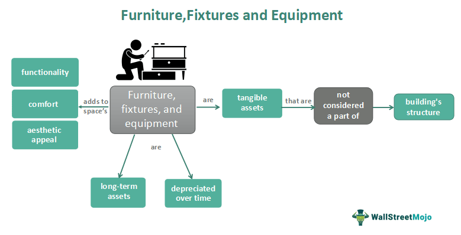

The article aims to elucidate the intersection of Furniture, Fixtures, and Equipment (FF&E) with algorithmic trading and its growing relevance in dynamic business environments. As companies are increasingly adopting advanced technologies to streamline operations and maximize profits, understanding how these distinct elements interact is crucial for gaining a competitive edge.

Furniture, Fixtures, and Equipment (FF&E) represent essential physical assets within any business setting. These include movable furniture, office equipment, and fixtures that are not permanently affixed to a building but play a pivotal role in accommodating business operations. For sectors such as hospitality, healthcare, and corporate environments, FF&E is fundamental in providing comfort, functionality, and a conducive working atmosphere. Proper management and accounting of FF&E are vital to ensuring operational efficiency and financial accuracy, as these assets often constitute substantial capital investment.

Algorithmic trading, on the other hand, refers to the use of computer programs and systems to execute financial transactions at speeds and frequencies that surpass those capable of human traders. Leveraging mathematical models and strategies, algorithmic traders can process vast data sets to identify trading opportunities and execute orders. This approach has significantly transformed modern financial markets by increasing trading volume and liquidity while reducing transaction costs.

The intersection of FF&E and algorithmic trading is particularly pronounced through technological advancements and asset management strategies. As algorithmic trading environments require robust technological infrastructure, the role of specialized equipment becomes paramount. High-frequency trading firms, for instance, rely on state-of-the-art servers and networking equipment to minimize latency and maximize trading efficiency. The FF&E assets procured for such environments are not merely comfort assets but pivotal components that directly impact financial outcomes.

In this article, we aim to explore this convergence by examining how advancements in technology are shaping both sectors. We will discuss the management challenges and opportunities presented by FF&E in high-tech environments and how algorithmic trading benefits from these strategic investments. By analyzing current trends and future directions, this article will provide valuable insights into how businesses can leverage FF&E and algorithmic trading for improved operational and financial performance.

## Table of Contents

## Understanding FF&E: Key Components and Relevance

FF&E, an acronym for Furniture, Fixtures, and Equipment, constitutes a critical component of business operations across various sectors. Understanding the intricacies of FF&E is essential for effective asset management, financial accounting, and operational optimization.

**Components of FF&E:**

1. **Furniture:** This category includes items such as desks, chairs, cabinets, and tables. These are typically movable objects that provide functional and aesthetic value to a space.

2. **Fixtures:** Fixtures refer to items that are fixed or attached to the building structure, such as lighting, shelving, plumbing components, and built-in cabinetry. They are integral to the functionality and design of the facility.

3. **Equipment:** This encompasses a wide range of machinery and tools necessary for the functional operations of a business. In a hospital, for example, this could involve medical machines, while in a corporate setting, it might include computers and servers.

**Importance in Various Sectors:**

In the hospitality industry, FF&E contributes significantly to the guest experience. The design and quality of furniture and fixtures can influence customer satisfaction. Similarly, in healthcare, the functionality and reliability of medical equipment are vital for patient care. Corporate environments rely on FF&E for creating efficient workplaces that support workflow and employee productivity. 

**Management and Accounting of FF&E:**

FF&E assets are managed through inventory systems that track acquisition, condition, and location. Accounting for FF&E involves depreciation, as these are capital expenditures. This ensures compliance with financial reporting standards, affecting the calculation of net book value and influencing tax and financial decisions.

**Challenges and Best Practices:**

One of the main challenges in FF&E management is ensuring that assets are regularly maintained and updated to avoid obsolescence. Another issue is balancing cost considerations with the need for quality and durability. Best practices include adopting a lifecycle management approach—regularly evaluating when assets need replacement or repair—and leveraging technology for asset tracking and management. Optimizing these processes can enhance operational efficiency and reduce unnecessary expenditures.

The strategic management of FF&E is pivotal across industries, reflecting not only on functionality but also on the financial health and environmental sustainability of a business.

## Insight into Algorithmic Trading

Algorithmic trading, often referred to as algo trading, is the use of computer algorithms to automate trading decisions and processes in financial markets. These computer programs are designed to execute trades at high speeds, and they operate on pre-defined criteria such as timing, price, quantity, or any mathematical model. Algo trading encompasses a wide range of strategies, including high-frequency trading ([HFT](/wiki/high-frequency-trading-strategies)), statistical [arbitrage](/wiki/arbitrage), [market making](/wiki/market-making), and [trend following](/wiki/trend-following).

Over recent years, [algorithmic trading](/wiki/algorithmic-trading) has seen substantial growth and evolution, influenced by advancements in technology and data analysis capabilities. Initially adopted by large institutional investors and hedge funds, algorithmic trading has gradually permeated retail trading platforms, democratizing access to sophisticated trading tools. The growth of electronic trading and the availability of vast amounts of market data have spurred the development of increasingly complex algorithms.

The technological infrastructure underlying algorithmic trading is crucial to its success. Key components include high-speed internet connectivity, low-latency trading platforms, and robust data processing systems. Additionally, co-location services, where trading firms place their computers close to stock exchange servers, minimize transmission delays. The infrastructure must also include risk management systems to monitor and mitigate potential losses due to algorithmic errors.

Algorithmic trading offers several advantages. It enhances market [liquidity](/wiki/liquidity-risk-premium) and ensures more accurate pricing by executing trades with minimal human intervention, thus reducing the risk of manual trading errors. Algo trading enables market participants to exploit small price discrepancies rapidly and consistently. Moreover, it provides the capability to backtest strategies against historical data, bolstering the development of effective trading models.

However, algorithmic trading also presents potential risks. One notable risk is the occurrence of "flash crashes," where rapidly executing algorithms can cause dramatic, short-lived drops in market value. The infamous 2010 Flash Crash, where the U.S. stock market lost nearly $1 trillion in market value within minutes, exemplifies this risk. Additionally, the reliance on sophisticated technology makes algo trading vulnerable to system failures, software bugs, and cybersecurity threats.

Overall, algorithmic trading continues to transform modern financial markets. It offers significant efficiency and precision but requires careful management to minimize associated risks. The ever-evolving landscape necessitates continuous adaptation to technological and market changes.

## The Intersection of FF&E and Algo Trading

Advancements in technology have significantly influenced both Furniture, Fixtures, and Equipment (FF&E) and algorithmic trading, reshaping traditional business practices and leading to notable improvements in efficiency and functionality. The integration of smart equipment has played a crucial role in the asset management and financial trading sectors, streamlining operations and enhancing decision-making processes.

Smart equipment, embedded with IoT and AI capabilities, facilitates better asset management by providing real-time data analytics and enabling predictive maintenance. For instance, in a financial trading environment, smart desks and ergonomic chairs equipped with sensors can monitor a trader's physical well-being, potentially enhancing productivity and reducing downtime. Moreover, these smart assets can optimize space management and energy consumption, aligning with sustainable business goals.

High-frequency trading (HFT) environments benefit immensely from FF&E installations optimized to house and support advanced computing systems. Companies utilize modular and adaptable furniture designs that accommodate rapid changes in technology, ensuring that trading floors remain efficient and congestion-free. Moreover, soundproofing fixtures and temperature-controlled equipment help maintain an optimal working environment, crucial for the high-speed decision-making required in HFT.

Case studies demonstrate the positive impact of FF&E on trading efficiency and outcomes. A notable example is the transformation of trading floors with the introduction of ergonomic setups and acoustically optimized spaces, which led to improvements in trader focus and transaction speed. Similarly, firms that adopted smart energy management systems within their FF&E setup saw reductions in operational costs and enhancements in eco-efficiency, directly contributing to improved financial performance.

Overall, the intersection of FF&E and algorithmic trading underlines the necessity for businesses to adopt technologically advanced and adaptable infrastructures. By doing so, they not only enhance their operational capabilities but also position themselves competitively in the fast-evolving financial markets.

## Procurement and Management of FF&E for Trading Firms

Procurement and management of Furniture, Fixtures, and Equipment (FF&E) for trading firms require meticulous planning and strategy to ensure that all physical resources align with the dynamic needs of algorithmic trading. The following outlines the steps and considerations involved in this process:

### Steps in Procuring FF&E for Trading Firms

1. **Needs Assessment:**
   Trading firms must evaluate their specific requirements, considering factors like the number of trading desks, types of equipment needed, and technological requirements. This step involves close collaboration with traders and IT specialists to understand the crucial FF&E components necessary for efficient operations.

2. **Budgeting and Financial Planning:**
   Accurate budgeting is essential to allocate sufficient resources for the acquisition of high-quality FF&E. This includes analyzing costs related to purchase, installation, and maintenance while factoring in depreciation and capital expenditures.

3. **Vendor Selection and Evaluation:**
   Selecting reputable vendors is crucial. Trading firms should conduct thorough evaluations and request proposals to compare product offerings, warranties, service agreements, and pricing. Firms may also consider working with vendors who specialize in FF&E for financial sectors to ensure compatibility with trading technology needs.

4. **Procurement and Acquisition:**
   The procurement process involves negotiating contracts, securing financing if necessary, and scheduling delivery and installation. Attention should be paid to terms that ensure timely delivery and deferment of payment solutions if required.

5. **Implementation and Setup:**
   This step involves the physical setup and installation of the purchased FF&E. It often requires coordination with IT teams to integrate technology seamlessly, including ergonomic setups for traders to optimize performance and reduce physical strain.

6. **Ongoing Management and Maintenance:**
   After installation, consistent monitoring and maintenance of the FF&E are necessary to extend the lifespan of the assets and ensure continuous operation. This involves regular inspections, repairs, and updates to keep the equipment functioning optimally.

### Special Considerations for Equipment Used in Algorithmic Trading

Algorithmic trading demands high-performance and reliable technology infrastructure. Special considerations include:

- **High-Speed Connectivity:**
  Trading desks and equipment need to support high-speed internet and data processing capabilities to execute trades in milliseconds.

- **Computing Power:**
  Algorithms require robust computing resources. Equipment should include high-performance servers and workstations optimized for trading platforms.

- **Redundancy and Backup Systems:**
  To avoid downtime, redundancy in power supplies, internet connections, and data backup systems is essential. This ensures trading operations can continue uninterrupted during technical failures.

### Service Providers and Solutions for FF&E in Financial Sectors

Several service providers and solutions are specifically tailored for the financial sector's FF&E needs:

- **Workplace Technology Solutions:**
  Companies such as Trading Technologies and FlexTrade offer specialized solutions for trading floor setups, integrating furniture with technology to optimize trader performance.

- **Asset Management Firms:**
  Companies like Colliers International provide asset management services, aiding in the procurement and lifecycle management of FF&E.

- **Ergonomic Furniture Providers:**
  Firms like Herman Miller and Steelcase offer ergonomically designed furniture that caters to the unique demands of trading environments, promoting physical well-being among traders for enhanced efficiency. 

Effective procurement and management of FF&E are instrumental in creating an optimal environment for algorithmic trading, emphasizing the need for technology-integrated solutions that support high-frequency trading operations seamlessly.

## Future Trends in FF&E and Algorithmic Trading

Emerging trends in Furniture, Fixtures, and Equipment (FF&E) and algorithmic trading are driven by technological advancements and a growing emphasis on sustainability. FF&E, traditionally comprising static elements like desks and lighting fixtures, is increasingly incorporating smart technology. This shift plays a significant role in sectors where optimal space utilization and energy efficiency are crucial. Smart technology integration in FF&E enables real-time monitoring and control over work environments, optimizing energy consumption and extending the lifespan of accompanying assets. For example, smart lighting systems can adjust based on occupancy and natural light availability, offering operational cost savings and contributing to sustainability goals.

In parallel, algorithmic trading, which relies on executing pre-programmed trading instructions, is witnessing transformative effects from [artificial intelligence](/wiki/ai-artificial-intelligence) (AI) and [machine learning](/wiki/machine-learning) (ML). These technologies enhance trading strategies by analyzing vast data sets to identify patterns and predict market movements often invisible to human traders. Machine learning algorithms are adept at adapting to changing markets, thus improving the precision and speed of trade executions. The deployment of AI in trading systems, such as through neural networks or [reinforcement learning](/wiki/reinforcement-learning) models, provides a competitive edge by enabling trades that are not only faster but also more informed.

The integration of smart FF&E solutions can have implications for the infrastructure supporting algorithmic trading environments. High-frequency trading (HFT) requires low-latency and high-reliability systems, both of which can be bolstered by advanced facility management solutions. Consider a scenario where environmental factors—like temperature or power supply—impact server performance. Smart FF&E can preemptively adjust these variables to ensure optimal trading infrastructure conditions, thus minimizing potential operational inefficiencies or downtimes.

Looking forward, potential innovations that could enhance the synergy between FF&E and algorithmic trading include the widespread adoption of sustainable materials and Internet of Things (IoT) technology in FF&E, which will further facilitate seamless, automated environments. The use of blockchain for transparent and secure asset management and decentralized trading platforms may also emerge as influential trends. Additionally, with advancements in quantum computing, there could be a paradigm shift in how trades are executed, encouraging a reevaluation of the equipment and facilities needed to support such computational power.

These trends underscore a strategic opportunity for businesses to leverage FF&E and algorithmic trading advancements. By investing in smart and sustainable FF&E while adopting AI-driven trading strategies, companies are well-positioned to enhance operational efficiency and sustain long-term competitiveness in the financial market landscape.

## Conclusion

The integration of Furniture, Fixtures, and Equipment (FF&E) into algorithmic trading environments has emerged as a significant [factor](/wiki/factor-investing) in optimizing the operational infrastructure of trading firms. By incorporating modern FF&E solutions, businesses enhance their physical workspaces to support complex algorithmic systems, which can lead to improved efficiency and precision in trading activities. This integration highlights the necessity for trading firms to not only focus on digital technologies but also consider the physical assets that underpin everyday operations.

As both technology and market conditions rapidly evolve, businesses must adapt their FF&E and algorithmic trading strategies to maintain a competitive edge. Technological advancements in FF&E—such as smart technology and sustainable solutions—not only contribute to operational efficiency but also promote an adaptable and responsive business environment. The synchronization of these advancements with cutting-edge algorithmic trading systems ensures that firms remain agile and effective in tackling market challenges.

Moreover, the strategic utilization of FF&E assets for trading can lead to enhanced performance outcomes by providing superior support for high-frequency trading platforms and reducing latency issues through optimized hardware deployments. Forward-thinking businesses recognize the competitive advantage that lies in aligning their physical and technological infrastructures, thus paving the way for innovative approaches and sustained growth in ever-mutable financial markets.

In conclusion, the seamless integration of FF&E within algorithmic trading settings is pivotal for firms aiming to capitalize on technological progress. By strategically aligning physical assets with trading technologies, businesses can enhance their operational excellence and maintain a leadership position in the financial industry.

## References & Further Reading

[1]: Bergstra, J., Bardenet, R., Bengio, Y., & Kégl, B. (2011). ["Algorithms for Hyper-Parameter Optimization."](https://dl.acm.org/doi/10.5555/2986459.2986743) Advances in Neural Information Processing Systems 24.

[2]: ["Advances in Financial Machine Learning"](https://www.amazon.com/Advances-Financial-Machine-Learning-Marcos/dp/1119482089) by Marcos Lopez de Prado

[3]: ["Evidence-Based Technical Analysis: Applying the Scientific Method and Statistical Inference to Trading Signals"](https://www.amazon.com/Evidence-Based-Technical-Analysis-Scientific-Statistical/dp/0470008741) by David Aronson

[4]: ["Machine Learning for Algorithmic Trading"](https://github.com/stefan-jansen/machine-learning-for-trading) by Stefan Jansen

[5]: ["Quantitative Trading: How to Build Your Own Algorithmic Trading Business"](https://github.com/LucindaYa/quant-resources/blob/master/Quantitative%20Trading%20How%20to%20Build%20Your%20Own%20Algorithmic%20Trading%20Business.pdf) by Ernest P. Chan