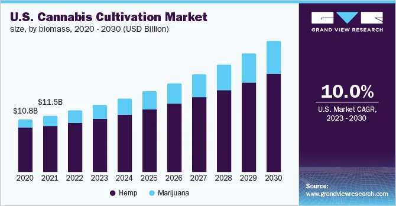

## Table of Contents

## What is the current legal status of cannabis in the United States?

In the United States, the legal status of cannabis is complicated. At the federal level, cannabis is still considered a Schedule I drug, which means it is illegal. However, many states have their own laws that allow people to use cannabis for medical or recreational purposes. This creates a situation where cannabis can be legal in some places but not in others.

As of now, more than 30 states have laws that allow the use of cannabis for medical reasons. These laws let people with certain health conditions use cannabis to help with their symptoms. In addition, about 20 states have made recreational cannabis legal for adults over the age of 21. This means that in these states, adults can buy and use cannabis for fun, not just for medical reasons. The laws can be different from one state to another, so it's important to know the rules where you live.

## How has the legalization of cannabis for medical and recreational use evolved over the past decade?

Over the past decade, the legalization of cannabis for medical use has grown a lot in the United States. In 2012, only a few states had laws that allowed people to use cannabis for medical reasons. But by 2022, more than 30 states had these laws. This change happened because more people started to see that cannabis could help with certain health problems, like pain and nausea. Also, more research showed that cannabis might be safer than some other medicines. So, more states decided to let people use it if they had a doctor's permission.

The legalization of cannabis for recreational use has also changed a lot in the last ten years. In 2012, Colorado and Washington became the first states to make recreational cannabis legal for adults over 21. Since then, many other states have followed their lead. By 2022, about 20 states had laws that let adults use cannabis for fun, not just for medical reasons. This big change happened because more people started to think that making cannabis illegal did not work well. They believed that if cannabis was legal, it could be controlled better and it could bring in money for the states through taxes.

## What are the economic impacts of the cannabis industry on states that have legalized it?

The cannabis industry has brought a lot of money to the states that have made it legal. When states started allowing people to buy cannabis for medical or fun reasons, they began to make money from taxes on cannabis sales. This money has been used to help pay for things like schools, roads, and health programs. In some states, the cannabis industry has created many new jobs. People work in growing cannabis, selling it in stores, and making products like edibles and oils. This has helped the economy grow by giving people work and bringing in more money.

But there are also some challenges. Some people worry that the cannabis industry might hurt other parts of the economy. For example, if people spend more money on cannabis, they might spend less money on other things like clothes or food. Also, the cost of making sure that cannabis is sold safely and legally can be high. States need to spend money on things like testing cannabis to make sure it's safe, and making sure that stores follow the rules. Even with these challenges, many states see the cannabis industry as a way to make their economy stronger.

## What are the potential health benefits and risks associated with cannabis use?

Cannabis can help with some health problems. Many people use it to feel less pain, especially if they have conditions like cancer or arthritis. It can also help people who feel sick from treatments like chemotherapy. Some studies show that cannabis might help with mental health issues like anxiety and depression, but the research is not clear yet. For people with epilepsy, certain types of cannabis can lower the number of seizures they have. Overall, many people find that cannabis makes them feel better and helps them deal with their health issues.

But cannabis also has risks. One big risk is that it can affect your brain, especially if you start using it when you're young. It can make it harder to think clearly, remember things, and learn new stuff. Cannabis can also make you feel anxious or paranoid, and in some cases, it can lead to mental health problems like psychosis. Another risk is that smoking cannabis is bad for your lungs, just like smoking cigarettes. If you use cannabis a lot, you might start to depend on it, which can be hard to stop. So, while cannabis can help with some health problems, it's important to know about the risks too.

## How is the cannabis industry regulated at both the state and federal levels?

At the federal level, cannabis is still considered a Schedule I drug, which means it's illegal. This is because the government thinks it has a high chance of being abused and no accepted medical use. Even though many states have made cannabis legal, the federal government still says it's illegal. This makes things confusing because if you follow state laws, you might still be breaking federal laws. The federal government also controls things like how cannabis can be moved between states and how it's studied for research.

At the state level, things are different. Each state that has made cannabis legal has its own rules. For medical cannabis, states say who can use it and what health problems it can help with. They also control how it's grown, sold, and used. For recreational cannabis, states set rules about who can buy it, how old you have to be, and how much you can have. States also make sure that cannabis is safe by testing it and checking that stores follow the rules. This means that even though cannabis is legal in some states, the rules can be very different from one state to another.

## What are the key challenges facing the cannabis industry in terms of banking and finance?

The cannabis industry faces big problems with banking and finance because cannabis is still illegal at the federal level. Banks are scared to work with cannabis businesses because they could get in trouble with the federal government. This makes it hard for cannabis companies to have bank accounts, get loans, or use credit cards. They often have to deal with a lot of cash, which can be risky and hard to manage.

Another challenge is that cannabis businesses can't use many financial services that other companies take for granted. For example, they can't use big payment systems like PayPal or Stripe. This makes it hard for them to sell their products online or accept payments easily. Some states have tried to help by creating special banks or credit unions for cannabis businesses, but it's still a big problem. Overall, the banking and finance issues make it harder for cannabis companies to grow and succeed.

## How does the cannabis industry contribute to job creation and what types of jobs are available?

The cannabis industry has created a lot of jobs in states where it's legal. As more states allow people to use cannabis for medical or fun reasons, more businesses open up. These businesses need people to work in different parts of the industry, like growing cannabis, making products like oils and edibles, and selling it in stores. This means that the cannabis industry helps people find work and makes the economy stronger.

There are many types of jobs in the cannabis industry. Some people work as growers, taking care of cannabis plants to make sure they grow well. Others work in labs, testing cannabis to make sure it's safe and strong. There are also jobs in stores, where people help customers pick out what they need. Some people work in making products, like turning cannabis into oils or edibles. And there are jobs in managing the business, like keeping track of money and making sure everything follows the law. So, the cannabis industry offers a lot of different kinds of work for people.

## What are the latest trends in cannabis products and consumption methods?

In recent years, the cannabis industry has seen a lot of new trends in products and how people use them. One big trend is edibles, like gummies and chocolates. These are popular because they don't involve smoking, which can be bad for your lungs. Another trend is cannabis drinks, like sodas and teas. These are easy to use and can be more fun than traditional ways of using cannabis. Also, more people are using vape pens, which heat up cannabis oil to make a vapor you can breathe in. Vaping is seen as a healthier option than smoking because it doesn't burn the cannabis.

Another trend is the rise of cannabis concentrates, like oils and waxes. These are very strong and can be used in different ways, like dabbing or adding to edibles. People like them because a little bit can have a big effect. There's also a trend towards wellness products, like cannabis-infused lotions and creams. These are used for things like pain relief and skin care. Overall, the cannabis industry is always coming up with new products to meet what people want and to make using cannabis easier and more enjoyable.

## How are advancements in cannabis research influencing the development of new products?

Advancements in cannabis research are helping to create new products that people can use. Scientists are learning more about the different parts of the cannabis plant, like THC and CBD. These parts can help with different health problems. For example, CBD is being used in lotions and oils to help with pain and skin issues. Because of this research, companies are making new products that are safer and work better for what people need.

Research is also helping to make cannabis products stronger and more reliable. Scientists are finding ways to grow cannabis plants that have more of the good parts people want. This means that when people use these new products, they know what they are getting. It also helps companies make products that are the same every time, so people can trust them. This is important for things like edibles and drinks, where people want to know how much cannabis they are using.

## What role do social equity programs play in the future of the cannabis industry?

Social equity programs are important for the future of the cannabis industry. These programs help people who were hurt by old cannabis laws. For a long time, many people, especially from certain communities, were arrested and had their lives changed because of cannabis. Now, with these programs, states are trying to give those people a chance to work in the cannabis industry. They can get help to start their own businesses or find good jobs. This makes the industry more fair and helps the economy in those communities.

These programs also make sure that the cannabis industry includes everyone. They help people who might not have had a chance before to learn about the industry and get the training they need. This can lead to more diverse businesses and more people working in cannabis. As more states make cannabis legal, social equity programs will be a big part of making sure that everyone can benefit from the industry's growth.

## How might federal legalization impact the cannabis industry and its stakeholders?

If the federal government makes cannabis legal, it would change a lot for the cannabis industry. Right now, cannabis is still illegal at the federal level, even though some states have their own laws. If it becomes legal everywhere, cannabis businesses could work more easily across state lines. They could use banks and credit cards without worrying about breaking federal laws. This would make it easier for them to grow and make more money. It would also mean more jobs and more tax money for the government, which could be used to help schools and roads.

Federal legalization would also help people who were hurt by old cannabis laws. Social equity programs could become bigger and help more people start businesses or find good jobs in the cannabis industry. This would make the industry more fair and give everyone a chance to benefit from its growth. But there would still be challenges, like making sure that cannabis is safe and that the rules are followed. Overall, federal legalization could make the cannabis industry stronger and help more people.

## What are the long-term projections for growth and market expansion in the cannabis industry?

The cannabis industry is expected to grow a lot in the future. More and more states are making cannabis legal for medical and fun reasons, and this means more people can buy it. As more places make it legal, the market will get bigger. Experts think that the cannabis industry could be worth billions of dollars in the next few years. This growth will create more jobs and bring in more money for states through taxes. Companies will also keep making new products, like edibles and drinks, which will help the industry grow even more.

But there are also some things that could slow down this growth. One big thing is that cannabis is still illegal at the federal level. If the federal government doesn't change the law, it could be hard for the industry to keep growing. Also, there are still a lot of rules and costs that come with making cannabis safe and legal. These things could make it harder for new businesses to start and for the industry to expand. Even with these challenges, many people think that the cannabis industry will keep growing and become a big part of the economy.

## References & Further Reading

[1]: National Conference of State Legislatures. (2023). ["State Medical Cannabis Laws."](https://www.ncsl.org/health/state-medical-cannabis-laws)

[2]: Marijuana Policy Project. (2023). ["Recreational Marijuana Laws."](https://www.mpp.org/assets/pdf/states/ohio/2023-ohio-cannabis-legalization-law-summary.pdf?v=1703921358)

[3]: U.S. Drug Enforcement Administration. ["Drug Scheduling."](https://www.dea.gov/drug-information/drug-scheduling)

[4]: U.S. Department of Justice. (2013). ["Memorandum for All United States Attorneys."](https://www.dfi.wa.gov/documents/banks/cole-memo-08-29-13.pdf)

[5]: Pew Research Center. (2021). ["America's New Drug Policy Landscape."](https://www.pewresearch.org/politics/2014/04/02/americas-new-drug-policy-landscape/)

[6]: Hall, W., & Lynskey, M. (2016). ["Evaluating the public health impacts of legalizing recreational cannabis use in the United States."](https://pubmed.ncbi.nlm.nih.gov/27082374/) Addiction.