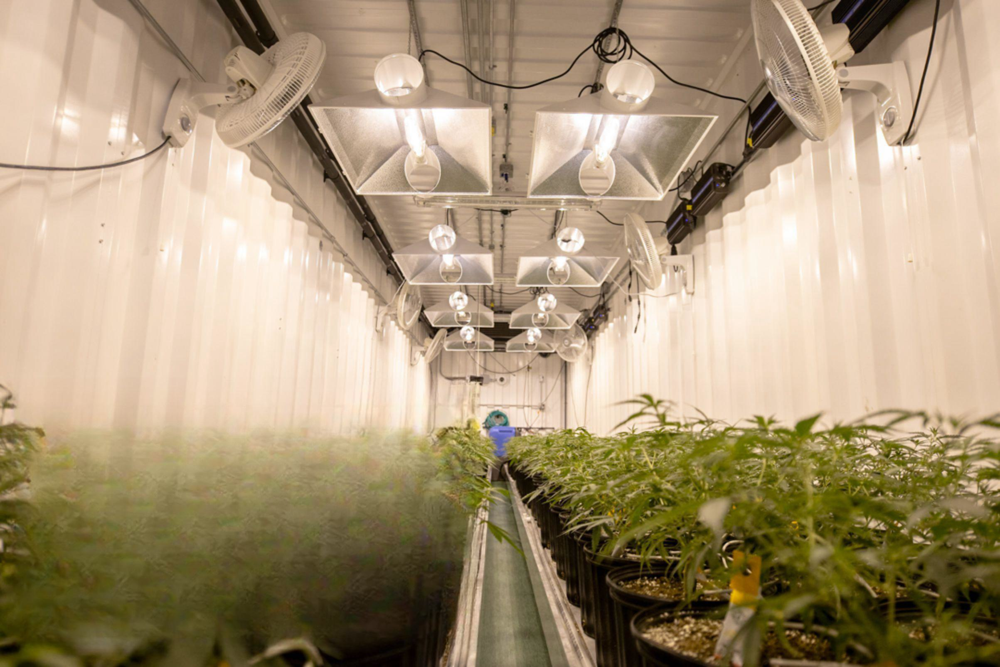

The legalization of marijuana in various parts of the United States represents a significant shift in legislation that is profoundly influencing the cannabis industry. With an increasing number of states permitting marijuana for medical and recreational purposes, the cannabis market is experiencing unprecedented growth and innovation. This transformation is attracting entrepreneurial ventures and established businesses alike, eager to capitalize on new opportunities within the industry.

The evolving market landscape is further enriched by the intersection of cannabis and algorithmic trading. Algorithmic trading, driven by AI and machine learning technologies, offers potential enhancements in the cannabis stock market by enabling real-time data analysis and efficient trading strategies. These technological advances in trading could result in more strategically informed investments within the cannabis sector, thus pushing the industry toward greater economic viability.



Moreover, as public acceptance of marijuana grows, federal and state-level policies are undergoing continuous reevaluation and modification. Such societal acceptance has the potential to influence legislative attitudes, driving a reconsideration of existing laws and possibly leading towards more comprehensive legalization measures. This change is crucial as it not only affects the regulatory framework but also the financial ecosystem surrounding cannabis-related businesses. Establishing a more coherent policy across states could provide a stable environment conducive to growth and innovation while addressing the present ambiguities that complicate operations and investments in the cannabis sector.

The impact of legalization extends beyond mere regulatory considerations. It affects market dynamics, public health perspectives, criminal justice reform, and tax revenues, each playing a role in redefining the cannabis landscape in the United States. As the nation continues to move towards broader acceptance of marijuana, understanding the interplay of these factors with algorithmic trading technologies could shape the future trajectory of the cannabis industry, providing both challenges and unprecedented opportunities.

## Table of Contents

## Current State of Marijuana Legalization in the U.S.

Marijuana legalization in the United States has progressed significantly over the past few decades, resulting in a complex legal landscape where state and federal laws sometimes conflict. As of 2023, a substantial number of states have legalized marijuana for medical use, recreational use, or both. 

### Overview of State Legalization

Currently, 37 states and the District of Columbia have legalized marijuana for medical use, allowing patients with specific medical conditions to use cannabis products under medical supervision [1]. In terms of recreational use, 21 states, along with the District of Columbia, have legalized marijuana for adults over the age of 21 [2]. These states have implemented regulatory frameworks to control the cultivation, distribution, and sale of cannabis, often using tax revenues generated from these activities to fund public services such as education and healthcare.

### Federal vs. State Regulations

A notable aspect of marijuana policy in the United States is the dichotomy between federal and state regulations. Under federal law, marijuana remains classified as a Schedule I substance under the Controlled Substances Act, indicating that it is considered to have a high potential for abuse and no accepted medical use [3]. This classification places marijuana alongside drugs such as heroin and LSD. Despite its federal status, the Department of Justice has largely deferred enforcement to the states, especially those that have established stringent regulatory systems in compliance with federal priorities, as outlined in documents such as the Cole Memorandum [4].

### Public Perception and Societal Impacts

Public perception of marijuana has shifted significantly over recent years, reflecting changing societal attitudes towards cannabis use. According to surveys conducted by Pew Research Center, as of 2021, approximately 91% of U.S. adults believe marijuana should be legal either for medical use only or for both medical and recreational use [5]. This widespread support has contributed to the [momentum](/wiki/momentum) for legislative changes at the state level.

The societal impacts of marijuana legalization are multifaceted. On one hand, legalization has been associated with economic benefits, such as increased tax revenues and job creation, particularly in states that have legalized recreational use. On the other hand, concerns remain regarding public health and safety, including the potential for increased youth access to marijuana, impaired driving, and the overall public health ramifications of broader cannabis availability [6].

In conclusion, the current state of marijuana legalization in the U.S. reflects a dynamic and evolving policy environment, with significant variations across state lines. The ongoing tension between state initiatives and federal prohibition continues to shape the discourse and development of cannabis-related legislation in the country.

### References

1. National Conference of State Legislatures. (2023). State Medical Cannabis Laws.
2. Marijuana Policy Project. (2023). Recreational Marijuana Laws.
3. U.S. Drug Enforcement Administration. Drug Scheduling.
4. U.S. Department of Justice. (2013). Memorandum for All United States Attorneys.
5. Pew Research Center. (2021). America's New Drug Policy Landscape.
6. Hall, W., & Lynskey, M. (2016). Evaluating the public health impacts of legalizing recreational cannabis use in the United States.

## The Economic Impact of Marijuana Legalization

Marijuana legalization in the United States presents significant economic benefits, notably through increased employment opportunities and state revenue generation. As more states adopt laws permitting both medical and recreational use, the cannabis industry experiences substantial job growth. According to reports, the legal cannabis industry employed approximately 321,000 full-time workers in 2021, a number expected to rise as additional states legalize marijuana (Leafly, 2021).

The economic contributions from marijuana legalization are also evident in increased state revenues, primarily derived from taxes levied on cannabis sales. States implementing legalization frameworks often employ excise taxes, sales taxes, and local taxes on cannabis products. For example, in 2020, California generated over $1 billion in tax revenue from cannabis sales (California Department of Tax and Fee Administration, 2020), funds which were subsequently allocated towards public health, education, and law enforcement initiatives.

Despite these gains, the cannabis industry faces unique challenges, primarily due to the federal classification of marijuana as a Schedule I controlled substance. This disparity creates complications in banking, taxation, and interstate commerce. Nonetheless, the industry also encounters lucrative opportunities for growth. As societal and legislative attitudes toward cannabis evolve, the potential for expansion into untapped markets increases, coupled with innovation in product offerings and cannabis-related technologies.

The intersection of legalization, consumer demand, and regulatory adjustments will continue to shape the economic landscape, providing a robust foundation for ongoing growth within the cannabis sector. As such, stakeholders must navigate these dynamic conditions to ensure sustainable development and maximum economic benefit.

## Cannabis Industry Trends and Projections

The cannabis industry in the United States is characterized by dynamic growth and evolving consumer preferences, driven by increasing legalization and technological advancements. Emerging trends in cannabis products reflect a diversification that caters to a wider array of consumer needs and preferences. Notably, there is a shift towards non-traditional cannabis formats such as edibles, beverages, and health-focused products like CBD oils and topicals. This diversification is partly attributed to consumers seeking discrete and convenient consumption methods, as well as health and wellness benefits.

Market size projections for the cannabis industry indicate significant growth potential. According to New Frontier Data, the U.S. cannabis market is projected to exceed $30 billion by 2025, driven by continued legalization and increased consumer awareness. This growth is accompanied by expanding investment opportunities in various segments of the industry, such as cultivation, distribution, and retail. Investors are also focusing on ancillary services, including technology platforms and product innovation, which support the core cannabis business.

Technology and innovation are critical in propelling the cannabis industry forward. Technological advancements are optimizing cultivation processes through precision agriculture and automated systems, enhancing yield quality and reducing operational costs. Furthermore, innovation in product development, such as nanotechnology for improved bioavailability of cannabinoids, is creating new market segments and consumer experiences. The integration of data analytics and AI is also significant, providing insights into consumer behavior and market trends, allowing for more tailored marketing strategies and inventory management.

As the industry continues to evolve, these trends and projections highlight the importance of adaptability and innovation for stakeholders looking to capitalize on the burgeoning cannabis market. Companies that leverage technology and respond to consumer demands will be well-positioned to thrive in this rapidly growing sector.

## Algorithmic Trading and Its Potential in the Cannabis Market

Algorithmic trading, an integral component of modern financial markets, involves the use of computer algorithms to automate trading decisions. This approach allows for rapid execution of trades, analysis of vast datasets, and the identification of market patterns that may not be apparent to human traders. In recent years, the cannabis sector has emerged as an area of interest for [algorithmic trading](/wiki/algorithmic-trading), as legalization efforts progress and the market evolves. The use of [artificial intelligence](/wiki/ai-artificial-intelligence) (AI) and [machine learning](/wiki/machine-learning) (ML) technologies is particularly promising in transforming cannabis stock trading.

AI and ML can analyze historical data, identify trends, and predict future price movements with high accuracy. For instance, machine learning algorithms like neural networks or support vector machines (SVMs) can process and learn from complex datasets, adapting to changing market conditions. These methods enhance the predictive power of trading algorithms, making them highly effective in the cannabis stock market, where [volatility](/wiki/volatility-trading-strategies) and regulatory changes can create rapid price shifts. An example of a basic prediction model using Python might look like this:

```python
import numpy as np
from sklearn.model_selection import train_test_split
from sklearn.svm import SVR

# Example dataset: Features (X) could be historical price data, and Targets (y) could be future prices
X, y = np.array([[...], [...]]), np.array([...])

# Split dataset into training and testing sets
X_train, X_test, y_train, y_test = train_test_split(X, y, test_size=0.2, random_state=42)

# Create and train the Support Vector Regression (SVR) model
model = SVR(kernel='rbf')
model.fit(X_train, y_train)

# Predicting future prices
predictions = model.predict(X_test)
```

Despite its potential, the use of algorithmic trading in the cannabis market carries certain risks and considerations. The nascent nature of the industry means that it is subject to fast-paced regulatory changes, which can impact stock volatility. Algorithms require continuous updates and fine-tuning to account for these variables and maintain their efficacy. Additionally, [liquidity](/wiki/liquidity-risk-premium) constraints in cannabis stocks, often due to varying state laws and limited banking access, may hinder the performance of algorithmic strategies reliant on high trade volumes.

Furthermore, the ethical implications of AI-driven trading and the risk of market manipulation must be considered. Automated systems can contribute to market instability if not carefully regulated. Thus, traders and firms entering the cannabis stock market with algorithmic strategies should remain aware of these risks and ensure compliance with all relevant securities regulations.

In conclusion, while algorithmic trading presents remarkable opportunities for innovation in cannabis stock trading, it necessitates a balanced approach, incorporating robust risk management and adherence to evolving regulatory landscapes.

## Regulatory and Policy Considerations

Marijuana legalization in the United States continues to evolve, with significant regulatory and policy considerations that can shape the cannabis industry's future. One key area is the potential federal rescheduling of marijuana. Currently classified as a Schedule I substance under the Controlled Substances Act (CSA), cannabis is designated alongside drugs considered to have a high potential for abuse and no accepted medical use. If rescheduled, marijuana could be moved to a lower classification, potentially recognizing its medical value and reducing regulatory burdens for research and commercial activities. Such a shift might open opportunities for broader business operations, though it also imposes the need for compliance with FDA regulations similar to other pharmaceuticals.

Legislatively, several actions have impacted the cannabis market significantly. The Secure and Fair Enforcement (SAFE) Banking Act, for instance, aims to shield financial institutions serving the cannabis industry from federal penalties. This legislation, if passed, could mitigate one of the industry's largest hurdles by allowing cannabis businesses access to banking services currently restricted. Other notable actions include the MORE Act, which proposes comprehensive reforms by decriminalizing marijuana at the federal level and addressing issues like expungement of past convictions. Legalization efforts at the state level, combined with shifts in federal policy, suggest a potential restructuring of how cannabis operations are governed.

The cannabis sector faces specific banking and financial challenges due to its Schedule I classification. Financial institutions remain wary of engaging with cannabis-related businesses, fearing federal repercussions. Consequently, many cannabis companies operate largely in cash, posing significant risks in logistics and security. This financial isolation also restricts businesses from utilizing traditional financial services such as loans, insurance, and payment processing, which are critical for growth and stability. The proposed SAFE Banking Act could alleviate some pressures by offering a formal shield for banks, thus integrating cannabis businesses into the broader financial system. The ability to engage with banks would enable better cash flow management, investment opportunities, and business expansion strategies, ultimately contributing to broader economic integration and development for the cannabis sector.

## Future Outlook for Marijuana Legalization and the Cannabis Industry

As marijuana legalization continues to progress across the United States, significant developments and transformations are anticipated in both the legal landscape and the cannabis industry. Predictions for future legalization efforts suggest a gradual but steady increase in the number of states adopting medical and recreational cannabis laws. This shift is primarily driven by changing public perceptions, economic benefits, and ongoing legislative efforts at the federal level.

### Predictions for the Future of Marijuana Legalization Across the U.S.

Public support for marijuana legalization has been on an upward trajectory, with recent surveys indicating that a majority of Americans favor legalizing cannabis for recreational use. This growing acceptance is likely to encourage more states to implement legalization measures, leading to a more uniform national framework over time. The potential rescheduling of marijuana at the federal level could significantly impact this trajectory, offering a more cohesive approach to regulation across state lines.

### Business Strategies and Adaptations Required for Cannabis Companies

As legalization expands, cannabis companies must adapt to a rapidly evolving market. One key strategy involves diversification of product offerings to meet varying consumer preferences, including the development of new cannabis-infused products and wellness-focused items. Additionally, companies should prioritize building strong brand identities to distinguish themselves in a competitive market.

Operational efficiencies will be crucial as businesses scale. Implementing advanced cultivation technologies, improving supply chain logistics, and optimizing distribution channels will help companies better serve growing demand. Strategic partnerships and mergers may also present opportunities for growth and market expansion.

Adapting to regulatory changes remains a critical aspect of business strategy. Companies must stay attuned to shifting legal requirements at both state and federal levels, ensuring compliance to avoid potential legal challenges. This underscores the need for robust legal and compliance teams within cannabis organizations.

### Role of Policy Changes and Technological Advances

Policy changes, particularly at the federal level, hold significant implications for the cannabis industry's future. Potential federal legalization or rescheduling of marijuana could lead to increased research opportunities, greater investment, and the removal of banking and financial barriers that currently impede industry growth. This would facilitate interstate commerce and enhance the competitiveness of U.S. cannabis businesses globally.

Technological advances will continue to play a pivotal role in the industry's evolution. Innovations in cultivation methods, such as precision agriculture and automated harvesting, can reduce costs and improve product quality. In addition, blockchain technology may offer solutions for secure and transparent supply chain management, increasing consumer trust.

Artificial intelligence and data analytics can enhance consumer insights, enabling companies to tailor their marketing strategies and product offerings. Furthermore, advancements in online retail and e-commerce platforms can broaden market reach and improve customer accessibility.

In summary, the future outlook for marijuana legalization and the cannabis industry is characterized by an ongoing expansion of legal markets, necessitating adaptive business strategies and leveraging policy and technological advancements. Companies poised to succeed in this dynamic environment will be those that remain agile, innovative, and responsive to evolving market dynamics and regulatory frameworks.

## Conclusion

The legalization of marijuana in the United States has brought profound impacts on the nation's economy. By transforming an underground market into a regulated industry, states have been able to generate significant tax revenue. In 2021 alone, cannabis sales reached approximately $25 billion, contributing billions in tax revenue to fund public services. Additionally, the industry has spurred job creation, with more than 320,000 full-time jobs tied to cannabis, catalyzing economic development within communities hosting cannabis businesses.

As the industry matures, the potential for the integration of algorithmic trading into the cannabis sector presents a unique opportunity. Algorithmic trading, leveraging artificial intelligence and machine learning, enables the ability to analyze vast datasets and execute trades with efficiency and precision. This technology could bring enhanced liquidity and stability to cannabis stock markets, aligning with a shift towards data-driven decision making in financial markets. However, the volatility and the nascent nature of the cannabis industry may pose significant risks that need to be carefully managed by algorithmic strategies.

The cannabis industry continues to evolve amid dynamic regulatory and policy shifts. Federal rescheduling and legislation could further open banking and financial services to cannabis businesses, addressing current operational challenges. Moreover, ongoing technological advancements continue to reshape consumer engagement and product innovation, offering fresh opportunities for growth.

In conclusion, marijuana legalization is not only reshaping the U.S. economy through direct economic benefits but also by fostering a progressive market environment poised for technological innovation. The intertwining of cannabis with algotrading represents a forward-looking approach that could redefine industry practices. As legal frameworks and technologies continue to evolve, the cannabis industry is set to uncover new opportunities, influencing broader societal changes and economic growth.

## References & Further Reading

[1]: National Conference of State Legislatures. (2023). ["State Medical Cannabis Laws."](https://www.ncsl.org/health/state-medical-cannabis-laws)

[2]: Marijuana Policy Project. (2023). ["Recreational Marijuana Laws."](https://www.mpp.org/assets/pdf/states/ohio/2023-ohio-cannabis-legalization-law-summary.pdf?v=1703921358)

[3]: U.S. Drug Enforcement Administration. ["Drug Scheduling."](https://www.dea.gov/drug-information/drug-scheduling)

[4]: U.S. Department of Justice. (2013). ["Memorandum for All United States Attorneys."](https://www.dfi.wa.gov/documents/banks/cole-memo-08-29-13.pdf)

[5]: Pew Research Center. (2021). ["America's New Drug Policy Landscape."](https://www.pewresearch.org/politics/2014/04/02/americas-new-drug-policy-landscape/)

[6]: Hall, W., & Lynskey, M. (2016). ["Evaluating the public health impacts of legalizing recreational cannabis use in the United States."](https://pubmed.ncbi.nlm.nih.gov/27082374/) Addiction.