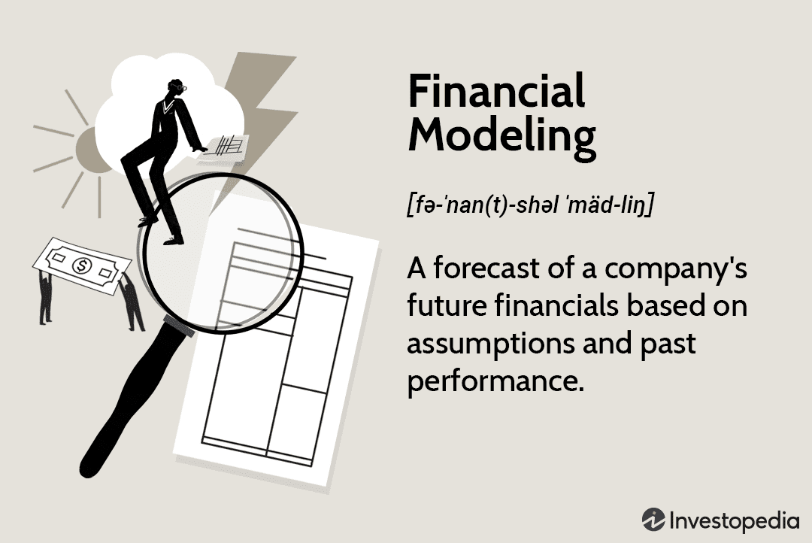

The world of trading constantly adapts as numerous events and occasions impact market dynamics. Critical events such as economic reports, corporate announcements, and geopolitical developments play a significant role in influencing market behavior. In this constantly changing environment, algorithmic trading, commonly referred to as algo trading, offers traders a powerful tool to harness these events and derive trading opportunities.

Algorithmic trading employs complex algorithms to execute orders and manage positions based on predefined criteria. This approach leverages the speed and precision of computer systems to process information faster than traditional manual trading. As events unfold, these algorithms analyze data and execute trades, creating a more efficient trading process. 



Understanding upcoming occasions and effectively using an events calendar is crucial for maximizing the potential of algorithmic trading. A well-structured events calendar provides traders with a comprehensive overview of essential market-moving events, enabling them to plan and adjust their strategies accordingly. These calendars offer insights into key occurrences such as macroeconomic data releases, central bank meetings, and significant corporate activities like stock splits and earnings announcements, all of which can induce market volatility.

By anticipating these events, traders can position themselves strategically in the market, taking advantage of opportunities while managing potential risks. This proactive approach not only enhances trading success but also allows traders to navigate the complexities of the financial landscape with greater confidence.

This article aims to guide readers through understanding the impact of future events on trading and explores how algorithmic trading strategies can be employed to capitalize on such occasions. By staying informed and utilizing technological advancements, traders can maintain a competitive edge in this dynamic market environment.

## Table of Contents

## Understanding the Importance of a Trading Calendar

A trading calendar is a crucial resource for traders and investors, providing a comprehensive list of significant events that can influence financial markets. Such a calendar typically includes macroeconomic data releases, corporate actions like stock splits, and central bank meetings. These events have the potential to cause market volatility, offering both risks and opportunities, particularly for those engaging in algorithmic trading.

Macroeconomic data releases, such as GDP (Gross Domestic Product) figures, Consumer Price Index (CPI) updates, and employment [statistics](/wiki/bayesian-statistics), are pivotal as they reflect the economic health of a nation. For instance, a higher-than-expected GDP growth rate may boost investor confidence, potentially leading to a rise in stock market indices. Conversely, an unexpected drop in employment figures could signal economic distress, possibly prompting a market sell-off.

Corporate actions, including stock splits, mergers, and acquisitions, are also significant calendar entries. These actions often lead to short-term fluctuations in stock prices as investors react to news. For example, a stock split may initially increase a stock's perceived availability, potentially resulting in higher demand and a temporary price increase.

Central bank meetings are events closely monitored by traders. Decisions regarding [interest rate](/wiki/interest-rate-trading-strategies) changes or monetary policy adjustments can have immediate and profound impacts on currency and stock markets. A central bank's decision to raise interest rates typically strengthens its national currency but may lead to lower stock prices as borrowing costs rise.

Having a trading calendar enables traders to anticipate these events and strategically adjust their trading positions in advance. This preparation allows for better risk management and the potential to capitalize on anticipated market movements. For algorithmic traders, knowing the schedule of upcoming events is essential for programming their trading algorithms to respond appropriately. By incorporating event data, traders can fine-tune their strategies to improve accuracy and profitability.

In summary, a trading calendar serves as an indispensable tool for navigating the complexities of financial markets. It empowers traders by providing them with the information needed to make informed decisions, helping to mitigate risks and seize opportunities presented by market fluctuations.

## Key Features of an Effective Events Calendar

A trading events calendar is an indispensable tool for algorithmic traders, providing crucial information about market-moving events. The first key feature to consider is the comprehensive description and significance of events included in the calendar. For instance, GDP announcements significantly impact market sentiment and price movements, as they reflect the economic health of a country. Similarly, Federal Open Market Committee (FOMC) meetings are pivotal because of their influence on monetary policy decisions, which can induce market [volatility](/wiki/volatility-trading-strategies). A calendar that includes detailed descriptions helps traders understand the potential implications of each event on the markets they trade.

Another essential feature is the use of impact level indicators. These indicators assess the likely influence of an event on market conditions, allowing traders to prioritize their focus. Typically categorized as low, medium, or high impact, these indicators help traders allocate resources and adjust their strategies accordingly. For example, a high-impact event like a central bank policy announcement may require traders to brace for significant price fluctuations, while a low-impact event might be monitored for minor adjustments.

Precise date and time specifics are crucial for effective trading strategy execution. Knowing the exact timing of an event, such as a scheduled economic report release, enables traders to prepare and implement their strategies with precision. This accuracy is vital for high-frequency trading, where milliseconds can differentiate between profit and loss. Calendars that provide events in traders’ local time zones further enhance usability and ensure precise planning.

Integration with historical data is another valuable feature, as it supports event analysis and predictive modeling. By incorporating past data related to similar events, traders can identify patterns and predict potential market responses. For instance, analyzing how markets reacted to previous GDP announcements can inform future trading decisions. This data-driven approach enhances the robustness of algorithmic strategies by offering insights into probable market behaviors.

In conclusion, an effective events calendar for [algorithmic trading](/wiki/algorithmic-trading) combines detailed descriptions of events, impact level indicators, precise timing information, and historical data integration. These elements collectively empower traders to optimize their strategies, manage risks, and seize opportunities presented by market-moving events.

## Role of Economic Calendars in Algorithmic Trading

Economic calendars are instrumental in algorithmic trading, providing structured data that is pivotal for making real-time trading decisions. These calendars encapsulate a comprehensive range of economic events, such as interest rate announcements, GDP releases, and employment figures, all of which can have substantial impacts on market movements. By offering timely economic updates, economic calendars enable traders to implement event-driven trading strategies effectively. These strategies rely on the premise that markets typically react to scheduled economic events, leading to potential trading opportunities.

A significant advantage of using economic calendars in algorithmic trading lies in their support for [backtesting](/wiki/backtesting) and refinement of trading strategies. Backtesting involves running an algorithm through historical data to evaluate its performance against past market conditions. By incorporating historical economic calendar data into this process, traders can assess how various events have historically affected market trends and refine their algorithms to enhance predictive accuracy. For instance, a backtesting model might simulate how an algorithm would have responded to previous Federal Reserve interest rate changes, allowing traders to adjust their strategies accordingly.

Furthermore, economic calendars facilitate event anticipation, enabling algorithms to react dynamically to anticipated market changes and opportunities. Algorithms can be pre-programmed to recognize specific economic events and execute trades based on these cues. For example, if an economic calendar predicts an upcoming unemployment rate announcement, an algorithm could be designed to enter or [exit](/wiki/exit-strategy) trades based on the predicted impact of this announcement on the market.

The dynamic nature of algorithmic trading also benefits significantly from the precise timing and predictability provided by economic calendars. Algorithms can be fine-tuned to execute trades at optimal moments, such as immediately before or after a significant economic release, thereby maximizing potential gains or minimizing potential losses. By continuously monitoring economic events, algorithms can be adjusted in real-time to respond to unexpected market shifts, ensuring that trading strategies remain adaptive and resilient.

In conclusion, economic calendars are a cornerstone of algorithmic trading, offering structured, timely data essential for executing trades and refining strategies. By enabling event-driven approaches, supporting rigorous backtesting, and facilitating dynamic response capabilities, economic calendars empower traders to harness market volatility associated with economic events effectively.

## Upcoming Occasions for Algorithmic Traders

Major economic reports such as Gross Domestic Product (GDP), Consumer Price Index (CPI), and employment figures serve as crucial indicators for algorithmic traders. These reports encapsulate the health and direction of an economy, thus influencing investor sentiment and market trends. For instance, a higher-than-expected GDP growth can signal a flourishing economy, encouraging bullish sentiment, while disappointing employment numbers may trigger bearish market reactions. Algorithmic traders leverage these data releases to calibrate trading strategies, optimizing for anticipated market volatility.

Corporate announcements, stock splits, and Initial Public Offerings (IPOs) also offer distinctive trading opportunities. Corporate announcements, which may include earnings reports or significant business decisions, can substantially affect a company's stock price. Algo traders can configure strategies to exploit this price volatility. Stock splits, often perceived positively, may result in increased trading [volume](/wiki/volume-trading-strategy) and stock price adjustments, enabling traders to capitalize on short-term movements. IPOs introduce new market entrants, often accompanied by substantial investor attention and varying price dynamics, creating fertile ground for event-driven algo trading strategies.

Central bank policy statements are another pivotal component, often causing considerable market shifts. Central banks, through entities like the Federal Reserve or European Central Bank, wield significant influence over economic conditions via monetary policy decisions such as interest rate changes. For instance, an unexpected rate hike may strengthen a currency, providing currency traders with profitable opportunities. Algorithmic systems can be pre-programmed to respond to these policy announcements, facilitating real-time adjustments in trading positions based on the central bank's direction.

Staying informed about these events is imperative for proactive strategy formulation. Algorithmic traders rely on a synthesis of historical data, real-time news analysis, and predictive modeling to anticipate and act upon these occasions. Utilizing comprehensive economic calendars enables traders to schedule trades around anticipated events, driving the formulation of strategies that are both reactive to current events and predictive of future market directions. Thus, maintaining a robust awareness of these occasions is essential for optimizing algo trading outcomes and securing a competitive market edge.

## Leveraging Technology and Tools for Event-Driven Trading

In the ever-evolving landscape of algorithmic trading, leveraging technology and tools to effectively utilize economic calendar data is essential for traders aiming to capitalize on market opportunities. Platforms that integrate economic calendars provide a robust framework for seamless algo trading execution. These platforms often come equipped with features that allow traders to automate processes and streamline decision-making by delivering timely updates on upcoming economic events, corporate announcements, and central bank meetings.

A crucial aspect of event-driven trading involves supplementing calendar information with market sentiment data and news feeds. Sentiment analysis, which can be executed through natural language processing (NLP) techniques, gathers insights from various sources such as financial news articles, social media, and market reports. By incorporating this data, algorithms can adjust to both anticipated and real-time shifts in market sentiment, ensuring that strategies remain relevant and informed.

To further enhance the predictive capabilities of algorithms in gauging event impacts, [machine learning](/wiki/machine-learning) tools are increasingly employed. These tools can analyze historical data to identify patterns and correlations between past events and market reactions. Regression models, such as linear regression or more complex forms like support vector machines (SVM) and neural networks, are often utilized for this purpose. For example, a simple linear regression model might predict a stock price movement based on past GDP announcements:

```python
from sklearn.linear_model import LinearRegression
import numpy as np

# Example historical GDP data and corresponding stock price changes
gdp_data = np.array([1.5, 2.0, -0.5, 3.0, 2.5]).reshape(-1, 1)
stock_changes = np.array([0.1, 0.15, -0.05, 0.2, 0.18])

# Creating and training the model
model = LinearRegression().fit(gdp_data, stock_changes)

# Predicting stock movement for an upcoming GDP announcement
future_gdp = np.array([2.3]).reshape(-1, 1)
predicted_change = model.predict(future_gdp)
print("Predicted stock price change:", predicted_change)
```

Adaptive algorithms represent another layer of sophistication in event-driven trading strategies. These algorithms are designed to dynamically modify trading strategies based on event outcomes and varying market reactions. For instance, a [reinforcement learning](/wiki/reinforcement-learning) approach, where algorithms learn optimal trading actions through trial and error in a simulated market environment, can effectively adapt to new data and refine strategy execution accordingly.

By incorporating these advanced technologies and tools, traders can better navigate the complexities of market events. This approach not only enhances decision-making accuracy but also optimizes the ability to respond to volatile market conditions, thereby improving the chances of executing successful trades.

## Examples of Successful Event-Driven Algo Trading Strategies

Algorithmic trading leverages event-driven strategies to exploit market movements induced by significant financial events. This approach is particularly evident in currency markets where traders capitalize on post-announcement volatility. A well-documented case involves the reaction of algorithmic systems to central bank interest rate announcements. These systems rapidly analyze the language and sentiments in such announcements to make split-second trading decisions, often leading to substantial profits.

Central bank announcements are pivotal due to their immediate impact on currency valuations. For instance, consider a scenario where a central bank hints at future interest rate hikes. Algorithmic traders equipped with advanced natural language processing (NLP) models can detect subtle cues in the announcement. These models parse the communication for specific terms or tones suggesting hawkish or dovish shifts, thereby enabling the algorithmic system to predict the likely market direction.

```python
import nltk
from nltk.sentiment import SentimentIntensityAnalyzer

# Sample text from a central bank announcement
announcement_text = "The economic outlook remains positive. We anticipate a gradual increase in interest rates."

sia = SentimentIntensityAnalyzer()
sentiment = sia.polarity_scores(announcement_text)

# If sentiment indicates a positive outlook, assume hawkish stance
if sentiment['compound'] > 0.2:
    action = "Buy currency"
else:
    action = "Sell currency"

print(action)
```

Similarly, economic calendar cues play a crucial role in stock market strategies. Traders utilize these cues to establish optimal entry and exit points, aligning trades with anticipated fluctuations. For example, a trader may set a buy order on a stock before a scheduled GDP report release, expecting positive economic data to push the stock's value higher.

Incorporating risk management techniques is equally crucial when devising event-driven strategies. Algorithms can include stop-loss features adjusted according to the event's anticipated impact size. For instance, employing a volatility-based stop-loss ensures that the trade can withstand short-term movements while guarding against unforeseen excessive losses.

The following pseudo-code illustrates a simple risk management strategy based on volatility:

```pseudo
function calculate_stop_loss(entry_price, volatility):
    # Define a risk multiplier (e.g., 2%)
    risk_multiplier = 0.02
    stop_loss = entry_price - (entry_price * volatility * risk_multiplier)
    return stop_loss
```

By integrating these components—rapid sentiment analysis, economic calendar cues, and effective risk management—algorithmic trading systems can harness event-driven opportunities effectively, demonstrating consistently profitable outcomes across various market scenarios.

## Future Trends and Innovations in Algo Trading Events

Algorithmic trading continues to evolve through the integration of emerging technologies, positioning itself at the forefront of financial innovation. One significant development is the application of blockchain technology in updating and validating economic events data. Blockchain's decentralized and immutable nature ensures that financial data is accurate and trustworthy. As a distributed ledger technology, blockchain can securely timestamp economic events, offering traders a reliable source of information. This enhances the precision of trading strategies reliant on such data.

Alongside blockchain, advancements in [artificial intelligence](/wiki/ai-artificial-intelligence) (AI) and machine learning (ML) are providing more accurate predictions of economic events. These technologies can analyze vast amounts of historical data to identify patterns and trends, leading to smarter forecasting models. For example, sophisticated algorithms can be trained to detect nuances in market sentiment shifts, enhancing strategies based on anticipated economic changes.

The rise of non-traditional data sources is another trend reshaping algorithmic trading. Platforms like social media and environmental monitoring systems offer real-time insights that can impact financial markets. By incorporating sentiment analysis and environmental metrics, traders gain a comprehensive view of factors that could influence asset prices. Such data, when processed through AI algorithms, can unveil correlations that are not immediately evident through traditional market indicators.

The globalization of financial markets is also driving diversification in event-driven strategies. As emerging markets grow and integrate into the global economy, they present unique opportunities for traders willing to explore these less charted waters. Developing countries often experience volatile economic landscapes, providing fertile ground for event-driven trading strategies. By leveraging technology, algorithmic traders can capture [arbitrage](/wiki/arbitrage) opportunities, mitigate risks, and enhance returns in diverse markets.

Overall, the confluence of blockchain, AI, non-traditional data, and global market strategies ushers in a new era of innovation in algorithmic trading. By harnessing these tools, traders stand to achieve improved precision, transparency, and diversification, maintaining a competitive edge in an ever-changing market environment.

## Conclusion

Navigating the landscape of financial events and occasions is a fundamental aspect of achieving successful trading outcomes. For algorithmic traders, a well-structured calendar acts as an indispensable roadmap, guiding their strategic decisions and allowing them to anticipate market movements. This structured approach helps in identifying potential opportunities and preparing for the volatility that often accompanies significant financial events.

Embracing technological advancements is key to enhancing the ability to capitalize on these event-driven opportunities. Modern tools, including machine learning and AI, enable more accurate predictions of market reactions to various economic events. Such technologies allow traders to refine their strategies continuously, facilitating dynamic responses to real-time data and effectively leveraging the insights provided by a comprehensive events calendar.

Staying informed and adaptable in today’s fast-paced financial markets ensures that algorithmic traders can maintain a competitive edge. By keeping abreast of upcoming occasions and leveraging advanced technological tools, algo traders can navigate market complexities more effectively. The combination of a robust calendar strategy and cutting-edge technology empowers traders to optimize their trading decisions, thereby sustaining success in the ever-evolving market environment.

## References & Further Reading

[1]: Bergstra, J., Bardenet, R., Bengio, Y., & Kégl, B. (2011). ["Algorithms for Hyper-Parameter Optimization."](https://proceedings.neurips.cc/paper/2011/file/86e8f7ab32cfd12577bc2619bc635690-Paper.pdf) Advances in Neural Information Processing Systems 24.

[2]: ["Advances in Financial Machine Learning"](https://www.amazon.com/Advances-Financial-Machine-Learning-Marcos/dp/1119482089) by Marcos Lopez de Prado

[3]: ["Evidence-Based Technical Analysis: Applying the Scientific Method and Statistical Inference to Trading Signals"](https://www.amazon.com/Evidence-Based-Technical-Analysis-Scientific-Statistical/dp/0470008741) by David Aronson

[4]: ["Machine Learning for Algorithmic Trading"](https://github.com/stefan-jansen/machine-learning-for-trading) by Stefan Jansen

[5]: ["Quantitative Trading: How to Build Your Own Algorithmic Trading Business"](https://www.amazon.com/Quantitative-Trading-Build-Algorithmic-Business/dp/1119800064) by Ernest P. Chan