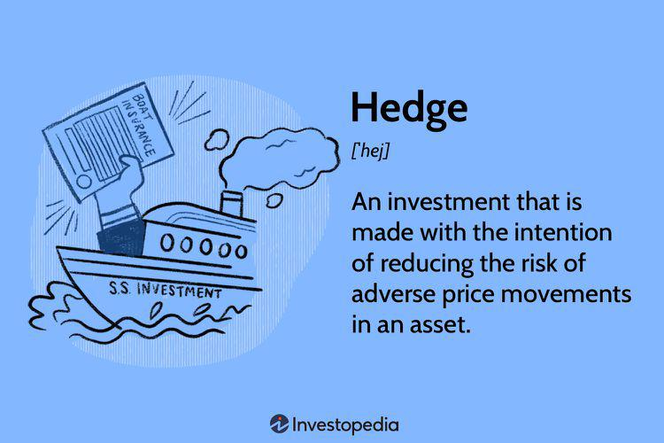

The financial markets are constantly evolving, creating new opportunities and challenges for investors. One of the emerging trends in the investment landscape is the increasing reliance on hedge funds and algorithmic trading.

Hedge funds have been a significant part of the financial markets for decades, traditionally catering to wealthy individuals and institutional investors due to their capacity to employ sophisticated strategies and generate substantial returns. Over the years, hedge funds have attracted significant assets under management, highlighting their importance in the investment industry. However, technological advancements are redefining their role in the future of finance. The advent of new technologies is pushing hedge funds towards more streamlined operations and improved risk management, catering to a broader audience beyond the elite.



Algorithmic trading, commonly known as algo trading, stands at the intersection of finance and technology. It enables traders to execute orders with impressive speed and precision, a feat accomplished through complex algorithms. This technological application is becoming indispensable, especially in highly volatile markets where rapid decision-making is paramount. Algo trading not only enhances trading efficiency but also leverages data-driven strategies to optimize investment decisions.

This article explores the future of investments in financial markets, with a keen focus on hedge funds and algorithmic trading. It seeks to uncover the key trends, innovations, and potential challenges that these elements represent, providing a comprehensive overview of their role in shaping tomorrow's financial landscape. As both hedge funds and algo trading continue to evolve with technological integration, they are set to redefine the investment mechanisms and strategic approaches within the financial markets globally.

## Table of Contents

## The Evolution of Hedge Funds in Modern Markets

Hedge funds, traditionally characterized by their exclusivity, have catered primarily to affluent investors and large institutional clients. These investment vehicles leverage a wide range of strategies to achieve positive returns, often irrespective of market conditions. However, in recent years, hedge funds have come under scrutiny for their high fee structures and inconsistent returns, particularly after the 2008 financial crisis. This environment has spurred a transformation towards greater transparency and more accessible models.

Technology has played a pivotal role in this evolution. With the integration of advanced algorithms, data analytics, and machine learning, hedge funds have streamlined their operations. Technology enhances risk management by allowing funds to quickly assess and adjust to market changes. For example, hedge funds use sophisticated software to simulate different market conditions, enabling them to optimize portfolio strategies. These technological innovations have contributed to improved performance and operational efficiency.

Simultaneously, the industry is witnessing a shift towards democratization. Traditionally, regulatory requirements and the need for substantial initial capital excluded many potential investors. However, the advent of platforms offering a fraction of [hedge fund](/wiki/hedge-fund-trading-strategies)-like strategies at reduced minimum investments is challenging this exclusivity. Publicly traded vehicles, such as Exchange-Traded Funds (ETFs) that replicate hedge fund strategies, are gaining traction. These developments could potentially broaden access for retail investors, democratizing investment opportunities.

This ongoing shift reflects a broader trend towards enhancing investor accessibility and trust, aligning hedge fund operations with modern expectations for accountability and performance transparency. As hedge funds continue to adapt, they are expected to further streamline operations through technology, broaden their investor base, and refine their fee structures, ensuring their relevance in today's dynamic financial landscape.

## Algorithmic Trading: Transforming Investment Strategies

Algorithmic trading uses computer algorithms to automate trading decisions, often based on complex mathematical models. This approach has revolutionized the financial markets by introducing unprecedented speed and precision to the trading process. Algorithms can be designed to execute trades at optimal times, reducing the likelihood of human error and enhancing efficiency.

The growth of big data and [machine learning](/wiki/machine-learning) has significantly advanced the capabilities of [algorithmic trading](/wiki/algorithmic-trading). These technologies allow for the real-time analysis of vast quantities of market data, enabling traders to identify patterns and trends that might not be apparent through traditional analysis methods. For instance, machine learning algorithms can analyze historical data to predict future price movements, providing traders with a strategic edge.

One of the key advantages of algorithmic trading is its ability to reduce transaction costs. By automating the trading process, transactions can be executed rapidly and at a lower cost than manual methods. Additionally, algorithms can operate around the clock, taking advantage of market conditions in different time zones without the need for human intervention. This constant market engagement allows for the exploitation of short-term market inefficiencies, often leading to improved trading outcomes.

Furthermore, the precision inherent in algorithmic trading minimizes human error, a [factor](/wiki/factor-investing) that can lead to significant financial losses in manual trading. Automated systems follow pre-defined rules and models, ensuring consistency and reliability in executing trades according to the strategy set by the trader.

Investors and hedge funds are increasingly turning to algorithmic trading to manage and optimize their portfolios. The ability to process and interpret large sets of data quickly provides these financial entities with a competitive advantage in the highly dynamic market environment. Hedge funds, in particular, have embraced algorithmic strategies to enhance their investment approaches, leveraging technology to gain insights and execute complex trades with efficacy.

In conclusion, algorithmic trading has transformed investment strategies by integrating technological advancements in data processing and analysis into the trading ecosystem. As technology continues to evolve, it is likely that algorithmic trading will become even more sophisticated, further embedding itself as a key component in modern financial markets.

## The Impact of Technology on Hedge Funds and Algo Trading

Technological advancements are fundamentally reshaping hedge funds and algorithmic trading, providing innovative tools for data analysis, risk management, and portfolio optimization. As the financial markets evolve, the integration of technology has emerged as a catalyst for enhanced efficiency and precision.

High-Frequency Trading ([HFT](/wiki/high-frequency-trading-strategies)), a specialized form of algorithmic trading, employs state-of-the-art technology to process and execute a large [volume](/wiki/volume-trading-strategy) of orders at incredibly high speeds. HFT relies on sophisticated algorithms to capitalize on small price differentials in the market, executing trades within fractions of a second. This speed advantage allows HFT firms to enhance [liquidity](/wiki/liquidity-risk-premium) and narrow bid-ask spreads, although it also introduces challenges related to market stability and fairness.

Technology is increasingly pivotal in ensuring security and compliance for hedge funds and algorithmic traders. Advanced systems for real-time data monitoring, encryption, and secure data storage protect sensitive financial information and mitigate risks associated with cyber threats. Meanwhile, sophisticated compliance platforms ensure that operations align with evolving regulatory requirements, reducing the likelihood of legal infringements.

Looking ahead, the integration of Artificial Intelligence (AI) and machine learning stands at the forefront of technological progression in hedge funds and algo trading. AI facilitates predictive analytics by analyzing historical data alongside real-time market conditions to forecast trends and inform trading strategies. Machine learning algorithms can autonomously adapt to new data without explicit programming, offering decision-making processes that evolve and improve over time.

The following Python code snippet exemplifies the use of machine learning in financial predictions, utilizing a simple linear regression model to predict stock prices based on historical data:

```python
import numpy as np
import pandas as pd
from sklearn.model_selection import train_test_split
from sklearn.linear_model import LinearRegression
from sklearn.metrics import mean_squared_error

# Example dataset: Historical stock prices
data = pd.read_csv('stock_prices.csv')
X = data[['feature1', 'feature2', 'feature3']]  # Features
y = data['price']  # Target variable

# Split dataset into training and testing sets
X_train, X_test, y_train, y_test = train_test_split(X, y, test_size=0.2, random_state=42)

# Initialize and train the linear regression model
model = LinearRegression()
model.fit(X_train, y_train)

# Make predictions
predictions = model.predict(X_test)

# Evaluate the model
mse = mean_squared_error(y_test, predictions)
print(f'Model Mean Squared Error: {mse:.2f}')
```

The future of hedge funds and algorithmic trading is set to harness advancements in quantum computing, which promises exponential increases in computational capability. Such technology could transform data analysis, enabling even more complex problem-solving and optimization tasks. As technology perpetually advances, hedge funds and algo traders will need to continually innovate, adapting to emerging trends and leveraging cutting-edge solutions to maintain competitiveness and efficacy in the financial markets.

## Challenges and Considerations for the Future

Algorithmic trading, despite its numerous advantages, introduces several challenges that could impact the stability and efficiency of financial markets. One primary concern is the risk of algorithmic failures. These failures can occur due to coding errors, unforeseen market conditions, or bugs in the algorithm's design, potentially leading to significant financial losses. For instance, a flawed algorithm might misinterpret market signals, executing unwanted trades at high volume and speed. These incidents highlight the importance of rigorous testing and monitoring systems to ensure reliability and minimize the risk of catastrophic failures.

Another significant challenge is market manipulation. Algorithmic trading strategies, if not properly regulated, may contribute to practices such as spoofing, where fake orders are placed to create a misleading picture of demand or supply. This presents a complex regulatory landscape where authorities need to strike a balance between fostering innovation and maintaining market integrity.

Hedge funds operating in this high-tech environment face their own challenges. They must contend with a competitive landscape increasingly driven by technological prowess and data analytics. Regulatory pressures are mounting too, with authorities worldwide demanding greater transparency and accountability. For hedge funds, this means providing more detailed reporting and disclosures to satisfy investor and regulatory expectations. This shift towards transparency can be resource-intensive and may require significant alterations to traditional business practices.

Continual innovation is key in this rapidly changing environment, as financial technology evolves at a rapid pace. Investment firms, including hedge funds and algo traders, must stay updated with the latest technological advancements to remain competitive. This involves not only adopting new tools and systems but also fostering a culture of innovation within their organizations. Professionals skilled in both finance and technology are particularly valuable, as they can bridge the gap between traditional investment strategies and emerging digital solutions.

Ethical considerations and investor protection remain paramount. As hedge funds and algo traders deploy increasingly sophisticated technologies, they must ensure that their operations do not compromise ethical standards or investor confidence. This includes adhering to best practices in data privacy, addressing conflicts of interest, and ensuring that trading strategies align with the financial goals of investors. Building and maintaining trust with stakeholders is crucial for long-term success and sustainability in the financial markets.

In summary, despite the opportunities presented by algorithmic trading and advanced technology, there are considerable challenges and considerations that must be addressed. Continuous innovation, rigorous risk management, and unwavering commitment to ethical standards are essential for navigating these complexities and ensuring a stable and trustworthy investment environment.

## Conclusion

The future of investment in financial markets is poised to be heavily influenced by the continued evolution of hedge funds and algorithmic trading. As these sectors evolve, technology remains both a challenge and an opportunity. It has the potential to unlock new efficiencies and foster innovative investment strategies. Technologies like [artificial intelligence](/wiki/ai-artificial-intelligence) (AI) and machine learning are not merely enhancements; they are transforming how trades are executed, how risks are assessed, and how data is processed. They enable predictive analytics and autonomous decision-making, leading to potential improvements in both speed and accuracy of trading activities.

As the landscape continues to shift, it is imperative for investors and financial professionals to adapt and embrace emerging opportunities while also ensuring a robust risk management framework. The rapid adoption of big data analytics combined with AI technologies allows investors to leverage vast amounts of unstructured data, thereby improving decision-making processes and identifying market trends that were previously unnoticed. However, this advancement also comes with associated risks such as algorithmic failures and cybersecurity threats, which must be mitigated through diligent oversight and strategic planning.

Hedge funds and algorithmic trading are set to play a pivotal role in shaping the financial markets of tomorrow. As they adopt and innovate with technological advancements, they promise a future that is dynamic and exciting for investors. The evolution of these strategies not only enriches the investment portfolio but also reshapes the broader financial ecosystem, presenting both challenges and unparalleled opportunities for growth and efficiency. The agility to adapt to these changes will determine the competitiveness and success in the futuristic financial landscape.

## References & Further Reading

[1]: Bergstra, J., Bardenet, R., Bengio, Y., & Kégl, B. (2011). ["Algorithms for Hyper-Parameter Optimization."](https://dl.acm.org/doi/10.5555/2986459.2986743) Advances in Neural Information Processing Systems 24.

[2]: ["Advances in Financial Machine Learning"](https://www.amazon.com/Advances-Financial-Machine-Learning-Marcos/dp/1119482089) by Marcos Lopez de Prado

[3]: ["Evidence-Based Technical Analysis: Applying the Scientific Method and Statistical Inference to Trading Signals"](https://www.amazon.com/Evidence-Based-Technical-Analysis-Scientific-Statistical/dp/0470008741) by David Aronson

[4]: ["Machine Learning for Algorithmic Trading"](https://github.com/stefan-jansen/machine-learning-for-trading) by Stefan Jansen

[5]: ["Quantitative Trading: How to Build Your Own Algorithmic Trading Business"](https://www.amazon.com/Quantitative-Trading-Build-Algorithmic-Business/dp/1119800064) by Ernest P. Chan