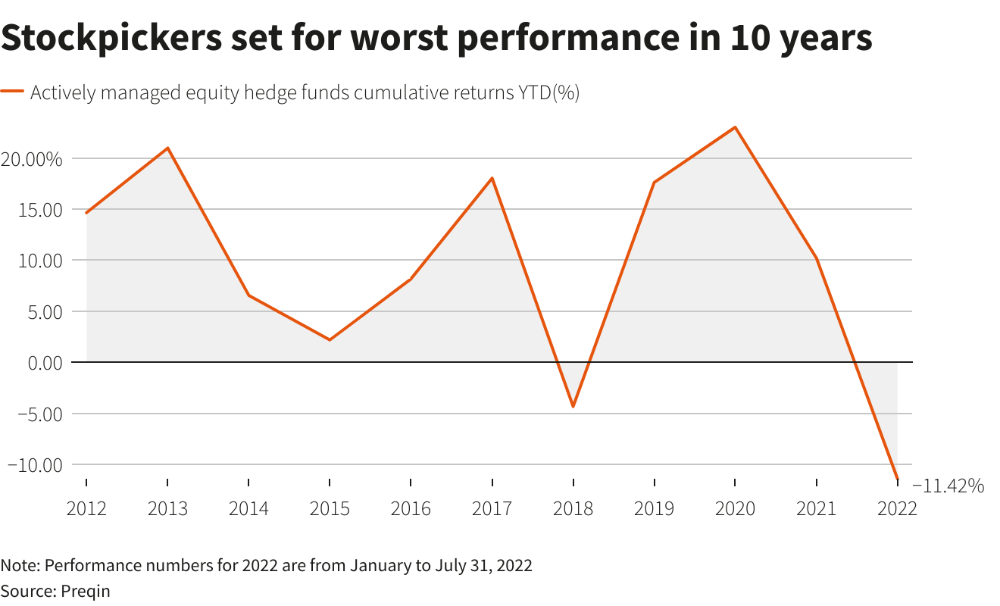

## Table of Contents

## What are hedge funds and how do they operate?

Hedge funds are a type of investment fund that pools money from investors to invest in a wide range of assets, often with the goal of making higher returns than traditional investments like stocks or bonds. They are usually managed by professional investment managers who use different strategies to try to make money for their investors. These strategies can include buying and selling stocks, bonds, commodities, and even more complex financial instruments like derivatives. Hedge funds are often seen as riskier than other types of investments because they can use borrowed money to increase their potential returns, a practice known as leverage.

Hedge funds operate with fewer regulations than other investment funds, which allows them more freedom in how they invest. This means they can take bigger risks, but it also means they can potentially earn higher rewards. Typically, hedge funds are only available to wealthy individuals and institutions because they require a high minimum investment and are considered suitable for people who can afford to take on more risk. The managers of hedge funds usually charge a management fee, often around 2% of the assets they manage, and a performance fee, which is a percentage of the profits they make, often around 20%. This fee structure is meant to align the interests of the managers with those of the investors, encouraging the managers to perform well.

## What trends are currently shaping the hedge fund industry?

The hedge fund industry is currently being shaped by several key trends. One major trend is the increased use of technology and data analytics. Hedge funds are using advanced computer systems and algorithms to analyze large amounts of data quickly. This helps them make better investment decisions and find new opportunities that might be hard to spot otherwise. Another trend is a focus on environmental, social, and governance (ESG) factors. More investors are interested in funds that consider how companies impact the world, so hedge funds are adjusting their strategies to meet this demand.

Another important trend is the rise of co-investments and partnerships. Hedge funds are increasingly working together with other investors, like pension funds or private equity firms, to share the costs and risks of big investments. This can make it easier for them to take on larger projects. Additionally, there is a shift towards more transparency and lower fees. Investors are pushing for hedge funds to be more open about their strategies and performance, and some funds are responding by charging less to attract more clients. These trends are changing how hedge funds operate and compete in the market.

## How might technological advancements impact hedge fund strategies in the next decade?

In the next decade, technology will likely change how hedge funds work a lot. One big change will be the use of [artificial intelligence](/wiki/ai-artificial-intelligence) (AI) and [machine learning](/wiki/machine-learning). These technologies can look at huge amounts of data very quickly and find patterns that humans might miss. This means hedge funds can make better guesses about which investments will do well. They can also use AI to make their trading faster and more automatic, which can help them make money faster and with less risk.

Another way technology will impact hedge funds is through blockchain and cryptocurrencies. More hedge funds might start investing in digital currencies like Bitcoin, and using blockchain to make their transactions safer and easier to track. This could make the whole process of buying and selling investments more clear and less likely to have mistakes. Also, as more companies use technology in their businesses, hedge funds will need to understand these new tech trends to pick the best companies to invest in.

## What role will artificial intelligence and machine learning play in the future of hedge funds?

Artificial intelligence and machine learning will be very important for hedge funds in the future. These technologies can look at a lot of information very quickly and find patterns that people might not see. This helps hedge funds make better choices about where to put their money. They can use AI to guess which investments will do well and make more money for their clients. Also, AI can help hedge funds trade faster and with less risk by making decisions automatically.

Another way AI and machine learning will help hedge funds is by making their work easier and more accurate. For example, AI can help with things like figuring out how much risk a fund is taking or how well it is doing compared to other funds. This can save time and help hedge funds make better decisions. As more companies use technology in their businesses, hedge funds will need to use AI to understand these new trends and pick the best companies to invest in.

## How will regulatory changes potentially affect hedge funds over the next ten years?

Over the next ten years, regulatory changes could have a big impact on hedge funds. Governments around the world might make new rules to make sure hedge funds are safer and more open about what they do. This could mean hedge funds have to tell investors more about their strategies and how much risk they are taking. It might also mean they can't use as much borrowed money, which could make it harder for them to make big profits. These changes could make hedge funds less risky, but they might also make it harder for them to make a lot of money.

Another way regulatory changes could affect hedge funds is by changing who can invest in them. Right now, hedge funds are mostly for rich people and big organizations. But if the rules change, more people might be able to invest in hedge funds. This could bring in more money for hedge funds, but it could also mean they have to be more careful about how they invest because they will have more investors to answer to. Overall, regulatory changes will likely make hedge funds operate differently, balancing between making money and following the rules.

## What are the expected shifts in investor demographics and how will they influence hedge fund strategies?

In the next ten years, the people who invest in hedge funds might change a lot. Right now, most investors are rich people and big organizations. But as more people learn about investing and want to grow their money, younger people and people from different countries might start investing in hedge funds too. This means hedge funds will need to think about what these new investors want and how they can make money for them.

Because of these changes, hedge funds might need to change their strategies. If more younger people are investing, hedge funds might focus more on technology and new kinds of investments that these investors are interested in. They might also need to explain their strategies in simpler ways so that everyone can understand them. If more people from different countries are investing, hedge funds might look for opportunities in those countries and think about how to manage money in different parts of the world. Overall, hedge funds will need to be flexible and ready to change to meet the needs of their new investors.

## How might global economic conditions shape the performance and strategies of hedge funds?

Global economic conditions will have a big impact on how well hedge funds do and what strategies they use. If the world economy is doing well, with lots of people buying and selling things, hedge funds might make more money. They could take more risks because they think the good times will keep going. But if the economy is not doing so well, with fewer people spending money, hedge funds might be more careful. They might try to protect their money by investing in safer things like government bonds or gold. They might also use strategies that let them make money even when the market is going down.

Different things happening around the world can also change what hedge funds do. For example, if one country's economy is growing faster than others, hedge funds might invest more money in that country. Or if there is a big change like a new trade deal or a war, hedge funds might quickly change their strategies to take advantage of new opportunities or to avoid losing money. So, hedge funds always need to keep an eye on what's happening everywhere and be ready to change what they're doing.

## What are the potential new investment strategies that hedge funds might adopt in the next decade?

In the next ten years, hedge funds might start using new ways to make money. One new strategy could be investing more in things like technology and green energy. As more people care about the environment, hedge funds might put money into companies that make clean energy or help fight climate change. They might also use more computer programs to help them pick the best investments. These programs can look at a lot of information very quickly and find good opportunities that people might miss.

Another new strategy could be investing in things like cryptocurrencies and using blockchain technology. More hedge funds might start buying digital money like Bitcoin because it's becoming more popular. They might also use blockchain to make their investments safer and easier to track. This could help them make money in new ways and be more open about what they're doing. As the world changes, hedge funds will need to keep trying new things to stay ahead and make money for their investors.

## How will the competition from other investment vehicles like ETFs and mutual funds evolve?

In the next ten years, hedge funds will face more competition from other ways to invest like ETFs and mutual funds. ETFs, or exchange-traded funds, are becoming more popular because they are easy to buy and sell, and they often cost less than hedge funds. Mutual funds are also getting better at making money for people, and they are easier for more people to invest in. This means hedge funds will need to work harder to show why they are a good choice for investors.

To stay ahead, hedge funds might need to change what they do. They could start using new technology and computer programs to find better investments. They might also try to be more open about their strategies and charge less money to attract more people. As ETFs and mutual funds get better and more popular, hedge funds will need to keep finding new ways to make money and show that they can do better than these other options.

## What are the sustainability and ESG (Environmental, Social, and Governance) considerations that hedge funds will need to address?

Hedge funds will need to think more about sustainability and [ESG](/wiki/esg-investing) factors in the next ten years. More and more people want to invest in companies that are good for the environment and treat people well. This means hedge funds will need to look at how the companies they invest in affect the world. They might choose to put money into businesses that use clean energy or help fight climate change. By doing this, hedge funds can attract investors who care about these issues and want their money to make a positive difference.

Another thing hedge funds will need to do is be more open about how they consider ESG factors. Investors want to know that hedge funds are thinking about the environment, social issues, and how companies are run. Hedge funds might need to report on these things more often and show how they are making a difference. This can help them build trust with investors and show that they are not just trying to make money, but also trying to do good in the world.

## How can hedge funds adapt to the increasing demand for transparency and accountability from investors?

Hedge funds can adapt to the increasing demand for transparency and accountability by sharing more information with their investors. They can do this by giving regular reports that show how they are investing the money and what kind of risks they are taking. By being open about their strategies and performance, hedge funds can build trust with their investors. This means telling investors about the good and the bad, so they know exactly what is happening with their money.

Another way hedge funds can meet this demand is by using technology to make their processes clearer. They can use computer systems to track and report on their investments in real-time. This helps investors see exactly where their money is going and how it is being used. By being more accountable and showing that they care about what investors want, hedge funds can keep their clients happy and attract new ones who value openness and honesty.

## What are the expert predictions on the survival and evolution of hedge funds in the next decade?

Experts think that hedge funds will keep changing and growing in the next ten years. They believe that hedge funds will need to use new technology like AI and machine learning to stay ahead. This will help them find better investments and make more money for their clients. Hedge funds might also start investing more in things like green energy and cryptocurrencies because more people care about the environment and want to try new kinds of investments. To keep up with other ways to invest like ETFs and mutual funds, hedge funds will need to be more open about what they do and maybe even charge less money.

Some experts also think that hedge funds will need to pay more attention to what investors want. More people are asking for transparency and accountability, so hedge funds will need to share more information about their strategies and how they are doing. This means they will need to report more often and be honest about the risks they are taking. If hedge funds can do these things well, they can keep their current investors happy and attract new ones. But if they don't change, they might have a harder time surviving in the future.

## References & Further Reading

[1]: Bergstra, J., Bardenet, R., Bengio, Y., & Kégl, B. (2011). ["Algorithms for Hyper-Parameter Optimization."](https://dl.acm.org/doi/10.5555/2986459.2986743) Advances in Neural Information Processing Systems 24.

[2]: ["Advances in Financial Machine Learning"](https://www.amazon.com/Advances-Financial-Machine-Learning-Marcos/dp/1119482089) by Marcos Lopez de Prado

[3]: ["Evidence-Based Technical Analysis: Applying the Scientific Method and Statistical Inference to Trading Signals"](https://www.amazon.com/Evidence-Based-Technical-Analysis-Scientific-Statistical/dp/0470008741) by David Aronson

[4]: ["Machine Learning for Algorithmic Trading"](https://github.com/stefan-jansen/machine-learning-for-trading) by Stefan Jansen

[5]: ["Quantitative Trading: How to Build Your Own Algorithmic Trading Business"](https://www.amazon.com/Quantitative-Trading-Build-Algorithmic-Business/dp/1119800064) by Ernest P. Chan