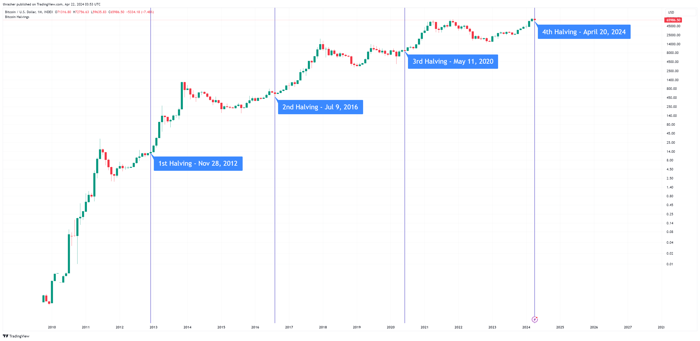

## Table of Contents

## What is Bitcoin and how does it work?

Bitcoin is a type of digital money that you can use to buy things online. It was created in 2009 by someone using the name Satoshi Nakamoto. Unlike regular money, Bitcoin is not controlled by a government or a bank. Instead, it uses a technology called blockchain, which is like a big, public record book that keeps track of all Bitcoin transactions. This makes Bitcoin secure and transparent because everyone can see the transactions, but it also means that once a transaction is recorded, it can't be changed.

When you want to use Bitcoin, you need a special app called a digital wallet to store your Bitcoins. You can get Bitcoins by buying them with regular money or by earning them through a process called mining. Mining involves using powerful computers to solve complex math problems, and when a problem is solved, the miner gets rewarded with new Bitcoins. When you want to send Bitcoins to someone else, you use your digital wallet to create a transaction, which then gets added to the blockchain. This whole process is done without any banks or middlemen, making it a direct way to exchange money.

## Why is Bitcoin considered a valuable investment?

Bitcoin is considered a valuable investment for a few reasons. First, it's seen as a new kind of money that isn't controlled by banks or governments. This makes it attractive to people who want to keep their money safe from things like inflation or economic problems in their country. Also, because there's a limit to how many Bitcoins can ever be made, some people think it will become more valuable over time as more people want to use it.

Another reason people see Bitcoin as a good investment is because it's becoming more popular and accepted. More businesses are starting to accept Bitcoin as payment, and more people are learning about it and wanting to use it. This growing interest can make the value of Bitcoin go up. Plus, Bitcoin can be a way for people to make money by buying it when the price is low and selling it when the price goes up, similar to investing in stocks or gold.

## What are the current trends in Bitcoin's value and adoption?

Bitcoin's value goes up and down a lot. In the past few years, it has had big jumps and falls. For example, in 2021, Bitcoin reached its highest value ever, but then it dropped a lot. Lately, it has been going up and down but not as much as before. Many people think that over time, Bitcoin will become more valuable because more people are starting to use it and believe in it. But it's hard to predict because the price can change quickly based on what people think and what's happening in the world.

More and more people and businesses are starting to use Bitcoin. Big companies like Tesla and PayPal now accept Bitcoin, and some countries are even thinking about using it as their official money. This shows that Bitcoin is becoming more normal and accepted. Also, new ways to use Bitcoin are being created, like special bank accounts that let you save and spend Bitcoin easily. But even with all this, not everyone trusts Bitcoin yet, and some places don't let you use it at all. So, while it's growing, it still has a long way to go before everyone uses it like regular money.

## What factors could influence Bitcoin's growth over the next decade?

Over the next ten years, many things could help Bitcoin grow. One big [factor](/wiki/factor-investing) is if more countries and businesses start to use Bitcoin. If more places accept it as money, then more people will want to use it, which could make its value go up. Also, if governments make rules that help Bitcoin instead of making it harder to use, that could be good for its growth. Another thing is technology. If new tools and apps make it easier and safer to use Bitcoin, then more people might start using it.

Another factor is what people think about Bitcoin. If people believe that Bitcoin is a good way to keep their money safe from problems like inflation or bad economies, then more people might want to buy it. This belief can make the price go up. Also, if big investors and companies keep putting their money into Bitcoin, it could help its value grow. But, if something bad happens, like a big security problem or if people lose trust in Bitcoin, then its value could go down.

In the end, Bitcoin's growth will depend on a mix of these things. If more people use it, if governments and businesses support it, and if technology keeps getting better, then Bitcoin could become a lot more valuable over the next decade. But it's hard to know for sure because the world of money and technology can change a lot.

## How might regulatory changes affect Bitcoin's future?

If governments make rules that help Bitcoin, it could grow a lot. For example, if more countries say Bitcoin is okay to use and make it easier for people to buy and sell it, then more people might start using it. This could make Bitcoin's value go up because more people would want to have it. Also, if big countries like the United States or China make good rules for Bitcoin, it could make people feel safer about using it. When people feel safe, they are more likely to invest in Bitcoin, which can help it grow.

On the other hand, if governments make strict rules that make it hard to use Bitcoin, it could hurt its growth. For example, if a country bans Bitcoin or makes it very hard to buy and sell, then fewer people might want to use it. This could make the value of Bitcoin go down because people might be scared to invest in something that could get them in trouble. So, the rules that governments make about Bitcoin can have a big effect on whether it grows or not in the future.

## What technological advancements could impact Bitcoin's scalability and security?

One big thing that could help Bitcoin work better and be safer is called the Lightning Network. This is a new way to send Bitcoin that makes it much faster and cheaper. Right now, it can take a while to send Bitcoin and it can cost a lot of money. The Lightning Network lets people send Bitcoin to each other without having to wait for the whole Bitcoin network to check the transaction. This could make Bitcoin easier to use for everyday things like buying coffee or paying for a bus ride. If more people start using the Lightning Network, it could help Bitcoin grow because it would be more useful for everyone.

Another thing that could help Bitcoin is better ways to keep it safe. Right now, if someone steals your Bitcoin, it's very hard to get it back. But new technology like multi-signature wallets and hardware wallets can make it much harder for thieves to take your Bitcoin. Multi-signature wallets need more than one person to agree before the Bitcoin can be moved, which makes it safer. Hardware wallets keep your Bitcoin on a special device that isn't connected to the internet, so hackers can't get to it. If these new safety tools become more popular, more people might feel safe using Bitcoin, which could help it grow.

## What are the potential risks and challenges Bitcoin might face in the next decade?

One big risk for Bitcoin in the next ten years is that governments might make rules that make it hard to use. If more countries decide to ban Bitcoin or make it very hard to buy and sell, then fewer people might want to use it. This could make the value of Bitcoin go down because people might be scared to invest in something that could get them in trouble. Also, if big countries like the United States or China make strict rules, it could hurt Bitcoin a lot because many people look to these countries for what to do.

Another challenge is that Bitcoin can be hard to use and not very fast. Right now, it can take a while to send Bitcoin and it can cost a lot of money. If new technology like the Lightning Network doesn't work well or if it's hard for people to use, then Bitcoin might not grow as much as people hope. Also, if there are big security problems, like hackers stealing a lot of Bitcoin, it could make people lose trust in it. If people don't feel safe using Bitcoin, they might not want to use it, which could stop it from growing.

Lastly, the value of Bitcoin can go up and down a lot. This can be scary for people who want to invest in it because they might lose money if the price goes down. If Bitcoin keeps being very unpredictable, it might be hard for it to become something that people use every day. So, for Bitcoin to grow in the next decade, it needs to become easier to use, safer, and less unpredictable.

## How could global economic conditions influence Bitcoin's performance?

Global economic conditions can have a big effect on how well Bitcoin does. When the world's economy is doing badly, like during a recession, people might look for other ways to keep their money safe. Bitcoin can seem like a good choice because it's not controlled by banks or governments. If more people start buying Bitcoin during tough economic times, its value could go up. But if people are scared about losing their money and don't trust Bitcoin, they might not buy it, which could make its value go down.

Also, when the economy is doing well, it can be good or bad for Bitcoin. If people feel rich and want to try new things, they might invest in Bitcoin, which could make its value go up. But if the economy is doing so well that people trust regular money more, they might not see the need for Bitcoin. Plus, if big events happen, like changes in interest rates or big economic policies, they can make Bitcoin's value change a lot. So, the world's economy can push Bitcoin's value up or down depending on what people think and do.

## What role might institutional investors play in Bitcoin's future?

Institutional investors, like big banks and investment funds, could have a big impact on Bitcoin's future. If more of these big investors start buying Bitcoin, it could make its value go up a lot. This is because they have a lot of money to spend, and when they invest in something, it often makes other people want to invest too. Also, if big investors start using Bitcoin, it might make more people trust it because they see that smart people with a lot of money believe in it.

But there are also risks. If big investors decide to sell their Bitcoin all at once, it could make the price go down a lot. This is because they have so much Bitcoin that selling it could make the market go crazy. Also, if big investors start making their own rules about Bitcoin, it could change how it works and who can use it. So, while big investors could help Bitcoin grow, they could also make it more unpredictable and risky.

## How could the development of other cryptocurrencies and blockchain technologies affect Bitcoin?

The development of other cryptocurrencies and blockchain technologies could make things harder for Bitcoin. If new cryptocurrencies come out that are faster, cheaper, or easier to use than Bitcoin, then people might start using those instead. For example, some new cryptocurrencies are trying to solve problems that Bitcoin has, like being slow or expensive to use. If these new cryptocurrencies become popular, it could make fewer people want to use Bitcoin, which could make its value go down. Also, if new blockchain technologies make it easier for people to create their own cryptocurrencies, there could be a lot more competition for Bitcoin.

On the other hand, the growth of other cryptocurrencies and blockchain technologies could also help Bitcoin. If more people start using and understanding blockchain technology because of other cryptocurrencies, it could make more people interested in Bitcoin too. For example, if a new [cryptocurrency](/wiki/cryptocurrency) gets a lot of attention, it could make people want to learn more about all cryptocurrencies, including Bitcoin. Also, if new blockchain technologies make the whole world of digital money better and safer, it could make people trust Bitcoin more. So, while other cryptocurrencies and blockchain technologies could make things harder for Bitcoin, they could also help it grow if they make the whole world of digital money better.

## What are the long-term predictions for Bitcoin's price and market dominance?

In the long term, many people think Bitcoin's price could go up a lot. This is because more and more people are starting to use and believe in Bitcoin. If more businesses accept Bitcoin and if governments make rules that help it, then more people might want to buy it. Also, there's a limit to how many Bitcoins can ever be made, which some people think will make it more valuable over time. But, it's hard to know for sure because the price can change a lot based on what people think and what's happening in the world. Some experts say Bitcoin could reach very high prices in the next ten years, while others think it might not grow as much as people hope.

Bitcoin's market dominance, which means how much of the whole cryptocurrency market it controls, could also change in the future. Right now, Bitcoin is the biggest cryptocurrency, but other cryptocurrencies are growing too. If new cryptocurrencies become very popular and useful, they might take some of Bitcoin's market share. But, if Bitcoin keeps improving and stays the most trusted and well-known cryptocurrency, it might keep its big place in the market. It's hard to predict because the world of cryptocurrencies is always changing, but Bitcoin's strong brand and early start could help it stay important for a long time.

## How should investors prepare their strategies based on future projections for Bitcoin?

Investors should think about the future of Bitcoin carefully before making any decisions. Many people believe that Bitcoin's price could go up a lot over the next ten years because more people are using it and it has a limit on how many can be made. But, it's also important to remember that Bitcoin's price can change a lot and quickly. So, investors should not put all their money into Bitcoin. They should only invest money they can afford to lose and should think about spreading their money across different investments to be safe.

Another thing investors should do is keep up with news and changes in the world of Bitcoin. This includes watching what governments are doing, what new technology is coming out, and how the economy is doing. All these things can affect Bitcoin's price and how well it does. If investors stay informed, they can make better choices about when to buy or sell Bitcoin. Also, they should think about the long term and not just try to make quick money, because Bitcoin can be a good investment if people are patient and smart about it.

## References & Further Reading

[1]: Nakamoto, S. (2008). ["Bitcoin: A Peer-to-Peer Electronic Cash System."](https://nakamotoinstitute.org/library/bitcoin/)

[2]: Peters, G. W., and Panayi, E. (2016). ["Understanding modern banking ledgers through blockchain technologies: Future of transaction processing and smart contracts on the internet of money."](https://arxiv.org/pdf/1511.05740.pdf) Banking Beyond Banks and Money, 239-278.

[3]: Narayanan, A., Bonneau, J., Felten, E., Miller, A., & Goldfeder, S. (2016). ["Bitcoin and Cryptocurrency Technologies: A Comprehensive Introduction."](https://press.princeton.edu/books/hardcover/9780691171692/bitcoin-and-cryptocurrency-technologies) Princeton University Press.

[4]: Tapscott, D., & Tapscott, A. (2016). ["Blockchain Revolution: How the Technology Behind Bitcoin and Other Cryptocurrencies is Changing the World."](https://www.amazon.com/Blockchain-Revolution-Technology-Cryptocurrencies-Changing/dp/1101980141) Portfolio.

[5]: De Filippi, P., & Wright, A. (2018). ["Blockchain and the Law: The Rule of Code."](https://www.jstor.org/stable/j.ctv2867sp) Harvard University Press.

[6]: Shiryaev, A., & Feinberg, E. A. (2017). ["Handbook of Blockchain, Digital Finance, and Inclusion, Volume 1: Cryptocurrency, FinTech, InsurTech, and Regulation."](https://www.sciencedirect.com/book/9780128104415/handbook-of-blockchain-digital-finance-and-inclusion-volume-1) Elsevier.

[7]: Hull, J. C. (2018). ["Options, Futures, and Other Derivatives"](https://www.semanticscholar.org/paper/Options%2C-Futures%2C-and-Other-Derivatives-Hull/89bdee500c8623864fc9eb7a471546aa713acc44) (10th Edition). Pearson. 

[8]: Lopez de Prado, M. (2018). ["Advances in Financial Machine Learning."](https://www.amazon.com/Advances-Financial-Machine-Learning-Marcos/dp/1119482089) John Wiley & Sons.

[9]: Chan, E.P. (2009). ["Quantitative Trading: How to Build Your Own Algorithmic Trading Business."](https://github.com/ftvision/quant_trading_echan_book) John Wiley & Sons.