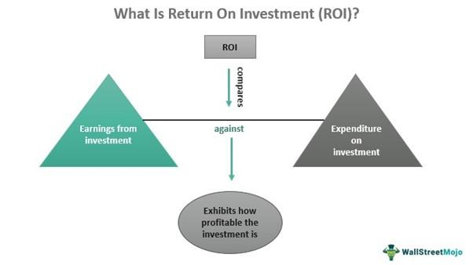

## Table of Contents

## What are TIPS and how do they work?

TIPS stands for Treasury Inflation-Protected Securities. They are special bonds issued by the U.S. government. TIPS help protect your money from inflation, which is when prices go up over time. When you buy a TIPS, you get interest payments every six months. The cool thing about TIPS is that both the interest payments and the amount you get back at the end can grow if inflation goes up.

Here's how it works: Let's say you buy a TIPS for $1,000. If inflation goes up, the value of your TIPS will increase. For example, if inflation is 2%, your TIPS might be worth $1,020 the next year. The interest you earn is based on this new, higher value. So, if the interest rate is 1%, you would get interest on $1,020 instead of $1,000. This way, your money keeps up with inflation. When the TIPS matures, you get back the adjusted amount, which could be more than what you paid if inflation has been high.

## What are the benefits of investing in TIPS?

Investing in TIPS has some big benefits. One of the main benefits is that they protect your money from inflation. When prices go up, the value of your TIPS goes up too. This means your money keeps its buying power over time. For example, if you save money in a regular savings account and inflation goes up, your money might not be worth as much when you want to spend it. But with TIPS, the value adjusts to keep up with inflation.

Another benefit is that TIPS are very safe. They are backed by the U.S. government, which means there's a very low chance you'll lose your money. This makes TIPS a good choice if you want to keep your money safe while still getting some protection from inflation. Also, TIPS can be a good part of a balanced investment plan. They can help balance out riskier investments like stocks, making your overall investment plan more stable.

## How do TIPS protect against inflation?

TIPS protect against inflation by adjusting the value of the bond based on changes in the Consumer Price Index (CPI), which measures inflation. When you buy a TIPS, you get interest payments every six months. If inflation goes up, the value of your TIPS increases too. This means the interest you earn is calculated on a higher amount, so your earnings keep up with rising prices.

When the TIPS matures, you get back the adjusted principal, which could be more than what you originally paid if inflation has been high. This way, your investment keeps its buying power even as prices go up. So, if you save money in TIPS, you don't have to worry about your money being worth less in the future because of inflation.

## What is the typical return on TIPS over a 20-year period?

The typical return on TIPS over a 20-year period can vary based on inflation rates during that time. If inflation is low, the return might be close to the [interest rate](/wiki/interest-rate-trading-strategies) you get when you buy the TIPS. For example, if you buy a TIPS with a 1% interest rate and inflation stays low, your return might be around 1% per year, which would add up to about 20% over 20 years, not counting the adjustments for inflation.

If inflation is higher, the return can be better because the value of your TIPS goes up with inflation. Let's say inflation averages 2% per year over 20 years. With the same 1% interest rate, your TIPS would grow with inflation, and you would get interest on the higher value. This could lead to a total return of around 60% over 20 years, considering both the interest and the inflation adjustments. So, the return on TIPS depends a lot on what happens with inflation over the years.

## How does the interest rate environment affect TIPS returns?

The interest rate environment plays a big role in how much you can earn from TIPS. When interest rates are low, the interest you get from TIPS might not be very high. But if inflation goes up during this time, the value of your TIPS can still grow because it adjusts with inflation. So, even with low interest rates, you can still make money if prices are going up a lot.

On the other hand, when interest rates are high, the interest payments you get from TIPS can be better. But if inflation is low, the overall return might not be as good because the value of your TIPS won't grow as much from inflation adjustments. So, the best situation for TIPS is when interest rates are high and inflation is also high, because then you get good interest payments and your TIPS grows in value too.

## What are the tax implications of investing in TIPS?

When you invest in TIPS, you need to know about the taxes. The interest you get from TIPS every six months is taxed as regular income. This means you have to pay taxes on this interest every year, even though you don't get all your money back until the TIPS matures. Also, if inflation goes up and the value of your TIPS increases, you have to pay taxes on that increase too, even though you don't get that extra money until the end. This can be a bit tricky because you're paying taxes on money you haven't actually received yet.

The good news is that when your TIPS matures and you get your money back, you don't have to pay taxes on the inflation adjustments again. You already paid taxes on those increases every year. But if you sell your TIPS before they mature and you make a profit, you'll have to pay capital gains tax on that profit. So, it's important to think about these tax rules when you're deciding if TIPS are a good investment for you.

## How does the timing of investment in TIPS impact long-term returns?

The timing of when you buy TIPS can really change how much money you make over a long time. If you buy TIPS when interest rates are high, you'll get bigger interest payments every six months. This can make your total return better over many years. But if you buy them when interest rates are low, your interest payments won't be as big, and your overall return might not be as good, even if inflation goes up.

Also, the timing matters because of inflation. If you buy TIPS when inflation is expected to go up a lot, your TIPS will grow in value more, and you'll get interest on a bigger amount. This can lead to a better return over the long run. But if you buy them when inflation is low and stays low, the value of your TIPS won't grow as much, and your return might not be as good. So, thinking about when to buy TIPS can help you make more money over time.

## What are the risks associated with TIPS investments over 20 years?

One risk of investing in TIPS over 20 years is that inflation might be lower than expected. If inflation stays low, the value of your TIPS won't go up much, and your returns might not be as good as you hoped. This means you might not make as much money as you would with other investments that do better when inflation is low.

Another risk is that interest rates could go up after you buy your TIPS. If that happens, new TIPS will have higher interest rates, making the ones you already own less valuable. This can affect how much you can sell your TIPS for if you need to sell them before they mature. Also, if you need to take money out of your TIPS early, you might lose money because you have to pay taxes on the inflation adjustments every year, even though you don't get that money until the end.

Overall, while TIPS are safe because they're backed by the U.S. government, their returns depend a lot on inflation and interest rates. If those don't go the way you expect, your long-term returns might not be as good as you planned. It's important to think about these risks when deciding if TIPS are right for your investment goals.

## How do TIPS compare to other inflation-protected securities?

TIPS are a type of inflation-protected security that the U.S. government offers. They adjust with inflation, so the value of your investment goes up when prices go up. This means your money keeps its buying power over time. TIPS pay interest every six months, and the interest is based on the adjusted value, so if inflation is high, you get more interest. They are very safe because they are backed by the U.S. government, which makes them a good choice if you want to protect your money from inflation without taking a lot of risk.

Other inflation-protected securities exist too, like inflation-linked bonds from other countries or inflation-indexed annuities. These work in a similar way by adjusting for inflation, but they might have different rules and risks. For example, inflation-linked bonds from other countries might be affected by changes in currency values, which can add another layer of risk. Inflation-indexed annuities might offer a steady income that goes up with inflation, but they can be more complex and might have higher fees. So, while TIPS are a safe and straightforward way to protect against inflation, other options might offer different benefits and risks depending on what you're looking for in an investment.

## What role does TIPS play in a diversified investment portfolio?

TIPS can be a really helpful part of a diversified investment portfolio because they protect your money from inflation. When prices go up, the value of your TIPS goes up too, so your money keeps its buying power. This can balance out other investments like stocks or regular bonds that might not do as well when inflation is high. By having TIPS in your portfolio, you spread out your risk and make your overall investment plan more stable.

Also, TIPS are very safe because they are backed by the U.S. government. This means there's a very low chance you'll lose your money. When you mix TIPS with riskier investments like stocks, you can feel more secure knowing that part of your money is protected. So, TIPS can help you keep some of your money safe while still giving you a chance to grow your wealth through other investments.

## How can one forecast future returns on TIPS using economic indicators?

To forecast future returns on TIPS, you need to look at economic indicators like inflation rates and interest rates. Inflation is really important because TIPS adjust their value based on the Consumer Price Index (CPI). If you think inflation will go up a lot, your TIPS will grow in value, and you'll get more interest. So, keeping an eye on economic reports that predict inflation can help you guess how well your TIPS will do. Also, watching interest rates is key because they affect the interest payments you get from TIPS. If interest rates are expected to go up, the returns on new TIPS will be better, but the value of the TIPS you already own might go down.

Another thing to think about is the overall economy. If the economy is doing well, inflation might go up, which is good for TIPS. But if the economy is struggling, inflation might stay low, and your TIPS won't grow as much. You can look at economic indicators like GDP growth, unemployment rates, and consumer spending to get a sense of where the economy is headed. By putting all these pieces together, you can make a better guess about how much money you might make from TIPS in the future.

## What advanced strategies can be used to optimize returns from TIPS over a 20-year horizon?

To optimize returns from TIPS over a 20-year horizon, one strategy is to ladder your investments. This means you buy TIPS that mature at different times over the 20 years. By doing this, you can take advantage of different interest rates and inflation levels. If interest rates go up, you can reinvest the money from TIPS that mature early into new TIPS with higher rates. If inflation goes up a lot, the TIPS that mature later will have had more time to grow in value, giving you a better return. Laddering helps you spread out your risk and make the most of changing economic conditions.

Another strategy is to use TIPS as part of a larger investment plan that includes other types of investments. You can balance TIPS with stocks, regular bonds, and other assets to create a portfolio that can handle different economic situations. When inflation is high, TIPS will help protect your money, while other investments might do better when inflation is low. By adjusting how much you put into TIPS based on your predictions about inflation and interest rates, you can optimize your overall returns. This approach requires you to keep an eye on economic indicators and be ready to make changes to your investments over time.

## What are Inflation-Protected Securities (TIPS) and how do they work?

Inflation-Protected Securities, known as Treasury Inflation-Protected Securities (TIPS), are a type of U.S. Treasury bond designed to help investors guard against inflation. The principal feature of TIPS is their ability to adjust in relation to the Consumer Price Index (CPI), an indicator of inflation. This adjustment ensures that the purchasing power of the investment is maintained throughout the bond's life.

**Mechanics of TIPS**

The principal value of TIPS increases with inflation and decreases with deflation, as measured by the CPI. The interest payments on TIPS occur semi-annually and are calculated based on the adjusted principal. Therefore, if the principal increases due to inflation, the interest payments increase as well. This feature distinguishes TIPS from regular fixed-income securities whose principal remains constant over time.

The formula for calculating the adjusted principal of TIPS is as follows:

$$
\text{Adjusted Principal} = \text{Original Principal} \times \left(1 + \frac{\text{CPI Change}}{100}\right)
$$

**Comparison with Other Fixed-Income Securities**

While conventional Treasury bonds provide a fixed interest payment, their real value can erode due to inflation, leading to reduced purchasing power over time. In contrast, TIPS mitigate this risk through principal adjustments, providing an effective hedge against inflation. This inflation protection comes at a cost: TIPS often offer lower initial yields compared to similar maturity non-inflation-adjusted Treasuries. However, their inflation-linked adjustments can enhance returns in a high inflation environment, which other bonds cannot offer without jeopardizing their principal.

**Historical Context and U.S. Treasury Introduction**

TIPS were first issued by the U.S. Treasury in 1997 as part of an effort to provide investors with a tool to manage inflation risk while broadening the types of debt instruments available. Since their inception, TIPS have become a staple in government debt offerings, attracting a variety of institutional and individual investors seeking to hedge against inflation.

**Benefits of TIPS in a Diversified Investment Portfolio**

Incorporating TIPS into a diversified portfolio can offer several benefits:

1. **Inflation Protection**: The principal adjustment feature of TIPS makes them a reliable instrument for preserving purchasing power during inflationary periods.

2. **Diversification**: As their performance is linked to inflation changes, TIPS may perform differently than nominal bonds and equities, thus contributing to diversification.

3. **Low Correlation with Other Asset Classes**: TIPS often exhibit low correlation with other investment vehicles like stocks and nominal bonds, which can enhance portfolio stability.

Overall, TIPS can be a valuable component of an investment strategy aimed at long-term capital preservation and income generation, particularly for those concerned about inflation eroding the value of their investments. Their inclusion in a diversified investment portfolio helps balance risk by offsetting potential losses in other fixed-income assets during inflationary periods.

## What is the Importance of 20-Year Returns in Investment Planning?

The 20-year time frame is considered a crucial period for investors due to its ability to encompass entire economic cycles, diminishing the adverse effects of short-term [volatility](/wiki/volatility-trading-strategies) and enabling long-term growth potential. This duration provides a buffer against ephemeral market fluctuations, allowing investors to accumulate wealth through compounding returns. Unlike shorter investment periods where market volatility can significantly affect outcomes, a 20-year horizon tends to smooth out price swings, providing a clearer picture of an asset's performance trajectory.

Inflation-Protected Securities, or TIPS, historically have demonstrated resilience and reliability over the past two decades, making them a favored choice for investors seeking both security and growth. Data from the U.S. Treasury show that TIPS have consistently outperformed traditional fixed-income securities, especially during periods of high inflation. Over the past 20 years, TIPS have provided a hedge against inflation, as their principal adjusts with the Consumer Price Index (CPI), which ensures that the real value of the investment remains intact.

The significance of 20-year returns foregrounds TIPS as a potent tool in retirement and wealth-building strategies. For retirement planning, TIPS offer assurance that the purchasing power will not be eroded over time, which is crucial for retirees who depend on a stable income stream. Additionally, when incorporated into a diversified portfolio, TIPS can reduce overall risk, as their performance is typically less correlated with equities, offering stability in tumultuous markets.

In the context of long-term financial planning, TIPS serve as a strategic asset for maintaining [liquidity](/wiki/liquidity-risk-premium) while securing inflation-adjusted growth. The enduring nature of TIPS returns over two decades empowers investors to plan with greater precision, aligning their financial goals with expected outcomes. Consequently, TIPS can play a fundamental role in solidifying the financial foundation required to achieve lasting economic security.

Investors might use a formula to model returns over a 20-year period, taking into account inflation adjustments and compounding effects. For example:

$$

\text{Final Principal} = \text{Initial Principal} \times (1 + \text{CPI Increase})^{20}
$$

For precise calculations, this process could be implemented in Python:

```python
def calculate_final_principal(initial_principal, cpi_increase, years=20):
    final_principal = initial_principal * ((1 + cpi_increase) ** years)
    return final_principal

# Example usage
initial_principal = 1000  # Initial investment
cpi_increase = 0.02       # Average annual CPI increase (2%)
final_value = calculate_final_principal(initial_principal, cpi_increase)
print(f"The final principal after 20 years is: ${final_value:.2f}")
```

These insights demonstrate the importance of the 20-year period as both a protective horizon and a framework for achieving financial goals through instruments like TIPS.

## How can we analyze the performance of TIPS using algorithmic models?

Inflation-Protected Securities (TIPS) have gained prominence among investors due to their ability to hedge against inflation. As [algorithmic trading](/wiki/algorithmic-trading) becomes more prevalent, analyzing the performance of TIPS through algorithmic models presents opportunities for optimizing returns.

### Case Studies of TIPS Performance Analysis

Algorithmic models have been employed to assess TIPS performance by analyzing historical data and simulating various market scenarios. A notable case study involves using a data-driven algorithmic framework that incorporates macroeconomic indicators like GDP growth, employment rates, and inflation expectations to forecast TIPS returns. By integrating these factors, the model offers insights into the potential performance under varying economic conditions.

### Key Metrics and Indicators

Evaluating TIPS performance requires analyzing specific key metrics. The real yield, calculated as the nominal yield minus expected inflation, is critical. Additionally, the break-even inflation rate, which represents the difference in yield between TIPS and comparable nominal Treasury bonds, serves as a gauge of market inflation expectations. The consumer price index (CPI), which directly influences the principal value of TIPS, is another vital indicator.

Mathematically, the real return on TIPS can be calculated using:

$$
\text{Real Return} = \frac{1 + \text{Nominal Return}}{1 + \text{Inflation Rate}} - 1
$$

Python code for calculating real return:

```python
def real_return(nominal_return, inflation_rate):
    return (1 + nominal_return) / (1 + inflation_rate) - 1

nominal_return = 0.03  # Example: 3%
inflation_rate = 0.02  # Example: 2%
print("Real Return:", real_return(nominal_return, inflation_rate))
```

### Impact of Economic Factors and Inflation Trends

Economic factors and inflation trends substantially influence TIPS performance. For instance, during periods of rising inflation, TIPS can outperform traditional fixed-income securities due to their inflation adjustment features. Conversely, in low-inflation environments, they may offer lower returns as the inflation adjustment is minimal. Hence, algorithmic models need to incorporate adaptive components to account for changing economic conditions.

### Role of Back-Testing

Back-testing is pivotal in refining algorithmic models for TIPS. By simulating past market conditions, analysts can validate the model's accuracy and adjust its parameters to enhance predictive performance. This iterative process helps in tuning the model to react appropriately to different inflationary scenarios, thus optimizing TIPS trading strategies.

### Future Innovations in TIPS Trading Algorithms

Looking ahead, innovations in TIPS trading algorithms are likely to leverage advancements in [machine learning](/wiki/machine-learning) and [artificial intelligence](/wiki/ai-artificial-intelligence). Techniques such as [deep learning](/wiki/deep-learning) can uncover complex patterns in historical data, improving the accuracy of forecasts. Furthermore, the incorporation of real-time data analytics will enable dynamic adjustments to strategies, ensuring that TIPS investments are aligned with prevalent economic and inflationary trends.

In conclusion, analyzing the performance of TIPS using algorithmic models involves a multifaceted approach that integrates economic indicators, back-testing, and innovative techniques. These tools empower investors to make informed decisions and optimize returns in the context of dynamic inflationary environments.

## References & Further Reading

[1]: Campbell, J. Y., Shiller, R. J., & Viceira, L. M. (2009). ["Understanding Inflation-Indexed Bond Markets."](https://www.nber.org/papers/w15014) Brookings Papers on Economic Activity.

[2]: Bodie, Z. (1990). ["Inflation-Protected Value Investing"](https://www.investopedia.com/articles/investing/081315/9-top-assets-protection-against-inflation.asp). Financial Analysts Journal, 46(5), 18-28.

[3]: ["Investing in TIPS: The Treasury Inflation-Protected Securities"](https://www.investopedia.com/articles/investing/102215/3-reasons-stay-away-tips.asp) by U.S. Department of the Treasury

[4]: ["Machine Learning for Asset Managers"](https://www.cambridge.org/core/elements/abs/machine-learning-for-asset-managers/6D9211305EA2E425D33A9F38D0AE3545) by Marco Avellaneda and Jean-Philippe Bouchaud

[5]: ["Quantitative Strategies for Achieving Alpha"](https://books.google.com/books/about/Quantitative_Strategies_for_Achieving_Al.html?id=gak10pWSMxIC) by Richard Tortoriello

[6]: ["Algorithmic Trading: Winning Strategies and Their Rationale"](https://www.wiley.com/en-us/Algorithmic+Trading%3A+Winning+Strategies+and+Their+Rationale-p-9781118460146) by Ernie Chan

[7]: ["Treasury Inflation-Protected Securities: What They Offer Investors"](https://www.investopedia.com/terms/t/tips.asp) by John Carlson, Federal Reserve Bank of Cleveland 

These references provide a range of perspectives on TIPS, algorithmic trading, and the role of machine learning in finance, offering further insight for readers interested in these topics.