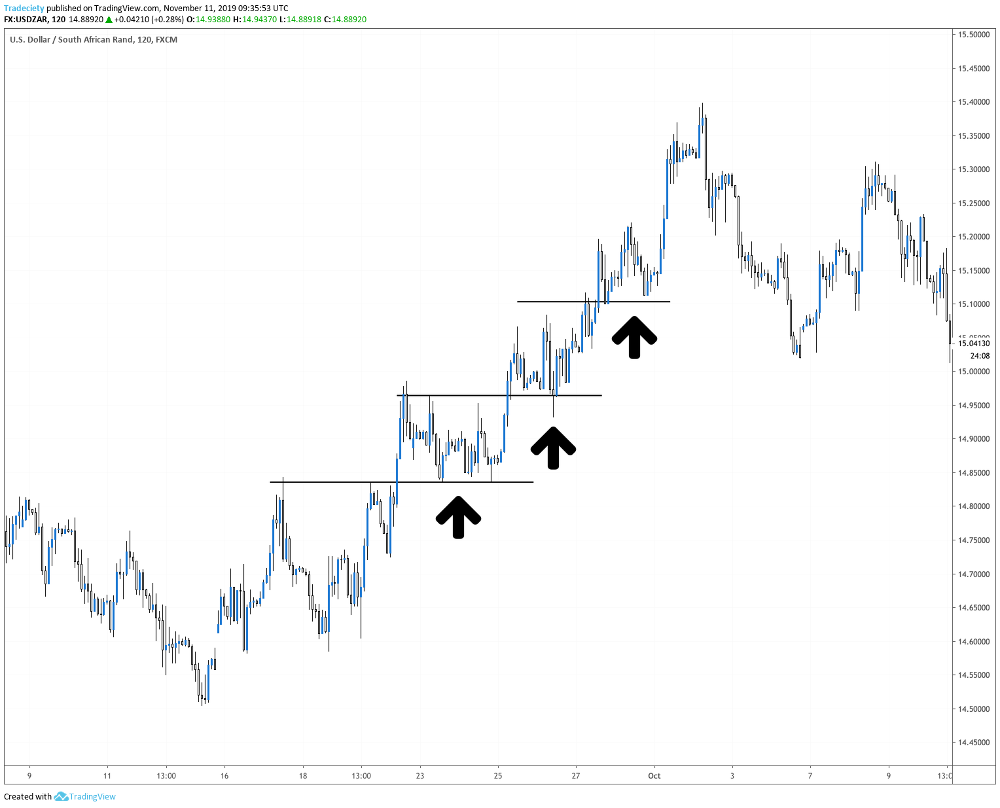
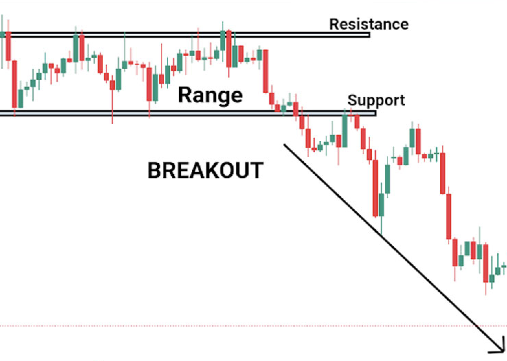

Futures trading, a pivotal component of the financial markets, involves the buying and selling of contracts that obligate the holder to purchase or sell an asset at a predetermined future date and price. These assets range broadly, encompassing commodities like oil and gold, financial instruments like bonds, and even market indices. At its core, futures trading serves as a crucial mechanism for price discovery and risk management, offering a platform for both speculation and hedging.

The significance of futures trading lies in its ability to allow traders and investors to hedge against market risks and speculate on price movements of underlying assets. This form of trading is unique in that it provides high leverage, meaning traders can control large contract values with a relatively small amount of capital. However, with this leverage comes a proportional increase in risk, making futures trading a double-edged sword.

The purpose of this article is not just to deep dive into the mechanics of futures trading, but to provide a comprehensive exploration of various trading strategies. Whether you're a novice trader embarking on your first foray into the futures market or an experienced trader looking to refine your approach, this guide aims to equip you with a deeper understanding and practical knowledge of effective strategies in futures trading. From understanding the basic construction of a futures contract to mastering advanced trading techniques, this article will be your roadmap to navigating the complex yet rewarding world of futures trading.

# Futures Trading Basics

Understanding futures contracts is foundational to mastering futures trading. At its core, a futures contract is a standardized legal agreement to buy or sell an asset at a predetermined price at a specified time in the future. The assets in question can vary widely, encompassing commodities like oil and agricultural products, financial instruments such as government bonds, or even market indices. Unlike the immediate exchange of assets in spot trading, futures contracts are about the agreement to transact in the future, providing a unique blend of flexibility and obligation.

The mechanics of futures trading hinge on these contracts and their specifications, which include the size of the contract, the delivery date, and the increment by which the price can fluctuate. Traders don't usually intend to take physical delivery of the commodities; instead, they speculate on the price movement of these contracts. This is where futures trading becomes an essential tool for both hedging and speculation.

In hedging, traders use futures contracts to mitigate the risk of price movements in the underlying asset. For example, a farmer might sell wheat futures to lock in a price for their crop, guarding against potential price drops before harvest. Conversely, speculators engage in futures trading to profit from price fluctuations. They analyze market trends and economic indicators to predict future price movements, buying or selling contracts accordingly.

An integral aspect of futures trading is its leverage feature. Traders can control large contract values with relatively small amounts of capital, known as the margin. While this can amplify profits, it also increases risk, making it vital for traders to have a robust understanding of market dynamics and risk management strategies.

Futures trading plays a significant role in market speculation and hedging. By offering a platform to manage price risk and speculate on future price movements, futures markets contribute significantly to the overall price discovery process in financial markets. This makes them an indispensable tool for individual traders, institutional investors, and commercial enterprises alike.

# Advantages and Risks

## Pros of Futures Trading

Futures trading presents several key advantages, making it an attractive option for a variety of traders and investors. One of the most significant benefits is **leverage**. Leverage in futures trading means controlling a large contract value with a relatively small amount of capital, known as the initial margin. This leverage can amplify potential profits but also increases risk, which is why it's essential for traders to use it judiciously.

Another major advantage is **liquidity**. Futures markets are typically very liquid, especially for major commodities and indices, ensuring tight bid-ask spreads and the ability to enter and exit positions easily. This liquidity is a critical factor that helps traders implement strategies more efficiently and at better prices.

Futures trading also offers diverse hedging opportunities. Hedging is the practice of reducing risk by taking an opposing position in a related asset. For example, a wheat farmer can use futures contracts to lock in a price for their crop, mitigating the risk of price fluctuations. Similarly, investors holding a portfolio of stocks can hedge against potential market downturns using index futures.

Furthermore, futures markets are nearly **24 hours**, providing the flexibility to react to global economic events as they unfold, which is especially beneficial in today's interconnected world. This around-the-clock trading can lead to better risk management and the ability to capitalize on market opportunities outside of standard market hours.

In addition, futures markets offer a wide variety of instruments to trade, from commodities like oil and gold to financial instruments like Treasury bonds and stock indices. This variety enables traders to diversify their strategies across different asset classes, reducing risk and increasing potential opportunities for profit.

Lastly, futures markets are **highly regulated**, offering a transparent and fair trading environment. This regulation helps protect market participants from fraud and manipulation, contributing to a more stable and trustworthy market environment.

In summary, the benefits of futures trading, such as leverage, liquidity, hedging, market access, variety, and regulation, make it a versatile and potent tool in the financial markets. However, it is crucial to approach these markets with a solid understanding of their mechanisms and risks.

## Cons and Risks

Futures trading, while offering numerous benefits, also comes with its own set of risks and challenges that traders should be aware of. Understanding these risks is crucial for anyone looking to enter the futures market.

One of the most significant risks in futures trading is **market volatility**. Futures markets can be highly volatile, with prices fluctuating rapidly due to various factors such as economic reports, geopolitical events, and natural disasters. This volatility can result in substantial gains, but it also poses a risk of large losses, especially for those who are not prepared or do not understand the market dynamics well.

The **complexity** of futures markets can also be a risk for inexperienced traders. Futures contracts come with their own set of terms, including expiration dates and tick sizes, which can be challenging to understand for those new to the market. A lack of understanding of these elements can lead to mistakes and financial losses.

# Developing a Trading Plan

Developing a trading plan is a critical step for any futures trader. A well-structured plan provides a framework for making informed decisions and can significantly enhance the likelihood of trading success. It is the foundation upon which disciplined and consistent trading is built.

A trading plan is essential as it outlines your trading methodology and procedures. It helps in maintaining discipline in volatile markets and can be a reference point to keep you focused on your trading goals and strategies. A trading plan also aids in minimizing emotional decision-making, which is often a downfall for many traders.

Components of a Successful Plan:

- [ ]  **Risk Management:** This is perhaps the most critical aspect of any trading plan. It involves setting your risk tolerance levels, determining stop-loss orders, and deciding on how much capital to risk per trade. Effective risk management ensures that losses are kept within manageable limits.
- [ ]  **Trading Objectives:** Clearly define your trading goals. Are you trading for income, wealth accumulation, or simply as a hobby? Your objectives will influence your trading style and the strategies you employ.
- [ ]  **Strategy Selection:** Your plan should detail the types of trading strategies you intend to use. Whether it’s pullback, breakout, or trend-following strategies, each should be outlined with specific entry and exit criteria.
- [ ]  **Market Analysis:** Include your methods for market analysis. Will you rely on technical analysis, fundamental analysis, or a combination of both? Detail the tools and indicators you will use to analyze market conditions.
- [ ]  **Money Management:** This includes how you will allocate your capital across different trades, how much leverage to use, and how to diversify your portfolio to manage risk.
- [ ]  **Trade Documentation and Review:** Keeping a record of all your trades is essential for evaluating your performance and identifying areas for improvement. Your plan should include how often you will review your trades and the metrics you will use to assess your success.
- [ ]  **Adjustment Criteria:** Markets are dynamic, and your plan should include criteria for when and how to adjust your strategies in response to changing market conditions.
- [ ]  **Personal Reflection:** Acknowledge your emotional and psychological state in your trading plan. Understanding your trading psychology can help in making better decisions under pressure.

In summary, a trading plan acts as your personal guide to futures trading. It should be tailored to your unique trading style, risk tolerance, and objectives. Regularly reviewing and updating your plan is crucial as your experience grows and market conditions evolve. Remember, a well-conceived trading plan is a vital tool in your journey to mastering the futures market.

# Futures Trading Strategies

## Pullback Strategy

The Pullback Strategy is a powerful approach in futures trading that capitalizes on the natural ebb and flow of market prices. This strategy is particularly effective in markets with an established trend, allowing traders to enter the market after a temporary reversal or "pullback" in prices, offering an opportunity to join the trend at a more favorable price point.

**Key Principles of the Pullback Strategy**

- **Identify the Trend:** The first step is to establish the presence of a strong trend in the futures market you are trading. This can be done using trend indicators like moving averages or trendlines.
- **Spotting Pullbacks:** Once a trend is identified, the next step is to watch for pullbacks within that trend. A pullback is a temporary reversal in the direction of the overall trend, often caused by traders taking profits or repositioning.
- **Entry Points:** The ideal entry point is after the pullback shows signs of concluding and the price begins to move back in the direction of the overall trend. Indicators like Fibonacci retracement levels, support and resistance levels, or candlestick patterns can help in identifying these points.
- **Risk Management:** Setting stop-loss orders is crucial to minimize potential losses if the market does not move as expected. The stop-loss is typically placed just below the most recent low in an uptrend or above the most recent high in a downtrend.
- **Profit Targets:** It’s important to set realistic profit targets based on previous market highs or lows, or using a risk-reward ratio that suits your trading style.

**Why Use the Pullback Strategy?**

- **Higher Probability Entries:** By entering the market after a pullback, traders can take positions at more favorable prices, increasing the probability of a profitable trade.
- **Reduced Risk:** Pullback trading allows for tighter stop-loss orders, reducing potential losses.
- **Psychological Comfort:** Trading in the direction of the trend often aligns with the overall market sentiment, providing a psychological edge.

## Trading the Range

**Trading the Range** is a futures trading strategy that operates on the principle that prices often move within a steady and predictable range over a given time frame. This strategy is designed to capitalize on the market's tendency to oscillate between consistent high and low price points.

**Key Components of Range Trading Strategy:**

- **Identifying the Range:** The first step involves determining the range within which the asset is trading. This is typically done by identifying consistent support and resistance levels where prices have historically reversed.
- **Entering Trades at Range Boundaries:** Once a range is established, traders look to enter trades at the boundaries of the range. They buy at or near the support level, where the price is expected to increase, and sell at or near the resistance level, where the price is expected to decrease.
- **Profit and Loss Targets:** Setting clear profit and loss targets is crucial. Profit targets are generally just below the resistance level for buys and just above the support level for sells. Stop-loss orders are placed just outside the range to minimize potential losses if the price breaks out of the range.
- **Monitoring Price Action:** Traders must closely monitor price action for signs that the range is holding or breaking. A break of the range might signal a new trend, requiring a different trading strategy.

**Why Choose Range Trading?**

- **Predictability:** This strategy is based on predictable price movements, making it relatively easier to identify entry and exit points.
- **Suitability in Stable Markets:** Range trading is most effective in stable markets where prices fluctuate within a consistent range without significant trends.
- **Defined Risk:** The clear boundaries of support and resistance allow for well-defined risk management.

## Breakout Trading

**Breakout Trading** is a dynamic futures trading strategy that focuses on identifying and capitalizing on significant price movements that occur when the price breaks out of its established range or pattern. This strategy is predicated on the belief that significant price movements and increased volatility often follow these breakout points.

**Key Aspects of Breakout Trading:**

1. **Identifying Potential Breakouts:** This involves spotting key price levels that act as support or resistance. A breakout occurs when the price moves beyond these levels with increased volume.
2. **Entry Points:** Traders enter a position as soon as the price breaks through the resistance (for a long position) or support level (for a short position). The rationale is that once a breakout occurs, the price will continue in that direction.
3. **Setting Stop-Loss and Take-Profit Points:** To manage risk effectively, breakout traders set stop-loss orders just below or above the breakout point. Take-profit levels are often set at a point where the trader anticipates the next level of resistance or support.
4. **Volume Confirmation:** A significant increase in trading volume often accompanies a genuine breakout, providing additional confirmation of the price movement's strength.

**Benefits of Breakout Trading:**

- **Clear Entry and Exit Points:** Breakouts provide well-defined entry points, while stop-loss orders offer clear exit points if the trade goes against the prediction.
- **High Profit Potential:** Successful breakouts can lead to significant price moves, offering substantial profit opportunities.
- **Applicability Across Markets:** This strategy can be applied in various futures markets, including commodities, indices, and currencies.

## Fundamental Trading Strategy

The Fundamental Trading Strategy in futures trading involves making trading decisions based on the analysis of economic, financial, and other qualitative and quantitative factors. This strategy is rooted in the belief that the price of a futures contract is influenced by the underlying asset's fundamental value, which can be affected by various macroeconomic indicators, industry trends, and company-specific news.

Traders employing this strategy closely monitor economic reports, including GDP growth rates, employment data, inflation reports, and central bank decisions, to predict the impact on the market and the future price movements of assets. For commodities, factors like weather patterns, crop reports, and geopolitical events are crucial, as they can significantly impact supply and demand.

A key aspect of the Fundamental Trading Strategy is the thorough analysis of market conditions and economic trends. Traders need to be well-versed in economic theory and familiar with the specific market they are trading in. For instance, in the energy futures market, an understanding of OPEC's policies can be as crucial as the economic indicators.

This strategy often involves a longer-term perspective compared to technical trading strategies. Traders may hold positions for several weeks or months, expecting the market to align with the underlying fundamentals eventually.

However, this strategy requires significant research and a solid understanding of economic principles. One of the challenges is the timing of trades, as markets might not react to fundamental indicators immediately. Furthermore, unexpected events or changes in market sentiment can lead to significant volatility, sometimes contradicting fundamental analysis.

Overall, the Fundamental Trading Strategy can be highly effective, especially for those who have a strong grasp of economic factors influencing markets. However, it requires patience, extensive research, and a willingness to withstand market volatility.

## Trend-Following

Trend-Following is a widely-used futures trading strategy that capitalizes on the continuation of existing market trends. The core principle of this strategy is to identify a trend in its early stages and take positions in the direction of the trend, holding onto them until there is evidence of a reversal. This strategy can be applied in various futures markets, including commodities, indices, and currencies.

The key to successful trend-following lies in accurate trend identification and timely entry and exit. Traders typically use technical analysis tools like moving averages, trend lines, and momentum indicators to determine the direction and strength of the trend. For instance, a simple moving average crossover system can signal the beginning of a new trend.

One of the advantages of the trend-following strategy is its simplicity and applicability over different time frames, from short-term to long-term. It allows traders to capitalize on the most significant movements in the market, which often occur during sustained trends.

Risk management is a critical component of this strategy. This involves setting stop-loss orders to minimize potential losses if the market moves against the expected trend. Additionally, trend-followers must remain disciplined, as the strategy requires patience to wait for a trend to develop and resilience to stick with it, even in the face of minor reversals.

While trend-following is powerful, it's not without challenges. The main difficulty lies in distinguishing between short-term fluctuations and a genuine trend reversal. This can lead to premature exits or overstaying in a position. Moreover, during periods of market range or low volatility, trend-following strategies can underperform.

Despite these challenges, trend-following remains a fundamental strategy in futures trading, especially beneficial in markets characterized by long-term trends. By sticking to a well-defined trend-following system and maintaining strict discipline in risk management, traders can effectively harness market momentum for substantial gains.

## Counter-Trend Trading

Counter-Trend Trading is a futures trading strategy that focuses on identifying and capitalizing on potential reversals in market trends. Unlike trend-following strategies, counter-trend trading involves taking positions that are opposite to the prevailing market direction, based on the expectation that the current trend will pause or reverse.

The key to successful counter-trend trading lies in accurately identifying potential reversal points. This often involves the use of technical analysis tools such as Fibonacci retracements, Bollinger Bands, RSI (Relative Strength Index), and Stochastic Oscillators. These tools help traders to pinpoint overbought or oversold market conditions, suggesting a potential trend reversal.

A critical aspect of counter-trend trading is risk management. Since this strategy goes against the prevailing market trend, it carries a higher level of risk. Setting tight stop-loss orders is essential to protect against large losses if the market does not reverse as anticipated.

Traders using this strategy must possess a deep understanding of market dynamics and the ability to act quickly. Counter-trend trading can be particularly effective in markets characterized by high volatility, where price swings are more pronounced.

However, this strategy can be challenging, as predicting market reversals is inherently difficult. The timing of entry and exit points is crucial and requires a significant degree of skill and experience. There is always a risk that what appears to be a trend reversal is just a temporary retracement, after which the prevailing trend continues.

Despite these challenges, counter-trend trading can be highly profitable if executed correctly. It offers the opportunity to enter trades at potentially low-risk entry points, just as a trend is weakening and before it reverses. For traders who can accurately identify these turning points and effectively manage their risk, counter-trend trading offers a way to capitalize on market movements that are overlooked by trend-following strategies.

## Strategy Selection

Selecting the right trading strategy in futures trading is a critical decision that hinges on a combination of market conditions and the trader's individual profile. Understanding these components helps in aligning trading strategies with personal goals, risk tolerance, and trading style.

**Assessing Market Conditions:** Market conditions can vary widely, from highly volatile to extremely stable. Certain strategies, like breakout trading, work best in volatile markets, while range trading is more suited to stable, sideways markets. It's important to analyze market trends, volatility levels, and economic indicators to gauge the current state of the market.

**Trader's Profile and Risk Tolerance:** Every trader has a unique profile, including their risk tolerance, investment goals, and the amount of time they can dedicate to trading. For instance, day traders might prefer strategies like scalping that require constant monitoring, while swing traders might opt for trend-following strategies that allow for holding positions over a longer period.

**Capital and Leverage:** The amount of capital a trader is willing to invest and their approach to leverage also play a significant role in strategy selection. Strategies that require significant capital outlay may not be suitable for every trader. Similarly, strategies that involve high leverage might be unsuitable for risk-averse traders.

**Level of Expertise:** The complexity of a strategy should match the trader’s level of experience and understanding. Beginners may start with more straightforward strategies such as pullback or trend-following strategies, while more experienced traders might engage in sophisticated techniques like counter-trend trading or using quantitative models.

**Time Commitment:** Some strategies require continuous market monitoring and quick decision-making, while others are more set-and-forget. A trader’s availability to monitor and manage trades should align with the chosen strategy.

**Adaptability and Flexibility:** Markets are dynamic, and strategies may need to be adjusted over time. A trader should be prepared to switch strategies or modify their approach as market conditions change.

In conclusion, the right strategy is one that not only aligns with the current market conditions but also fits the trader's unique profile, including their risk tolerance, capital, experience level, and time commitment. It’s also beneficial for traders to continuously educate themselves and be adaptable in their approach, as the futures market can change rapidly.

# Contract Specifications and Markets

## Understanding Contract Specifications

Understanding contract specifications is crucial in futures trading as they define the key elements of a futures contract, helping traders to make informed decisions. Contract specifications are detailed descriptions of the contract terms set by the futures exchange. They include several important components:

- **Underlying Asset**: This is what the futures contract represents, such as commodities, financial instruments, indices, or currencies. The nature of the underlying asset influences factors like pricing and settlement.
- **Contract Size**: This details the quantity of the underlying asset each contract covers. For instance, one crude oil futures contract typically represents 1,000 barrels of oil. The contract size determines the minimum trade amount and influences the capital required to trade.
- **Price Quotation and Tick Size**: This specifies how the price of the contract is quoted and the minimum fluctuation in the contract price, known as the tick size. For example, if a contract has a tick size of $0.01, the price of the contract can move in increments of $0.01.
- **Expiration Date**: Futures contracts have a set expiration date, which is the last day the contract can be traded. After this date, the contract must be settled either by physical delivery of the asset (in the case of commodities) or by cash settlement (common in financial futures).
- **Settlement Method**: This defines how the contract is settled at expiration - either physical delivery of the underlying asset or cash settlement. The type of settlement affects the trading strategy; for instance, traders in non-physical markets like index futures usually opt for cash settlement.
- **Trading Hours**: Contract specs include the hours during which the contract can be traded. Futures markets often have extended hours compared to traditional stock markets, and some contracts can be traded almost 24 hours a day.
- **Margin Requirements**: This refers to the amount of capital a trader needs to put up to hold a futures position. Futures trading is leveraged, meaning traders can control large contract values with a relatively small amount of capital.

Understanding these contract specifications is vital as they impact the trading strategy, risk management, and potential profitability. Each futures market has different specifications, so traders must familiarize themselves with the specifics of the contracts they intend to trade. Proper understanding of these specifications helps in making precise calculations regarding profit, loss, margin requirements, and managing trades effectively.

## Different Futures Markets

The futures market is diverse, offering traders a variety of instruments to trade. Each market has its characteristics and factors influencing price movements, making them suitable for different trading strategies and objectives.

**Commodity Futures**

One of the oldest forms of futures trading, it includes agricultural products (like wheat, corn, soybeans), energy (like crude oil, natural gas), and metals (like gold, silver, copper). Prices in commodity futures are influenced by factors such as weather, geopolitical events, supply and demand dynamics, and global economic trends. Commodity futures are popular for both speculation and hedging.

**Financial Futures**

This category includes futures contracts on financial instruments like government bonds and interest rates. Interest rate futures, for instance, are based on instruments like Treasury bills and are sensitive to changes in interest rates and monetary policy. These futures are used for hedging interest rate risk and speculating on the direction of future interest rates.

**Stock Index Futures**

These futures contracts are based on stock market indices such as the S&P 500, Dow Jones Industrial Average, or the Nasdaq 100. Stock index futures are used to speculate on the overall movement of the stock market or to hedge against a portfolio of stocks. They are highly popular due to their liquidity and the broad market exposure they provide.

**Currency Futures**

These are futures contracts that specify a price at which a currency can be bought or sold at a future date. Currency futures are used for hedging against foreign exchange risk or speculating on currency movements. They are influenced by factors like interest rate differentials, economic data, and geopolitical events.

**Cryptocurrency Futures**

A newer addition to futures markets, these contracts are based on the price of cryptocurrencies like Bitcoin and Ethereum. They allow traders to speculate on the price of cryptocurrencies without actually holding the digital asset. This market is known for its high volatility and is influenced by factors like regulatory news, technological developments, and market sentiment.

Each of these futures markets comes with its own set of risks and opportunities. Understanding the unique characteristics of each market is crucial for developing effective trading strategies and managing risk effectively. Traders should consider factors like liquidity, volatility, and the economic factors influencing each market before diving into futures trading.

# Quantitative trading & Algorithmic Trading

In the dynamic world of futures trading, advanced considerations are key for those looking to deep dive deeper into sophisticated techniques and gain insights into the economic factors that influence trading strategies. These advanced elements are essential for traders aiming to navigate the intricate landscape of futures markets with enhanced tools and strategies.

Quantitative trading is a cornerstone of these advanced considerations. This approach uses mathematical models to unearth trading opportunities, blending statistical models for predicting price movements, algorithmic execution strategies for optimal trade timing, and risk management techniques like value at risk (VaR). These models, grounded in historical data analysis, often employ intricate algorithms. The primary advantage of quantitative trading lies in its capacity to sift through and process vast quantities of data, facilitating trade decisions based on objective criteria and mitigating emotional biases.

Another pivotal aspect is algorithmic trading, which involves deploying pre-set instructions for automated trade execution. These algorithms may hinge on various factors like time, price, and volume, or an amalgamation of numerous market elements. Within this domain, high-frequency trading (HFT) emerges as a specialized category characterized by executing trades in mere fractions of a second. Algorithmic trading is recognized for its efficiency and rapid execution capabilities, proving particularly effective in capitalizing on minor price fluctuations. However, it demands an extensive understanding of both market dynamics and the intricacies of algorithm design.

# Conclusion

In conclusion, mastering the futures market involves a comprehensive understanding of various essential aspects. Futures trading, significant in financial markets, offers opportunities for speculation and hedging through futures contracts. Key benefits include leverage, liquidity, and the ability to hedge, while challenges encompass market volatility and margin requirements.

We explored several trading strategies, including the pullback strategy, trading the range, breakout trading, fundamental strategy, trend-following, and counter-trend trading, each tailored to different market conditions and trader profiles.

Understanding contract specifications is vital in futures trading, as is being aware of the various futures markets available, such as commodities, indices, and currencies.

Navigating futures trading successfully requires continuous learning, adapting to market changes, and a disciplined approach to risk management. As traders progress, they should explore further resources and engage in continuous education to enhance their trading skills and knowledge. This comprehensive guide serves as a foundation for traders to explore and master the dynamic and challenging world of futures trading.

💡 **Read more:**

- Trading strategies papers with code on [Equities](https://wiki.paperswithbacktest.com/trading-strategies/equities), [Cryptocurrencies](https://wiki.paperswithbacktest.com/trading-strategies/cryptocurrencies), [Commodities](https://wiki.paperswithbacktest.com/trading-strategies/commodities), [Currencies](https://wiki.paperswithbacktest.com/trading-strategies/currencies), [Bonds](https://wiki.paperswithbacktest.com/trading-strategies/bonds), [Options](https://wiki.paperswithbacktest.com/trading-strategies/options)
- [A curated list](https://github.com/paperswithbacktest/awesome-systematic-trading) of awesome libraries, packages, strategies, books, blogs, and tutorials for systematic trading
- [A bunch of datasets](https://huggingface.co/paperswithbacktest) for quantitative trading
- [A website to help you](https://paperswithbacktest.com/) become a quant trader and achieve financial independence

# Frequently Asked Questions

**How do I start trading in the futures market?**

To start trading in futures, begin by educating yourself about how futures markets work and the various strategies involved. Next, choose a reputable brokerage firm that offers futures trading and meets your trading needs. Open a trading account, deposit the required capital, and start with a well-defined trading plan. It's also advisable to start by trading on a demo account to gain practical experience without financial risk.

**What are the key risks involved in futures trading?**

The main risks in futures trading include market risk due to price volatility, leverage risk as futures are highly leveraged instruments, liquidity risk, and the risk of gap openings. It's crucial to understand these risks fully and implement effective risk management strategies to mitigate them.

**Can I trade futures with a small amount of capital?**

Yes, it is possible to trade futures with a relatively small amount of capital due to the leverage offered in futures trading. However, it's important to remember that while leverage can amplify profits, it also increases the potential for significant losses.

**How important is technical analysis in futures trading?**

Technical analysis is a vital tool in futures trading. It helps traders identify trends, patterns, and potential entry and exit points in the market. However, it should be complemented with fundamental analysis, especially for longer-term trades.

**What are the best strategies for beginners in futures trading?**

Beginners should start with simpler strategies such as trend-following or range trading. These strategies are easier to understand and implement, and they provide a solid foundation for developing more complex strategies in the future.

**How do economic events impact futures trading?**

Economic events such as interest rate decisions, employment reports, and GDP announcements can have a significant impact on futures prices. Traders should monitor the economic calendar and be prepared for increased volatility during these events.

**What resources can help me learn more about futures trading?**

Numerous resources are available for learning about futures trading. These include online courses, trading forums, books, webinars, and educational content provided by many brokerage platforms. Some well-regarded books on futures trading include "Technical Analysis of the Financial Markets" by John J. Murphy and "Trading Commodities and Financial Futures" by George Kleinman.

**Is algorithmic trading in futures markets suitable for individual traders?**

Algorithmic trading can be suitable for individual traders, but it requires a good understanding of both trading strategies and programming. Individual traders should carefully assess whether they have the necessary skills and resources before venturing into algorithmic trading.

# References & Further Reading

- ["Futures 101: An Introduction to Commodity Trading"](https://www.amazon.com/Futures-101-Introduction-Commodity-Trading/dp/0965659305) by Richard E. Waldron - Ideal for beginners, this book provides a comprehensive introduction to the basics of futures trading.
- ["Trading Commodities and Financial Futures: A Step-by-Step Guide to Mastering the Markets"](https://www.amazon.com/Trading-Commodities-Financial-Futures-Step/dp/0134087186) by George Kleinman - This book covers a wide range of strategies and is suitable for traders at all levels.
- ["Technical Analysis of the Futures Markets: A Comprehensive Guide to Trading Methods and Applications"](https://www.amazon.com/Technical-Analysis-Futures-Markets-Comprehensive/dp/013898008X) by John J. Murphy - A must-read for anyone interested in technical analysis in futures trading.