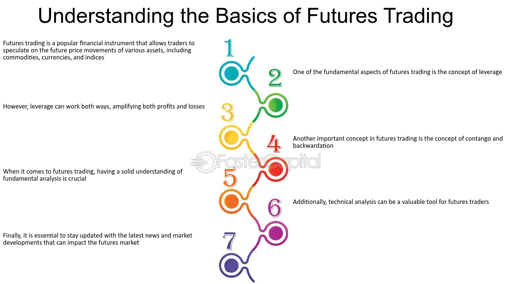

## Table of Contents

## What are futures bundles?

Futures bundles are a way to trade multiple futures contracts at the same time. They are like packages that contain several futures contracts, which are agreements to buy or sell something at a future date. By using futures bundles, traders can manage their risk better and make their trading easier because they don't have to deal with each contract separately.

These bundles are often used by investors who want to spread their risk across different types of futures, like commodities, currencies, or stock indexes. For example, a bundle might include futures for oil, gold, and the S&P 500. This way, if one type of future doesn't do well, the others might balance it out. Futures bundles can be a smart way to diversify and manage investments in the futures market.

## How do futures bundles differ from individual futures contracts?

Futures bundles and individual futures contracts are both used in trading, but they work a bit differently. An individual futures contract is an agreement to buy or sell a specific asset, like oil or wheat, at a set price on a future date. Traders use these contracts to bet on the future price of the asset or to hedge against price changes. Each contract is for a single type of asset and has its own terms and expiration date.

On the other hand, futures bundles are like packages that contain several different futures contracts. Instead of trading one contract at a time, a trader can buy or sell a bundle that includes multiple types of futures, such as commodities, currencies, or stock indexes. This makes it easier to manage a diverse portfolio because you're dealing with one bundle instead of many separate contracts. It also helps spread the risk because if one type of future doesn't perform well, the others in the bundle might balance it out.

In summary, while individual futures contracts focus on a single asset and require more detailed management, futures bundles offer a simpler way to trade multiple assets at once, providing diversification and potentially reducing risk.

## What are the main components of a futures bundle?

A futures bundle is made up of different futures contracts put together. Each contract in the bundle is for a specific thing, like oil, gold, or a stock index. These contracts all have their own rules, like when they will end and what price they are set at. When you buy a futures bundle, you are getting all these different contracts at once.

The main idea of a futures bundle is to help traders manage their investments better. By having a mix of different futures contracts, the bundle can spread out the risk. If one type of future goes down in value, the others might go up and balance things out. This makes it easier for traders to handle a variety of assets without having to keep track of each contract separately.

## How can futures bundles be used for hedging?

Futures bundles can be a good way to hedge, which means protecting your investments from big price changes. If you have a lot of money in one thing, like oil, and you're worried the price might go down, you can use futures bundles to help. A futures bundle might have contracts for oil, but also for other things like gold or stock indexes. If the price of oil goes down, the other parts of the bundle might not go down as much, or might even go up. This can help balance out the loss from the oil and protect your overall investment.

Using futures bundles for hedging is also simpler than dealing with many separate futures contracts. Instead of buying and keeping track of different contracts for oil, gold, and stocks, you can just buy one bundle. This makes it easier to manage your hedging strategy. By spreading your risk across different types of futures, you can feel more secure about your investments, knowing that the bundle is working to protect you from big losses in any one area.

## What are the advantages of trading futures bundles over single futures?

Trading futures bundles has some big advantages over trading single futures. One main advantage is that futures bundles help spread out your risk. When you trade a bundle, you're not just betting on one thing, like oil or gold. Instead, you're betting on a mix of different things. If one part of the bundle goes down in value, the other parts might go up and help balance it out. This can protect you from losing a lot of money if one type of future doesn't do well.

Another advantage is that futures bundles make trading simpler. Instead of buying and keeping track of many different futures contracts, you can just buy one bundle. This saves time and makes it easier to manage your investments. With a bundle, you can have a diverse portfolio without having to do a lot of extra work. This can be a big help, especially if you're new to trading or if you want to focus on other parts of your investment strategy.

## What are the potential risks associated with futures bundles?

Trading futures bundles can be risky because they come with a lot of complexity. Each bundle has many different futures contracts inside it, and each contract can go up or down in value. If you don't understand all the parts of the bundle, you might end up losing money if some of the contracts don't do well. Also, the value of the whole bundle can be hard to predict because it depends on so many different things.

Another risk is that futures bundles can be less flexible than trading single futures. If you want to change your investment strategy or get out of a certain contract, it can be harder to do with a bundle. You can't just sell off one part of the bundle; you have to deal with the whole thing. This means you might have to keep parts of the bundle that you don't want anymore, which can be a problem if those parts start losing value.

## How do you evaluate the performance of a futures bundle?

To evaluate the performance of a futures bundle, you need to look at how each part of the bundle is doing. Since a futures bundle is made up of different futures contracts, you should check the price changes of each contract over time. If some contracts are going up in value and others are going down, you need to see if the overall value of the bundle is increasing or decreasing. This helps you understand if the bundle is doing well or if it's losing money.

Another way to evaluate the performance is by comparing the bundle to a benchmark. This could be a standard like a stock index or another futures bundle that you think is similar. By seeing how your bundle performs compared to this benchmark, you can tell if it's doing better or worse than expected. This can help you decide if you should keep the bundle or if you need to make changes to your investment strategy.

## Can you explain the process of creating a customized futures bundle?

Creating a customized futures bundle means [picking](/wiki/asset-class-picking) out different futures contracts that you want to put together in one package. You start by deciding what you want to include in your bundle. This could be contracts for things like oil, gold, or stock indexes. You need to think about your investment goals and how much risk you're okay with. Once you know what you want, you can go to a futures exchange or use a trading platform that lets you create custom bundles. You'll choose the specific contracts, how many of each you want, and when they will expire.

After you've picked all the parts of your bundle, you need to check if it fits with what you're trying to achieve. Look at how the different contracts might affect each other and if the bundle helps you spread out your risk. If everything looks good, you can then buy the bundle. Keep in mind that creating a custom bundle can be more work than buying a ready-made one, but it gives you more control over your investments. You can adjust the bundle later if you need to, by adding or removing contracts to match changes in your strategy or the market.

## What role do futures bundles play in portfolio diversification?

Futures bundles help with portfolio diversification by letting you invest in many different things at the same time. Instead of putting all your money into one thing, like oil, you can buy a bundle that has contracts for oil, gold, and stock indexes. This way, if the price of oil goes down, the other parts of the bundle might not go down as much, or might even go up. This can help balance out your investments and lower your risk.

Using futures bundles makes it easier to have a diverse portfolio. You don't have to buy and keep track of many different futures contracts. With just one bundle, you can spread your money across different types of futures. This can save you time and make it simpler to manage your investments. By having a mix of different futures in one bundle, you can feel more secure about your investments because the bundle helps protect you from big losses in any one area.

## How do market conditions affect the pricing of futures bundles?

Market conditions can change the price of futures bundles a lot. If the market is doing well, and people think prices will go up, the value of the futures in the bundle might go up too. For example, if everyone thinks oil prices will rise, the oil futures in the bundle will be worth more. But if the market is not doing well, and people think prices will go down, the value of the futures can drop. This means the whole bundle might be worth less because it's made up of all those futures contracts.

Also, different parts of the bundle can be affected by different market conditions. If the stock market is doing great, the stock index futures in the bundle might go up in value. But at the same time, if there's a lot of oil being produced and the price of oil goes down, the oil futures in the bundle might lose value. So, the overall price of the bundle depends on how all these different futures are doing in their own markets. This makes it important to keep an eye on what's happening in each market that affects the parts of your futures bundle.

## What are some advanced strategies for trading futures bundles?

One advanced strategy for trading futures bundles is called spread trading. This means you buy and sell different futures contracts within the bundle at the same time. For example, you might buy oil futures and sell gold futures if you think oil prices will go up more than gold prices. This can help you make money from the difference in price changes between the two. It's a bit tricky because you need to keep track of how each part of the bundle is doing, but it can be a good way to make the most of the bundle's diversity.

Another strategy is called delta hedging. This is when you use the futures bundle to balance out the risk in your other investments. For example, if you own a lot of stocks and you're worried about the stock market going down, you can buy a futures bundle that includes stock index futures. If the stock market does go down, the value of the stock index futures in your bundle might go up, helping to protect your overall investment. This strategy needs a good understanding of how different markets move together, but it can be a smart way to use futures bundles to manage risk.

A third strategy is to use futures bundles for seasonal trading. Some markets, like agriculture or energy, have patterns that repeat every year. If you know these patterns, you can buy a futures bundle that includes contracts for things that usually go up in price during certain times of the year. For example, you might buy a bundle with natural gas futures in the fall, knowing that prices often go up in the winter. This strategy can help you take advantage of predictable market changes, but you need to do a lot of research to understand the seasonal patterns well.

## How do regulatory requirements impact the trading of futures bundles?

Regulatory requirements can affect how you trade futures bundles. Rules set by government agencies, like the Commodity Futures Trading Commission (CFTC) in the United States, are there to make sure trading is fair and safe. These rules can say who is allowed to trade futures bundles, how much money you need to start trading, and what information you need to give to the regulators. If you don't follow these rules, you might get in trouble or not be able to trade at all. So, it's important to know and follow the regulations in your country.

Different countries might have different rules, which can make trading futures bundles across borders tricky. For example, some places might need you to report your trades in a certain way or limit how much you can trade. This can affect how you build and manage your futures bundles, especially if you're trying to trade in different markets. Keeping up with these rules and making sure you follow them can be a lot of work, but it's necessary to avoid problems and trade legally.

## References & Further Reading

[1]: Bergstra, J., Bardenet, R., Bengio, Y., & Kégl, B. (2011). ["Algorithms for Hyper-Parameter Optimization."](https://dl.acm.org/doi/10.5555/2986459.2986743) Advances in Neural Information Processing Systems 24.

[2]: ["Advances in Financial Machine Learning"](https://www.amazon.com/Advances-Financial-Machine-Learning-Marcos/dp/1119482089) by Marcos Lopez de Prado

[3]: ["Evidence-Based Technical Analysis: Applying the Scientific Method and Statistical Inference to Trading Signals"](https://www.amazon.com/Evidence-Based-Technical-Analysis-Scientific-Statistical/dp/0470008741) by David Aronson

[4]: ["Machine Learning for Algorithmic Trading"](https://github.com/stefan-jansen/machine-learning-for-trading) by Stefan Jansen

[5]: ["Quantitative Trading: How to Build Your Own Algorithmic Trading Business"](https://www.amazon.com/Quantitative-Trading-Build-Algorithmic-Business/dp/1119800064) by Ernest P. Chan