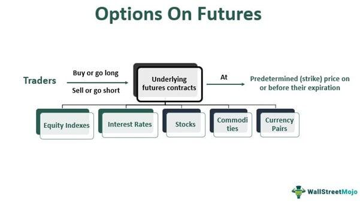

In the fast-paced world of financial markets, futures bundle trading and algorithmic trading strategies have become essential tools for traders seeking to optimize their portfolios. Futures bundles are sophisticated financial instruments that allow traders to buy or sell a set number of futures contracts across consecutive quarterly delivery months. This approach offers significant advantages, such as price locking and reduction in operational complexity, making it particularly appealing to industries like finance and commodities.

Algorithmic trading, often referred to as algo trading, enhances these strategies by automating trading decisions based on computer algorithms. The use of algorithms can lead to faster trade execution and a reduction in human error. Additionally, algorithmic strategies provide the ability to leverage big data for informed decision-making, thus increasing trading efficiency.



This article explores the mechanics behind trading futures bundles and how algorithmic trading can augment these strategies. It discusses key benefits and strategies, as well as potential pitfalls when incorporating algorithmic trading into futures bundle trading. By understanding these fundamental concepts, traders can better navigate the integration of traditional trading methodologies with modern technological advancements.

## Table of Contents

## Understanding Financial Markets and Futures Bundles

A futures bundle, also known as a "pack" or "strip", is a unique type of futures order that allows traders to buy or sell a predetermined number of futures contracts across successive quarterly delivery months within a specified time frame. These bundles are particularly advantageous for managing long-term exposure to market movements, providing traders with the ability to lock in a specific price for multiple future periods. This mechanism is especially useful in industries sensitive to interest rate fluctuations, such as banking, insurance, and commodities.

Futures bundles simplify trading by reducing operational complexities. Instead of executing individual trades for each contract, a trader can efficiently manage their portfolio by executing a single order. This reduces transaction costs and streamlines the hedging process. For example, in the Eurodollar market, traders frequently utilize futures bundles to manage interest rate risks. Eurodollar futures are cash-settled contracts based on the expected U.S. Dollar LIBOR interest rates, and bundles in this market often include multiple contracts covering several years.

The composition of a futures bundle typically involves standard contracts grouped across consecutive delivery months. For instance, a four-quarter bundle would consist of contracts in March, June, September, and December for a given year. This structured approach allows market participants to perfectly align their trading strategies with their financial objectives over the desired period.

In the Eurodollar market, futures bundles offer an efficient way to speculate or hedge against [interest rate](/wiki/interest-rate-trading-strategies) changes. By using models that predict future rate movements, traders can apply these insights directly into their trading strategies. For example, an organization looking to hedge against rising interest rates might purchase a bundle to lock in current rates across future periods, ensuring financial stability and predictability in their cash flow.

By employing such mechanisms, traders not only mitigate the risks associated with rate variability but also potentially capitalize on favorable rate movements. As futures bundles become more integrated with [algorithmic trading](/wiki/algorithmic-trading) systems, the ability to automate and optimize these trades enhances their attractiveness, offering both speed and precision in execution.

## Algorithmic Trading: An Overview

Algorithmic trading, commonly known as algo trading, utilizes computer programs to make trading decisions based on a predetermined set of criteria. This method leverages mathematical models and historical data to automate and enhance trading processes. The primary advantage of algorithmic trading lies in its capacity to execute orders with precision and speed, minimizing the likelihood of human error and emotional biases.

Algo trading consists of several key components, starting with market data analysis. At its core, market data analysis involves sifting through vast volumes of real-time data from financial markets. The algorithms dissect patterns, trends, and anomalies within this data to identify potential trading opportunities. Key data points include price, [volume](/wiki/volume-trading-strategy), and time, along with macroeconomic indicators and other relevant metrics.

Trade execution is the next critical component. Upon identifying a favorable trading opportunity, the algorithm is responsible for executing the trade at optimal conditions. This involves deciding the size of the trade, the precise timing, and the specific order type to use, such as a market order, limit order, or stop order. Modern trading platforms allow for executing large volumes of orders in milliseconds, a feat unachievable through manual trading.

Risk management is integral to algo trading systems. Algorithms are programmed to consider the risk-reward ratio and implement stop-loss and take-profit levels to protect against significant losses. Risk management algorithms constantly monitor portfolio exposure and ensure compliance with predefined risk thresholds.

The benefits of algorithmic trading are manifold. Primarily, it offers increased speed, as algorithms can process and execute trades far faster than human traders. This speed enables taking advantage of fleeting market opportunities that might otherwise be missed. Efficiency is another benefit; automated systems can operate around the clock, continuously scanning for trading signals without fatigue.

Furthermore, algo trading allows traders to capitalize on big data. By analyzing massive datasets beyond human capacity, algorithms can uncover hidden insights and make informed strategic decisions. Machine learning techniques can enhance this capability by adapting and learning from new data, improving decision-making over time.

In summary, algorithmic trading represents a fusion of advanced computation and financial acumen. By automating the trading process, it not only expedites execution but also enhances decision-making through rigorous data analysis and robust risk management practices.

## Developing a Futures Bundle Trading Strategy with Algo Trading

To effectively combine futures bundles and algorithmic trading, careful strategizing is essential. A well-developed trading strategy serves as a roadmap for automating trades, adjusting to market conditions, and achieving consistent performance. The development process involves creating, testing, and optimizing strategies to adapt to dynamic markets.

### Developing a Trading Strategy

**1. Creating a Trading Model:** Start by defining the trading model's parameters. Consider the objectives, such as maximizing returns or minimizing risk. Identify indicators and signals that will trigger buy or sell orders. This could include moving averages, price bands, or momentum indicators. The strategy should outline how the algorithm will interact with futures bundles specifically, detailing entry and exit points.

**2. Backtesting Strategy:** Backtesting involves testing the trading strategy against historical data to evaluate its performance. It helps ascertain how the strategy would have performed in past market conditions without risking real capital. While backtesting, ensure that the data used mirrors actual trading conditions, including market depth and trading costs.

**Python Example for Backtesting:**

```python
import pandas as pd
import numpy as np

# Load historical data
data = pd.read_csv('historical_price_data.csv')
data['Signal'] = 0

# Define simple moving average strategy
short_window = 10
long_window = 50

data['Short_MA'] = data['Close'].rolling(window=short_window, min_periods=1).mean()
data['Long_MA'] = data['Close'].rolling(window=long_window, min_periods=1).mean()

# Generate buy/sell signals
data.loc[data['Short_MA'] > data['Long_MA'], 'Signal'] = 1
data.loc[data['Short_MA'] <= data['Long_MA'], 'Signal'] = -1

# Backtest
data['Returns'] = data['Close'].pct_change()
data['Strategy_Returns'] = data['Signal'].shift(1) * data['Returns']

# Calculate cumulative returns
cumulative_returns = (1 + data['Strategy_Returns']).cumprod() - 1

print(f"Total Strategy Return: {cumulative_returns.iloc[-1]:.2%}")
```

This code snippet demonstrates a simple moving average crossover strategy. The strategy generates signals based on short-term and long-term moving averages. It backtests the strategy's performance on historical data, providing insights into potential future performance.

### Optimization and Market Conditions

**1. Optimization:** Fine-tuning a trading strategy involves adjusting parameters to maximize performance without overfitting to historical data. This may include altering moving average periods or trade filters. Optimization requires balancing complexity and robustness, avoiding excessive parameterization which can reduce the strategy's adaptability.

**2. Market Conditions and Risk Tolerance:** Consider current and projected market conditions when setting parameters. A strategy should be resilient to various market environments, including periods of high volatility. Define your risk tolerance levels and integrate them into the trading strategy, ensuring that position sizes and leverage align with acceptable risk levels. 

Risk management techniques like stop-loss orders, position sizing, and diversification can help control exposure. Adaptive algorithms, which modify their behavior based on ongoing market analysis, can further assist in managing risk and enhancing strategy robustness.

In summary, the development of a futures bundle trading strategy with algorithmic trading involves a systematic approach to model creation, [backtesting](/wiki/backtesting), and optimization. Each step should consider market conditions and risk tolerance, utilizing historical data to validate and refine strategies. This structured approach helps position traders to benefit from both futures bundles and algorithmic efficiencies.

## Common Strategies in Algo Trading for Futures Bundles

Algorithmic trading strategies have become increasingly popular tools to enhance trading in futures bundles. These strategies include trend-following, mean reversion, and [arbitrage](/wiki/arbitrage), each offering unique opportunities to capitalize on market movements. The automation of these strategies allows traders to integrate them seamlessly with the trading of futures bundles.

**Trend-Following Strategies**

Trend-following strategies aim to capture gains through the analysis of an asset's [momentum](/wiki/momentum) in a particular direction. By leveraging historical data, algorithms can detect ongoing trends and make buy or sell decisions accordingly. The key principle is that an asset that is rising (or falling) will continue to do so for a sufficient period, allowing traders to profit from the trend. 

A common tool for implementing trend-following strategies is the Moving Average Crossover. In Python, this can be achieved using libraries like pandas to calculate moving averages and execute trades when short-term averages cross long-term averages.

```python
import pandas as pd

def moving_average(data, window):
    return data.rolling(window=window).mean()

def trend_following_strategy(prices):
    short_term = moving_average(prices, 40)
    long_term = moving_average(prices, 100)

    signal = short_term > long_term
    return signal.shift(1) < signal
```

**Mean Reversion Strategies**

Mean reversion strategies are based on the assumption that asset prices will revert to their historical mean or average level. Traders using this strategy would buy when the price is below its historical average and sell when it's above. This concept is often applied using statistical measures such as the Z-score.

The Z-score indicates how many standard deviations an element is from the mean, which can help identify when a price is too far from the average and likely to revert. Implementing a mean reversion strategy in Python might involve creating algorithms that utilize Z-scores to trigger trades.

**Arbitrage Strategies**

Arbitrage strategies exploit price discrepancies between related markets or instruments. In the futures market, opportunities often arise when futures prices deviate from their theoretical value or between different futures contracts with the same delivery date but varying [liquidity](/wiki/liquidity-risk-premium) or spreads.

Arbitrage requires real-time data analysis and swift execution. Complex algorithms running on powerful computational platforms are often used to scan markets continuously and execute trades as soon as an opportunity is detected. Reinforcement learning and advanced statistical models, such as co-integration, are sometimes used to identify relationships between assets and potential arbitrage opportunities.

**Automation and Integration**

The automation of these strategies allows for rapid execution and consistency in trading operations. Through integrated trading platforms, algorithms can monitor market conditions continuously, execute trades automatically, and adjust positions without human intervention. This not only increases efficiency but also minimizes errors associated with manual trading.

For example, Python's integration with trading platforms via APIs enables seamless trade execution. Libraries like Alpaca can be employed to connect algorithms to brokerage accounts, facilitating real-time trading and portfolio management.

Overall, effective implementation of algorithmic strategies in futures bundle trading requires a robust understanding of market dynamics, advanced analytical tools, and reliable technological infrastructure. Through the combination of strategy automation and adaptive risk management techniques, traders can potentially enhance profitability while navigating the complexities of the futures markets.

## Tools and Platforms for Algo Trading in Futures Bundles

In algorithmic trading of futures bundles, selecting appropriate platforms and tools is crucial. Among the most popular platforms are MetaTrader and TradeStation, both of which offer robust environments for developing and executing algorithmic trading strategies. MetaTrader is renowned for its user-friendly interface and the MQL scripting language, which allows traders to develop custom algorithms. TradeStation, on the other hand, offers EasyLanguage, a programming language specifically designed for traders, which facilitates the development of custom indicators and strategies.

API integration plays a pivotal role in algorithmic trading. An API, or Application Programming Interface, allows seamless access to real-time market data and provides the capability to execute trades automatically based on pre-defined algorithms. This real-time data access is essential for making informed trading decisions in the fast-paced futures market. APIs enable traders to retrieve live quotes, monitor market fluctuations, and execute orders without human intervention, thus optimizing the trading process.

When selecting a platform for algo trading in futures bundles, a few factors should be considered. Firstly, the platform should support comprehensive backtesting features. Backtesting allows traders to simulate their strategies on historical data to evaluate performance and adjust algorithms accordingly. Moreover, the platform should offer a variety of technical indicators and customizable tools for strategy development.

Traders should also look for platforms that offer strong community support and resources. Interactive forums and tutorials can provide valuable insights and facilitate troubleshooting. Furthermore, the platform’s compatibility with third-party applications and tools can extend its functionality and enhance trading strategies.

Developing custom algorithms for trading futures bundles involves a clear understanding of programming languages compatible with the chosen platform. For instance, Python, with its extensive libraries like NumPy and pandas, offers powerful tools for data analysis and algorithm testing. A simple Python strategy that sends market orders based on moving averages might look as follows:

```python
import pandas as pd
import numpy as np

def moving_average_strategy(prices, short_window=40, long_window=100):
    signals = pd.DataFrame(index=prices.index)
    signals['price'] = prices
    signals['short_mavg'] = prices.rolling(window=short_window, min_periods=1, center=False).mean()
    signals['long_mavg'] = prices.rolling(window=long_window, min_periods=1, center=False).mean()
    signals['signal'] = 0.0
    signals['signal'][short_window:] = np.where(signals['short_mavg'][short_window:] > signals['long_mavg'][short_window:], 1.0, 0.0)
    signals['positions'] = signals['signal'].diff()
    return signals

# Example usage
historical_prices = pd.Series([...])  # Replace [...] with actual historical price data
strategy_signals = moving_average_strategy(historical_prices)
```

This example demonstrates a basic moving average crossover strategy, where signals indicate potential buy or sell points. Such strategies can be further refined by integrating more complex statistical models and [machine learning](/wiki/machine-learning) algorithms to enhance predictive accuracy.

In conclusion, the choice of platform and tools in algo trading for futures bundles significantly impacts the efficiency and success of trading strategies. By leveraging API integration, comprehensive backtesting capabilities, and strong community support, traders can build adaptable and robust trading systems tailored to dynamic market conditions.

## Risks and Pitfalls in Algo Trading Futures Bundles

Algorithmic trading in futures bundles offers significant advantages, but it also presents a series of risks that traders need to manage effectively. One of the primary concerns is technical failures. These can occur due to software bugs, hardware malfunctions, and network connectivity issues, leading to erroneous trades or execution delays. To mitigate such risks, regular system maintenance and testing are vital, alongside establishing redundant systems to ensure continuity.

Data inaccuracies pose another critical risk. Algorithmic trading systems rely heavily on accurate and timely data for decision-making. Any discrepancies in data due to incorrect feeds or latency can result in poor trading decisions. Traders should employ data validation techniques and utilize multiple data sources to cross-verify information before executing trades.

Market [volatility](/wiki/volatility-trading-strategies) further complicates algorithmic trading in futures bundles. Markets can behave unpredictably due to sudden news events or economic data releases, leading to large swings in prices. Such conditions can cause significant algorithmic trading losses if strategies are not designed to handle them. Stress testing algorithms under different market conditions and implementing volatility-adjusted trading rules can help in managing this risk.

Overfitting is a common pitfall in algorithmic trading, where models are excessively tailored to historical data, capturing noise instead of underlying market patterns. This can lead to strategies that perform well during backtesting but falter in live markets. To avoid overfitting, traders should use techniques like cross-validation, where data is split into training and testing sets to ensure independent evaluation of the model’s performance. Additionally, complexity penalization methods, such as Akaike Information Criterion (AIC) or Bayesian Information Criterion (BIC), can be employed to discourage overly complex models.

Furthermore, implementing strict risk management protocols is essential. This includes setting stop-loss orders to limit potential losses, using position sizing techniques like the Kelly Criterion to determine the optimal amount to invest, and continuously monitoring overall exposure to the market. Here is a basic Python example of a stop-loss mechanism:

```python
def execute_trade(current_price, target_price, stop_loss_price):
    if current_price >= target_price:
        print("Sell: Target reached")
    elif current_price <= stop_loss_price:
        print("Sell: Stop-loss triggered")
    else:
        print("Hold position")

# Example usage
current_price = 102
target_price = 110
stop_loss_price = 100

execute_trade(current_price, target_price, stop_loss_price)
```

Ensuring data integrity and robust backtesting are additional strategies for mitigating risks. Comprehensive backtesting should simulate as many realistic market conditions as possible, including transaction costs and slippage. Ensuring that data used for testing is clean and free from errors is crucial for accurate strategy evaluation.

In summary, while algorithmic trading in futures bundles offers significant opportunities, traders must be vigilant in managing associated risks. Technical failures, data inaccuracies, market volatility, and overfitting are key challenges that can be addressed through careful planning and robust risk management strategies.

## Conclusion

Futures bundle trading, when combined with algorithmic trading strategies, represents a significant advancement in the sphere of modern financial trading. By leveraging the precision and efficiency of algorithmic models, traders can capitalize on the complexities and opportunities presented by futures bundles. This article has presented a comprehensive guide to understanding and applying these trading strategies effectively. We emphasized the ability of algorithmic trading to reduce human error, enhance trade execution speed, and facilitate the analysis of vast data sets, all of which are crucial in making informed trading decisions.

Moreover, the article highlighted the inherent benefits of futures bundle trading, such as price locking and operational simplicity, allowing traders to focus on strategic positioning rather than dealing with the granular aspects of individual contracts. Algorithmic strategies, from trend-following to arbitrage, can be tailored to exploit the unique attributes of futures bundles, delivering robust and consistent performance under varying market conditions. 

However, it is crucial to remain vigilant regarding the associated risks. Algorithmic trading in futures bundles is susceptible to technical glitches, data inaccuracies, and volatile market dynamics, necessitating stringent risk management practices. Ensuring data integrity and rigorous backtesting are essential steps in mitigating these risks and enhancing the reliability of the trading algorithms.

For traders, whether seasoned professionals or novices, a profound understanding of these concepts equips them with the knowledge to transition from traditional trading methods to more sophisticated, technology-driven approaches. This positions them to not only stay competitive but to also exploit the burgeoning opportunities that algorithmic trading of futures bundles offers in today’s rapidly evolving financial landscape.

## References & Further Reading

[1]: Bergstra, J., Bardenet, R., Bengio, Y., & Kégl, B. (2011). ["Algorithms for Hyper-Parameter Optimization."](https://dl.acm.org/doi/10.5555/2986459.2986743) Advances in Neural Information Processing Systems 24.

[2]: ["Advances in Financial Machine Learning"](https://www.amazon.com/Advances-Financial-Machine-Learning-Marcos/dp/1119482089) by Marcos Lopez de Prado

[3]: ["Evidence-Based Technical Analysis: Applying the Scientific Method and Statistical Inference to Trading Signals"](https://www.amazon.com/Evidence-Based-Technical-Analysis-Scientific-Statistical/dp/0470008741) by David Aronson

[4]: ["Machine Learning for Algorithmic Trading"](https://github.com/stefan-jansen/machine-learning-for-trading) by Stefan Jansen

[5]: ["Quantitative Trading: How to Build Your Own Algorithmic Trading Business"](https://www.amazon.com/Quantitative-Trading-Build-Algorithmic-Business/dp/1119800064) by Ernest P. Chan