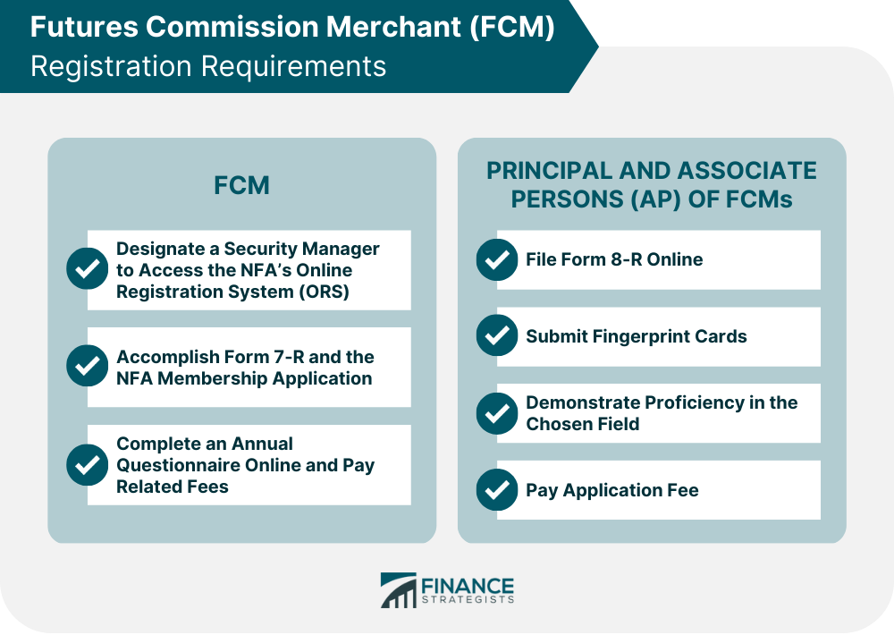

## Table of Contents

## What is a Futures Commission Merchant (FCM)?

A Futures Commission Merchant (FCM) is a company or individual that is allowed to handle the buying and selling of futures contracts. These contracts are agreements to buy or sell something at a future date, like crops or oil. The FCM acts as a middleman between the buyer and the seller, making sure everything goes smoothly. They also have to follow rules set by government agencies to make sure they are doing things the right way.

FCMs are important because they help people and businesses manage risk. For example, a farmer might use a futures contract to lock in a price for their crops before they are harvested. This way, they know how much money they will get, even if prices go down later. The FCM helps the farmer find someone who wants to buy the crops at that price in the future. By doing this, FCMs help keep the market stable and help people plan for the future.

## What role does an FCM play in the futures market?

An FCM, or Futures Commission Merchant, is like a helper in the futures market. They work between people who want to buy futures contracts and those who want to sell them. Futures contracts are deals to buy or sell things like crops or oil at a set price in the future. The FCM makes sure these deals happen smoothly. They take care of the money and make sure everyone follows the rules.

FCMs are important because they help people manage risk. For example, a farmer might want to know how much money they'll get for their crops before they are ready. They can use a futures contract to lock in a price. The FCM helps find someone willing to buy at that price later. This way, the farmer can plan better and not worry about prices dropping. By doing this, FCMs help keep the market stable and help people feel more secure about the future.

## How does an FCM differ from a broker?

An FCM, or Futures Commission Merchant, and a broker both help people buy and sell things, but they work in different ways. An FCM focuses on futures contracts, which are agreements to buy or sell something at a set price in the future. They act as a middleman between buyers and sellers in the futures market, making sure the deals go smoothly and everyone follows the rules. FCMs also handle the money involved in these deals and help clients manage risk by locking in prices for future transactions.

On the other hand, a broker can work with a wider range of financial products, not just futures. Brokers help people buy and sell stocks, bonds, and other investments. They often give advice on what to buy or sell and help clients make decisions. While some brokers might also deal with futures, their main job is usually to help with a variety of investments, not just futures contracts like an FCM does.

## What are the regulatory requirements for becoming an FCM?

To become a Futures Commission Merchant (FCM), a company or individual must follow strict rules set by government agencies. In the United States, the main agency that oversees FCMs is the Commodity Futures Trading Commission (CFTC). The CFTC works with another group called the National Futures Association (NFA) to make sure FCMs follow the rules. To get started, an FCM must register with both the CFTC and the NFA. They also need to show that they have enough money to cover any risks they might face. This is called meeting the minimum financial requirements.

Once registered, FCMs have to keep following a lot of rules to stay in business. They need to keep detailed records of all their deals and report them regularly to the CFTC and NFA. They also have to make sure their clients' money is safe and separate from their own money. This is called segregation of funds. FCMs must also have a plan for what to do if something goes wrong, like if they lose a lot of money. This plan is called risk management. By following these rules, FCMs help keep the futures market fair and safe for everyone.

## How does an FCM handle client funds and ensure their safety?

An FCM, or Futures Commission Merchant, takes care of client funds by keeping them separate from their own money. This is called segregation of funds. It's a rule set by the government to make sure that if the FCM has money problems, the clients' money stays safe. The FCM puts the clients' money into special accounts that are only for their clients. This way, even if the FCM goes out of business, the clients' money is protected and can be returned to them.

To make sure the funds are safe, FCMs have to follow strict rules from the Commodity Futures Trading Commission (CFTC) and the National Futures Association (NFA). They have to keep detailed records of all the money they handle and report these records regularly. FCMs also have to do regular checks to make sure they are following all the rules. If they don't, they can get in big trouble. By doing all these things, FCMs help make sure that clients' money is safe and that they can trust the FCM to handle their funds the right way.

## What types of services does an FCM typically offer to clients?

An FCM, or Futures Commission Merchant, helps clients buy and sell futures contracts. These contracts are deals to buy or sell things like crops or oil at a set price in the future. The FCM acts as a middleman, making sure the deals go smoothly. They handle the money involved in these deals, making sure it's safe and separate from their own money. They also keep detailed records of all the transactions and report them regularly to make sure everything is done right.

FCMs also help clients manage risk. For example, a farmer might want to know how much money they'll get for their crops before they are ready. The FCM helps them find someone willing to buy at that price later, so the farmer can plan better. FCMs also give advice on the futures market and help clients understand how it works. By doing all these things, FCMs help clients feel more secure about their future deals and keep the market stable.

## How do FCMs manage risk for themselves and their clients?

FCMs, or Futures Commission Merchants, manage risk for themselves by following strict rules set by the government. They have to keep a certain amount of money saved up, called capital, to cover any losses they might have. This is like having a safety net. They also have to do regular checks to make sure they are following all the rules and that they are not taking too many risks. If something goes wrong, they have a plan, called risk management, to handle it and keep their business safe.

For their clients, FCMs help manage risk by helping them buy and sell futures contracts. These contracts let clients lock in a price for something they will buy or sell in the future. This way, clients know what they will pay or get, even if prices change later. FCMs also keep their clients' money safe by putting it in special accounts, separate from their own money. This is called segregation of funds. By doing all these things, FCMs help their clients feel more secure and plan better for the future.

## What are the key considerations for choosing an FCM?

When choosing an FCM, it's important to look at how safe they are. A good FCM should be registered with the government and follow all the rules. They should have a good history and no big problems in the past. It's also good to check if they have enough money to cover any risks, which is called their financial stability. You can find this information on the websites of the Commodity Futures Trading Commission (CFTC) and the National Futures Association (NFA).

Another thing to consider is the services the FCM offers. They should be able to help you buy and sell futures contracts easily and give you good advice on the market. It's helpful if they have tools and information that make it easier for you to understand and use the futures market. Also, think about how good their customer service is. You want an FCM that answers your questions quickly and helps you when you need it. By looking at these things, you can choose an FCM that will help you manage your risks well and keep your money safe.

## How has technology impacted the operations of FCMs?

Technology has made a big difference in how FCMs, or Futures Commission Merchants, do their work. Now, FCMs use computers and the internet to help their clients buy and sell futures contracts. This makes things faster and easier. Clients can see prices and make deals from anywhere, not just at a trading floor. FCMs also use special software to keep track of all their deals and make sure they follow the rules. This helps them stay organized and avoid mistakes.

Another way technology helps FCMs is by making it easier to manage risk. They use computer programs to watch the market and see how prices are changing. This helps them give better advice to their clients and help them make smart choices. FCMs also use technology to keep their clients' money safe. They have systems that make sure the money is in the right accounts and is not mixed with their own money. This makes everything safer and more reliable for everyone involved.

## What are the common challenges faced by FCMs in the market?

FCMs, or Futures Commission Merchants, face a lot of challenges in the market. One big challenge is keeping up with all the rules and regulations. They have to follow strict rules set by the government to make sure they are doing things the right way. This can be hard because the rules can change, and they have to keep learning and adjusting. Another challenge is managing risk. FCMs have to make sure they have enough money to cover any losses they might have. This can be tough because the market can be unpredictable, and prices can change quickly.

Another challenge for FCMs is staying competitive. There are a lot of FCMs out there, and they all want to help clients buy and sell futures contracts. To stand out, FCMs need to offer good services and keep their clients happy. This means they have to keep improving their technology and customer service. It can be hard to keep up with all the new tools and systems that come out. Also, FCMs have to deal with the ups and downs of the market. When the market is doing well, they can make more money, but when it's not, they have to be careful and manage their risks even more closely.

## How do global regulations affect the operations of FCMs?

Global regulations have a big impact on how FCMs, or Futures Commission Merchants, work. Different countries have their own rules about how FCMs should handle money and make deals. This means that an FCM that wants to work in many countries has to follow a lot of different rules. It can be hard to keep up with all these rules because they can change and they might not always agree with each other. FCMs have to make sure they know and follow all these rules to stay in business and keep their clients' money safe.

These regulations also affect how FCMs can grow their business. For example, if an FCM wants to start working in a new country, they have to get permission from that country's government. This can take a lot of time and money. Also, if one country has stricter rules than another, it might be harder for an FCM to offer the same services everywhere. By following these global rules, FCMs help make sure the futures market is fair and safe for everyone, but it can be a challenge to keep up with everything.

## What future trends are likely to influence the role of FCMs in the futures market?

Technology will keep changing how FCMs work. More and more, FCMs will use computers and the internet to help their clients buy and sell futures contracts. This will make things faster and easier for everyone. FCMs might use new tools like [artificial intelligence](/wiki/ai-artificial-intelligence) to watch the market and give better advice to their clients. They will also keep using technology to make sure their clients' money is safe and to follow all the rules. This means FCMs will need to keep learning about new technology and how to use it well.

Another trend that will affect FCMs is how the world is becoming more connected. FCMs will work with clients from more countries, so they will need to know and follow more rules from different places. This can be hard, but it also means FCMs can help more people manage risk and plan for the future. Also, as the world changes, new kinds of futures contracts might be created for things like green energy or new technology. FCMs will need to learn about these new contracts and help their clients understand them. By doing all these things, FCMs will keep playing an important role in the futures market.

## References & Further Reading

[1]: Kirilenko, A. A., Kyle, A. S., Samadi, M., & Tuzun, T. (2017). ["The Flash Crash: High-Frequency Trading in an Electronic Market."](https://www.jstor.org/stable/26652722) The Journal of Finance, 72(3), 967-998.

[2]: Lopez de Prado, M. (2018). ["Advances in Financial Machine Learning."](https://www.amazon.com/Advances-Financial-Machine-Learning-Marcos/dp/1119482089) Wiley.

[3]: Chan, E. (2008). ["Quantitative Trading: How to Build Your Own Algorithmic Trading Business."](https://github.com/ftvision/quant_trading_echan_book) Wiley.

[4]: Aronson, D. R. (2006). ["Evidence-Based Technical Analysis: Applying the Scientific Method and Statistical Inference to Trading Signals."](https://www.amazon.com/Evidence-Based-Technical-Analysis-Scientific-Statistical/dp/0470008741) Wiley.

[5]: Jansen, S. (2020). ["Machine Learning for Algorithmic Trading."](https://github.com/stefan-jansen/machine-learning-for-trading) Packt Publishing.