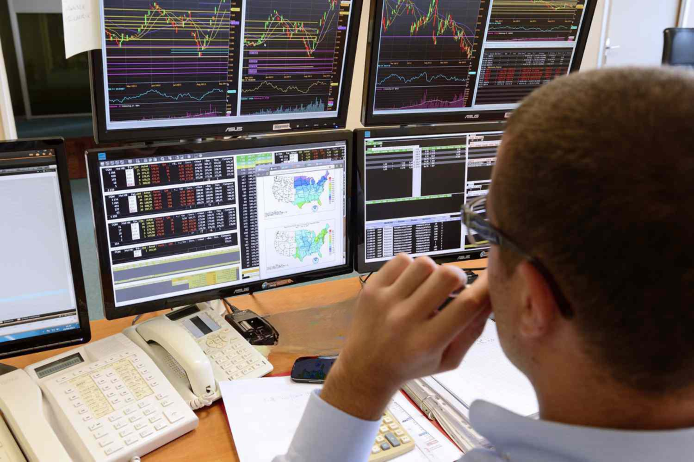

Futures trading, an integral part of modern financial markets, has been transformed by technological advancements, making trading more efficient and less risky. This evolution has been significantly driven by the rise of algorithmic trading, which offers a strategic advantage, particularly in futures and commodities trading. Algorithmic trading utilizes computer algorithms to execute trades based on predefined criteria, allowing for rapid responses to market changes that are beyond human capability.

This article aims to explore how futures trading, financial services, commodities, and algorithmic trading interact to create a dynamic trading environment. By examining the interplay between these elements, traders can gain insights that enable them to make better decisions in a complex and fast-paced market. Moreover, understanding this synergy is critical as the financial landscape becomes increasingly intricate, with technology playing a pivotal role.



Futures Commission Merchants (FCMs) are essential actors in this ecosystem. They facilitate futures trading by accepting buy and sell orders and ensuring these transactions are financially supported. The role of FCMs is underscored by regulatory frameworks that emphasize capital requirements and customer fund protection, ensuring the stability and security of the futures market.

As we navigate through the interconnected world of financial services, commodities, and algorithmic trading, it becomes evident how essential these elements are for the contemporary trader. With the evolution of algorithmic trading, particularly in managing large volumes of data and executing trades at unparalleled speed, its role in commodities trading has become crucial. This symbiosis between technology and trading not only enhances efficiency but also opens doors to innovative trading strategies and risk management solutions, setting the stage for a future where advanced technologies like AI and machine learning might further revolutionize the sector.

## Table of Contents

## Understanding Futures Trading

Futures trading involves the buying and selling of contracts that stipulate the exchange of a specific asset at a predetermined future date and price. This form of trading presents opportunities for both hedging and speculation. By locking in prices in advance, businesses and investors can mitigate the risk of price volatility, while speculators aim to profit from the anticipated direction of price movements.

These contracts are particularly prevalent in the commodities market, where they are used to trade products such as oil, gold, and various agricultural goods. For example, a wheat producer might use futures contracts to secure a favorable price for their crop months in advance, safeguarding against potential price drops. Conversely, a trader might speculate on the price of [crude oil](/wiki/crude-oil) rising, purchasing futures contracts with the intent to sell them at a profit if the market price increases.

Futures Commission Merchants (FCMs) play a crucial role in this trading landscape. FCMs are entities that accept orders to buy or sell futures contracts and handle the necessary financial transactions associated with these trades. Their responsibilities also include maintaining customer accounts, managing settlements, and ensuring the safekeeping of client funds.

The significance of FCMs in the futures market is underscored by their adherence to regulatory requirements. These regulations are designed to ensure that FCMs maintain adequate capital reserves and implement rigorous customer fund protection measures. For instance, guidelines require that FCMs segregate customer funds from their own operational money, thereby reducing the risk of client funds being used for purposes other than trading.

Through these mechanisms, FCMs contribute to the stability and integrity of the futures trading market, ensuring that participants can engage with confidence, knowing their transactions are supported by robust financial backing and regulatory oversight.

## Role of Algorithmic Trading in Futures and Commodities

Algorithmic trading involves the use of computer programs to execute trading strategies at speeds and frequencies that are beyond the capabilities of human traders. Crucial in the domain of futures trading, these algorithms act on pre-established rules derived from systematic analysis of market data, eliminating the potential for human error or emotional bias. The elimination of human interference not only enhances the efficiency of trade execution but also allows for the simultaneous analysis and management of multiple information streams, leading to more informed decision-making processes.

In futures trading, where market conditions can shift rapidly, the ability to execute trades swiftly is of paramount importance. Algorithms can assess and respond to market conditions in milliseconds, capitalizing on fleeting opportunities and mitigating risks more effectively than manual methods. For instance, when market prices fluctuate, an algorithm can instantaneously compare the current price to the predefined criteria and make a decision to buy, sell, or hold. This speed offers a significant advantage in fast-paced trading environments typical of futures markets.

Commodities trading, with its inherent complexity due to factors such as supply and demand dynamics, geopolitical influences, and weather conditions, also benefits substantially from [algorithmic trading](/wiki/algorithmic-trading). Algorithms equipped with advanced data analysis capabilities can synthesize large volumes of data faster and more accurately than human traders. For example, weather data impacting agricultural commodities, supply chain disruptions, and geopolitical tensions can all be integrated into an algorithm's decision-making process more efficiently than manual trading would allow.

The capabilities of algorithmic trading extend to handling more complex data sets involving various sources of information. Their advanced software frameworks process multiple inputs dynamically, leading to more robust trading strategies that can adapt to changing market conditions. This capability becomes especially critical when dealing with the high [volatility](/wiki/volatility-trading-strategies) and intricate correlations present within commodity markets.

Overall, the role of algorithmic trading in futures and commodities markets is characterized by its capacity to process data rapidly and execute trades efficiently, thus enabling traders to optimize their strategies and reduce exposure to market risks.

## Advantages of Algorithmic Trading in Financial Services

Algorithmic trading provides numerous advantages in the financial services sector, fundamentally altering the dynamics of futures trading and commodities markets. The primary advantage of algorithmic trading is its unparallelled execution speed. By utilizing advanced algorithms, traders can execute trades in milliseconds, a capability that is critical in the fast-paced trading environment. This speed enables traders to capitalize on transient market opportunities that might be missed with manual trading owing to human-related delays.

Moreover, algorithmic trading allows for emotion-free decision-making. Traditional trading often suffers from emotional biases such as fear and greed, which can negatively impact decision-making processes and lead to suboptimal outcomes. In contrast, algorithms operate based on predefined rules and data-driven analysis, ensuring decisions are objective and based on statistical evidence rather than subjective judgment.

Consistency is another key benefit offered by algorithmic trading. Algorithms are capable of continually monitoring vast arrays of market data and performing complex analyses without the fatigue that human traders may experience. This persistent analysis ensures that traders have ongoing insights into market conditions, enabling them to make informed decisions based on continuous performance assessment. As algorithms can function throughout trading hours without breaks, they offer a level of market vigilance that is beyond human capability.

Here is an example of how a simple algorithmic trading strategy might be implemented in Python:

```python
import pandas as pd

# Example market data in pandas DataFrame
market_data = pd.DataFrame({
    'price': [100, 102, 101, 105, 110, 108, 112],
    'volume': [1000, 1500, 1100, 1200, 1600, 1400, 1700]
})

# Define a basic moving average strategy
def moving_average_strategy(data, short_window=3, long_window=5):
    data['short_mavg'] = data['price'].rolling(window=short_window).mean()
    data['long_mavg'] = data['price'].rolling(window=long_window).mean()

    # Generate signals
    data['signal'] = 0
    data['signal'][short_window:] = [
        1 if data['short_mavg'].iloc[i] > data['long_mavg'].iloc[i] else 0
        for i in range(short_window, len(data))
    ]
    return data

# Apply the strategy to the market data
strategy_data = moving_average_strategy(market_data)
print(strategy_data)
```

This example outlines a moving average strategy where trades are executed based on the crossover of short-term and long-term averages. Such strategies leverage algorithmic precision to ensure that trades adhere strictly to predetermined criteria, eliminating the variability that results from human emotion. 

In summary, algorithmic trading transforms financial market operations by ensuring faster, unbiased, and consistent trading performance, augmenting the capabilities and effectiveness of traders in efficiently navigating complex markets.

## Challenges and Risks of Using Algorithmic Trading

Algorithmic trading, while revolutionizing the speed and efficiency of financial markets, comes with its own set of challenges and risks. One significant concern is the over-reliance on technology, which can become problematic if there is a system failure or technical issue. For instance, software bugs or server downtimes can lead to trading disruptions and financial losses. This reliance on technology necessitates robust infrastructure and effective contingency planning to mitigate potential system failures.

Over-optimization is another risk, where algorithms are excessively fine-tuned to historical data. This process, known as "curve fitting," can result in algorithms that perform excellently under past market conditions but falter when faced with new or unforeseen scenarios. The problem arises because such algorithms lack flexibility and adaptability, making them ineffective when the market dynamics evolve unexpectedly. Traders and developers need to ensure that their models are general enough to handle a variety of market conditions while still capturing underlying trends that are likely to persist.

Furthermore, regulatory scrutiny on algorithmic trading is intensifying due to its potential impact on market stability. High-frequency trading strategies, for example, can lead to extreme market volatility and events such as the "Flash Crash" of 2010 [1]. As a result, regulatory bodies are increasingly monitoring algorithmic trading activities to prevent systemic risks. Regulations may include the requirement for firms to maintain certain capital levels, implement risk controls, and adhere to reporting standards. Compliance with these regulations can pose a considerable challenge for trading firms, as they must balance innovation in algorithmic strategies with adherence to legal frameworks.

In summary, while algorithmic trading offers substantial advantages, traders and firms must be vigilant about the challenges it presents. Ensuring robust technical infrastructure, avoiding over-optimization, and adhering to regulatory requirements are essential steps in mitigating the risks associated with this modern trading approach.

[1] Kirilenko, A. A., Kyle, A. S., Samadi, M., & Tuzun, T. (2017). The Flash Crash: High-Frequency Trading in an Electronic Market. The Journal of Finance, 72(3), 967-998.

## Common Strategies in Algo Trading for Futures

Arbitrage in algorithmic trading for futures involves the exploitation of price discrepancies across different markets or exchanges to generate profit. This strategy relies on the simultaneous buying and selling of futures contracts in distinct markets to capitalize on price differences. The efficiency of algorithmic trading makes it particularly suited for [arbitrage](/wiki/arbitrage), as it can rapidly identify and execute trades before the market corrects the pricing inconsistencies. 

Trend following is another prominent strategy employed in algorithmic trading for futures. This approach utilizes algorithms to systematically identify and capitalize on market trends, whether upward or downward. The core principle is to align trades with the prevailing market [momentum](/wiki/momentum). Algorithms analyze historical price data and use indicators, such as moving averages or momentum oscillators, to anticipate the continuation of these trends. By following these signals, algorithms can enter and [exit](/wiki/exit-strategy) trades efficiently, increasing the potential for profitability while minimizing risk.

Market making is a strategy that ensures [liquidity](/wiki/liquidity-risk-premium) in the futures market by consistently providing buy and sell quotes. Algorithmic trading facilitates [market making](/wiki/market-making) by allowing traders to apply algorithms that automatically place orders on both sides of the [order book](/wiki/order-book-trading-strategies). The profit in market making is derived from the spread between the buying and selling prices. Algorithms continuously adjust these quotes based on real-time market conditions, inventory levels, and risk thresholds. The ability to rapidly calculate and manage spreads and inventories enables market makers to maintain liquidity, contributing to smoother market operations.

Algorithmic trading empowers traders to implement these strategies with precision and speed, which are crucial in the dynamic futures markets. By automating the execution of trades and leveraging sophisticated algorithms, traders can enhance their ability to capture opportunities that may only exist for a brief moment.

## The Future of Trading: Integrating AI and Machine Learning

Artificial Intelligence (AI) and Machine Learning (ML) are progressively reshaping futures and commodities trading by enhancing both prediction and decision-making processes. These advanced technologies enable the development of adaptive algorithms capable of analyzing vast datasets and discerning intricate market patterns, thereby offering traders a strategic advantage.

AI and ML leverage historical data and sophisticated models to forecast market trends, prices, and trading volumes with greater accuracy. Machine learning algorithms, particularly those involving neural networks and [reinforcement learning](/wiki/reinforcement-learning), can learn and adapt over time, optimizing trading strategies in line with changing market conditions. For instance, a [neural network](/wiki/neural-network) could be trained to recognize patterns in time-series data, enabling predictions about future price movements based on past trends and anomalies.

The deployment of AI in trading platforms can also lead to more autonomous systems. These systems can continuously learn from new data, adapt to unexpected market changes, and execute trades without human intervention. This automation reduces reaction times to milliseconds—a critical advantage in volatile markets—thereby minimizing slippage and maximizing efficiency.

Consider a simple Python example to illustrate how [machine learning](/wiki/machine-learning) can be applied to predict future trends based on past data. Suppose we have a time series of commodity prices:

```python
import pandas as pd
from sklearn.model_selection import train_test_split
from sklearn.ensemble import RandomForestRegressor

# Simulated data
data = pd.DataFrame({
    'date': pd.date_range(start='1/1/2020', periods=100),
    'price': [100 + 0.5 * i + (1 if i % 2 == 0 else -1) * i**0.5 for i in range(100)]
})

# Feature engineering
data['lag1'] = data['price'].shift(1)
data['lag2'] = data['price'].shift(2)
data.dropna(inplace=True)

# Train-test split
X = data[['lag1', 'lag2']]
y = data['price']
X_train, X_test, y_train, y_test = train_test_split(X, y, test_size=0.2, random_state=42)

# Model training
model = RandomForestRegressor(n_estimators=100, random_state=42)
model.fit(X_train, y_train)

# Prediction
predictions = model.predict(X_test)
```

In this example, a Random Forest regressor predicts future price movements based on lagged prices. Such models can become increasingly sophisticated, using more features and larger datasets to improve predictions.

Furthermore, AI advancements facilitate the creation of complex trading strategies that encompass risk management and portfolio optimization. By using [deep learning](/wiki/deep-learning) and reinforcement learning, trading systems can dynamically adjust strategies based on real-time performance feedback.

The integration of AI into futures and commodities trading signals a shift towards a more efficient, data-driven marketplace. As these technologies continue to evolve, we can expect trading systems to become even more autonomous and sophisticated, thereby redefining the landscape of financial markets.

## Conclusion

Trading in futures and commodities has been profoundly transformed by algorithmic tools, significantly enhancing both accessibility and efficiency. The automation provided by these technologies allows traders to execute complex strategies with precision and speed, which was previously unimaginable with manual trading methods. As a result, market participants can leverage data-driven insights to make more informed decisions, ultimately optimizing their trading performance.

However, with the adoption of these advanced technologies comes the responsibility of understanding their complexities and inherent risks. Algorithmic trading systems require careful oversight to manage potential issues such as system failures, erroneous trades, and susceptibility to changing market conditions. Traders must ensure they thoroughly understand the algorithms they employ and maintain robust risk management frameworks.

Looking ahead, the continuous development of [artificial intelligence](/wiki/ai-artificial-intelligence) (AI) and machine learning technologies holds promise for further enhancements in trading strategies and risk management. These technologies offer the potential to create more sophisticated models that can adapt to evolving market conditions and predict price movements with greater accuracy. As AI systems learn to process and analyze vast quantities of data, they can identify patterns unrecognizable to human traders, leading to more dynamic and effective trading solutions.

Consequently, the integration of AI into trading systems may lead to highly autonomous platforms that further reduce the need for human intervention. This evolution implies a future where the synergy between human oversight and machine intelligence achieves new levels of efficiency in futures and commodities markets, pushing the boundaries of traditional trading paradigms and opening new opportunities in the financial landscape.

## References & Further Reading

[1]: Kirilenko, A. A., Kyle, A. S., Samadi, M., & Tuzun, T. (2017). ["The Flash Crash: High-Frequency Trading in an Electronic Market."](https://www.jstor.org/stable/26652722) The Journal of Finance, 72(3), 967-998.

[2]: Lopez de Prado, M. (2018). ["Advances in Financial Machine Learning."](https://www.amazon.com/Advances-Financial-Machine-Learning-Marcos/dp/1119482089) Wiley.

[3]: Chan, E. (2008). ["Quantitative Trading: How to Build Your Own Algorithmic Trading Business."](https://github.com/ftvision/quant_trading_echan_book) Wiley.

[4]: Aronson, D. R. (2006). ["Evidence-Based Technical Analysis: Applying the Scientific Method and Statistical Inference to Trading Signals."](https://www.amazon.com/Evidence-Based-Technical-Analysis-Scientific-Statistical/dp/0470008741) Wiley.

[5]: Jansen, S. (2020). ["Machine Learning for Algorithmic Trading."](https://github.com/stefan-jansen/machine-learning-for-trading) Packt Publishing.