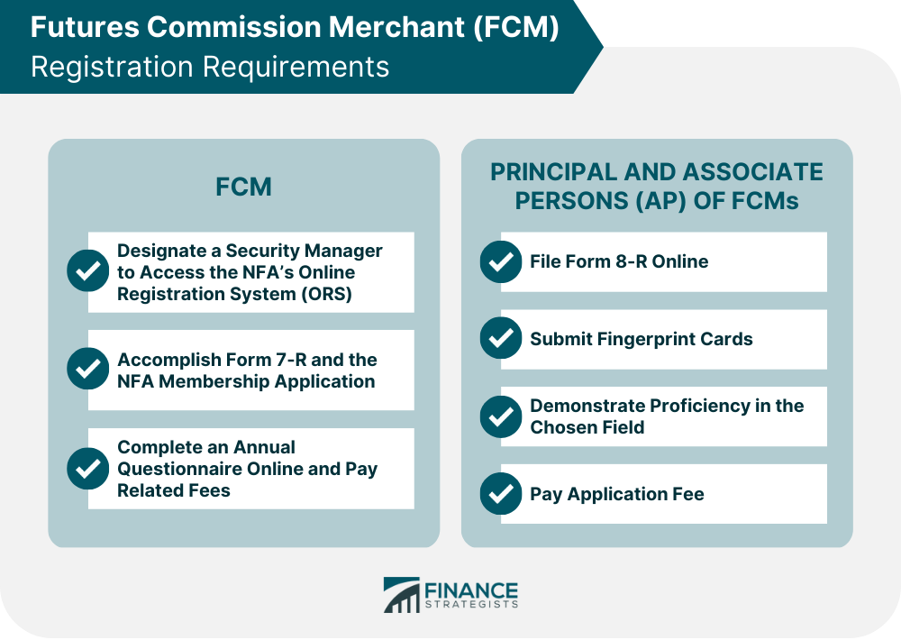

## Table of Contents

## What is a Futures Commission Merchant (FCM)?

A Futures Commission Merchant (FCM) is a company or individual that is authorized to handle the buying and selling of futures contracts on behalf of customers. These contracts are agreements to buy or sell something at a future date, like commodities or financial instruments. The FCM acts as an intermediary between the customer and the futures exchange, making sure that all trades are done correctly and according to the rules.

FCMs also have important responsibilities to manage the money and assets that customers give them to trade with. They must keep these funds safe and separate from their own money. This helps protect customers if the FCM faces financial problems. Additionally, FCMs need to follow strict rules set by regulatory bodies to ensure they operate fairly and transparently.

## What is the primary role of an FCM in the futures market?

The main job of a Futures Commission Merchant (FCM) in the futures market is to help people buy and sell futures contracts. Futures contracts are agreements to buy or sell something, like corn or oil, at a set price on a future date. The FCM acts like a middleman, connecting customers with the futures exchange where these contracts are traded. They make sure that the trades happen smoothly and follow all the rules of the exchange.

Besides trading, FCMs are responsible for taking care of the money and assets that customers give them to trade with. They must keep this money safe and separate from their own money, which helps protect customers if the FCM runs into financial trouble. FCMs also have to follow strict rules from regulators to make sure they are acting honestly and fairly in all their dealings.

## How does an FCM facilitate trading for its clients?

An FCM helps its clients trade futures contracts by acting as a middleman between them and the futures exchange. When a client wants to buy or sell a futures contract, they tell the FCM what they want to do. The FCM then carries out the trade on the exchange, making sure everything goes smoothly and follows the rules. This means the client doesn't have to deal directly with the complexities of the exchange, making it easier for them to trade.

Besides executing trades, an FCM also manages the money and assets that clients use for trading. When a client gives money to the FCM, the FCM keeps it safe and separate from its own money. This is important because it protects the client's money if the FCM ever has financial problems. The FCM also follows strict rules set by regulators to make sure they are treating clients fairly and keeping their trading activities transparent.

## What are the basic requirements for registering as an FCM with the Commodity Futures Trading Commission (CFTC)?

To register as a Futures Commission Merchant (FCM) with the Commodity Futures Trading Commission (CFTC), a company must meet several basic requirements. First, the company needs to have enough money to operate safely. This means they must have a certain amount of money, called capital, to show they can handle the risks of trading futures. They also need to have a plan to keep their customers' money safe and separate from their own money. This is important to protect customers if the FCM faces financial problems.

Second, the company must follow strict rules set by the CFTC. They need to have good systems in place to make sure they are treating customers fairly and keeping their trading activities transparent. This includes having a way to report their activities to the CFTC and other regulators. The company also needs to have people in charge who are honest and have a good understanding of the futures market. Once these requirements are met, the company can apply to the CFTC for registration as an FCM.

## What are the financial requirements that an FCM must meet to operate legally?

To operate legally, a Futures Commission Merchant (FCM) must meet certain financial requirements set by the Commodity Futures Trading Commission (CFTC). One key requirement is that the FCM must have enough money, called capital, to handle the risks of trading futures. This helps make sure the FCM can cover any losses and keep operating safely. The amount of capital needed can change based on how much business the FCM does and the types of trades they handle.

Another important financial requirement is that the FCM must keep their customers' money safe and separate from their own money. This is called segregation of funds. It's a big rule to protect customers if the FCM ever has financial problems. The FCM also needs to have a plan to show how they will manage this money and make sure it stays safe. By meeting these financial requirements, an FCM can operate legally and help their clients trade futures with confidence.

## How does an FCM manage client funds and ensure their safety?

An FCM manages client funds by keeping them separate from their own money. This is called segregation of funds. When a client gives money to the FCM to trade futures, the FCM puts that money into a special account that is just for the client's funds. This way, if the FCM has financial problems, the client's money stays safe and can be returned to them.

To make sure the client's money is safe, the FCM follows strict rules set by the Commodity Futures Trading Commission (CFTC). They have to keep detailed records of all the money they handle and report regularly to the CFTC. The FCM also has to have enough of their own money, called capital, to cover any risks they might face. This helps make sure they can keep operating and protecting their clients' funds even if things go wrong.

## What are the compliance and reporting obligations of an FCM?

An FCM has to follow a lot of rules set by the Commodity Futures Trading Commission (CFTC) to make sure they are doing things the right way. They need to keep detailed records of all the trades they do for their clients and how they handle their money. This helps make sure everything is transparent and fair. They also have to have enough of their own money, called capital, to cover any risks they might face. This is important to keep their clients' money safe if something goes wrong.

FCMs also have to report regularly to the CFTC. They need to send in reports about their financial health and how they are managing their clients' funds. This helps the CFTC keep an eye on them and make sure they are following the rules. If the FCM doesn't follow these rules, they could get in trouble and might not be allowed to keep operating. This is all to make sure that the futures market stays safe and fair for everyone involved.

## What types of risks do FCMs face, and how do they mitigate these risks?

FCMs face different kinds of risks when they help people trade futures. One big risk is financial risk, which means they might lose money if the market moves in a bad way. Another risk is operational risk, which can happen if there are problems with their computer systems or if someone makes a mistake. There's also the risk that their clients might not pay what they owe, called credit risk. Lastly, there's the risk of not following the rules, called regulatory risk, which can lead to fines or losing their license to operate.

To deal with these risks, FCMs take several steps. For financial risk, they keep a lot of their own money, called capital, to cover any losses. They also use special tools to manage how much risk they take on. To handle operational risk, they use strong computer systems and have backup plans in case something goes wrong. For credit risk, they check their clients carefully before letting them trade and might ask for more money if the market gets risky. To avoid regulatory risk, they follow all the rules set by the CFTC and keep good records of everything they do. By doing all these things, FCMs try to keep their business safe and protect their clients.

## How does an FCM interact with clearing houses and other market participants?

An FCM works closely with clearing houses to make sure that trades happen smoothly and safely. When a client wants to buy or sell a futures contract, the FCM sends the order to the clearing house. The clearing house then checks the trade to make sure it follows all the rules. After the trade is done, the clearing house keeps track of it and makes sure that both sides of the trade do what they promised. The FCM also gives money to the clearing house to cover any risks from the trades. This helps keep the market stable and safe for everyone.

FCMs also work with other market participants, like other FCMs and big traders called institutional investors. They might trade with these other participants directly or through the exchange. When they trade with each other, they need to make sure that the trades are fair and follow the rules. FCMs also share information with these other participants to help the market run smoothly. By working together, FCMs and other market participants help make the futures market a safe place to trade.

## What are the differences between an FCM and other types of financial intermediaries in the futures market?

An FCM is different from other financial intermediaries in the futures market because it acts as a middleman between clients and the futures exchange. While an FCM helps clients buy and sell futures contracts directly on the exchange, other intermediaries like Introducing Brokers (IBs) might only find clients and then pass them on to an FCM to handle the actual trading. IBs don't execute trades themselves but work closely with FCMs to make sure their clients' trades are done correctly. This means that FCMs have more direct responsibility for managing trades and client funds, while IBs focus more on bringing in new clients.

Another type of intermediary is a Commodity Trading Advisor ([CTA](/wiki/cta-strategy)), which gives advice on what futures to trade but doesn't actually handle the trades. CTAs work with FCMs to execute their clients' trades based on their recommendations. Unlike FCMs, CTAs don't manage client funds directly; they focus on providing trading strategies and advice. FCMs, on the other hand, are responsible for both executing trades and safeguarding client money, making them a key part of the futures market that handles more direct and hands-on activities than other intermediaries.

## How have regulatory changes affected the operations and responsibilities of FCMs?

Regulatory changes have made a big difference in how FCMs work and what they have to do. Over the years, rules have gotten stricter to make sure the futures market stays safe and fair. For example, after the 2008 financial crisis, new laws like the Dodd-Frank Act were put in place. These laws made FCMs keep more of their own money, called capital, to cover risks. They also had to report more information to regulators and follow new rules about how they handle client money. All these changes mean FCMs have to be more careful and transparent in their work.

These new rules have also changed how FCMs manage client funds. Now, they have to keep client money even more separate from their own money, which helps protect clients if the FCM has financial problems. FCMs also have to do more checks to make sure their clients are who they say they are and that they're not doing anything wrong. This means more work for FCMs, but it's all to make the futures market safer for everyone. Overall, these regulatory changes have made FCMs more responsible and focused on keeping their clients' money safe.

## What advanced strategies can FCMs employ to enhance their services and client offerings?

FCMs can use advanced strategies to make their services better and offer more to their clients. One way is by using new technology, like special computer programs that help with trading. These programs can look at lots of information very quickly and help FCMs make smart choices about when to buy or sell futures. FCMs can also offer tools that let clients see how their trades are doing in real time and get advice on what to do next. By using these technologies, FCMs can help their clients trade better and make more money.

Another strategy is to offer more types of products and services. FCMs can start working with other companies to give their clients more options, like trading different kinds of futures or even other financial products. They can also give advice on how to manage risk, which is important in the futures market. By offering more things, FCMs can attract more clients and keep the ones they have happy. This way, they can grow their business and help their clients succeed in the futures market.

## References & Further Reading

[1]: ["How Algorithmic Trading Has Changed the Financial Markets"](https://en.wikipedia.org/wiki/Algorithmic_trading) - Financial Times

[2]: Tresca, R. (2011). ["CFTC's Proposal on Risk Controls and Transparency of Algorithmic Trading: A Primer."](https://www.mdpi.com/2304-6767/13/1/15) Commodity Futures Trading Commission.

[3]: Lopez de Prado, M. (2018). ["Advances in Financial Machine Learning"](https://www.amazon.com/Advances-Financial-Machine-Learning-Marcos/dp/1119482089). Wiley.

[4]: Chan, E. P. (2008). ["Quantitative Trading: How to Build Your Own Algorithmic Trading Business"](https://github.com/egorpe/EPChan-QuantitativeTrading/blob/master/example7_6.m). Wiley.

[5]: Aronson, D. R. (2006). ["Evidence-Based Technical Analysis: Applying the Scientific Method and Statistical Inference to Trading Signals"](https://www.amazon.com/Evidence-Based-Technical-Analysis-Scientific-Statistical/dp/0470008741). Wiley.