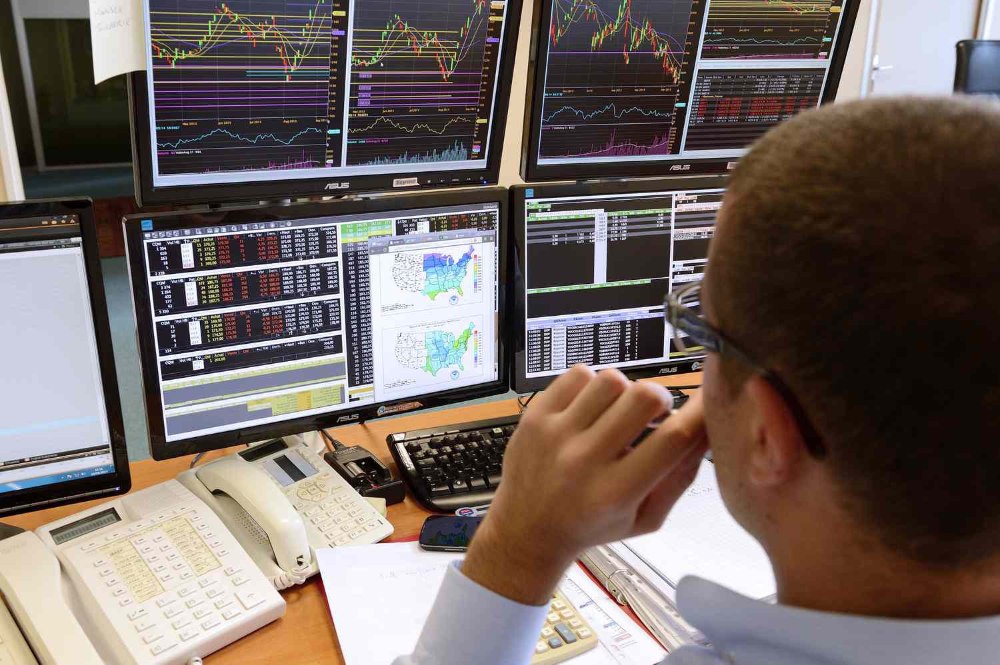

In today’s financial landscape, the convergence of technology and financial regulation is reshaping the dynamics of global markets. Futures Commission Merchants (FCMs) are pivotal entities within this transformation, serving as key intermediaries in the financial trading ecosystem. These organizations not only ensure compliance with stringent regulatory frameworks but also drive innovation in the highly competitive futures market.

The role of FCMs has become increasingly significant as the financial industry navigates the complexities of algorithmic trading. This form of trading leverages advanced computational algorithms to execute trades at speeds and volumes far beyond human capacity, thereby necessitating robust regulatory measures. Understanding the intricacies of how FCMs operate within this landscape is essential for comprehending the broader financial regulatory structure, as these entities are tasked with managing customer transactions, safeguarding funds, and fulfilling delivery obligations.

This article examines the essential functions that FCMs perform, the regulatory environment that dictates their operations, and the transformative impact of algorithmic trading on the futures market. By illuminating these aspects, we aim to offer a thorough understanding of the evolving relationship between financial technology and regulation, as well as the challenges and opportunities they present for FCMs and market participants alike. The narrative detailed here is intended to equip readers with a foundational knowledge of these critical components within the financial industry, highlighting the delicate balance required to foster innovation while ensuring market integrity and transparency.

## Table of Contents

## Understanding Futures Commission Merchants (FCMs)

Futures Commission Merchants (FCMs) are key entities within the financial markets, specifically tasked with facilitating transactions in futures contracts and options on futures. As intermediaries, FCMs play an essential role by managing customer transactions, which involves not only soliciting and accepting orders but also ensuring that these transactions adhere to established regulatory standards. One of their primary responsibilities is the collection and maintenance of margins, which are necessary to cover potential losses and fulfill delivery obligations associated with futures contracts.

FCMs must register with the National Futures Association (NFA) and comply with the directives set by the Commodity Futures Trading Commission (CFTC). This regulatory framework is aimed at maintaining market integrity and protecting customer funds. Compliance also encompasses aspects such as the segregation of customer funds and adherence to minimum capital requirements, which are instrumental in safeguarding the financial stability of the market participants.

The categorization of FCMs into clearing and non-clearing types delineates their distinct operational roles. Clearing FCMs are members of clearing houses and are responsible for ensuring the settlement of trades, managing counterparty risk, and maintaining adequate capital to cover the obligations of the trades they clear. Non-clearing FCMs, on the other hand, operate as introducing brokers that do not clear trades themselves but instead rely on clearing FCMs for trade settlement.

The function of FCMs extends beyond mere transaction facilitation; they are pivotal in maintaining the transparency and integrity of futures markets. By adhering to rigorous compliance standards and operational protocols, FCMs contribute to a stable and trustworthy trading environment, which is critical for fostering investor confidence and market efficiency.

## Regulatory Framework Governing FCMs

The Commodity Futures Trading Commission (CFTC) plays a pivotal role in regulating Futures Commission Merchants (FCMs) to ensure both the protection of customer funds and the integrity of the futures markets. FCMs, as integral components within these markets, must adhere to a stringent regulatory framework.

Key regulatory requirements for FCMs include the segregation of customer funds, ensuring that these funds are held separately from the firm's own assets. This measure is crucial to protect clients' assets in the event of the firm's insolvency. Another critical requirement is the maintenance of minimum net capital thresholds. These thresholds are designed to ensure that FCMs possess sufficient financial resources to fulfill their obligations, thus preventing systemic risks that could arise from financial instability within these firms.

Comprehensive reporting and recordkeeping obligations are also mandated. FCMs must provide detailed reports on their financial health, customer transactions, and compliance status. This transparency is essential for regulatory bodies to monitor the firms' activities and market health effectively.

The regulatory landscape has evolved substantially due to legislative measures like the Dodd-Frank Wall Street Reform and Consumer Protection Act. This act was a response to the financial crisis of 2008 and has significantly increased oversight and compliance demands on FCMs. The act introduced comprehensive reforms aimed at reducing systemic risks and enhancing the resilience of the financial markets.

Recently, the CFTC has implemented rule amendments focusing on further safeguarding customer funds and revising margin adequacy requirements. These amendments are part of ongoing efforts to enhance the stability of the futures markets. By continually adjusting regulations, the CFTC aims to mitigate systemic risk, promoting a robust and secure trading environment.

In summary, the regulatory framework governing FCMs is designed to protect customer assets, maintain market integrity, and minimize systemic risk. Through a combination of rigorous requirements and adaptive regulatory practices, the CFTC works to ensure the stability and resilience of the futures markets.

## Algorithmic Trading in the Futures Market

Algorithmic trading involves utilizing computer algorithms to automate and enhance decision-making processes in the futures market. This technological innovation has significantly modified trading strategies, allowing for high-frequency trading ([HFT](/wiki/high-frequency-trading-strategies)) and the execution of complex derivatives transactions. The automation afforded by these algorithms permits the rapid processing of vast amounts of data, enabling traders to respond instantaneously to market changes. One of the primary advantages is the removal of human emotion from trading activities, often leading to more rational investment decisions.

The expansion of [algorithmic trading](/wiki/algorithmic-trading) brings with it a complex set of regulatory considerations. Futures Commission Merchants (FCMs) and market participants must address issues such as market manipulation and data security concerns. The sophisticated nature of these algorithms implies that they could potentially be used to manipulate pricing or other market variables, a scenario that regulators are vigilantly attempting to prevent. For example, the Commodity Futures Trading Commission (CFTC) has been vocal about the need for robust controls and transparency in algorithmic systems to ensure compliance with fair trading practices.

In response to the challenges posed by algorithmic trading, new regulations have emerged, focusing on system resilience and integrity. These regulatory measures are designed to ensure that trading algorithms are not only robust and transparent but also align with established market standards. Regulators demand comprehensive testing and validation of these algorithms to prevent technical glitches that could disrupt market stability.

Additionally, the evolution of algorithmic trading remains a significant focus within the financial industry. Continuous advancements in technology, coupled with evolving regulatory landscapes, drive ongoing interest and development. The integration of [machine learning](/wiki/machine-learning) and [artificial intelligence](/wiki/ai-artificial-intelligence) in trading algorithms represents the frontier of this evolution, promising further enhancements in speed and accuracy of trade executions. As algorithmic trading continues to evolve, the collaboration between technology developers, traders, FCMs, and regulators will be crucial in ensuring that market advancements enhance rather than undermine financial market integrity.

## Impact of Regulation on Algorithmic Trading

The regulatory environment significantly shapes how algorithmic trading operates and is scrutinized, primarily to ensure market integrity and mitigate associated risks. One of the critical aspects of this regulatory landscape is the establishment and evolution of policies related to order execution, latency reduction, and algorithm transparency. These policies aim to maintain fairness in the market by ensuring that trading systems operate without unfair advantages and that their actions can be traced and audited effectively.

The Commodity Futures Trading Commission (CFTC), among other institutions, plays a pivotal role in updating and enforcing these guidelines. For instance, high-frequency trading (HFT), a subset of algorithmic trading characterized by rapid trade executions, presents unique challenges such as potential market manipulation and [liquidity](/wiki/liquidity-risk-premium) depletion. To counteract these risks, the CFTC has implemented stricter reporting requirements and system integrity checks to ensure that algorithms act in accordance with established trading norms and prevent destabilizing practices.

In response to these challenges, enhanced scrutiny on algorithmic trading systems has become a focal point. Regulators focus on implementing controls that can detect and rectify anomalies or misconduct swiftly. This includes using sophisticated monitoring technologies that can analyze massive trading data volumes in real-time, identifying potentially damaging patterns before they create broader market disruptions. Additionally, imposing minimum standards for the robustness and security of algorithmic systems helps shield against systemic risks.

For Futures Commission Merchants (FCMs) and traders, navigating these evolving regulations is indispensable to harness the potential benefits of algorithmic trading. Compliance involves not only adhering to existing legal standards but also anticipating and adapting to new regulatory developments. This necessitates investing in specialized compliance teams and technology solutions capable of ensuring that trading practices are both innovative and secure.

In summary, the intersection of regulation and algorithmic trading underscores the need for a delicate balance: fostering technological advancement while safeguarding market stability. As regulatory bodies like the CFTC continue to refine their approaches, the financial industry must remain vigilant and proactive in aligning technological capabilities with regulatory requirements.

## Future Trends and Challenges

The future of Futures Commission Merchants (FCMs) and algorithmic trading is closely tied to advancements in adaptive technology and evolving regulations. In recent years, there has been a significant emphasis on integrating artificial intelligence (AI) and machine learning (ML) into financial markets. These technologies promise to deliver new efficiencies and opportunities by enhancing predictive analytics, improving decision-making processes, and enabling the development of more sophisticated trading strategies. For example, AI-driven algorithms can process vast datasets rapidly, identifying patterns and trends that may not be apparent through traditional analytical methods.

However, the integration of such technologies is not without its challenges. One of the primary hurdles is aligning innovative technology with rigorous regulatory standards. As AI and ML technologies evolve, ensuring they comply with existing rules and regulations becomes increasingly complex. Regulatory bodies, like the Commodity Futures Trading Commission (CFTC), continue to adapt their frameworks to address the novel issues posed by these technologies, such as algorithmic transparency, data privacy, and system reliability. The challenge lies in striking a balance between fostering technological innovation and maintaining market integrity without stifling growth and competition.

For FCMs, agility is key to navigating this landscape. They must be prepared to adapt quickly to new technologies and regulatory changes to remain competitive. This often involves investing in cutting-edge technology and reevaluating compliance strategies to align with regulatory updates. For instance, the adoption of adaptive algorithms that can adjust their strategies in real-time in response to market shifts could provide a competitive advantage, but they must also adhere to stringent compliance standards.

Looking ahead, collaboration between regulators, FCMs, and technology providers will be crucial. Such partnerships can facilitate a more dynamic and secure trading environment by ensuring that technological advancements are implemented responsibly and effectively. A cooperative approach allows for the sharing of expertise and resources, helping to navigate the complexities of the evolving landscape. This collaboration can also contribute to developing best practices and standards that protect market participants while encouraging innovation.

Ultimately, the future of FCMs and algorithmic trading will be shaped by how effectively these entities can harness emerging technologies while adhering to and influencing evolving regulatory standards. This will require continuous innovation, strategic partnerships, and a commitment to transparency and compliance.

## Conclusion

Futures Commission Merchants (FCMs) stand as pivotal entities in the futures markets, playing an essential role in ensuring that transactions are executed efficiently and securely. Their responsibilities encompass a range of activities, from managing customer transactions to upholding compliance with delivery obligations, underlining their critical position in market operations.

The emergence and proliferation of algorithmic trading offer considerable opportunities for innovation within the financial markets. This technology enhances trading speed and accuracy, fostering an environment where complex trading strategies can be employed effectively. However, algorithmic trading also introduces significant regulatory challenges. Regulators are tasked with addressing concerns such as market manipulation and data security while ensuring that algorithmic systems remain robust and transparent.

The regulatory landscape for FCMs is evolving continuously to maintain a balance between market efficiency and risk mitigation. This evolution aims to create a trading environment that is both fair and transparent, protecting the interests of market participants while promoting overall market integrity. As new technologies and trading strategies develop, regulators are required to adjust their frameworks, ensuring they are equipped to handle the complexities introduced by advancements in trading technologies such as high-frequency trading.

For the financial industry to sustain its innovative trajectory, continuous dialogue between market participants and regulators is imperative. Such communication is essential to striking a balance that allows for growth and competition without compromising market stability or fairness. Regulators and industry participants must work collaboratively to understand and adapt to emerging trends and challenges.

The future success of FCMs and algorithmic trading hinges on this capacity to navigate and thrive within an increasingly intricate regulatory environment. Adapting to regulatory changes while remaining agile in adopting new technologies will be critical for maintaining competitiveness and sustainability. The financial markets will rely on this synergy between innovation and regulation to continue evolving responsibly and effectively.

## References & Further Reading

[1]: ["How Algorithmic Trading Has Changed the Financial Markets"](https://en.wikipedia.org/wiki/Algorithmic_trading) - Financial Times

[2]: Tresca, R. (2011). ["CFTC's Proposal on Risk Controls and Transparency of Algorithmic Trading: A Primer."](https://www.mdpi.com/2304-6767/13/1/15) Commodity Futures Trading Commission.

[3]: Lopez de Prado, M. (2018). ["Advances in Financial Machine Learning"](https://www.amazon.com/Advances-Financial-Machine-Learning-Marcos/dp/1119482089). Wiley.

[4]: Chan, E. P. (2008). ["Quantitative Trading: How to Build Your Own Algorithmic Trading Business"](https://github.com/egorpe/EPChan-QuantitativeTrading/blob/master/example7_6.m). Wiley.

[5]: Aronson, D. R. (2006). ["Evidence-Based Technical Analysis: Applying the Scientific Method and Statistical Inference to Trading Signals"](https://www.amazon.com/Evidence-Based-Technical-Analysis-Scientific-Statistical/dp/0470008741). Wiley.