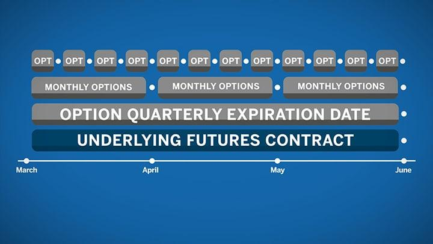

The financial markets are a dynamic ecosystem comprising various instruments and strategies, with futures contracts being one of the fundamental components. Futures contracts are standardized agreements to buy or sell an asset at a predetermined price at a specified future date. These contracts are pivotal for traders and investors seeking to hedge against price fluctuations or speculate on asset price movements.

Understanding expiration dates is crucial in futures trading. The expiration date of a futures contract marks the last day on which the contract can be traded before the underlying asset must be delivered or settled in cash. This critical feature influences the contract's validity and the strategies employed by traders to manage risk and optimize returns. The necessity to manage expiration dates leads to practices such as rolling over contracts and using continuous contracts.



Algorithmic trading, which has gained prominence in recent years, often leverages futures contracts to capitalize on market inefficiencies and execute trades at high speed. These algorithmic strategies are profoundly affected by futures contract expiration dates, as expiration can impact data continuity and trading signals used in automated systems. Traders must incorporate expiration considerations into their algorithms to maintain effectiveness and minimize risks associated with contract turnover.

This article explores futures contract expiration, its ramifications on trading strategies, and its integral role in algorithmic trading. By understanding these elements, traders and investors can enhance their decision-making processes and potentially improve their trading performance in leveraging futures contracts.

## Table of Contents

## What is Futures Contract Expiration?

Futures contract expiration signifies the final trading day available for a particular contract. On this date, the contract requires settlement or delivery, which ensures that participants fulfill their financial obligations. This mechanism is essential for maintaining orderly market operations by preventing open contracts from remaining unresolved. If contracts were allowed to persist indefinitely, futures markets could suffer from numerous inefficiencies, including reduced liquidity and increased credit risk. Expiration dates, therefore, play a pivotal role in prompting the clearing of outstanding positions, enabling the introduction of new contracts with updated terms that reflect the latest market conditions. By providing a definitive timeline, expiration dates facilitate the effective functioning of futures markets, helping to align the interests of buyers and sellers and ensuring that contracts serve their intended purpose.

## The Role of Expiration Dates in Futures Trading

Expiration dates are central to the functionality of futures markets, establishing a clear timetable for when obligations must be met. This temporal marker is essential for maintaining discipline and order, as it dictates the timeline for either settling or delivering the underlying asset specified in a futures contract. Without such deadlines, the futures market could be plagued by indefinite contract holdings, leading to inefficiencies and potential disruptions.

In hedging strategies, expiration dates are pivotal. Traders utilize these dates to synchronize their positions with financial objectives, effectively mitigating the risk associated with price fluctuations of the underlying asset. For instance, a company anticipating the need for a certain commodity in the future might use futures contracts expiring close to their forecasted purchase date. This approach locks in prices and shields the company from market [volatility](/wiki/volatility-trading-strategies).

Moreover, expiration dates have significant implications for [liquidity](/wiki/liquidity-risk-premium) and risk management within futures markets. As a contract approaches its expiration, trading volumes often increase, leading to heightened liquidity. However, this liquidity tends to dwindle post-expiration, as the contracts cease to exist, which can challenge traders seeking to [exit](/wiki/exit-strategy) positions swiftly near the end of a contract’s life. Efficient risk management strategies must account for these liquidity dynamics to reduce potential exposure.

Expiration also influences market volatility. As the expiration date nears, the convergence of futures prices to the spot price of the underlying asset can lead to increased trading activity, often causing short-term volatility. This volatility is a consequence of traders adjusting or closing their positions to avoid taking delivery or to maintain a market-neutral stance.

In essence, expiration dates impose a structured rhythm on futures trading, compelling market participants to align their trading activities with defined timelines, thereby enhancing market function through structured risk mitigation and liquidity management.

## Impact on Algorithmic Trading

Algorithmic trading, which involves the use of complex algorithms to execute trades, relies heavily on historical data for [backtesting](/wiki/backtesting) and forecasting models. However, futures contract expiration dates can disrupt data continuity, posing significant challenges to the efficacy of such models. When a futures contract reaches its expiration, it either needs to be settled or rolled over into a new contract. This transition can introduce discontinuities in price data, potentially skewing backtesting results and impairing the reliability of predictive models.

To mitigate these challenges, algorithmic traders employ several strategies aimed at managing the risks associated with futures contract expiration. One prevalent approach is the implementation of contract rollover strategies. This involves closing positions in expiring contracts and simultaneously opening equivalent positions in contracts further out on the expiration calendar. By executing these rollovers efficiently, traders can maintain their market positions without interruption. However, careful timing and execution are crucial, as mismatches in contract liquidity or mispricing during the rollover can lead to increased transaction costs or slippage, impacting the overall strategy's effectiveness.

Another sophisticated method used by algorithmic traders is the development of continuous contracts. Continuous contracts are synthetic instruments that blend data from several contract expirations into a contiguous historical series. This approach provides traders with a seamless dataset that spans multiple contract lifecycles, enhancing the stability and accuracy of both backtesting and forecasting. Continuous contracts are often constructed using techniques that adjust for differences in prices between consecutive futures contracts, such as adjusting the price series for gaps via additive or proportional methods.

In Python, constructing a continuous contract could involve utilizing libraries like Pandas for data manipulation and NumPy for mathematical operations, as exemplified by the following snippet:

```python
import pandas as pd
import numpy as np

# Dummy data for two contracts
contract1 = pd.Series([98, 100, 102], index=pd.date_range('2023-09-01', periods=3))
contract2 = pd.Series([103, 104, 106], index=pd.date_range('2023-09-04', periods=3))

# Continuous series creation using proportional adjustment
adjustment_factor = contract2.iloc[0] / contract1.iloc[-1]
continuous_series = pd.concat([contract1, contract2 / adjustment_factor])

print(continuous_series)
```

This code creates a continuous data series from two overlapping contract periods, providing a reliable dataset for analysis devoid of expiration-induced discontinuities.

By applying these techniques, algorithmic traders can adapt their models to account for the impacts of futures expiration, thereby optimizing their trading strategies and aiding in effective risk management. These adaptations ensure that [algorithmic trading](/wiki/algorithmic-trading) systems remain robust, enhancing decision-making capabilities and achieving strategic financial goals even in the face of potential disruptions caused by contract expirations.

## Techniques for Managing Futures Expiration

Rolling over futures contracts is a fundamental technique employed by traders to manage upcoming expirations. This involves closing an existing futures contract approaching its expiration and simultaneously opening a new contract with a later expiration date. This process allows traders to maintain their market position without taking delivery of the underlying asset. By doing so, traders can sustain their intended exposure to a particular market while mitigating the risks associated with expirations.

Continuous contracts offer another method for managing futures expirations by synthesizing data across multiple contracts with different expiration dates. This approach results in a seamless historical dataset that is particularly advantageous for developing and testing trading algorithms. Continuous contracts are generated by splicing together successive futures contracts, ensuring that the time series reflects a consistent price movement without the distortions caused by abrupt contract changes.

Various adjustment methodologies exist to ensure that datasets compiled from continuous contracts are accurate and reliable over the long term. One common approach is the proportional adjustment, which involves scaling prices based on the ratio of the last price of the expiring contract to the first price of the new contract:

$$
\text{Adjusted Price} = \text{Historical Price} \times \left(\frac{\text{New Contract First Price}}{\text{Old Contract Last Price}}\right)
$$

This method maintains the relative price changes across the splice point, preserving the integrity of historical trends. Another approach is the calendar spread adjustment, which focuses on the differences between the contracts' prices. This adjustment aims to eliminate any artificial jumps in the time series caused by contracts transitioning.

These techniques are crucial for algorithmic trading strategies that rely on long-term, backtested datasets for decision-making. Precise adjustments help in minimizing the impact of rollovers on trading models, ensuring that algorithmic strategies can operate effectively over time without being skewed by discrepancies in the dataset.

In practice, implementation of these techniques can be achieved using programming languages such as Python, leveraging libraries like pandas and numpy for data manipulation and adjustment. Here's a simple Python example of rolling over contracts using proportional adjustment:

```python
import pandas as pd

# Sample data: Two contracts with dates and prices
old_contract_data = {'date': ['2023-01-01', '2023-01-02'], 'price': [100, 101]}
new_contract_data = {'date': ['2023-01-03', '2023-01-04'], 'price': [102, 103]}

# Create DataFrames
old_contract_df = pd.DataFrame(old_contract_data)
new_contract_df = pd.DataFrame(new_contract_data)

# Calculate adjustment ratio
adjustment_ratio = new_contract_df['price'].iloc[0] / old_contract_df['price'].iloc[-1]

# Apply adjustment to old contract prices
old_contract_df['adjusted_price'] = old_contract_df['price'] * adjustment_ratio

# Concatenate adjusted data to form a continuous contract
continuous_contract_df = pd.concat([old_contract_df, new_contract_df], ignore_index=True)

# Display the continuous contract with adjustments
print(continuous_contract_df[['date', 'adjusted_price']])
```

In summary, rolling over contracts and generating continuous datasets are critical techniques that facilitate effective risk management and ensure the accuracy of historical data used in futures trading. These methods enable traders to maintain consistent market insights and robust algorithmic strategies.

## Conclusion

Understanding and effectively managing futures contract expiration is essential for traders, particularly those employing algorithmic trading strategies. Expiration dates dictate the settlement timeline of futures contracts, affecting liquidity, market volatility, and the execution of trading strategies. For algorithmic traders, who rely heavily on precise data and continuity for model accuracy, this aspect of futures trading is a critical [factor](/wiki/factor-investing) to consider.

Integrating strategies that thoughtfully incorporate expiration risk can significantly enhance trading performance. One such approach is contract rollover, where traders close an expiring contract and open a new one in a later expiration period. This technique helps maintain exposure to the underlying asset without interruption. Additionally, continuous contracts offer an innovative solution by combining data from successive futures contracts into a single, seamless dataset. This approach aids traders in overcoming challenges in data continuity, crucial for backtesting and forecasting.

Sophisticated models and algorithms that account for the nuances of expiration dates can provide traders with a competitive edge. By understanding the timing and impact of these dates, traders can optimize their entry and exit points and manage risks more effectively. Continuous contracts, supplemented with advanced analytical tools, enable traders to harness the full potential of futures markets, ensuring robust and informed decision-making.

In conclusion, the meticulous management of futures contract expiration is pivotal in enhancing algorithmic trading capabilities. Employing strategies that consider expiration risks and exploring advanced models like continuous contracts offers traders the opportunity to maximize their trading performance and tap into the expansive opportunities presented by futures markets.

## References & Further Reading

[1]: Rolnick, A., & Pindyck, R. S. (1998). ["The Social Cost of Futures Market Speculation."](https://journals.sagepub.com/doi/10.5547/ISSN0195-6574-EJ-Vol22-No3-1) Journal of Financial and Quantitative Analysis.

[2]: Hull, J. C. (2018). ["Options, Futures, and Other Derivatives"](https://www.semanticscholar.org/paper/Options%2C-Futures%2C-and-Other-Derivatives-Hull/89bdee500c8623864fc9eb7a471546aa713acc44) (10th Edition). Pearson.

[3]: Black, F. (1976). ["The Pricing of Commodity Contracts."](https://www.sciencedirect.com/science/article/pii/0304405X76900246) Journal of Financial Economics.

[4]: Cox, J. C., Ingersoll, J. E. Jr., & Ross, S. A. (1981). ["The Relationship between Forward Prices and Futures Prices."](https://pages.stern.nyu.edu/~dbackus/BCZ/discrete_time/CIR_Econometrica_85.pdf) Journal of Financial Economics.

[5]: Aldridge, I. (2013). ["High-Frequency Trading: A Practical Guide to Algorithmic Strategies and Trading Systems"](https://www.amazon.com/High-Frequency-Trading-Practical-Algorithmic-Strategies/dp/1118343506) (2nd Edition). Wiley.