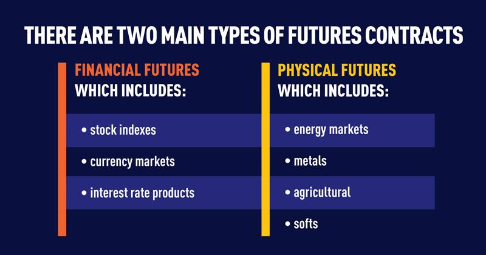

Futures contracts are a vital component of modern financial markets, enabling investors and traders to manage risk and engage in speculative activities. These contracts represent an agreement to buy or sell an asset at a predetermined future date and price, thereby offering a standardized and regulated means of trading various assets. They are used extensively for hedging purposes, allowing participants to lock in prices and protect against market volatility.

Algorithmic trading, which involves using computer algorithms to execute trades automatically, has become increasingly significant in today's trading landscape. It provides numerous advantages over traditional manual trading methods, including speed, precision, and the ability to process vast amounts of data. Algorithms can execute trades based on predefined criteria, enabling traders to exploit market inefficiencies and capitalize on opportunities often unnoticed by human traders.



Understanding futures contracts is essential when considering algorithmic trading strategies. These contracts offer unique opportunities for algorithms to optimize trading strategies by allowing them to execute trades based on precise predictive models and market data analysis. By incorporating futures contracts, algorithmic trading strategies can enhance liquidity, improve market efficiency, and contribute to more effective price discovery.

In essence, futures contracts and algorithmic trading are intertwined components of the modern financial ecosystem. Comprehending how they interact is crucial for anyone looking to navigate the complexities of today’s financial markets and leverage technological advancements to gain a competitive edge.

## Table of Contents

## Understanding Futures Contracts

Futures contracts are standardized legal agreements to buy or sell an asset at a predetermined price at a specified time in the future. These contracts obligate the parties involved to transact, thus playing a pivotal role in risk management and speculation within financial markets. They provide a mechanism for market participants to hedge against potential future price fluctuations, allowing producers and consumers to lock in prices for commodities, or investors to gain exposure to specific market indices or currencies without owning the underlying asset.

Historically, futures contracts can be traced back to the 17th century, with the establishment of Dojima Rice Exchange in Japan, considered the world's first organized futures market. In the United States, futures trading formally commenced in the mid-19th century with the Chicago Board of Trade (CBOT) facilitating contracts primarily in agricultural products. Over time, the scope expanded beyond agricultural commodities to include financial instruments, indices, and currencies.

Today, futures contracts encompass various types:

1. **Commodity Futures**: These involve tangible products such as agricultural goods (wheat, corn), energy (crude oil, natural gas), and metals (gold, silver). Commodity futures enable producers and users to hedge against price volatility inherent in raw materials.

2. **Equity Index Futures**: These allow traders to speculate on the future value of equity indices like the S&P 500 or Dow Jones Industrial Average. Such contracts provide investors with a tool to hedge against market risk or gain exposure to broad market movements without the need to manage individual stock positions.

3. **Currency Futures**: Also known as FX futures, these contracts specify the exchange of one currency for another at a future date and at a specified rate. They are pivotal for businesses and investors to hedge against foreign exchange risk and for speculators looking to profit from currency value fluctuations.

Futures contracts contribute substantially to market efficiency by promoting price discovery and [liquidity](/wiki/liquidity-risk-premium). Their standardized nature and central clearing mitigate counterparty risk, while their leverage potential magnifies both opportunities and risks for market participants. Understanding the historical context and different types of futures contracts is crucial for anyone engaging in modern financial markets, particularly when employing [algorithmic trading](/wiki/algorithmic-trading) strategies for optimal market leverage and risk mitigation.

## The Mechanics of Trading Futures Contracts

Futures contracts are standardized agreements to buy or sell a specific quantity of an asset at a predetermined price at a specified time in the future. They are traded on exchanges, which provide a transparent and regulated environment for buyers and sellers to interact. The exchange acts as an intermediary, ensuring the integrity of transactions by maintaining the standardization of contract specifications such as quantity, quality, and delivery time.

Trading futures contracts involves several key components:

1. **Exchanges and Trading Mechanism**: Futures contracts are primarily traded on futures exchanges like the Chicago Mercantile Exchange (CME) or Intercontinental Exchange (ICE). These exchanges facilitate trading through electronic systems that match buy and sell orders in a centralized manner, enabling price discovery. Market participants, including hedgers, speculators, and arbitrageurs, engage in trading to manage risk or profit from price movements.

2. **Margin Requirements and Leverage**: A distinguishing characteristic of futures trading is the use of margin, which serves as a security deposit to ensure contract performance. Unlike the full value of the asset, traders only need to deposit an initial margin, a small percentage of the contract's value, to open a position. This enables leverage, allowing traders to control larger positions with limited capital. For example, if the initial margin requirement is 10%, a trader can control a $100,000 position with just $10,000. However, leverage amplifies both potential gains and losses.

3. **Maintenance Margin and Margin Calls**: In addition to the initial margin, a maintenance margin level is set, representing the minimum equity a trader must maintain in their account. If the equity falls below this level due to adverse price movements, a margin call is issued, requiring the trader to deposit additional funds or liquidate positions to restore the minimum margin level.

4. **Rollover Process**: Futures contracts have expiration dates, and traders who wish to maintain their positions beyond the expiration must engage in a process known as "rollover." Rollover involves closing the expiring contract and opening a new contract with a later expiration date. This is crucial for traders engaged in long-term strategies, allowing them to continuously maintain their positions without taking delivery of the actual asset.

The mechanics of trading futures contracts are designed to provide a standardized and regulated framework that facilitates efficient risk management and speculative opportunities. The use of margin and leverage introduces both opportunities and risks, necessitating prudent risk management practices by traders. The rollover process ensures the continuous management of positions, aligning contract terms with traders' strategic objectives.

## What Makes for a Good Futures Contract?

Futures contracts are crucial financial instruments in both risk management and speculation. For a futures contract to be deemed effective, it must possess several key components, most prominently liquidity, standardized underlying entities, and appropriate price [volatility](/wiki/volatility-trading-strategies).

Liquidity refers to the ease with which a futures contract can be bought or sold in the market without causing a significant price change. High liquidity is essential because it ensures tighter bid-ask spreads, reduced transaction costs, and greater market stability. A liquid market enables participants to enter and [exit](/wiki/exit-strategy) positions swiftly, which is vital for both hedgers and speculators who rely on the ability to transact efficiently.

Standardization is another critical aspect of effective futures contracts. Standardized contracts have uniform terms and conditions concerning the quantity, quality, and delivery time of the underlying asset. This uniformity reduces confusion among participants and facilitates a more straightforward comparison of contracts across different exchanges. Standardization also increases trust and participation in the market, as traders are assured they are dealing with familiar and comprehensible contracts.

Price volatility is a double-edged sword in futures markets. While excessive volatility may discourage participation and increase risks, a certain level of volatility is necessary for investors to exploit [arbitrage](/wiki/arbitrage) opportunities and for hedgers to effectively offset risk. A well-balanced contract reflects stability without eliminating the potential for profit and risk management.

The risk-shifting potential of futures contracts allows investors to transfer unwanted price risk to those willing to assume it, typically speculators. This transfer of risk is a foundational utility of futures markets, providing a mechanism for producers and consumers to stabilize costs and revenues through hedging.

Cash market competition also plays a pivotal role in the effectiveness of futures contracts. A strong and efficient cash market ensures that the futures prices align closely with the actual market conditions of the underlying asset. When the cash market functions optimally, it enhances price discovery and reduces the basis risk, which is the risk that the cash market price and the futures market price will not converge at the contract's expiration.

Together, these elements establish a robust framework within which futures contracts can function effectively, providing valuable tools for hedging and speculative purposes. The alignment of these components encourages broader market participation, leading to more efficient and stable financial markets.

 to Algorithmic Trading

Algorithmic trading, commonly referred to as algo trading, involves the use of computer algorithms to automatically execute trades based on predefined criteria. These algorithms are designed to make trading decisions at speeds and frequencies that are impossible for human traders, capitalizing on the slightest market inefficiencies.

One of the primary benefits of algorithmic trading over manual trading is the elimination of human emotion, which often leads to suboptimal decision-making. Algorithms operate on logical directives derived from quantitative analysis, ensuring systematic and disciplined trading. Additionally, algorithmic trading can analyze multiple market conditions in real-time, executing orders instantly and reducing the impact of market fluctuations.

Common algorithmic trading strategies employed in financial markets include [market making](/wiki/market-making), [trend following](/wiki/trend-following), and [statistical arbitrage](/wiki/statistical-arbitrage). 

1. **Market Making** involves placing both buy and sell orders to profit from the spread between the continuous bid and ask prices.

2. **Trend Following** strategies capitalize on market momentum, using technical indicators to identify and follow market trends.

3. **Statistical Arbitrage** seeks to profit from price discrepancies between correlated financial instruments, relying on statistical models to predict price movements.

Quantitative analysis plays a crucial role in the development of trading algorithms. By applying mathematical and statistical methods to historical data, traders can identify patterns and relationships within market behavior, forming the basis of predictive models. These models may integrate various advanced techniques, such as [machine learning](/wiki/machine-learning) algorithms, to process and react to new data efficiently.

A typical example of a simple quantitative strategy could be a moving average crossover strategy, which involves buying an asset when its short-term moving average crosses above its long-term moving average and selling when the inverse occurs. In Python, this strategy might be implemented as follows:

```python
import pandas as pd 
import numpy as np

# Load historical price data
data = pd.read_csv('price_data.csv')

# Calculate moving averages
data['Short_MA'] = data['Close'].rolling(window=40).mean()
data['Long_MA'] = data['Close'].rolling(window=100).mean()

# Define buy and sell signals
data['Signal'] = 0
data['Signal'][40:] = np.where(data['Short_MA'][40:] > data['Long_MA'][40:], 1, 0) 
data['Position'] = data['Signal'].diff()

# Results
print(data[['Close','Short_MA','Long_MA','Signal','Position']])
```

This fundamental code exemplifies the intersection of quantitative analysis and algorithmic trading, demonstrating how data-driven insights guide investment decisions without requiring human intervention. As the marketplace continues to grow in complexity, the importance of integrating robust quantitative models within algorithmic trading systems remains paramount.

## How Algo Trading is Used in Futures Markets

Algorithmic trading has revolutionized the way futures markets operate, offering diverse strategies to optimize trading processes. Among the most prominent strategies are market making and statistical arbitrage, both of which leverage computational power and algorithmic precision to enhance trading efficiency and profitability.

Market making in futures markets involves creating liquidity by continuously offering buy and sell quotes for a futures contract. This strategy relies on capturing the bid-ask spread for profit, requiring sophisticated algorithms to rapidly assess market conditions and adjust quotes accordingly. Effective market-making algorithms must consider factors such as [order book](/wiki/order-book-trading-strategies) depth, historical price data, and current market volatility to manage inventory and minimize risk. Through high-frequency trading and algorithmic execution, market makers significantly enhance market liquidity and facilitate price discovery.

Statistical arbitrage is another algorithmic strategy widely used in futures markets. It involves identifying pricing inefficiencies between related financial instruments, such as futures contracts and their underlying assets or correlated futures contracts. By employing quantitative models, statistical arbitrage algorithms predict price divergences and execute trades to exploit these anomalies. The success of these strategies hinges on the accuracy of predictive models, which often utilize historical price data and statistical techniques like cointegration and mean reversion.

The impact of algorithmic trading on market dynamics is substantial. Algo trading enhances liquidity by ensuring the availability of continuous buy and sell offers, leading to tighter spreads and more efficient markets. Moreover, it plays a critical role in price discovery by rapidly processing vast amounts of market data, thereby reflecting new information in prices more quickly. However, the speed and automation of algorithmic trading can also contribute to market volatility, as evidenced by events like the 2010 Flash Crash.

Developing and [backtesting](/wiki/backtesting) trading algorithms are fundamental to successful algorithmic trading. The development process requires quantitative analysts to engineer strategies based on mathematical models and empirical data. Backtesting involves simulating the algorithm's performance over historical data to evaluate its effectiveness and robustness. This process helps in identifying potential risks and optimizing parameters before deploying the algorithms in live markets.

Python has become a preferred language for algorithm development and backtesting due to its rich ecosystem of libraries such as NumPy, pandas, and scikit-learn for data manipulation and machine learning. For example, a simple Python script to backtest a moving average crossover strategy in futures markets might look like this:

```python
import pandas as pd
import numpy as np

# Load historical data
data = pd.read_csv("futures_data.csv")
data['short_ma'] = data['Close'].rolling(window=5).mean()
data['long_ma'] = data['Close'].rolling(window=20).mean()

# Generate trading signals
data['signal'] = 0
data['signal'][5:] = np.where(data['short_ma'][5:] > data['long_ma'][5:], 1, -1)

# Calculate returns
data['returns'] = data['Close'].pct_change()
data['strategy_returns'] = data['signal'].shift(1) * data['returns']

# Performance metrics
cumulative_return = (1 + data['strategy_returns']).prod() - 1
print("Cumulative Return of Strategy: {:.2f}%".format(cumulative_return * 100))
```

In conclusion, algorithmic trading continues to shape futures markets through strategies like market making and statistical arbitrage, impacting liquidity and price discovery. The continued development and rigorous backtesting of trading algorithms are vital in navigating the complexities of modern financial markets.

## Challenges and Regulatory Considerations

Algorithmic trading, particularly in futures markets, presents a blend of technological prowess and intricate market dynamics. However, this innovative approach also grapples with several challenges and is subject to rigorous regulatory scrutiny.

### Technological and Market-Related Challenges

One of the primary technological challenges in algorithmic futures trading is latency. Even microsecond delays in order execution can mean the difference between profit and loss. High-frequency trading ([HFT](/wiki/high-frequency-trading-strategies)) systems necessitate infrastructure that supports minimal latency, such as colocating servers in exchange data centers and utilizing high-speed fiber optic connections.

Furthermore, the development of robust algorithms is a complex task that requires substantial expertise in quantitative analysis, programming, and financial markets. Designing an algorithm involves understanding historical market data patterns and employing machine learning techniques to predict future movements. A common mathematical model used is the moving average crossover strategy, defined as:

$$
\text{Signal} = \frac{1}{n}\sum_{i=0}^{n-1} \text{Price}_i - \frac{1}{m}\sum_{i=0}^{m-1} \text{Price}_i
$$

where $n$ and $m$ represent short and long moving average periods, respectively. Implementing such strategies requires substantial computational power and can suffer from overfitting, where models perform well on historical data but fail in live markets.

Market-related challenges include liquidity and price impact risk. Illiquid futures can result in sizable slippage, where the executed price deviates from the expected price, adversely impacting profitability. Moreover, algorithmic traders need to constantly update models and strategies to adapt to market conditions, which is resource-intensive.

### Overview of Regulatory Frameworks

The regulatory landscape governing algorithmic trading in futures markets is complex and constantly evolving. Regulations aim to ensure fair market access, minimize systemic risk, and prevent market manipulation.

In the United States, the Commodity Futures Trading Commission (CFTC) regulates futures markets. The CFTC’s Regulation Automated Trading (Reg AT) proposal emphasized pre-trade risk controls, transparency, and system safeguard requirements. Although Reg AT was withdrawn in 2018, aspects of its framework continue to influence current policy discussions.

In Europe, the European Securities and Markets Authority (ESMA) plays a similar role. Under the Markets in Financial Instruments Directive II (MiFID II), ESMA mandates trading firms to implement algorithmic controls, ensure adequate testing of algorithms, and maintain records of their algorithmic trading activities.

Both the CFTC and ESMA aim to prevent market abuse, enhance transparency, and protect market integrity. They require firms to undergo stringent testing and approval processes, maintain robust risk management systems, and adhere to periodic reporting obligations.

### The Role of Regulatory Organizations

The CFTC and ESMA exert significant influence in shaping the regulatory environment. They establish standards for algorithmic trading that mitigate risks associated with unforeseen market anomalies and technological failures, sometimes referred to as "flash crashes."

The CFTC actively monitors trading activities and enforces penalties for non-compliance to deter malpractice. Similarly, ESMA’s framework ensures that algorithmic firms in the EU are accountable for their trading strategies and systems, emphasizing investor protection and market transparency.

In conclusion, navigating the challenges and regulatory considerations of algorithmic futures trading requires a meticulous approach. Firms must balance technological innovation with rigorous compliance to thrive in this competitive domain. Staying informed of regulatory changes and technological advancements is crucial for market participants to sustain their competitive advantage while adhering to legal standards.

## The Future of Algorithmic Trading in Futures Markets

The future of algorithmic trading in futures markets is poised to be significantly influenced by emerging technologies and data paradigms. Big data, [artificial intelligence](/wiki/ai-artificial-intelligence) (AI), and blockchain are rapidly transforming the landscape, introducing both opportunities and challenges.

Big data is a crucial asset in the algorithmic trading ecosystem. The ability to process and analyze vast datasets in real-time allows traders to identify patterns and make informed decisions with greater speed and accuracy [1]. These datasets encompass market data, financial news, and even social media sentiment, offering unprecedented insights. Algorithms can be designed to [factor](/wiki/factor-investing) in this diverse set of information, optimizing trading strategies. The predictive power of big data analytics enhances traders' capabilities to anticipate market movements, thereby improving the efficacy of futures trading strategies.

Artificial Intelligence (AI), particularly machine learning, is driving substantial advancements in algorithmic trading. AI algorithms are capable of learning from historical data, identifying patterns, and making predictions with minimal human intervention. Machine learning models, such as neural networks, are adept at recognizing complex patterns that traditional models might miss. For instance, [reinforcement learning](/wiki/reinforcement-learning) algorithms can be employed to develop adaptive trading strategies that evolve in response to market dynamics. Python, with its extensive libraries like TensorFlow and scikit-learn, is often used for building and testing these models:

```python
import numpy as np
from sklearn.model_selection import train_test_split
from sklearn.neural_network import MLPRegressor

# Sample data input
data = np.random.rand(1000, 10)  # 1000 samples with 10 features each
targets = np.random.rand(1000)

# Split data into training and test sets
X_train, X_test, y_train, y_test = train_test_split(data, targets, test_size=0.2)

# Create and train the neural network model
model = MLPRegressor(hidden_layer_sizes=(50,), max_iter=1000)
model.fit(X_train, y_train)

# Evaluate the model
score = model.score(X_test, y_test)
print(f"Model accuracy: {score:.2f}")
```

Blockchain technology holds the potential to revolutionize futures markets by enhancing transparency and reducing counterparty risk. As a distributed ledger, blockchain ensures that all transactions are immutable and verifiable, thus fostering trust among market participants. Smart contracts, which are self-executing contracts with the terms directly written into code, can automate various trading processes, reducing the need for intermediaries and minimizing transaction costs.

The regulatory environment is continuously adapting to this technological evolution. Regulators like the Commodity Futures Trading Commission (CFTC) in the United States and the European Securities and Markets Authority (ESMA) are tasked with maintaining market integrity while fostering innovation. They face the challenge of designing frameworks that can accommodate new technologies without stifling growth. Ensuring cybersecurity, managing systemic risks, and preserving market fairness are central considerations for regulators as they develop guidelines tailored to handle advancements in technology. Balancing these aspects is crucial for sustaining trust and stability in futures markets dominated by algorithmic trading.

In conclusion, the future of algorithmic trading in futures markets is intertwined with advancements in big data, AI, and blockchain technologies. These innovations promise to enhance trading efficiency and transparency while posing regulatory challenges that necessitate vigilant oversight. As these technologies continue to evolve, staying informed and adaptable will be vital for traders and policymakers alike.

References:
1. Chen, Y., & Zhang, Z. (2018). Data-driven quantitative trading strategies. Springer.
2. Narang, R. K. (2013). Inside the black box: A simple guide to quantitative and high-frequency trading. John Wiley & Sons.

## Conclusion

Futures contracts and algorithmic trading are intrinsically linked, with each enhancing the other's effectiveness and scope within financial markets. Futures contracts provide a standardized and efficient mechanism for trading various assets, offering both risk management through hedging and opportunities for speculation. Algorithmic trading further amplifies these capabilities by leveraging technology to execute trades at high speed and with precision, optimizing strategies that may involve complex calculations and data analysis.

The relationship between futures contracts and algorithmic trading is synergistic: futures offer the standardized structure and liquidity essential for algorithmic strategies, while algorithms bring increased efficiency and innovation to futures markets. This integration has revolutionized the way financial markets operate, offering traders the ability to implement sophisticated approaches like statistical arbitrage, market making, or trend following, which are often unfeasible through manual trading alone.

However, this confluence of futures contracts and algorithmic trading is not without its challenges. Technological vulnerabilities and the potential for systemic risks underscore the need for robust regulatory frameworks and vigilant risk management. Organizations such as the Commodity Futures Trading Commission (CFTC) and the European Securities and Markets Authority (ESMA) play pivotal roles in regulating this sector, ensuring that market integrity is maintained even as technologies evolve.

Balancing risks and opportunities is crucial in algorithmic trading. While algorithms can dramatically enhance trading efficiency and open new avenues for profit, they also introduce risks related to overfitting, market instability, and the potential for unintended consequences during periods of volatility. Hence, traders and firms must continually refine their models and remain cognizant of the limitations inherent in algorithmic systems.

Staying informed and adaptable is paramount in the fast-paced world of algorithmic futures trading. Market participants must keep abreast of technological advancements, regulatory changes, and market dynamics. Embracing a mindset of continuous learning and adaptation will be vital for navigating the complexities of modern markets. Moreover, innovations such as AI and big data analytics present new possibilities, suggesting that the future of algorithmic trading in futures markets holds significant potential for those who are prepared to harness these advancements judiciously.

## References & Further Reading

[1]: Hull, J. C. (2017). ["Options, Futures, and Other Derivatives"](https://elibrary.pearson.de/book/99.150005/9781292212920). Pearson.

[2]: Narang, R. K. (2013). ["Inside the Black Box: A Simple Guide to Quantitative and High-Frequency Trading"](https://onlinelibrary.wiley.com/doi/book/10.1002/9781118662717). John Wiley & Sons.

[3]: Chen, Y., & Zhang, Z. (2018). ["Data-Driven Quantitative Trading Strategies"](https://www.nature.com/articles/s41467-024-55592-1). Springer.

[4]: Aldridge, I. (2013). ["High-Frequency Trading: A Practical Guide to Algorithmic Strategies and Trading Systems"](https://www.amazon.com/High-Frequency-Trading-Practical-Algorithmic-Strategies/dp/1118343506). John Wiley & Sons.

[5]: Lopez de Prado, M. (2018). ["Advances in Financial Machine Learning"](https://www.amazon.com/Advances-Financial-Machine-Learning-Marcos/dp/1119482089). Wiley.

[6]: Tse, Y., & Hackard, S. (2019). ["Algorithmic Trading in Futures Markets"](https://www.umsl.edu/business/directory/documents/tse_2019.pdf). Review of Futures Markets.

[7]: Gomber, P., Koch, J.-A., & Siering, M. (2017). ["Digital Finance and FinTech: Current Research and Future Research Directions"](https://link.springer.com/article/10.1007/s11573-017-0852-x). Journal of Business Economics.