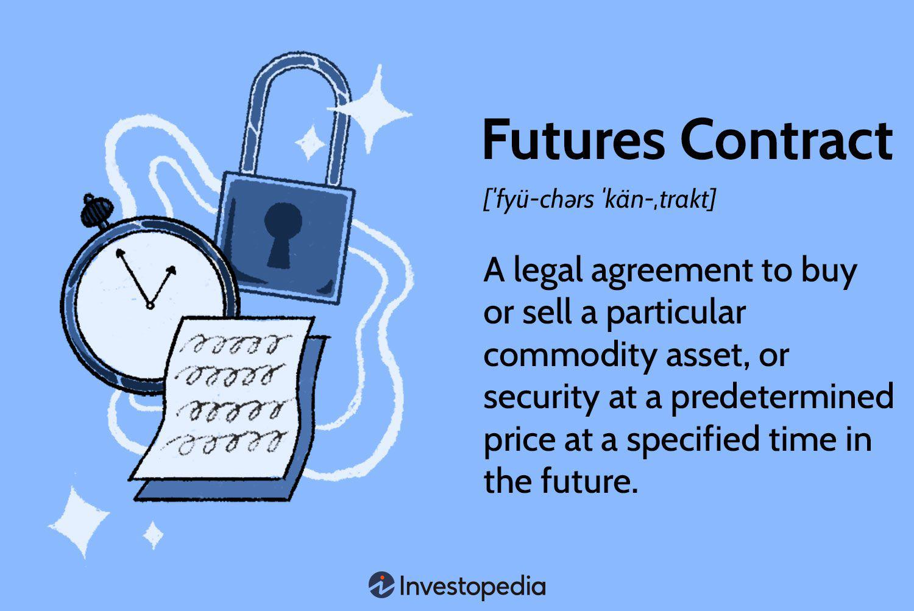

In the rapidly evolving world of finance, the use of algorithmic methods for trading futures contracts has gained significant traction. Algorithmic trading, often referred to as algo trading, involves the use of computer programs to automate and execute trades at velocities and volumes that surpass human capabilities. This technology-driven approach facilitates efficiency in trading by minimizing human error and streamlining the execution process.

Futures contracts, on the other hand, are standardized agreements to buy or sell a specific commodity or financial asset at a predetermined price on a set future date. These contracts are distinguished by their ability to be traded on exchanges, providing a platform for hedging risk or engaging in speculative activities. As integral components of global financial markets, futures contracts enable both risk management and profit-seeking strategies across various sectors, including commodities, equity indices, and currencies.

The integration of algorithmic trading into the futures market revolutionizes traditional trading paradigms. It allows traders to leverage sophisticated algorithms to perform complex calculations, analyze market data, and execute high-frequency trades. This amalgamation of technology and finance offers significant benefits, such as enhancing market liquidity, optimizing pricing efficiency, and reducing transaction costs. Moreover, algorithmic trading can facilitate strategies that are well-suited to futures markets, such as statistical arbitrage and trend following, where rapid execution and precision are critical for success.

Understanding the relationship between futures contracts and algorithmic trading is crucial for traders aiming to maintain a competitive edge. Both seasoned and novice traders must comprehend the intricacies of these financial instruments and their deployment in algorithmic strategies to harness their potential fully. This article examines the definitions, mechanisms, and roles of futures contracts and algo trading within the current financial frameworks. 

Subsequent sections of this article provide an in-depth analysis of the operational dynamics of these components. Topics include a detailed examination of different types of futures contracts, the mechanics of futures trading, and an introduction to algorithmic trading techniques. By exploring these areas, readers will gain valuable insights into the role technology plays in the efficient functioning of financial markets and the benefits it brings to traders globally. This comprehensive understanding will equip industry participants to navigate the complexities of modern trading environments successfully.

## Table of Contents

## Understanding Futures Contracts

Futures contracts are standardized financial agreements stipulating the purchase or sale of a specific commodity or financial instrument at a predetermined price, to be executed at a future date. These contracts are a cornerstone of modern financial markets, playing a crucial role in both risk management and speculative investment strategies.

Futures contracts are typically traded on regulated futures exchanges, such as the Chicago Mercantile Exchange (CME) or the Intercontinental Exchange (ICE). These exchanges provide a transparent and standardized platform where buyers and sellers can engage in transactions, ensuring [liquidity](/wiki/liquidity-risk-premium) and the enforcement of contract terms.

Hedging and speculation form the dual purposes of futures contracts. Hedgers, such as farmers or manufacturers, utilize futures to lock in prices and protect against adverse price movements in raw materials or products. Conversely, speculators seek to profit from price fluctuations by assuming the risk that hedgers wish to avoid, thus contributing to market liquidity and depth.

A diverse array of futures contracts is available, each tailored to specific markets and needs. Commodity futures cover raw materials such as oil, gold, and agricultural products. Equity index futures allow investors to speculate on the performance of stock indices like the S&P 500. Currency futures provide a hedging mechanism against foreign exchange risks. Each type of futures contract comes with unique characteristics concerning size, settlement procedures, and underlying assets.

Historically, futures contracts have evolved from simple forward contracts used in agrarian markets to complex instruments underpinning diverse financial assets. The 19th century saw the formalization of futures trading in the United States, and these markets have since expanded globally, reflecting the growing significance of futures contracts in financial market stability and economic efficiency.

Several critical components influence futures trading. Margin requirements are essential for ensuring that both parties fulfill their contractual obligations. Initial margins act as collateral to cover potential losses, while maintenance margins ensure the integrity of accounts. If the account falls below this level, a margin call requires additional funds to restore the account to the initial margin requirement. 

Contract specifications, including the contract size, tick size, and expiry dates, define the parameters of the trade. For instance, a single [crude oil](/wiki/crude-oil) futures contract might involve 1,000 barrels, with the purchase or sale contingent upon market rules and contract specifications.

The determination of futures prices is primarily driven by the forces of supply and demand in the market. The spot price of the underlying asset, the cost of [carry](/wiki/carry-trading) (including storage costs and interest rates), and expectations of future price changes all contribute to the futures price. Mathematical models, such as the futures pricing model, often formalize these factors:

$$
F = S \times e^{(r + c) \times t}
$$

where $F$ is the futures price, $S$ is the spot price, $r$ is the risk-free interest rate, $c$ is the cost of carry, and $t$ is the time to maturity.

This section provides an understanding of the fundamental mechanics behind futures contracts, highlighting their role in risk management and investment and exploring the factors that influence futures pricing. Through these standardized contracts, market participants can effectively manage exposure and capitalize on future price movements.

## The Mechanics of Trading Futures Contracts

Trading futures contracts consists of engaging various participants in a structured market environment. Key elements include exchanges, clearinghouses, regulatory bodies, and market participants such as traders and brokers who are crucial for the orderly and efficient operation of futures markets.

When an order is placed in futures trading, it can be either a buy/sell based on the trader’s predictive market analysis or risk management strategy. Orders are placed through brokers who are members of a futures exchange like the Chicago Mercantile Exchange (CME). These exchanges facilitate the trading of standardized futures contracts, ensuring transparency and fairness. The match between buyers and sellers occurs through an electronic [order book](/wiki/order-book-trading-strategies) system, crucial for maintaining liquidity—a measure of how quickly assets can be bought or sold in the market without affecting the asset's price.

Liquidity is critical in futures markets as it affects price stability and traders' ability to execute large orders swiftly. High liquidity means traders can enter or [exit](/wiki/exit-strategy) positions effortlessly, while low liquidity can lead to price [volatility](/wiki/volatility-trading-strategies). Clearinghouses, such as the CME Clearing, play a pivotal role in fostering market confidence by guaranteeing the execution of trades. They stand as the central counterparty to both sides of a trade, thus mitigating counterparty risk and ensuring that each party fulfills its contractual obligations. This process of clearing involves verifying and settling trades, a function vital for maintaining market integrity and operational efficiency.

Leverage, an inherent feature of futures markets, allows traders to control a large position with a relatively small amount of capital. This is achieved through the margin system, where a trader deposits a fraction of the contract's total value. While leverage amplifies potential returns, it also heightens risk exposure. For example, a small price movement can lead to significant profits or losses, as illustrated by the leverage ratio calculated as:

$$
\text{Leverage Ratio} = \frac{\text{Contract Value}}{\text{Margin Requirement}}
$$

One operational aspect of futures trading is the concept of ‘rollover’. This occurs when a trader extends a position beyond the contract’s expiration date by closing the nearby contract and opening a new position in a longer-dated contract. This practice is common in managing long-term positions and avoiding delivery of the underlying asset.

Real-world examples serve to elucidate these concepts. Consider a trader speculating on wheat prices. They may leverage their position to maximize potential gains, using models to predict price movements. As the contract expiry nears, if they intend to hold the position, they will engage in a rollover by selling the expiring contract and buying a contract with a later expiration date. This strategy enables management of positions without the burden of physical delivery.

Through these intricate mechanics, trading futures contracts involves a careful balance of risk and opportunity, with liquidity, leverage, and clearing playing central roles in market functionality. These components collectively ensure the stability and efficiency required for successful futures trading.

 to Algorithmic Trading

Algorithmic trading, or algo trading, leverages the power of computer algorithms to automate and optimize the trading process. These algorithms execute trades at speeds and frequencies that are beyond the capacity of human traders, allowing for precision and rapid decision-making in volatile markets. The primary objective of [algorithmic trading](/wiki/algorithmic-trading) is to capitalize on opportunities that arise from market inefficiencies.

The types of algorithms used in algo trading are varied, each tailored to exploit specific strategies. Common trading strategies include [market making](/wiki/market-making), [trend following](/wiki/trend-following), statistical [arbitrage](/wiki/arbitrage), and mean reversion. For instance, a trend-following algorithm will identify and exploit upward or downward trends in asset prices, while a [statistical arbitrage](/wiki/statistical-arbitrage) strategy uses statistical methods to profit from pricing inefficiencies between correlated securities.

The benefits of algorithmic trading are substantial. Increased efficiency is one of the most significant advantages. Algorithms can process vast amounts of data in milliseconds, enabling traders to respond swiftly to market events. This reduces manual intervention, as trades are automatically executed based on pre-defined criteria, leading to optimized trading decisions that are consistent and free from emotional biases.

Quantitative analysis plays a crucial role in the development of these trading algorithms. By using mathematical models and statistical techniques, traders can design algorithms that predict price movements and identify profitable trading opportunities. Machine learning and [artificial intelligence](/wiki/ai-artificial-intelligence) further enhance these strategies by enabling continuous learning and adaptation to changing market conditions. For example, a [machine learning](/wiki/machine-learning) algorithm can analyze historical price data to recognize patterns and predict future price movements.

However, algorithmic trading is not without its drawbacks. System failures and technical glitches can lead to financial losses if an algorithm executes trades based on erroneous data or if there is a connectivity issue. The impact on market dynamics can also be significant, with algorithms occasionally causing increased volatility or unintended market movements, as seen in events like the 2010 Flash Crash. Therefore, it is crucial to incorporate robust risk management and monitoring systems to mitigate these risks.

In summary, algorithmic trading represents a significant advancement in the financial markets, offering enhanced efficiency, speed, and precision. By leveraging quantitative techniques and cutting-edge technology, traders can unlock new opportunities and streamline their trading processes. However, the potential pitfalls necessitate careful consideration and diligent oversight to ensure sustainable and responsible use of algorithmic strategies.

## How Algo Trading is Used in Futures Markets

Algorithmic trading, or algo trading, has revolutionized the futures markets, fundamentally altering how traders interact with these financial instruments. By employing advanced computer algorithms, traders can execute orders at speeds and frequencies unavailable to human traders, enhancing both efficiency and market participation.

### Diverse Algorithmic Strategies

Algo trading employs various strategies for different purposes in the futures markets. Market making algorithms, for instance, are designed to provide liquidity by continuously quoting bid and ask prices, allowing market participants to buy or sell futures contracts more easily. This constant presence helps narrow bid-ask spreads and enhances liquidity, making the market more attractive, especially to institutional investors.

Statistical arbitrage algorithms are also widely used. These algorithms identify pricing inefficiencies across correlated assets or markets, executing trades to capitalize on slight price deviations. By aligning the prices of futures contracts with their theoretical values, these algorithms contribute to more accurate price discovery.

Trend-following algorithms detect and exploit persistent price movements in futures markets. By using historical price data to predict future trends, they initiate trades to profit from these movements. This strategy is particularly effective in volatile markets, where rapid price changes create trading opportunities.

### Impact on Market Dynamics

Algorithmic trading significantly impacts market liquidity, spreads, and the price discovery process. By increasing the speed and [volume](/wiki/volume-trading-strategy) of transactions, algorithms enhance market liquidity, making it easier for traders to enter and exit positions without significantly affecting prices. This increased liquidity generally results in tighter spreads, reducing trading costs for participants.

Moreover, algo trading contributes to efficient price discovery by rapidly incorporating new information into market prices. As algorithms respond to news or changes in market conditions, they adjust orders accordingly, ensuring that futures prices reflect the most current information.

### Development and Backtesting of Algorithms

Traders develop algorithms by combining quantitative analysis with techniques like machine learning to create robust trading strategies. Developing a successful algorithm involves extensive [backtesting](/wiki/backtesting)—applying the algorithm to historical market data to evaluate its performance. This process helps identify potential weaknesses and ensures the algorithm can withstand various market conditions.

Backtesting requires careful consideration of several factors, including transaction costs, slippage, and the frequency of trades. By simulating trades on past data, traders can refine their algorithms to optimize performance and minimize risks.

### Security and Technology Infrastructure

Effective algo trading relies on robust technology infrastructure and stringent security measures. High-frequency trading demands low-latency systems capable of executing transactions in milliseconds. As such, traders must invest in cutting-edge hardware and software to maintain a competitive edge.

Security is paramount, as unauthorized access or cyberattacks can lead to significant financial losses. Traders employ encryption, access controls, and continuous monitoring to protect their systems. Additionally, regulatory compliance requires regular audits and reporting to ensure transparency and fairness in trading activities.

In conclusion, algorithmic trading has fundamentally transformed futures markets by enhancing liquidity, reducing trading costs, and refining the price discovery process. Through diverse strategies, traders can exploit market opportunities with unprecedented speed and precision. However, success in algo trading requires a strong technological foundation and rigorous risk management to navigate the challenges posed by this complex and rapidly evolving landscape.

## Challenges and Regulatory Considerations

Algorithmic trading in futures markets, while advantageous in terms of speed and efficiency, presents a unique array of challenges. Key challenges include technological risks, such as system failures, software bugs, and cybersecurity threats, which can disrupt trading operations. Market volatility can also be exacerbated by algorithmic trading, particularly during times of stress when automated systems might contribute to rapid price fluctuations. 

**Regulatory Frameworks**

Regulatory frameworks for futures and algorithmic trading have evolved significantly, emphasizing transparency, fairness, and market stability. In the United States, the Commodity Futures Trading Commission (CFTC) plays a critical role. The CFTC regulates futures trading activities to prevent market manipulation and ensure transparent operations. One of the key regulations is the Dodd-Frank Act, implemented following the 2008 financial crisis, which fortified the regulation of swaps and introduced requirements for central clearing and trade reporting.

In Europe, the European Securities and Markets Authority (ESMA) oversees the regulatory landscape, introducing regulations such as the Markets in Financial Instruments Directive II (MiFID II). MiFID II focuses on increasing market transparency and investor protection through strict reporting requirements and limitations on dark pool trading. It mandates high-frequency traders to get licensed and adhere to organizational requirements, ensuring these trades do not destabilize the markets.

Asia presents a varied regulatory environment, with jurisdictions such as Singapore and Hong Kong adopting comprehensive frameworks to regulate futures and algorithmic trading. For example, the Monetary Authority of Singapore (MAS) administers a regulatory regime promoting transparency and efficiency, while Hong Kong's Securities and Futures Commission (SFC) enforces stringent rules to safeguard market integrity.

**Role of Regulatory Organizations**

Organizations like the CFTC and ESMA are pivotal in shaping the regulatory landscape by ensuring that algorithmic trading does not threaten market integrity. The CFTC's role extends to proposing rules that enhance risk controls and system safeguards for automated trading systems. For instance, their Regulation Automated Trading proposal seeks to address risks posed by the rise of electronic trading and improve market oversight.

ESMA also contributes to harmonizing regulations across EU member states, addressing the challenges posed by algorithmic trading. By implementing guidelines and frameworks like MiFID II, ESMA seeks to mitigate systemic risks and enhance market stability. These regulations aim to balance the benefits of algorithmic trading with the need for robust infrastructural and ethical standards.

**Initiatives for Ethical Standards**

Developing ethical standards and mitigating risks related to market manipulation and technical issues are crucial. Industry standards, such as those from the Financial Services Industry, advocate for the implementation of robust risk management systems, ensuring algorithms behave ethically and responsibly.

Efforts to mitigate risks include deploying circuit breakers to prevent market crashes and instituting real-time monitoring systems to detect unusual trading patterns. Cybersecurity measures are also enhancing to protect sensitive data and prevent breaches that might lead to unauthorized trades.

In summary, while algorithmic trading in futures offers numerous benefits, it requires stringent regulatory oversight and comprehensive risk management to address the inherent challenges. These efforts are critical in fostering a stable, transparent, and efficient trading environment in the global markets.

## The Future of Algorithmic Trading in Futures Markets

As technology continues to advance, the landscape of algorithmic trading in futures markets is anticipated to experience significant developments. Emerging trends are expected to play crucial roles in shaping the future of this domain.

One pivotal trend is the integration of big data analytics. By harnessing vast volumes of data, traders can develop more sophisticated algorithms capable of improving decision-making processes and identifying trading opportunities. For example, machine learning models can process historical and real-time data to predict market movements with greater accuracy. Python libraries such as Pandas and Scikit-learn can be employed to manipulate and analyze large datasets, facilitating the creation of predictive models.

Another transformative technology is blockchain. By introducing decentralized ledgers, blockchain can enhance transparency and reduce fraud in futures trading. Smart contracts, which automatically execute trades once specific conditions are met, could streamline the trading process and reduce intermediaries. This automation may decrease costs and increase the speed and reliability of transactions.

AI-powered predictive analytics also offer significant potential. Artificial intelligence can optimize algorithmic strategies by continually learning from new data inputs and adapting to changing market conditions. AI systems can identify trends, perform sentiment analysis from news sources, and adjust trading algorithms in near-real-time, thereby increasing effectiveness and responsiveness in futures markets.

Innovations in these areas have the potential to enhance market efficiency by improving liquidity, narrowing spreads, and facilitating faster price discovery. Participants may experience improved trading outcomes due to more precise execution and reduced latency in trade settlement, enhancing the overall market experience.

Evolving regulatory frameworks will also play a crucial role in shaping the future of algorithmic trading in futures markets. As technology advances, regulators are likely to implement more robust guidelines to ensure stability and prevent market abuses. These regulations may cover aspects such as algorithm approval, audit trails, and risk management practices. Agencies like the Commodity Futures Trading Commission (CFTC) in the U.S. are already considering how to adapt their oversight to new technological developments.

Technological disruptions could significantly reshape trading practices. For instance, advancements in quantum computing might lead to the development of algorithms with vastly superior processing power, enabling them to solve complex problems at unprecedented speeds. This would allow traders to optimize strategies and execute trades more effectively, offering competitive advantages in increasingly fast-paced markets.

Finally, future opportunities for traders lie in staying adept with technological innovations and regulatory developments. Adaptation to new tools and methodologies, such as cloud computing and distributed ledger technologies, will be vital. However, challenges will persist, such as the need for substantial investments in technology infrastructure and the risk of algorithmic errors or system failures that could disrupt trading activities.

In conclusion, the future of algorithmic trading in futures markets is poised for transformation through technological advancements and regulatory changes. Embracing these developments will be crucial for traders seeking to capitalize on innovative opportunities while navigating emerging challenges in this dynamic trading environment.

## Conclusion

The intersection of futures contracts and algorithmic trading represents a dynamic and ever-evolving aspect of financial markets. As market participants seek to mitigate risks and enhance returns, a thorough understanding of the mechanics and roles of these tools is critical. By staying informed and adaptable, traders and investors can leverage the potential benefits of these financial instruments while effectively managing the inherent risks.

Sustained innovation in algorithmic trading, alongside appropriate regulatory oversight, holds the promise of more efficient and transparent futures markets. Algorithmic trading has the potential to improve liquidity, reduce trading costs, and enable rapid execution of trading strategies. However, it also presents risks such as system failures and market volatility. As such, ongoing technological advancements and the evolution of regulatory frameworks are essential to ensure stability and fairness in these markets.

Traders and investors must remain apprised of developments to navigate this complex yet rewarding landscape effectively. This involves adapting to new technologies, such as big data analytics and artificial intelligence, while also understanding and complying with evolving regulations. As markups develop, having a proactive approach towards education and adaptation can be critical components for maintaining a competitive edge in this arena.

This article has provided insights into the core components and future directions of financial instruments and algorithmic trading, serving as a useful resource for industry participants. By assimilating the information presented, market participants can aim for success in an environment that promises both challenges and opportunities.

## References & Further Reading

[1]: Aldridge, I. (2010). ["High-Frequency Trading: A Practical Guide to Algorithmic Strategies and Trading Systems."](https://www.ahmetbeyefendi.com/wp-content/uploads/2020/07/High-Frequency-Trading-Irene-Aldridge.pdf) Wiley.

[2]: Dodd-Frank Wall Street Reform and Consumer Protection Act. Pub. L. No. 111-203, § 124 Stat. 1376 (2010).

[3]: Hull, J. C. (2014). ["Options, Futures, and Other Derivatives."](https://www.amazon.com/Options-Futures-Other-Derivatives-9th/dp/0133456315) Pearson Education.

[4]: Johnson, B. R. (2010). ["Algorithmic Trading & DMA: An Introduction to Direct Access Trading Strategies."](https://archive.org/details/algorithmictradi0000john) 4Myeloma Press.

[5]: Securities and Exchange Commission (2010). ["Findings Regarding the Market Events of May 6, 2010."](https://www.sec.gov/news/studies/2010/marketevents-report.pdf) SEC and CFTC Joint Report.