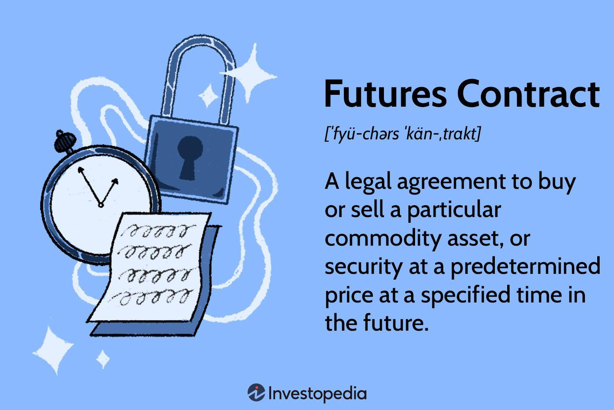

## Table of Contents

## What is a futures equivalent?

A futures equivalent is a way to measure how much a futures contract is worth compared to the actual thing it represents, like a commodity or stock. For example, if you have a futures contract for oil, the futures equivalent tells you how many barrels of oil that contract is worth. This helps traders and investors understand the size of their positions and manage their risks better.

In simple terms, the futures equivalent is calculated by looking at the contract size and the price of the futures contract. If one futures contract represents 1,000 barrels of oil and the price is $50 per barrel, then the futures equivalent value would be $50,000. This number helps people in the market make decisions about buying or selling futures contracts based on their overall investment strategy and risk tolerance.

## How does the concept of futures equivalent apply to financial markets?

In financial markets, the concept of futures equivalent helps traders and investors understand the value of their futures contracts compared to the actual assets they represent. For example, if you have a futures contract for a stock index like the S&P 500, the futures equivalent tells you how much of the index your contract is worth. This is important because it helps people figure out how much money they might make or lose, and it helps them manage how much risk they are taking on.

Using futures equivalents, traders can compare different futures contracts more easily. Let's say you are looking at futures for both gold and silver. By knowing the futures equivalent for each, you can see which one might be a better investment based on the amount of the metal each contract represents. This makes it easier to decide where to put your money and how to balance your investments across different types of assets.

## What are the key components of a futures equivalent?

The key components of a futures equivalent are the contract size and the price of the futures contract. The contract size tells you how much of the asset, like oil or gold, the futures contract represents. For example, if one futures contract for oil represents 1,000 barrels, that's the contract size. The price of the futures contract is how much you have to pay for that contract. If the price is $50 per barrel, then the futures equivalent value would be $50,000 because you're paying $50 for each of the 1,000 barrels.

Understanding these two components helps traders and investors know the real value of their futures contracts. It's like knowing how many apples you're buying when you buy a bag of apples. If you know the size of the bag and the price per apple, you can figure out the total cost. In the same way, knowing the contract size and the price of the futures contract helps you understand how much of the asset you're getting and how much it's worth. This information is crucial for making smart investment decisions and managing risk in the financial markets.

## How is the value of a futures equivalent calculated?

The value of a futures equivalent is calculated by multiplying the contract size by the price of the futures contract. The contract size is the amount of the asset, like oil or gold, that the futures contract represents. For example, if one futures contract for oil represents 1,000 barrels, that's the contract size. The price of the futures contract is how much you have to pay for each unit of the asset. If the price is $50 per barrel, you multiply 1,000 barrels by $50 to get the futures equivalent value of $50,000.

This simple calculation helps traders and investors understand the real value of their futures contracts. It's like figuring out the total cost of a bag of apples by knowing how many apples are in the bag and how much each apple costs. By knowing the contract size and the price of the futures contract, you can see how much of the asset you're getting and how much it's worth. This information is important for making smart investment choices and managing risk in the financial markets.

## What are the differences between futures equivalents and traditional futures contracts?

Futures equivalents and traditional futures contracts are related but different in how they are used and understood. A traditional futures contract is an agreement to buy or sell an asset, like oil or gold, at a set price on a specific date in the future. These contracts have a standard size and are traded on exchanges. For example, a futures contract for oil might represent 1,000 barrels of oil, and you agree to buy or sell those barrels at a certain price on a certain day.

On the other hand, a futures equivalent is not a contract itself but a way to measure the value of a futures contract compared to the actual asset it represents. It helps traders and investors understand how much of the asset a futures contract is worth. If you have a futures contract for 1,000 barrels of oil at $50 per barrel, the futures equivalent value is $50,000. This calculation helps people see the real value of their contracts and make better decisions about their investments and risks.

## Can you explain how futures equivalents are used for hedging?

Futures equivalents help people use futures contracts to protect their investments, which is called hedging. Imagine you own a farm and you grow wheat. You want to make sure you get a good price for your wheat even if the market price goes down. You can buy a futures contract that lets you sell your wheat at a set price in the future. To figure out how many contracts you need, you use the futures equivalent. If one futures contract represents 5,000 bushels of wheat and you have 10,000 bushels, you need two contracts. This way, you know you're covered for all your wheat, no matter what happens to the price.

Using futures equivalents makes hedging easier because it tells you how much of your asset the futures contract covers. This helps you decide how many contracts to buy or sell to protect your investment. For example, if you're a company that uses a lot of oil and you're worried about oil prices going up, you can use futures equivalents to figure out how many oil futures contracts you need to buy to lock in a good price. By knowing the futures equivalent, you can make sure you're not buying too many or too few contracts, which helps you manage your risk better.

## What role do futures equivalents play in portfolio management?

Futures equivalents are important for people who manage their money, like investors and financial advisors. They help these people understand how much of an asset, like gold or oil, a futures contract is worth. This information is useful when they are deciding how to spread their money across different investments. By knowing the futures equivalent, they can see if they are putting too much money into one type of asset or if they need to balance their investments better.

For example, if someone wants to invest in both gold and oil futures, they can use futures equivalents to see how much each contract is worth. This helps them decide how many contracts to buy so that their investments are balanced. If they have too much money in one type of futures contract, they might be taking on too much risk. By using futures equivalents, they can manage their portfolio better and make sure their investments are spread out in a way that makes sense for their goals and how much risk they are willing to take.

## How do futures equivalents affect market liquidity?

Futures equivalents help make the market easier to use by giving traders a clear idea of how much an asset a futures contract represents. When people know the value of what they are trading, they are more likely to trade. This means more people buying and selling, which makes the market more liquid. More liquidity means it's easier to buy or sell something quickly without changing the price too much. So, by helping traders understand the value of their contracts, futures equivalents can increase how much people are willing to trade.

This increased trading activity can also lead to more stable prices. When a lot of people are trading, small changes in supply and demand don't affect prices as much. Futures equivalents help traders see the real value of their contracts, which can make them feel more confident about trading. This confidence can lead to more people joining the market, which adds to the overall liquidity. In the end, futures equivalents play a big role in making the market easier to use and more stable for everyone involved.

## What are the regulatory considerations for trading futures equivalents?

Trading futures equivalents comes with some rules that people have to follow. These rules are set by government groups like the Commodity Futures Trading Commission (CFTC) in the United States. They make sure that everyone trading in the market is playing fair and that the market is safe for everyone. For example, they might require traders to report how many futures contracts they have, so the regulators can keep an eye on the market and stop people from trying to control prices.

Another important rule is about how much money traders need to have before they can start trading futures equivalents. This is called margin requirements. The rules say that traders have to put up a certain amount of money as a deposit, which helps make sure they can cover any losses they might have. This keeps the market stable and protects other traders from big price swings caused by people who can't pay for their trades. By following these rules, traders help keep the market fair and safe for everyone.

## How can futures equivalents be used in arbitrage strategies?

Futures equivalents are very useful for people who want to make money by taking advantage of price differences between different markets. This is called arbitrage. Imagine you see that the price of oil is different in two places. You can use futures equivalents to figure out how much oil a futures contract represents and then buy the cheaper one and sell the more expensive one. By knowing the futures equivalent, you can quickly see how many contracts you need to buy or sell to make a profit from the price difference.

For example, if the futures equivalent tells you that one oil futures contract represents 1,000 barrels and the price is lower in one market than another, you can buy the contract in the cheaper market and sell it in the more expensive market. This way, you make money from the difference in prices. Using futures equivalents helps you do this faster and more accurately because you know exactly how much oil you're dealing with in each contract. This makes arbitrage strategies easier and more effective.

## What advanced mathematical models are used to price futures equivalents?

To figure out the price of futures equivalents, people use some fancy math models. One popular model is the Black-Scholes model. It's usually used for pricing options, but it can help with futures too. The model looks at things like how much the price of the asset can change, how long until the futures contract ends, and what people expect the price to be in the future. It uses these pieces of information to come up with a fair price for the futures contract.

Another model that's used is the Binomial model. This one breaks down the time until the futures contract ends into smaller steps. At each step, it guesses if the price will go up or down. By looking at all these steps, the model can find out what the futures equivalent should be worth. Both of these models help traders and investors understand the value of their futures contracts better, which is important for making smart decisions in the market.

## How do global economic factors influence the performance of futures equivalents?

Global economic factors can have a big impact on how futures equivalents perform. Things like interest rates, inflation, and how strong different countries' economies are can change the prices of assets like oil, gold, or stocks. If interest rates go up, it might make borrowing money more expensive, which can slow down the economy and lower the prices of futures contracts. On the other hand, if a country's economy is doing well, it might make people more confident about investing, which could push up the prices of futures equivalents.

Also, events like political changes or natural disasters in other parts of the world can shake up the market. For example, if there's a big earthquake that affects oil production, it could make oil prices go up because there's less oil to go around. This would make futures equivalents for oil more valuable. Traders need to keep an eye on these global happenings because they can change the value of their futures contracts and affect their investment decisions.

## What is Understanding Futures Equivalent?

Futures equivalent is a financial concept used to determine the number of futures contracts required to mitigate the risk of an options position. This approach is crucial for traders aiming to hedge against the volatility inherent in financial markets. By aligning the risk profiles of futures and options, traders can more effectively manage their market exposure.

The foundation of the futures equivalent concept lies in its ability to create a delta-neutral position. Delta, in this context, represents the sensitivity of an option's price to changes in the price of the underlying asset. A delta-neutral position ensures that the overall portfolio does not gain or lose value with small movements in the underlying asset's price, thus effectively balancing market exposure.

To calculate the futures equivalent, one must consider the delta of the options and adjust the number of futures contracts to offset it. The formula for this calculation is:

$$
\text{Futures Equivalent} = \frac{\text{Delta of Options Position}}{\text{Delta of Futures Contract}}
$$

For instance, if the delta of the options position is 0.5 and the delta of the futures contract is 1, it would take 0.5 futures contracts to achieve a delta-neutral position. Adjusting the number of futures contracts in this manner aligns the risk sensitivity of the options and futures positions.

This concept is especially prominent in hedging strategies involving options on indices, such as the S&P 500. Traders often translate their options positions into equivalent futures positions to manage risk more effectively. By doing so, they can protect against unfavorable price movements while maintaining flexibility in their investment strategies.

In summary, understanding and applying the futures equivalent calculation is vital for traders and investors who utilize options and futures to navigate market fluctuations. It provides an efficient method for establishing delta-neutral positions and ensures that market exposure is optimally managed.

## How can Futures Trading be integrated with Algo Trading?

Combining futures trading with algorithmic strategies significantly enhances the ability to respond swiftly to market volatility. Algorithmic trading, often referred to as algo trading, utilizes sophisticated algorithms to identify and exploit trading opportunities in the futures market. This integration allows traders to employ various strategies like mean reversion, [trend following](/wiki/trend-following), and [arbitrage](/wiki/arbitrage), optimizing their trading performance.

Mean reversion strategies in algo trading operate on the principle that prices will revert to their historical mean over time. Algorithms assess historical price data to predict future price movements, executing trades when current prices deviate significantly from the historical average. This probability-driven approach can be mathematically represented as:

$$
\text{Expected Price Reversion} = \mu + \lambda (\text{Current Price} - \mu)
$$

where $\mu$ is the historical average price and $\lambda$ is a mean reversion coefficient.

Trend following, on the other hand, involves identifying and leveraging ongoing market trends. Algorithms are programmed to detect trends by analyzing market data metrics such as moving averages or relative strength indices (RSI), enabling timely entry into trending markets and effective [exit](/wiki/exit-strategy) strategies as trends wane. The coding of such strategies in Python might involve modules such as NumPy for data manipulation and TA-Lib for technical analysis:

```python
import numpy as np
import talib

# Example of trend following using moving averages
def trend_follow(price_data):
    short_window = 40
    long_window = 100

    signals = pd.DataFrame(index=price_data.index)
    signals['price'] = price_data['Close']
    signals['short_mavg'] = talib.SMA(price_data['Close'], timeperiod=short_window)
    signals['long_mavg'] = talib.SMA(price_data['Close'], timeperiod=long_window)

    signals['signal'] = 0.0
    signals['signal'][short_window:] = np.where(signals['short_mavg'][short_window:] > signals['long_mavg'][short_window:], 1.0, 0.0)   
    signals['positions'] = signals['signal'].diff()

    return signals
```

Arbitrage strategies exploit pricing inefficiencies between correlated futures contracts. Algo trading systems continuously monitor different exchanges and execute trades to capitalize on these discrepancies swiftly before they are corrected by the market.

Automated systems in algo trading provide a robust framework capable of tracking price movements continuously. These systems can analyze vast amounts of data in real-time, achieving optimal entry and exit points without the delay inherent in manual trading. The automation enhances speed, accuracy, and consistency, reducing human error and emotional influences.

In conclusion, integrating futures trading with algorithmic strategies provides a powerful approach for managing complex trading strategies. This combination allows for rapid responses to market changes, enhancing both efficiency and adaptability in a dynamic trading environment. As technology continues to grow, traders are increasingly empowered through advanced tools capable of navigating the complexities of rapidly evolving markets.

## References & Further Reading

[1]: Bergstra, J., Bardenet, R., Bengio, Y., & Kégl, B. (2011). ["Algorithms for Hyper-Parameter Optimization."](https://dl.acm.org/doi/10.5555/2986459.2986743) Advances in Neural Information Processing Systems 24.

[2]: ["Advances in Financial Machine Learning"](https://www.amazon.com/Advances-Financial-Machine-Learning-Marcos/dp/1119482089) by Marcos Lopez de Prado

[3]: ["Evidence-Based Technical Analysis: Applying the Scientific Method and Statistical Inference to Trading Signals"](https://www.amazon.com/Evidence-Based-Technical-Analysis-Scientific-Statistical/dp/0470008741) by David Aronson

[4]: ["Machine Learning for Algorithmic Trading"](https://github.com/stefan-jansen/machine-learning-for-trading) by Stefan Jansen

[5]: ["Quantitative Trading: How to Build Your Own Algorithmic Trading Business"](https://www.amazon.com/Quantitative-Trading-Build-Algorithmic-Business/dp/1119800064) by Ernest P. Chan