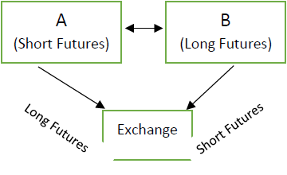

Financial markets are complex systems where participants engage in the buying and selling of financial instruments. Among the crucial components of these markets are futures exchanges. Futures exchanges are centralized platforms where futures contracts, which are agreements to buy or sell an asset at a predetermined future date for a specified price, are traded. These contracts serve as a vital tool for risk management and speculation, providing a structured environment where traders can hedge against price fluctuations in various assets, including commodities, currencies, and indices.

The emergence of algorithmic trading within these exchanges has marked a revolutionary shift in how trading is conducted. Algorithmic trading involves the use of computer algorithms to automate the process of trading based on predefined criteria. This technological advancement has accelerated the speed and efficiency of trades, allowing for the execution of complex strategies that were previously inconceivable with manual trading.



Understanding the evolution of futures exchanges and the advent of algorithmic trading is crucial to comprehending the broader dynamics of the global financial system. Futures exchanges have evolved from their inception in the mid-19th century to become integral components of contemporary finance. As they have developed, so has the sophistication and scope of trading methodologies, with algorithmic trading being the most transformative.

Algorithmic trading has radically altered the landscape of futures exchanges by introducing unparalleled speed and precision. Algorithms can analyze vast amounts of market data much faster than any human can, making decisions in milliseconds based on real-time information. This capability not only improves market efficiency but also enhances liquidity, as algorithms streamline the trading process and reduce transaction costs.

In summary, the interplay between futures exchanges and algorithmic trading represents a pivotal evolution in financial market operations. Recognizing and understanding this evolution fosters a greater comprehension of the current functionalities and potential directions of global financial markets. As algorithmic trading continues to advance, its role in shaping futures exchanges and broader financial markets will likely expand, underscoring the importance of sustainable and robust innovations in trading technologies.

## Table of Contents

## The Basics of Futures Exchanges

Futures exchanges are centralized platforms where futures contracts are bought and sold. A futures contract is a legally binding agreement to buy or sell a particular commodity or financial instrument at a predetermined price at a specified future date. These exchanges provide a structured environment for traders to hedge risks associated with price volatility, speculate on price movements, or lock in prices for future transactions. Examples of prominent futures exchanges include the Chicago Mercantile Exchange (CME) and the Intercontinental Exchange (ICE).

Futures exchanges play a pivotal role in financial markets by facilitating price discovery and providing [liquidity](/wiki/liquidity-risk-premium). They help ensure that commodities and financial instruments have transparent, market-driven price benchmarks. Additionally, they enable market participants to hedge against adverse price changes, thus managing risk more effectively. By offering a platform for speculators, these exchanges contribute to market liquidity and efficient price setting.

In contrast to stock exchanges, which are primarily venues for trading equity securities (stocks) representing ownership in companies, futures exchanges focus on derivative contracts whose values derive from underlying assets, such as commodities, currencies, or bond indices. While stock exchanges provide equity financing opportunities and dividend potential, futures exchanges primarily serve risk management and price discovery purposes.

The basic structure of a futures exchange involves several key components: 

1. **Clearing**: Clearinghouses act as intermediaries between buyers and sellers, reducing counterparty risk by guaranteeing contract fulfillment. They ensure that both parties adhere to their obligations, thereby maintaining market integrity.

2. **Settlement**: Settlement in futures exchanges can be either physical or cash-based. A physical settlement involves the actual delivery of the underlying asset, whereas cash settlement involves a cash payment based on the asset's price at contract maturity.

3. **Standardization**: Futures contracts are standardized to specify the quantity, quality, delivery time, and location of the underlying asset. This standardization allows for liquidity enhancement and more straightforward trading comparisons across different contracts.

Overall, the well-organized nature of futures exchanges, along with mechanisms like clearing and settlement, ensures that market participants can efficiently trade and manage exposure to various risks.

## Historical Background of Futures Exchange Trading

The origins of futures exchanges can be traced back to the mid-19th century with the establishment of the Chicago Board of Trade (CBOT) in 1848. The CBOT was created to facilitate the trading of grain commodities, addressing the challenges posed by unpredictable price fluctuations and the absence of standardized contracts. This innovation introduced the concept of futures contracts, which allowed farmers and merchants to lock in prices for future delivery, thereby reducing the risk associated with volatile market conditions.

Futures trading began to develop rapidly following the creation of the CBOT. Initially, trading was conducted through an open outcry system, where traders would shout bids and offers in a trading pit. This physical and highly visible method of trading was efficient for its time but had limitations in terms of speed and scalability. Throughout the late 19th and early 20th centuries, other commodities such as metals, energy products, and later financial instruments, were introduced to futures trading, leading to the establishment of additional exchanges like the New York Mercantile Exchange (NYMEX) and the Chicago Mercantile Exchange (CME).

The transition from open outcry to electronic trading marked a significant milestone in the history of futures exchanges. This shift was facilitated by technological advancements in computing and telecommunications, which enabled faster and more efficient processing of transactions. In 1992, the CME launched the Globex trading system, becoming one of the first exchanges to offer round-the-clock electronic trading. Electronic trading platforms soon started to dominate the market, allowing for higher trading volumes and increased accessibility to market participants around the world.

Throughout their history, futures exchanges have experienced several key milestones, including significant mergers and acquisitions. One of the most notable mergers occurred in 2007, when the CME acquired the CBOT, forming the CME Group. This merger created the world's largest and most diverse derivatives marketplace, further solidifying the prominence of futures exchanges in the global financial system. Other notable consolidations include the acquisition of NYMEX by CME Group in 2008, which expanded the range of products and services offered to traders and investors.

In summary, the historical evolution of futures exchange trading has been characterized by the establishment of pioneering exchanges such as the CBOT, the gradual shift from open outcry to electronic trading, and strategic mergers that have enhanced the scale and diversity of trading platforms. These developments have played a critical role in shaping the modern landscape of futures trading, reflecting the ongoing adaptation of the financial markets to technological advancements and changing economic conditions.

## Algorithmic Trading in Financial Markets

Algorithmic trading, often known as algo trading, represents a significant technological advancement in financial markets, utilizing algorithms to execute trading orders optimally by analyzing market conditions. The automation of trading strategies offers efficiency, speed, and precision, greatly enhancing the trading process compared to manual operations.

The history of [algorithmic trading](/wiki/algorithmic-trading) can be traced back to the late 1970s and early 1980s, marked by the development of electronic trading platforms. One of the major milestones was the introduction of the New York Stock Exchange's "Designated Order Turnaround" (DOT) system in 1976, which allowed small orders to be routed electronically. Following the dot-com bubble in the late 1990s, there was a significant investment in technological infrastructure, laying the foundation for the adoption of algorithmic trading in the financial sector.

The late 1990s and early 2000s witnessed notable changes, as regulatory reforms like Reg NMS (Regulation National Market System), introduced by the U.S. Securities and Exchange Commission in 2005, increased competition among trading venues, thus incentivizing traders to adopt sophisticated algorithms to achieve optimal order execution with minimal market impact. The widespread availability of high-frequency data and improvements in computational power further accelerated this adoption, enabling more complex algorithms to operate in real-time.

In futures exchanges, the integration of algorithmic trading platforms offers several advantages. Primarily, these platforms increase efficiency, allowing market participants to execute orders swiftly and at lower costs due to reduced human intervention. These platforms also enable sophisticated trading strategies that improve pricing accuracy and enhance liquidity.

Benefits of algorithmic trading include reduced transaction costs, as algorithms can match buy and sell orders at optimal prices without the need for manual intervention. Additionally, algorithmic platforms provide a broader range of trading strategies, including [arbitrage](/wiki/arbitrage) opportunities and trend-following strategies, allowing traders to capitalize on fleeting market discrepancies.

Overall, the integration of algorithmic trading in futures exchanges has revolutionized the trading landscape, providing market participants with tools to achieve more efficient and effective trade execution. As technology continues to advance, the role of algorithmic trading in financial markets is set to expand, further shaping the future of trading methodologies.

## Key Strategies in Algorithmic Trading

Algorithmic trading in financial markets has transformed the traditional approach to trading by employing predefined instructions and automated processes. Among the strategies utilized in algorithmic trading, arbitrage, [trend following](/wiki/trend-following), and mean reversion are prominent due to their effectiveness and efficiency in exploiting market conditions.

**Arbitrage Strategies**: Arbitrage involves taking advantage of price differentials in different markets or forms. This strategy capitalizes on the principle that the same asset should have the same price in separate markets. Algorithmic systems execute high-speed trades to exploit these discrepancies before they vanish. For example, if a futures contract on an asset is priced differently on two exchanges—where one is cheaper and the other more costly—an algorithm can simultaneously buy the cheaper one and sell the more expensive one, securing a risk-free profit after accounting for transaction costs. This strategy is heavily reliant on speed and precision, typically falling under high-frequency trading (HFT) methods.

**Trend Following**: Trend following strategies seek to capitalize on market momentum by assuming that assets will continue to move in the current direction. Algorithms identify trends by analyzing historical data and detecting sustained movements in price. A popular method used in trend following involves moving averages. Traders often look for situations where a short-term moving average crosses over a long-term moving average to identify potential buy or sell signals:
$$
\text{Moving Average}(P, n) = \frac{\sum_{i=1}^{n} P_i}{n}
$$
where $P$ represents the price and $n$ the period over which the average is calculated. Algorithmic systems can process vast amounts of data quickly, detecting these crossover points and executing trades accordingly. By automating this strategy, traders can react swiftly to emerging trends, optimizing entry and exit points in the futures market.

**Mean Reversion**: The mean reversion strategy is premised on the idea that asset prices and returns eventually return to their long-term mean or average. Algorithms using this strategy identify the price level from which a stock has deviated and predict when it will revert to the mean. This involves statistical calculations like standard deviation and variance to measure price volatility and average:
$$
\text{Mean Reversion Signal} = P_t - \text{Mean}(P)
$$
where $P_t$ is the current price, and $\text{Mean}(P)$ is the calculated long-term average. When prices deviate significantly from their average, an algorithm triggers trades to profit from the correction. This technique requires careful consideration of thresholds for deviation to distinguish between a temporary anomaly and a lingering trend.

**High-Frequency Trading (HFT)**: High-frequency trading enhances these strategies by utilizing sophisticated technological tools and resources to execute orders at an extremely rapid pace. Speed is the defining characteristic of HFT, enabling traders to execute a large number of orders within fractions of a second. HFT algorithms are often applied to arbitrage and trend following due to their need for rapid response times and orders of magnitude in trading volumes.

In futures trading, these algorithmic strategies provide traders with significant market advantages by ensuring actions are based on quantifiable data and analysis, rather than human emotion. Automated systems eliminate delays and errors associated with manual trading, enabling consistent and efficient execution of orders. Ultimately, these strategies enhance liquidity in futures markets, help manage risk, and offer traders the potential for substantial returns when precisely implemented.

## Impact of Algorithmic Trading on Market Dynamics

Algorithmic trading has fundamentally transformed the landscape of futures trading exchanges. As sophisticated algorithms perform rapid and intricate tasks that were traditionally executed by human traders, the structure and dynamics of these markets have evolved considerably. This section explores these changes, focusing on liquidity, market [volatility](/wiki/volatility-trading-strategies), trading volumes, and the associated risks.

Algorithmic trading, characterized by the use of pre-programmed instruction sets to execute trades at speeds substantially faster than human capabilities, has enhanced market liquidity. Increased liquidity refers to the ease with which trades can be executed without causing a significant shift in prices. Algorithms can continuously post bids and offers, thus narrowing the bid-ask spread and facilitating smoother transactions. This increased efficiency can lead to reduced transaction costs and improved price discovery, fostering a more fluid market environment.

However, the injection of high-frequency trading ([HFT](/wiki/high-frequency-trading-strategies)) strategies—a subset of algorithmic trading—brings complexity to market volatility. While HFT can stabilize prices by supplying liquidity, it also has the potential to exacerbate market volatility, particularly during market stress. Algorithms may react to minor price fluctuations by executing a series of rapid trades, sometimes resulting in significant price swings. This can contribute to a phenomenon known as "flash crashes," where market prices plummet and recover quickly. A notable example is the flash crash of May 6, 2010, when the Dow Jones Industrial Average plunged nearly 1,000 points within minutes before swiftly rebounding. 

The impact on trading volumes is another significant aspect. Algorithmic trading has led to an exponential increase in trading volumes on futures exchanges. The ability to execute numerous trades in fractions of a second contributes to higher turnover. This surge in [volume](/wiki/volume-trading-strategy) can be beneficial, enhancing the depth and resilience of markets. However, it also necessitates robust infrastructure and regulatory oversight to manage this new level of activity and to ensure orderly trading scenarios.

Despite the advantages, algorithmic trading is not without risks. Among the potential issues is the occurrence of algorithmic errors, where flawed or unintended code logic can result in disruptive market activities. Additionally, the sheer speed and volume of transactions by algorithmic systems can sometimes overwhelm existing trading infrastructures, leading to delays or breakdowns in trade execution and settlement processes.

To mitigate risks associated with algorithmic trading, exchanges and regulators have implemented various measures. Circuit breakers, for instance, are automated trading halts designed to curb excessive volatility by pausing trading temporarily when a significant market move is detected. Moreover, stressing the importance of implementing rigorous testing and monitoring protocols for trading algorithms cannot be overstated. Regular [backtesting](/wiki/backtesting) of algorithms using historical data, real-time oversight, and the capacity to intervene manually if necessary are crucial components of a robust risk management framework.

In conclusion, while algorithmic trading has brought substantial improvements in liquidity and efficiency to futures trading exchanges, it presents challenges that require careful management. Addressing the balance between exploiting the advantages of algorithmic systems and mitigating their potential risks is essential to maintaining stable and fair market conditions.

## Migration from Manual to Automated Futures Trading

The shift from traditional manual trading to automated systems in futures exchanges marks a transformative period in financial markets. This transition has been driven by technological advancements, the increasing complexity of markets, and the need for speed and efficiency in trading operations.

Initially, futures trading was characterized by manual processes, where traders relied on open outcry systems to negotiate and execute trades. This method, while effective in its time, had inherent limitations concerning speed, accuracy, and the ability to process large volumes of trades. Over time, technological innovations paved the way for electronic trading platforms, which facilitated the transition to automated trading systems.

Automated trading offers numerous opportunities for brokers and independent traders by leveraging algorithmic strategies to execute trades based on predefined criteria. One of the primary advantages is the capability to execute trades at significantly higher speeds than manual trading, thus capturing fleeting market opportunities. Automation also allows for the analysis of vast amounts of data in real-time, providing deeper insights into market trends and enabling more informed decision-making.

For brokers, automated trading systems reduce the dependency on human intervention, minimizing human errors and enhancing operational efficiency. These systems also allow brokers to serve a larger number of clients simultaneously, thereby scaling their operations without a proportional increase in costs.

Independent traders benefit from automated trading through enhanced capabilities to implement complex trading strategies that would be challenging to execute manually. Strategies such as arbitrage, trend following, and spread trading can be executed with precision and speed, offering traders a competitive edge in the market. Python, a popular programming language in the finance industry, is often used to develop custom trading algorithms due to its robust libraries and ease of use. A simple example of a trading strategy using Python might involve the use of a basic moving average crossover strategy:

```python
import pandas as pd

def moving_average_crossover(prices, short_window=40, long_window=100):
    signals = pd.DataFrame(index=prices.index)
    signals['signal'] = 0.0

    signals['short_mavg'] = prices['close'].rolling(window=short_window, min_periods=1, center=False).mean()
    signals['long_mavg'] = prices['close'].rolling(window=long_window, min_periods=1, center=False).mean()

    signals['signal'][short_window:] = np.where(signals['short_mavg'][short_window:] > signals['long_mavg'][short_window:], 1.0, 0.0)
    signals['positions'] = signals['signal'].diff()

    return signals
```

Despite these advantages, the migration to automated trading systems presents certain challenges. Market participants must invest in sophisticated technology and infrastructure, which may represent a significant upfront cost. Furthermore, the reliance on complex algorithms introduces systemic risks, as programming errors or unforeseen market conditions can lead to significant financial losses.

Future trends in algorithmic trading suggest a continuing evolution towards more sophisticated and intelligent systems. Machine learning and [artificial intelligence](/wiki/ai-artificial-intelligence) are poised to further revolutionize trading strategies, enabling systems to adjust to market conditions dynamically. These technologies can enhance predictive capabilities, thereby improving the accuracy and effectiveness of trading algorithms.

Moreover, as markets become increasingly interconnected and data-driven, there is an anticipated growth in the integration of big data analytics and cloud computing in trading practices. These trends are likely to enhance the speed and processing power available to traders, facilitating more complex and profitable trading strategies.

In conclusion, the migration from manual to automated futures trading signifies a pivotal change in how markets operate. While automated systems offer significant enhancements in efficiency and capability, they also necessitate careful consideration of associated risks and responsibilities. The future of algorithmic trading will likely be characterized by continued technological advances, offering new opportunities for market participants who can effectively adapt to these changes.

## Case Studies and Real-World Applications

Algorithmic trading has played a crucial role in the development and functioning of futures exchanges worldwide, offering numerous real-world applications and case studies that highlight its impact. One prominent example is the use of algorithmic trading strategies by large investment firms and hedge funds to manage and optimize their futures trading activities. These strategies allow traders to execute complex trading processes at speeds and efficiencies unattainable through manual trading.

### Real-World Examples

One notable example of successful algorithmic trading application is Renaissance Technologies, particularly its Medallion Fund. Renaissance Technologies employs sophisticated quantitative models to identify market patterns and execute trades across various asset classes, including futures. Its success demonstrates how algorithmic trading can generate significant profits by leveraging large datasets and advanced analytics.

Similarly, [quantitative trading](/wiki/quantitative-trading) firms such as Citadel and Two Sigma have implemented algorithmic trading strategies that allow them to execute high-frequency trades in futures markets. These firms employ sophisticated mathematical models and high-performance computing systems to gain a competitive edge, capitalizing on market inefficiencies and liquidity imbalances.

### Algorithmic Trading in Financial Crises

Algorithmic trading’s role during financial crises has been both significant and contentious. The Flash Crash of May 6, 2010, serves as a striking example. On that day, the Dow Jones Industrial Average dropped nearly 1,000 points within minutes, partly attributed to algorithmic trading algorithms executing a vast number of orders in an already volatile market. This event highlighted the potential for algorithmic trading to exacerbate market instability, leading to a push for regulators to rethink how these trading systems are managed and monitored.

### Lessons Learned and Improvements

The experiences from such market events have informed several improvements in algorithmic trading strategies and systems. Key lessons include the necessity of implementing robust risk management protocols and deploying circuit breakers to avert similar incidents. Strategies are now designed to incorporate smart order routing and dynamic stop-loss mechanisms to mitigate risks associated with rapid market movements.

Moreover, continuous advancements in artificial intelligence and [machine learning](/wiki/machine-learning) offer opportunities to evolve algorithmic trading strategies. By training models on extensive historical datasets, traders can improve pattern recognition and adaptability to market dynamics, fostering the development of more resilient trading algorithms.

In conclusion, while algorithmic trading applications have vastly improved efficiency and performance in futures exchanges, they also introduce complexities and risks that require careful management. The integration of modern technologies and consistent oversight forms the foundation for harnessing the full potential of algorithmic trading while safeguarding market stability.

## Conclusion

The evolution of futures exchange trading and algorithmic trading has significantly transformed the financial markets, enhancing efficiency and accessibility. Initially rooted in physical trading floors, futures exchanges have embraced electronic trading platforms influenced substantially by algorithmic trading. This transformation has introduced automated systems capable of executing trades at speeds and volumes far exceeding human capabilities.

Algorithmic trading's continuous development retains the potential to further optimize financial markets. Its advanced data analysis capabilities can enhance market predictions, leading to more informed trading decisions. Additionally, these algorithms can adapt to changing market conditions, making the trading process more resilient and dynamic. As technology progresses, algorithmic systems may integrate further with artificial intelligence and machine learning, opening new frontiers in trading strategies.

However, integrating algorithmic trading into financial systems necessitates robust risk management practices. The speed and volume of trades executed algorithmically can exacerbate market volatility and lead to systemic risks. Therefore, implementing risk management mechanisms, such as circuit breakers and real-time monitoring systems, is crucial to mitigate potential negative impacts.

In conclusion, while algorithmic trading presents significant advantages, it also demands careful regulation and oversight to safeguard market integrity. As the financial landscape continues to evolve, stakeholders must prioritize developing and refining strategies to manage the inherent risks of algorithmic trading effectively. This balanced approach will ensure that financial markets derive the maximum benefit from technological innovations while maintaining stability and trust.

## References & Further Reading

[1]: Bergstra, J., Bardenet, R., Bengio, Y., & Kégl, B. (2011). ["Algorithms for Hyper-Parameter Optimization."](https://papers.nips.cc/paper/4443-algorithms-for-hyper-parameter-optimization) Advances in Neural Information Processing Systems 24.

[2]: ["Advances in Financial Machine Learning"](https://www.amazon.com/Advances-Financial-Machine-Learning-Marcos/dp/1119482089) by Marcos Lopez de Prado

[3]: ["Evidence-Based Technical Analysis: Applying the Scientific Method and Statistical Inference to Trading Signals"](https://www.amazon.com/Evidence-Based-Technical-Analysis-Scientific-Statistical/dp/0470008741) by David Aronson

[4]: ["Machine Learning for Algorithmic Trading"](https://github.com/stefan-jansen/machine-learning-for-trading) by Stefan Jansen

[5]: ["Quantitative Trading: How to Build Your Own Algorithmic Trading Business"](https://www.amazon.com/Quantitative-Trading-Build-Algorithmic-Business/dp/1119800064) by Ernest P. Chan

[6]: Harris, L. (2003). ["Trading and Exchanges: Market Microstructure for Practitioners."](https://academic.oup.com/book/52292) Oxford University Press.

[7]: Aldridge, I. (2013). ["High-Frequency Trading: A Practical Guide to Algorithmic Strategies and Trading Systems."](https://www.ahmetbeyefendi.com/wp-content/uploads/2020/07/High-Frequency-Trading-Irene-Aldridge.pdf) Wiley Trading Series.

[8]: Budish, E., Cramton, P., & Shim, J. (2015). ["The High-Frequency Trading Arms Race: Frequent Batch Auctions as a Market Design Response."](https://academic.oup.com/qje/article/130/4/1547/1916146) The American Economic Review, 105(7), 3110-3144.