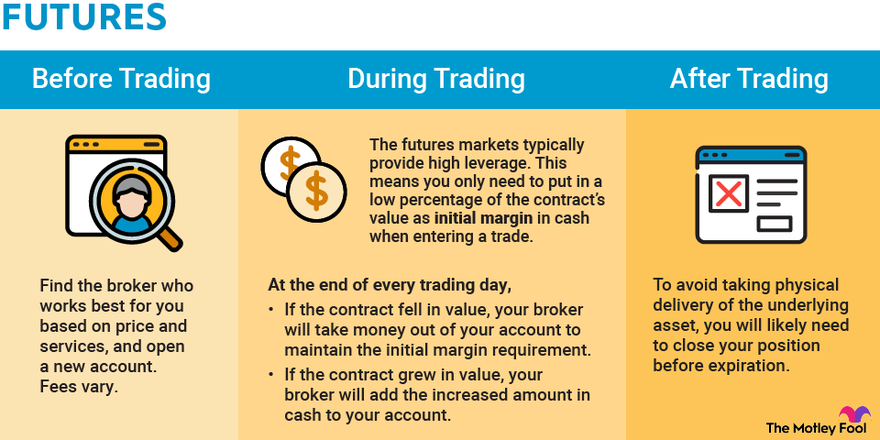

## Table of Contents

## What are futures and how do they work?

Futures are contracts where you agree to buy or sell something at a set price on a specific date in the future. This "something" can be anything from oil to wheat, or even financial products like stock indexes. People use futures to manage risk or to try and make money. For example, a farmer might use a future to lock in a price for their crops before they're even harvested, protecting them from price drops.

When you trade futures, you don't pay the full amount right away. Instead, you put down a smaller amount called a margin, which is like a deposit. If the price of the thing you're trading goes up or down, you'll have to add more money to your margin or you might get some back. This can happen every day, and it's called marking to market. Trading futures can be risky because prices can change a lot, but it can also be a way to make money if you guess the price changes correctly.

## What are the basic types of futures contracts?

There are two main types of futures contracts: commodity futures and financial futures. Commodity futures are for things you can touch, like corn, oil, or gold. Farmers, miners, and companies that need these things use commodity futures to make sure they can buy or sell them at a good price later on. For example, an airline might use oil futures to lock in fuel prices.

Financial futures are for things you can't touch, like stock market indexes, interest rates, or currencies. These are used by investors and big companies to manage money risks. For instance, if you think the stock market will go up, you might buy a future on a stock index. If you're right, you could make money without having to buy all the stocks in that index.

Both types of futures help people plan for the future and protect against price changes. They're traded on special markets where buyers and sellers come together to agree on prices for things that will be delivered later.

## How can beginners start investing in futures?

To start investing in futures, beginners should first learn the basics. Futures are agreements to buy or sell something at a set price in the future. They can be for things like corn, oil, or even stock indexes. It's important to understand how these contracts work and the risks involved. You can learn from [books](/wiki/algo-trading-books), online courses, or by talking to people who know about futures. Once you feel ready, you'll need to find a broker who can help you trade futures. Make sure to choose a broker that is right for you and that you understand their fees.

After choosing a broker, you'll need to open an account and put some money in it. This money is called margin, and it's like a deposit that lets you trade futures. When you start trading, remember that futures can be risky because prices can change a lot. It's a good idea to start small and only invest money you can afford to lose. As you get more comfortable, you can try different strategies and learn more about the markets. Always keep learning and be ready to adjust your plans as you go.

## What are the risks associated with futures trading?

Futures trading can be risky because prices can change a lot. If you guess wrong about which way prices will go, you could lose money. When you trade futures, you only put down a small amount of money called margin, but you could end up losing more than that if the price moves against you. This is called leverage, and it can make your wins bigger but also your losses.

Another risk is that futures contracts have an expiration date. If you don't close your position before the contract expires, you might have to buy or sell the actual thing the contract is for, like corn or oil. This can be a problem if you don't want or can't handle the physical delivery. Also, futures markets can be less liquid than stock markets, which means it might be harder to buy or sell when you want to. This can make it harder to get out of a bad trade quickly.

To manage these risks, it's important to learn as much as you can about futures trading and start with small amounts of money. Always have a plan for what you'll do if things go wrong, and be ready to change your plan as you learn more. Remember, futures trading isn't for everyone, and it's okay to take your time to decide if it's right for you.

## What strategies can be used to manage risk in futures trading?

One way to manage risk in futures trading is by using stop-loss orders. A stop-loss order is like a safety net that automatically closes your trade if the price moves against you by a certain amount. This can help limit your losses if the market goes the wrong way. Another strategy is to diversify your trades. Instead of putting all your money into one type of futures contract, you can spread it out across different kinds of futures, like oil, corn, and stock indexes. This way, if one trade goes bad, the others might still do well and help balance out your losses.

Another important strategy is to only use money you can afford to lose. Futures trading can be risky, so it's smart to only trade with money that won't hurt you if it's gone. Also, you can manage risk by not using too much leverage. Leverage lets you control a big position with a small amount of money, but it can also make your losses bigger. By keeping your leverage low, you can reduce the risk of losing a lot of money quickly. It's also a good idea to keep learning and stay updated on the markets, so you can make better decisions and adjust your strategies as needed.

## How do leverage and margin work in futures trading?

In futures trading, leverage lets you control a big position with just a small amount of money. This small amount is called margin, and it's like a deposit that you put down to open a futures contract. For example, if you want to trade a futures contract worth $100,000, you might only need to put down $5,000 as margin. This means you're using leverage of 20 to 1, because you're controlling $100,000 worth of the contract with just $5,000. Leverage can make your profits bigger if the price moves in your favor, but it can also make your losses bigger if the price moves against you.

Margin works by acting as a safety net for the exchange. When you open a futures position, you need to have enough money in your account to cover the margin requirement. If the price of the futures contract moves against you, you might need to add more money to your account to keep your position open. This is called a margin call. If you can't meet the margin call, your position might be closed automatically to limit the risk to the exchange. So, while margin and leverage can help you trade bigger positions with less money, they also come with the risk of bigger losses if things don't go your way.

## What are the key differences between futures and options?

Futures and options are both ways to trade things in the future, but they work differently. A futures contract is an agreement to buy or sell something at a set price on a specific date. When you trade futures, you have to follow through with the contract unless you close your position before it expires. This means if you're holding a futures contract until the end, you might have to take delivery of the actual thing, like oil or corn. Futures use leverage, so you only need to put down a small amount of money called margin, but this can also make your losses bigger if the price moves against you.

Options, on the other hand, give you the right but not the obligation to buy or sell something at a set price before a certain date. If you buy an option, you can choose to use it or let it expire without doing anything. This makes options less risky than futures because you don't have to follow through if the price moves against you. You pay a price called a premium to buy an option, and if the option expires worthless, you lose the premium. Options can be used for different strategies, like making money if the price stays the same or goes down, which you can't do as easily with futures.

## How can technical analysis be applied to futures trading?

Technical analysis is a way to look at past prices and trading volumes to guess where the price of a futures contract might go next. Traders use charts and special tools to find patterns in the data. For example, they might look for support and resistance levels, which are like floors and ceilings for prices. If the price keeps bouncing off a certain level, that could be a support. If it keeps getting stopped at a certain level, that could be resistance. Traders also use things like moving averages, which smooth out price data over time, to see if the price is trending up or down. By spotting these patterns and trends, traders can make better guesses about when to buy or sell futures contracts.

Another part of technical analysis is using indicators like the Relative Strength Index (RSI) or the Moving Average Convergence Divergence (MACD). These indicators help traders see if a futures contract is overbought or oversold, which means it might be due for a price change. For example, if the RSI is very high, it might mean the price has gone up too fast and could soon go down. Traders can use this information to decide when to enter or [exit](/wiki/exit-strategy) a trade. While technical analysis can be helpful, it's not perfect and should be used along with other ways of looking at the market, like understanding the news and events that might affect the price of the futures contract.

## What are the tax implications of trading futures?

When you trade futures, you have to pay taxes on any money you make. The good news is that profits from futures trading are usually taxed at a lower rate than regular income. In the United States, these profits are taxed at a rate of 60% long-term capital gains and 40% short-term capital gains, no matter how long you held the futures contract. This means you might pay less in taxes than if you had a regular job or made money from stocks.

On the other hand, you can't use losses from futures trading to reduce your regular income taxes. If you lose money trading futures, you can only use those losses to offset other gains from futures or other types of trading. This is different from stocks, where you can use losses to lower your taxable income. It's a good idea to keep good records of all your trades and talk to a tax professional to make sure you're doing everything right and taking advantage of all the tax rules that apply to futures trading.

## How do global economic events impact futures markets?

Global economic events can have a big impact on futures markets. When something big happens in the world, like a war or a big change in a country's economy, it can make the prices of things like oil, corn, or stock indexes go up or down. For example, if there's a war in a country that produces a lot of oil, the price of oil futures might go up because people are worried about getting enough oil. Or, if a big country like the United States changes its interest rates, it can affect the prices of financial futures like stock indexes because it changes how much it costs to borrow money.

These events can also make the futures markets more unpredictable. When there's a lot of uncertainty, traders might be more cautious and trade less, which can make it harder to buy or sell futures contracts. On the other hand, some traders might see these events as chances to make money by guessing how prices will change. So, while global economic events can create risks for futures traders, they can also create opportunities if traders can predict how the markets will react.

## What advanced strategies can experienced traders use in futures trading?

Experienced traders in futures markets often use a strategy called spread trading. This means they buy one futures contract and sell another at the same time. The idea is to make money from the difference in price between the two contracts. For example, a trader might buy a futures contract for oil that expires in three months and sell a contract for oil that expires in six months. If the price difference between these two contracts changes in the trader's favor, they can make money. Spread trading can be less risky than just buying or selling one futures contract because it's less affected by big price swings in the market.

Another advanced strategy is called [algorithmic trading](/wiki/algorithmic-trading). This is when traders use computer programs to buy and sell futures contracts automatically based on certain rules. These rules can be based on things like price patterns, trading [volume](/wiki/volume-trading-strategy), or even news events. Algorithmic trading can help traders make decisions faster and more accurately than they could on their own. It can also help them trade more often and take advantage of small price changes that might be hard to spot without a computer. While algorithmic trading can be very powerful, it also needs a lot of knowledge about both trading and computer programming to use it well.

## How can algorithmic trading be utilized in the futures market?

Algorithmic trading in the futures market means using computer programs to buy and sell futures contracts automatically. Traders set up rules for the computer to follow, like buying a contract if the price goes above a certain level or selling if the trading volume changes a lot. These rules can be based on things like price patterns, how many people are trading, or even news events. By using a computer, traders can make decisions faster and more accurately than they could on their own. This can help them trade more often and take advantage of small price changes that might be hard to spot without a computer.

While algorithmic trading can be very powerful, it also needs a lot of knowledge about both trading and computer programming to use it well. Traders have to be good at writing code and understanding how the futures market works. They also need to keep an eye on their algorithms to make sure they're working right and adjust them if the market changes. Even though it can be tricky to set up, algorithmic trading can help experienced traders make more money and manage their risks better in the futures market.

## References & Further Reading

[1]: Bank for International Settlements (2018). ["High-frequency trading in the foreign exchange market."](https://www.bis.org/publ/arpdf/ar2018e.htm)

[2]: Marcos Lopez de Prado (2018). ["Advances in Financial Machine Learning."](https://www.amazon.com/Advances-Financial-Machine-Learning-Marcos/dp/1119482089)

[3]: David Aronson (2006). ["Evidence-Based Technical Analysis: Applying the Scientific Method and Statistical Inference to Trading Signals."](https://www.amazon.com/Evidence-Based-Technical-Analysis-Scientific-Statistical/dp/0470008741)

[4]: Stefan Jansen (2020). ["Machine Learning for Algorithmic Trading: Predictive models to extract signals from market and alternative data for systematic trading strategies with Python."](https://github.com/stefan-jansen/machine-learning-for-trading)

[5]: Ernest P. Chan (2009). ["Quantitative Trading: How to Build Your Own Algorithmic Trading Business."](https://www.amazon.com/Quantitative-Trading-Build-Algorithmic-Business/dp/0470284889)