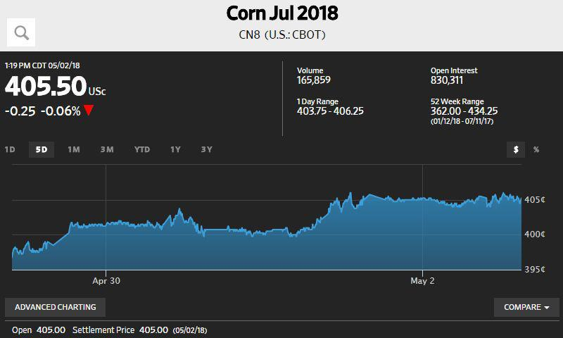

Investing in futures involves entering into contracts to buy or sell an asset at a predetermined price at a specified future date. These financial instruments are integral to hedging risk and speculating on price movements. The evolving landscape of futures trading has increasingly incorporated algorithmic trading, which leverages computer algorithms to expedite trading decisions, enhancing speed and precision.

Algorithmic trading, or algo trading, has gained popularity in financial markets due to its efficiency, capability to process vast datasets, and potential to minimize human biases. A study by the Bank for International Settlements (BIS) highlighted that algorithmic trading accounts for a significant portion of trading volumes in markets such as commodities and financial futures. This increasing prevalence underscores the need for investors to understand how algorithms can optimize their futures trading strategies.

Futures trading offers opportunities, such as the potential for high returns due to leverage. However, it also presents risks, including market volatility and margin calls. Algorithmic trading can mitigate some risks by enabling rapid execution and analysis, though it also introduces its own challenges, such as over-reliance on technology and algorithm errors.

This guide is designed to provide a comprehensive overview of investing in futures with the assistance of algorithms. It aims to equip novice traders with foundational knowledge, while offering seasoned investors advanced insights into leveraging algorithmic strategies effectively. Whether you are new to futures trading or experienced but new to algorithmic methods, this guide offers valuable perspectives and strategies to enhance your trading acumen using the power of technology.

## Table of Contents

## What are Futures?

Futures contracts are standardized legal agreements to buy or sell a particular commodity or financial instrument at a predetermined price at a specified time in the future. These contracts detail the quantity and quality of the underlying asset, settling on specific future dates, thus facilitating trading on futures exchanges. Futures serve various purposes, notably in hedging against price changes and speculative ventures, allowing participants to anticipate and act on future price movements.

Key features of futures contracts include leverage, margin, and standardization. Leverage in futures trading allows traders to control large positions with relatively small amounts of capital. This amplifies potential returns but also increases risk, as small market changes can yield significant impacts. The margin in futures trading refers to the initial deposit required to enter and maintain a position, functioning as a security buffer against potential losses. Standardized contracts ensure uniformity in terms of quantity, quality, delivery location, and date, thereby facilitating liquidity and ease of trading on exchanges.

Futures play an integral role in both hedging and speculation. Hedgers use futures contracts to lock in prices, thus mitigating the risk of price fluctuations, which is especially useful for farmers or manufacturers dealing with volatile commodities. For instance, an agricultural producer might use futures to secure a selling price for a crop, avoiding adverse market shifts. Conversely, speculators seek to profit by anticipating market trends and buying or selling contracts accordingly, assuming the risk in hopes of financial gain.

Examples of common futures markets include commodities such as oil, gold, and agricultural products; indices like the S&P 500; and currencies, which allow traders to hedge or speculate on the value of foreign exchange rates. Each market offers unique opportunities and risks, influenced by factors ranging from geopolitical events to macroeconomic indicators.

Futures trading differs from other forms of derivative trading, such as options or swaps, in several ways. Unlike options, which confer the right but not the obligation to buy or sell an asset, futures obligate both parties to fulfill the contract terms at expiration. Additionally, futures contracts are typically more liquid and transparent due to their standardized nature and centralized exchange trading, unlike over-the-counter derivatives such as swaps. This centralization contributes to more efficient price discovery and reduced counterparty risk, as exchanges often guarantee contract performance.

In conclusion, futures contracts are essential tools in financial markets, providing mechanisms for price locking and speculation, thereby contributing to market stability and [liquidity](/wiki/liquidity-risk-premium). Understanding their features and applications can greatly assist traders and investors in achieving their financial objectives.

 to Algorithmic Trading

Algorithmic trading, often referred to as algo trading, involves the use of computer algorithms to automate the execution of trades based on predefined criteria. This form of trading capitalizes on the ability of computers to process large volumes of market data quickly and make decisions with speed and precision, often executing trades in fractions of a second. Algo trading is prevalent across various financial markets, including futures, where rapid decision-making and execution can be paramount to success.

Algorithms execute trades by leveraging technological advances that allow for the near-instantaneous analysis of market conditions. They do this with unparalleled efficiency as they can continuously monitor market data, execute trades, and react to changes without the need for human intervention, thereby minimizing the impact of emotional decision-making on trading outcomes. This capability of identifying and acting upon market trends within seconds is a linchpin of modern [algorithmic trading](/wiki/algorithmic-trading) strategies.

Various strategies are employed within algorithmic trading, particularly in the futures markets. These strategies include:

1. **Trend Following**: This strategy seeks to capitalize on emerging trends by leveraging algorithms that assess momentum and price direction. Algorithms may use moving averages or other statistical measures to predict potential changes in market direction.

2. **Market-Making**: Involves placing buy and sell orders simultaneously to capture the spread between them. Market-making algorithms help enhance market liquidity and can generate profit from the bid-ask spread.

3. **Arbitrage**: This strategy exploits price differentials between markets or instruments. Algorithms quickly identify arbitrage opportunities and execute trades to capitalize on price discrepancies before they disappear.

4. **Statistical Arbitrage**: Relies on quantitative models to identify price inefficiencies across multiple securities. Algorithms perform complex statistical analyses to generate trading signals based on historical price patterns.

While algorithmic trading offers numerous benefits such as increased trade execution speed and reduced transaction costs, it also presents several challenges:

- **Pros**:
  - Efficiency in trade execution reduces latency and slippage.
  - The ability to process vast datasets quickly aids in comprehensive market analysis.
  - Reduces emotional bias in trading decisions, leading to more consistent strategies.

- **Cons**:
  - Over-reliance on technology can be a risk; technical failures can lead to significant losses.
  - Algorithms can react to market anomalies with unintended, adverse results.
  - Regulatory scrutiny is heightened as automated systems can contribute to market volatility.

Algorithmic trading in futures markets remains a powerful tool for traders seeking to harness technology for gaining a competitive advantage. However, success in this domain requires not only robust algorithms and infrastructure but also a deep understanding of market dynamics and careful risk management.

## Setting Up for Success in Futures Algorithmic Trading

Choosing the right trading platform and software is crucial for success in futures algorithmic trading. A platform must offer robust performance, reliability, and user-friendly interfaces. Key features to consider include access to real-time data feeds, automated trading capabilities, and comprehensive [backtesting](/wiki/backtesting) tools. Popular platforms like MetaTrader or NinjaTrader offer extensive libraries and community support, aiding in the development and execution of trading algorithms.

Understanding market mechanics and data is essential. It involves familiarization with how futures markets operate, the role of leverage and margin, and market dynamics such as liquidity and [volatility](/wiki/volatility-trading-strategies). Data analysis is fundamental, as algorithms rely on accurate, high-frequency data to make informed trading decisions. Historical data helps identify patterns and correlations that can be leveraged in trading strategies.

Developing a solid trading strategy requires a blend of theoretical knowledge and practical application. Traders must define clear goals, identify market conditions that align with their strategy, and establish rigorous entry and [exit](/wiki/exit-strategy) rules. Backtesting is a vital component, allowing traders to evaluate their strategies against historical data without risking capital. Successful backtesting requires an understanding of statistical measures, including Sharpe ratio and maximum drawdown, to assess risk and return profiles.

Risk management techniques are indispensable for algo traders. Position sizing, stop-loss orders, and diversification help mitigate risks associated with market volatility. Algorithms may incorporate adaptive measures, adjusting trade size or frequency based on risk assessments. Implementing robust risk management protocols safeguards capital and enhances long-term stability.

Key factors to consider in futures algorithmic trading include costs, technology, and market conditions. Trading costs, such as commissions and slippage, directly impact profitability and must be factored into strategy development. Technology is a critical enabler, as low-latency infrastructure can significantly enhance execution efficiency. Traders must also remain adaptable to evolving market conditions, continuously refining strategies to align with changing trends and regulatory developments.

In conclusion, establishing a successful framework for futures algorithmic trading involves selecting appropriate trading platforms, gaining a deep understanding of market mechanics, developing and testing a well-defined strategy, and implementing comprehensive risk management techniques. Considering all relevant factors, including costs and technology, ensures a robust approach to navigating futures markets effectively.

## Key Algorithmic Trading Strategies for Futures

Algorithmic trading strategies are essential tools for navigating the complexity of futures markets. This section will explore four popular strategies: [trend following](/wiki/trend-following), market-making, [arbitrage](/wiki/arbitrage), and [statistical arbitrage](/wiki/statistical-arbitrage), examining their application in futures trading, providing successful examples, guidance on strategy selection, and addressing the challenges inherent in their implementation.

### Trend Following

Trend following is a strategy that aims to capitalize on the persistent directional movement of an asset's price. Traders using this strategy identify trends by analyzing historical price data, using technical indicators such as moving averages or the relative strength index (RSI).

In futures trading, this strategy is particularly effective due to the high volatility and liquidity of futures markets. Traders establish positions in the direction of the prevailing trend, maintaining these positions until the trend shows signs of reversing.

A simple form of trend following might involve using a moving average crossover system, where a buy signal is generated when a short-term moving average crosses above a long-term moving average, and a sell signal when it crosses below.

**Example:**
An example of successful trend following is the approach used by Commodity Trading Advisors (CTAs) who leverage futures contracts across various asset classes, such as commodities and financial indices, to follow trends.

### Market-Making

Market-making involves providing liquidity to the market by submitting buy and sell limit orders for a financial instrument. The aim is to earn the bid-ask spread repeatedly, which requires high-speed execution and an understanding of [order book](/wiki/order-book-trading-strategies) dynamics.

In futures markets, market-makers profit by capturing the difference between the bid price and the ask price, while managing the risks associated with holding inventory. Market-makers use algorithms to dynamically adjust their orders in response to changing market conditions.

**Example:**
Large financial institutions and dedicated trading firms engage in market-making on futures exchanges, contributing to deep and liquid markets. They utilize sophisticated algorithms capable of processing vast amounts of data to maintain competitive bid and ask prices.

### Arbitrage

Arbitrage is a strategy that seeks to exploit price discrepancies of the same asset or equivalent assets across different markets or instruments. In futures trading, arbitrage can occur when the futures price diverges from the spot price or when prices differ across trading venues.

Arbitrage strategies often involve high-frequency trading ([HFT](/wiki/high-frequency-trading-strategies)) systems to quickly identify and act upon transient price inefficiencies before they disappear.

**Example:**
Intermarket arbitrage is a common approach where traders simultaneously buy and sell contracts in different markets to lock in risk-free profits when pricing anomalies are detected.

### Statistical Arbitrage

Statistical arbitrage (StatArb) employs quantitative models to identify statistical mispricings of one or more assets based on historical relationships. Unlike traditional arbitrage, which looks at absolute mispricing, statistical arbitrage focuses on probabilistic pricing discrepancies.

Traders develop models using statistical and [machine learning](/wiki/machine-learning) techniques to forecast asset price movements, mean reversion, or cointegrated relationships between futures contracts.

**Example:**
Pairs trading is a form of StatArb where traders take long and short positions in a pair of historically correlated futures contracts, betting that their price relationship will converge over time.

### Strategy Selection

Choosing the best algorithmic trading strategy depends on several factors, including trading objectives, market conditions, and risk tolerance. Traders must align their strategy with their specific trading goals—whether targeting short-term profits or long-term growth.

- **Market Volatility:** Strategies like trend following may perform better in volatile markets, whereas arbitrage strategies might thrive in more stable conditions.
- **Risk Tolerance:** Market-making and arbitrage strategies, which often involve leverage, require a higher risk appetite compared to more conservative approaches like trend following.
- **Technical Expertise:** Algorithms for statistical arbitrage require sophisticated knowledge of quantitative analysis and access to advanced computing resources.

### Challenges and Considerations

Implementing algorithmic trading strategies in futures markets presents several challenges:

- **Speed and Latency:** High-frequency strategies require fast execution and minimal latency, necessitating investment in advanced technology and infrastructure.
- **Data Quality:** Reliable and high-resolution market data is crucial for developing and backtesting trading models.
- **Risk Management:** Proper risk management techniques must be in place to mitigate both market and systemic risks inherent in leveraging futures.
- **Regulatory Compliance:** Traders must ensure their strategies comply with relevant regulations and are transparent in their operations.

Given these considerations, successful algorithmic trading in futures markets requires continuous adaptation and technological sophistication, aligned with a comprehensive understanding of market dynamics and risks.

## Regulatory and Ethical Considerations in Algo Trading

Algorithmic trading in futures markets operates within a complex regulatory landscape designed to ensure market integrity, protect investors, and promote transparency. The regulatory environment continuously evolves to address new technological advancements and trading practices.

### Overview of the Regulatory Landscape

Algorithmic trading is subject to a range of regulations, which vary across jurisdictions but generally aim to prevent systemic risks and promote fair trading practices. In the United States, regulatory bodies such as the Commodity Futures Trading Commission (CFTC) and the Securities and Exchange Commission (SEC) oversee algorithmic trading activities. The CFTC regulates futures and options markets, while the SEC is responsible for securities markets.

In Europe, the Markets in Financial Instruments Directive II (MiFID II) plays a key role in overseeing algorithmic trading. MiFID II requires firms engaging in algorithmic trading to have effective risk controls and contingency plans to prevent potential market disruptions.

### Key Regulations Impacting Futures and Algorithmic Trading

1. **Risk Management Controls**: Regulators mandate that trading firms implement risk management systems to monitor and control trading risk, including pre-trade and post-trade risk assessments and real-time monitoring of trading activity.

2. **Market Access**: Direct Market Access (DMA) providers must ensure that their clients adhere to regulatory requirements. For example, broker-dealers are required to maintain robust controls and practices to manage the risks associated with providing DMA.

3. **Fairness and Transparency**: Regulations such as the Regulation National Market System (Reg NMS) in the U.S. and the MiFID II in Europe mandate transparency in order execution and pricing, requiring that market participants receive the best possible execution on their trades.

4. **Technological Standards**: Firms are required to meet specific technological standards for their trading systems. This includes latency monitoring and prevention of erroneous trades through "kill-switches" that terminate trading in case of system failures.

### Ethical Considerations and the Importance of Compliance

Ethical trading practices are crucial in maintaining investor trust and market integrity. Compliance with regulatory standards is not merely a legal obligation but also a marker of ethical responsibility for trading firms. Key ethical considerations include:

- **Market Manipulation**: Algorithmic trading is susceptible to practices like spoofing and layering, where traders place large orders they intend to cancel to mislead the market. Regulators impose severe penalties for such practices.

- **Transparency**: Transparency in operations and clear communication with clients and stakeholders are essential for maintaining ethical standards.

Firms employ compliance officers and sophisticated software to ensure adherence to regulatory requirements and ethical practices.

### Risks of Market Manipulation and Ways to Mitigate Them

Market manipulation remains a persistent concern in algorithmic trading. Regulators use surveillance systems to identify and investigate suspicious trading patterns. Firms can mitigate these risks through:

- **Robust Surveillance Systems**: Implementing advanced market surveillance systems that can detect unusual trading patterns and flag them for further analysis.

- **Training and Awareness**: Regular training for traders and compliance staff on ethical trading practices and the latest regulatory requirements is vital.

- **Internal Controls**: Establishing strict internal control mechanisms and regular audits to ensure compliance with regulatory and ethical standards.

### Resources for Staying Informed About Regulatory Changes

Staying updated with regulatory changes is crucial for compliance and strategic planning. Key resources include:

- **Regulatory Websites**: Websites of the CFTC, SEC, and ESMA provide comprehensive information on ongoing regulatory changes and updates.

- **Professional Associations**: Membership in organizations such as the Futures Industry Association (FIA) can provide insights and updates on regulatory changes and industry best practices.

- **Continuing Education**: Regular webinars, workshops, and courses offered by industry experts and regulatory bodies help in keeping abreast of new developments.

- **News and Publications**: Financial news outlets and specialized regulatory publications provide timely updates and analysis on changes in the regulatory landscape.

By integrating regulatory compliance and ethical considerations into their operational framework, algorithmic traders in the futures market can ensure fair practice, maintain market integrity, and build trust with their clients and the broader financial community.

## Future of Algorithmic Trading in Futures Markets

The future of algorithmic trading in futures markets is being significantly shaped by a series of trends and innovations. One of the primary trends is the rapid pace of technological advancements that continue to transform trading algorithms. These advancements facilitate faster data processing and offer enhanced computational power, enabling more sophisticated and complex trading strategies. High-frequency trading (HFT), for instance, has become more prevalent due to improvements in hardware and software, allowing algorithms to execute trades in microseconds, thereby capitalizing on ephemeral market inefficiencies.

Artificial intelligence (AI) and machine learning (ML) are progressively playing pivotal roles in futures trading. These technologies enable the development of algorithms that can learn and adapt to market changes by analyzing vast datasets. This adaptability is crucial for identifying patterns and trends that may not be immediately apparent through traditional analytical methods. The incorporation of AI and ML can lead to more robust predictive models and decision-making processes, potentially improving the profitability and reliability of trading strategies.

Market evolution and trading opportunities are predicted to be influenced by several factors, including the growing adoption of decentralized finance (DeFi) and blockchain technologies. These innovations could lead to more transparent and efficient markets, offering new trading instruments and asset classes within the futures domain. Additionally, global regulatory changes and economic shifts will continue to create new opportunities for futures traders as markets adapt to these developments.

Continuous learning and adaptation are critical for traders as they navigate this dynamic environment. The rapid pace of technological and market changes necessitates that traders remain informed about the latest developments and continuously refine their strategies. Engaging in regular backtesting of algorithms on historical data, monitoring performance, and staying abreast of innovative tools and techniques are essential practices for maintaining a competitive edge in futures trading. Traders who embrace these practices are better positioned to leverage new opportunities and mitigate risks in the evolving landscape of algorithmic trading.

## Conclusion

In conclusion, this guide has explored the intricacies of investing in futures using algorithmic trading. We've delved into the definition and mechanics of futures contracts, touching on essential features such as leverage, margin, and the standardized nature of these financial instruments. Algorithmic trading's role in executing trades with speed, precision, and efficiency was highlighted, alongside a discussion of various strategies like trend following and arbitrage, which are crucial in the futures market.

Algorithmic trading in futures presents significant potential, offering opportunities for enhanced decision-making and execution speed. Traders who leverage technology stand to benefit from greater accuracy and efficiency, enabling them to capitalize on market trends and opportunities more effectively. However, it's critical to remain vigilant about the risks associated with complex algorithms and market dynamics.

For those looking to embark on or enhance their journey into algorithmic futures trading, starting with a robust understanding of trading strategies and computational tools is advised. Continuous learning, adaptation to emerging trends, and staying informed about regulatory and market changes are vital for success. As technology evolves, incorporating machine learning and AI into trading algorithms presents exciting possibilities, further emphasizing the importance of adaptability.

Resources for continued development in futures algorithmic trading include online courses, financial literature, webinars, and industry-specific publications. These can provide insights and skills necessary to thrive in this rapidly changing financial landscape. Embracing technology while maintaining a strong foundation in trading principles can position traders for future success.

## References & Further Reading

[1]: Bank for International Settlements (2018). ["High-frequency trading in the foreign exchange market."](https://www.bis.org/publ/arpdf/ar2018e.htm)

[2]: Marcos Lopez de Prado (2018). ["Advances in Financial Machine Learning."](https://www.amazon.com/Advances-Financial-Machine-Learning-Marcos/dp/1119482089)

[3]: David Aronson (2006). ["Evidence-Based Technical Analysis: Applying the Scientific Method and Statistical Inference to Trading Signals."](https://www.amazon.com/Evidence-Based-Technical-Analysis-Scientific-Statistical/dp/0470008741)

[4]: Stefan Jansen (2020). ["Machine Learning for Algorithmic Trading: Predictive models to extract signals from market and alternative data for systematic trading strategies with Python."](https://github.com/stefan-jansen/machine-learning-for-trading)

[5]: Ernest P. Chan (2009). ["Quantitative Trading: How to Build Your Own Algorithmic Trading Business."](https://www.amazon.com/Quantitative-Trading-Build-Algorithmic-Business/dp/0470284889)