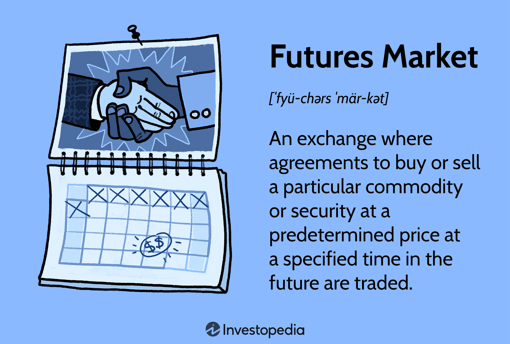

## Table of Contents

## What is a futures market?

A futures market is a place where people buy and sell contracts for things they will get later. These things can be anything from farm products like wheat and corn, to financial products like stocks and currencies. When someone buys a futures contract, they agree to buy the product at a certain price on a specific future date. This helps farmers, businesses, and investors plan ahead because they know what price they will pay or receive in the future.

People use futures markets to protect themselves from price changes. For example, a farmer might sell a futures contract for their wheat to make sure they get a good price, even if the market price goes down later. On the other hand, a bakery might buy a futures contract to lock in a price for wheat, so they know their costs won't go up unexpectedly. This way, both the farmer and the bakery can manage their risks better.

## How does a futures contract work?

A futures contract is like a promise between two people. One person agrees to buy something, like wheat or oil, at a set price on a specific future date. The other person agrees to sell that thing at the same price on the same date. This agreement is made on a special market called a futures exchange. The price they agree on is called the futures price, and it's based on what people think the price will be in the future.

People use futures contracts to protect themselves from price changes. For example, a farmer might want to make sure they get a good price for their wheat, even if the market price drops later. So, they can sell a futures contract now, locking in today's price for their wheat that they will deliver later. On the other hand, a company that needs wheat might buy a futures contract to make sure they don't have to pay more if the price goes up. This way, both the farmer and the company know what to expect and can plan better.

## What are the main types of futures contracts?

Futures contracts come in different types, mainly based on what they are for. The most common types are commodity futures and financial futures. Commodity futures are for things you can touch, like wheat, oil, gold, and livestock. People who work with these things, like farmers and miners, use these contracts to protect themselves from price changes. For example, a farmer might use a wheat futures contract to lock in a good price for their crop before they even plant it.

Financial futures are for things you can't touch, like stocks, bonds, and currencies. These are used by banks, investors, and companies to manage risks related to money. For example, an investor might use a stock index futures contract to bet on how the stock market will do in the future. Another type of financial future is an [interest rate](/wiki/interest-rate-trading-strategies) future, which helps banks and borrowers manage the risk of interest rate changes.

There are also other types of futures, like energy futures and metal futures, but they fit into the commodity category. Energy futures include contracts for things like [crude oil](/wiki/crude-oil) and natural gas, while metal futures include contracts for things like copper and aluminum. Each type of futures contract helps different people in different industries manage their risks and plan for the future.

## Who are the participants in the futures market?

The futures market has many different people and groups who take part in it. There are hedgers, who use futures contracts to protect themselves from price changes. For example, farmers and companies that need raw materials are often hedgers. They want to make sure they get a good price for what they sell or buy, so they use futures contracts to lock in prices ahead of time. This helps them plan better and avoid big surprises.

There are also speculators in the futures market. These are people who buy and sell futures contracts to try to make money from price changes. They don't actually want the thing being traded, like wheat or oil. Instead, they are betting on whether the price will go up or down. If they guess right, they can make a profit, but if they guess wrong, they can lose money. Speculators help make the market more active and can help set prices by showing what people think will happen in the future.

Lastly, there are arbitrageurs, who look for price differences between different markets or contracts. They buy in one place and sell in another to make a profit from the difference. This helps keep prices more even across different markets. All these participants together make the futures market work, helping to manage risk and set prices for the future.

## What is the role of futures exchanges?

Futures exchanges are like big marketplaces where people can buy and sell futures contracts. They make sure that everyone follows the rules and that trading is fair. When someone wants to buy or sell a futures contract, they go to the exchange. The exchange helps match buyers and sellers, so the trade can happen smoothly. They also keep track of all the trades and make sure that everyone gets what they agreed on when the time comes.

The exchanges also help set the prices for futures contracts. They do this by letting lots of people trade and see what others are willing to pay. This helps create a fair price that everyone can trust. Plus, futures exchanges make sure that people can trust the market. They do this by making sure that everyone who trades has enough money to cover their trades, so no one is left hanging if prices go the wrong way. This way, the futures market can work well and help people manage their risks.

## How is the price of a futures contract determined?

The price of a futures contract is set by what people think it will be worth in the future. This is called the futures price. It's based on what everyone trading on the futures exchange thinks the price will be when the contract is supposed to be finished. If lots of people think the price will go up, the futures price will be higher. If lots of people think the price will go down, the futures price will be lower. This guessing game happens every day as people buy and sell contracts, and the price changes based on what everyone thinks.

The futures exchange helps make sure the price is fair by letting lots of people trade. When many people are buying and selling, it's easier to find a price that everyone agrees on. The exchange also keeps track of all the trades and makes sure that the price stays fair. Things like news, weather, and big events can also change what people think the price will be, so the futures price can go up and down a lot. This way, the futures market can help people plan for the future by giving them a good guess about what prices might be.

## What are the risks associated with trading futures?

Trading futures can be risky because the prices can change a lot. If you buy a futures contract and the price goes down, you could lose money. This is called market risk. People who trade futures need to be ready for big changes in prices and have a plan for what to do if things don't go their way. It's not like buying something at a store where the price stays the same; with futures, the price can move up and down every day.

Another risk is called leverage risk. When you trade futures, you usually don't have to pay the full price of the contract right away. You only need to put down a small amount of money, called margin. This means you can control a big contract with just a little money. But if the price goes against you, you might have to put in more money quickly, or you could lose more than you started with. This makes futures trading exciting but also very risky, so it's important to understand these risks before you start trading.

## How can one hedge using futures contracts?

Hedging with futures contracts is like buying insurance for your business. Imagine you're a farmer who grows wheat. You want to make sure you get a good price for your wheat, even if the market price drops before you sell it. So, you can sell a futures contract for your wheat at today's price. This means you agree to sell your wheat at that price on a future date, no matter what happens to the market price. This way, you're protected if the price goes down, because you've locked in a good price ahead of time.

On the other hand, if you're a company that needs to buy wheat, you can use futures contracts to protect yourself from price increases. You can buy a futures contract at today's price, agreeing to buy wheat at that price on a future date. If the market price goes up, you're safe because you've already locked in a lower price. This helps you plan your costs better and avoid surprises. Hedging with futures contracts helps both buyers and sellers manage their risks and feel more secure about the future.

## What is the difference between futures and options?

Futures and options are both ways to buy and sell things in the future, but they work a bit differently. A futures contract is an agreement where you must buy or sell something at a set price on a certain date. For example, if you buy a futures contract for wheat, you have to buy the wheat when the contract says, no matter what the market price is at that time. This can be good for planning because you know exactly what you'll pay or get. But it can also be risky because if the price goes against you, you could lose money.

Options, on the other hand, give you a choice. When you buy an option, you get the right, but not the obligation, to buy or sell something at a set price before a certain date. For example, if you buy a call option for wheat, you can choose to buy the wheat at the set price if you want to, but you don't have to. This can be less risky than futures because you can walk away if the price goes against you. But options usually cost money upfront, called a premium, which you don't get back if you don't use the option.

## How do regulations affect the futures market?

Regulations are like rules that help keep the futures market fair and safe for everyone. They make sure that people who trade futures follow the same rules and don't cheat. For example, regulators check that everyone has enough money to cover their trades, so if prices go the wrong way, no one is left with big losses. They also make sure that the futures exchanges are doing their job right, like matching buyers and sellers fairly and keeping track of all the trades. This helps people trust the market and feel safe when they trade.

Regulations can also change how the futures market works. Sometimes, new rules can make it harder or easier to trade futures. For example, if the rules get stricter, it might be harder for some people to trade because they need more money upfront. But stricter rules can also make the market safer by reducing the chance of big problems. On the other hand, if the rules get looser, more people might start trading, but it could also mean more risk. So, regulations are important because they help balance safety and opportunity in the futures market.

## What are some advanced trading strategies used in the futures market?

One advanced trading strategy in the futures market is called spread trading. This is when a trader buys one futures contract and sells another at the same time. They do this to take advantage of the price difference between the two contracts. For example, a trader might buy a futures contract for wheat that will be delivered in March and sell a futures contract for wheat that will be delivered in June. If the price difference between these two contracts changes in a way the trader expected, they can make money. This strategy can be less risky than just buying or selling one contract because it's based on the difference between two prices, not just one.

Another strategy is called [scalping](/wiki/gamma-scalping). Scalpers are traders who try to make small profits from very quick trades. They might buy a futures contract and then sell it a few minutes later if the price goes up just a little bit. They do this over and over again throughout the day, hoping that the small profits add up. Scalping needs a lot of focus and quick thinking because the trader has to watch the market closely and act fast. It can be exciting but also stressful because the profits are small, and the market can change quickly.

A third strategy is called [trend following](/wiki/trend-following). Trend followers look for patterns in the market and try to ride those trends to make money. For example, if they see that the price of oil has been going up for a few weeks, they might buy an oil futures contract, hoping the price will keep going up. They use tools like charts and indicators to help them spot these trends. Trend following can be less stressful than scalping because it's based on longer-term movements, but it still needs careful watching and a good understanding of the market.

## How has technology impacted the futures market?

Technology has made a big difference in the futures market. It's easier and faster to trade now because of computers and the internet. Traders can buy and sell futures contracts from anywhere, not just at a special place like they used to. They can use special programs to help them make decisions and see what's happening in the market right away. This makes trading quicker and can help people make money faster, but it also means the market can change very fast.

Another way technology has changed the futures market is by making it more open to everyone. Before, only big companies and rich people could trade futures because it was hard to get into the market. Now, anyone with a computer and some money can start trading. This has made the market bigger and more exciting, but it also means more people are trying to make money, so it can be more competitive. Technology has made the futures market more efficient and accessible, but it's also made it more challenging and fast-paced.

## References & Further Reading

[1]: Raphael A. Espinoza, J. D. Mateo, & R. H. Grau. (2011). ["Handbook of Futures Markets,"](https://www.imf.org/external/pubs/ft/wp/2010/wp1076.pdf) Palgrave Macmillan.

[2]: De Prado, Marcos López. (2018). ["Advances in Financial Machine Learning."](https://www.amazon.com/Advances-Financial-Machine-Learning-Marcos/dp/1119482089) Wiley.

[3]: Chan, Ernest P. (2008). ["Quantitative Trading: How to Build Your Own Algorithmic Trading Business,"](https://github.com/ftvision/quant_trading_echan_book) John Wiley & Sons.

[4]: Narang, Rishi K. (2009). ["Inside the Black Box: The Simple Truth About Quantitative Trading,"](https://onlinelibrary.wiley.com/doi/book/10.1002/9781118267738) Wiley.

[5]: Stefan Jansen. (2018). ["Machine Learning for Algorithmic Trading,"](https://github.com/stefan-jansen/machine-learning-for-trading) Packt Publishing.

[6]: Ian Goodfellow, Yoshua Bengio, & Aaron Courville. (2016). ["Deep Learning."](https://www.deeplearningbook.org/) MIT Press.

[7]: Tsay, Ruey S. (2010). ["Analysis of Financial Time Series,"](https://onlinelibrary.wiley.com/doi/book/10.1002/9780470644560) Wiley.

[8]: David Aronson. (2007). ["Evidence-Based Technical Analysis: Applying the Scientific Method and Statistical Inference to Trading Signals."](https://books.google.com/books/about/Evidence_Based_Technical_Analysis.html?id=MeoJAQAAMAAJ) Wiley.

[9]: Christopher G. Rude & John W. Labuszewski. (2006). ["Trading and Exchanges: Market Microstructure for Practitioners."](https://academic.oup.com/book/52292) Oxford University Press.