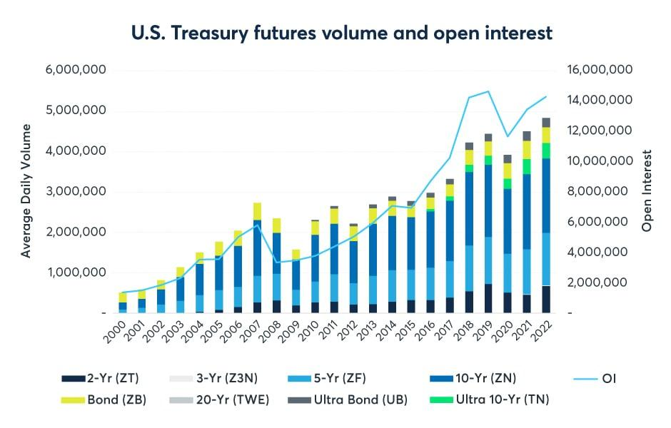

## Table of Contents

## What are futures markets and how do they function?

Futures markets are places where people buy and sell contracts for things they will get later. These things can be anything from farm products like wheat and corn, to financial products like stock indexes or currencies. When someone buys a futures contract, they agree to buy the product at a certain price on a specific future date. The seller agrees to provide the product at that price on that date. This helps farmers, businesses, and investors plan for the future because they know what price they will pay or receive.

Futures markets work by bringing together people who want to buy and sell these contracts. They use a special place called an exchange, where all the trading happens. The price of the futures contract can go up or down based on what people think will happen in the future. If more people want to buy than sell, the price goes up. If more people want to sell than buy, the price goes down. People who trade futures can make money if they guess the price changes correctly, but they can also lose money if they guess wrong. This makes futures markets both a way to manage risk and a way to take risks.

## What is the history of futures markets in the United States?

The history of futures markets in the United States started in the mid-19th century. Farmers and merchants in Chicago needed a way to manage the risks of price changes for their crops. In 1848, they created the Chicago Board of Trade (CBOT), which was the first organized futures market. They started trading futures contracts for grains like wheat and corn. This helped farmers know what price they would get for their crops in the future, and it helped merchants plan their buying and selling.

Over time, futures markets grew and changed. In 1874, the Chicago Produce Exchange was created, and it later became the Chicago Mercantile Exchange (CME). The CME started trading futures for things like butter and eggs, and later added financial products like currencies and stock indexes. By the 20th century, futures markets were not just for farm products but for many different things. Today, the CBOT and CME have merged into the CME Group, and they are still important places for trading futures in the United States.

## What are the main types of futures contracts traded in the U.S.?

In the U.S., people trade many different types of futures contracts. The most common ones are for farm products like wheat, corn, and soybeans. These contracts help farmers and food companies plan for the future because they know what price they will get or pay for their crops. Another big group of futures contracts is for energy products like oil and natural gas. These help oil companies and energy users manage the risk of price changes in the energy market.

There are also futures contracts for metals like gold, silver, and copper. These are important for mining companies and manufacturers who use these metals. Financial futures are another big category. These include contracts for stock indexes like the S&P 500, interest rates, and currencies. People use these to bet on or protect against changes in the stock market, interest rates, or exchange rates. All these types of futures help people manage risk and plan for the future.

## Who are the key participants in the U.S. futures markets?

The key participants in the U.S. futures markets are farmers, businesses, and investors. Farmers use futures markets to lock in prices for their crops before they harvest them. This helps them know how much money they will make and plan their finances. Businesses, like food companies, use futures to make sure they can buy the things they need at a set price. This helps them avoid big price changes that could hurt their profits.

Investors and speculators are also important in the futures markets. Investors use futures to protect their other investments from price changes. For example, if they own a lot of stocks, they might buy stock index futures to protect against a drop in the stock market. Speculators, on the other hand, try to make money by guessing which way prices will go. They don't plan to actually buy or sell the product; they just want to make money from the price changes. Both groups help make the futures markets more active and liquid, which means it's easier for everyone to buy and sell.

## How are futures prices determined in the U.S. markets?

Futures prices in the U.S. markets are determined by what people think will happen in the future. When more people want to buy a futures contract than sell it, the price goes up. This can happen if people think the price of the product, like wheat or oil, will be higher in the future. On the other hand, if more people want to sell than buy, the price goes down. This might happen if people think the price of the product will be lower later.

The price is also affected by things like the weather, news, and changes in the economy. For example, if there's a drought that might hurt the wheat crop, people might think wheat will be more expensive in the future, so the price of wheat futures goes up. Or if there's good news about the economy, people might think stock prices will go up, so the price of stock index futures goes up too. All these things together help decide the price of futures contracts.

## What are the major futures exchanges in the United States?

The biggest futures exchange in the United States is the CME Group. It was made when the Chicago Mercantile Exchange and the Chicago Board of Trade joined together. They trade futures for many things like farm products, energy, metals, and financial products. The CME Group is very important because it helps people all over the world buy and sell futures.

Another important futures exchange is the Intercontinental Exchange (ICE). It started in Atlanta and now trades futures for things like energy, farm products, and financial products too. The ICE helps people manage the risks of price changes in these markets. Both the CME Group and the ICE are key places for trading futures in the U.S.

## What role does the Commodity Futures Trading Commission (CFTC) play in regulating U.S. futures markets?

The Commodity Futures Trading Commission (CFTC) is a government group in the United States that makes sure the futures markets work fairly and honestly. They watch over the trading of futures contracts to stop people from cheating or doing things that are not allowed. The CFTC makes rules that everyone in the futures markets must follow, and they check to see if people are following these rules. If someone breaks the rules, the CFTC can punish them.

The CFTC also helps keep the futures markets safe for everyone. They work to stop fraud and other bad things that could hurt people who trade futures. They also make sure that the information people get about futures is true and not misleading. By doing all these things, the CFTC helps make the futures markets a good place for farmers, businesses, and investors to manage their risks and plan for the future.

## How can individuals and institutions use futures for hedging and speculation?

Individuals and institutions use futures for hedging to protect themselves from price changes. For example, a farmer might sell wheat futures to lock in a price for their crop before they harvest it. This way, if the price of wheat goes down, the farmer still gets the price they agreed on in the futures contract. A company that needs to buy a lot of oil might buy oil futures to make sure they can buy oil at a set price in the future. This helps them avoid big losses if the price of oil goes up a lot. Hedging with futures helps people and businesses plan better because they know what prices they will get or pay.

Speculation is when people use futures to try to make money from price changes. They buy futures if they think the price of the product will go up, and they sell futures if they think the price will go down. For example, an investor might buy gold futures if they think the price of gold will rise. If they are right, they can sell the futures later at a higher price and make a profit. But if they are wrong, they could lose money. Speculators help make the futures markets more active because they are always buying and selling, but it's risky because they can lose money if they guess wrong.

## What are the risks associated with trading futures in the U.S.?

Trading futures in the U.S. can be risky because prices can change a lot. If you buy a futures contract and the price goes down, you could lose money. This is called market risk. Futures also use something called leverage, which means you can control a big contract with a small amount of money. This can make your profits bigger, but it can also make your losses bigger. If the price moves against you, you might have to put in more money to keep your position, and if you can't, you could lose everything you put in.

Another risk is called [liquidity](/wiki/liquidity-risk-premium) risk. This happens when it's hard to buy or sell a futures contract because not many people are trading it. If you need to get out of a position quickly and there aren't many buyers or sellers, you might have to sell at a bad price. There's also the risk of not understanding the market well. Futures can be complicated, and if you don't know what you're doing, you could make bad decisions and lose money. It's important to learn about futures and maybe get help from a professional before you start trading.

## How have technological advancements impacted U.S. futures markets?

Technological advancements have changed the U.S. futures markets a lot. Before, people had to go to a place like the Chicago Board of Trade to trade futures. They would shout and use hand signals to buy and sell. Now, with computers and the internet, people can trade futures from anywhere. This is called electronic trading. It's faster and easier, and more people can join in. The big exchanges like the CME Group and the Intercontinental Exchange use electronic systems to match buyers and sellers quickly.

These changes have also made the markets more open and fair. With electronic trading, everyone can see the prices and trade at the same time. This helps stop people from cheating or getting special deals. Also, new technology has made it easier to use computers to trade futures. People can write programs that trade for them based on rules they set. This is called [algorithmic trading](/wiki/algorithmic-trading). It can help people trade better and faster, but it can also make the market move quickly and sometimes in unexpected ways.

## What are some notable trends and developments in the U.S. futures markets in recent years?

In recent years, one big trend in the U.S. futures markets is the growth of electronic trading. More and more people are using computers and the internet to buy and sell futures. This has made trading faster and easier for everyone. It also means that the markets are open to more people from all over the world. Another trend is the rise of algorithmic trading, where computers use special programs to trade futures based on rules set by people. This can help traders make quick decisions and take advantage of small price changes, but it can also make the market move very fast and sometimes in unexpected ways.

Another development is the introduction of new types of futures contracts. For example, there are now futures for things like cryptocurrencies like Bitcoin. This shows how the futures markets are trying to keep up with new kinds of investments. Also, there's been more focus on environmental, social, and governance ([ESG](/wiki/esg-investing)) issues. Some futures contracts now help people invest in ways that are good for the environment or society. These trends show that the futures markets are always changing and trying to meet the needs of different kinds of traders.

## How do global economic factors influence U.S. futures markets?

Global economic factors can have a big impact on U.S. futures markets. When something important happens in the world economy, like a change in interest rates or a big event like a war, it can change what people think will happen to prices in the future. For example, if there's a problem in a country that makes a lot of oil, people might think the price of oil will go up. This can make the price of oil futures in the U.S. go up too. Also, if the economy in other countries is doing well, it might make people want to buy more U.S. products, which can affect futures prices for things like wheat or soybeans.

Another way global economic factors influence U.S. futures markets is through currency changes. If the value of the U.S. dollar goes up or down compared to other currencies, it can change how much people want to buy or sell U.S. futures. For example, if the dollar gets weaker, it might make U.S. products cheaper for people in other countries, which can make the prices of futures for those products go up. On the other hand, if the dollar gets stronger, U.S. products might become more expensive for foreigners, which can make futures prices go down. All these global factors together help decide what happens in the U.S. futures markets.

## References & Further Reading

[1]: Aldridge, I. (2013). ["High-Frequency Trading: A Practical Guide to Algorithmic Strategies and Trading Systems, Second Edition."](https://onlinelibrary.wiley.com/doi/pdf/10.1002/9781119203803.fmatter) Wiley.

[2]: MacKenzie, D., & Spears, T. (2014). ["The Formulaic Revolution in Futures Trading."](https://journals.sagepub.com/doi/abs/10.1177/0306312713517157) Pacific-Basin Finance Journal.

[3]: Hull, J. C. (2008). ["Options, Futures, and Other Derivatives, 7th Edition."](https://www.semanticscholar.org/paper/Options%2C-Futures%2C-and-Other-Derivatives-Hull/89bdee500c8623864fc9eb7a471546aa713acc44) Pearson.

[4]: Bank for International Settlements. (2011). ["High-frequency trading in the foreign exchange market."](https://www.bis.org/publ/mktc05.pdf) BIS Markets Committee.

[5]: Hendershott, T., Jones, C. M., & Menkveld, A. J. (2011). ["Does Algorithmic Trading Improve Liquidity?"](https://onlinelibrary.wiley.com/doi/full/10.1111/j.1540-6261.2010.01624.x) The Journal of Finance, 66(1), 1-33.

[6]: Securities and Exchange Commission. (2010). ["Findings regarding the market events of May 6, 2010."](https://www.sec.gov/news/studies/2010/marketevents-report.pdf) Report of the Staffs of the CFTC and SEC.

[7]: Cartea, A., Jaimungal, S., & Penalva, J. (2015). ["Algorithmic and High-Frequency Trading."](https://assets.cambridge.org/97811070/91146/frontmatter/9781107091146_frontmatter.pdf) Cambridge University Press.