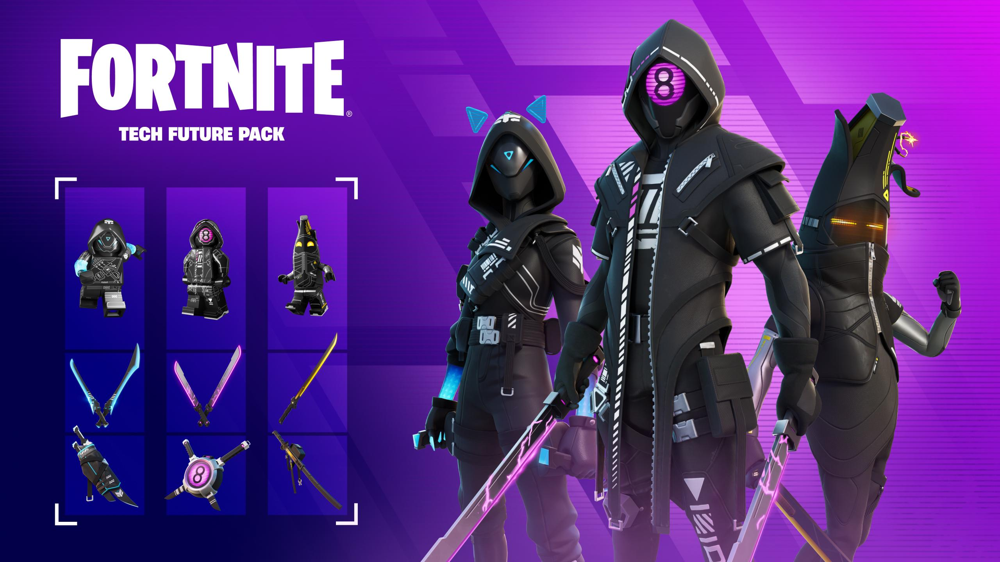

## Table of Contents

## What is a Futures Pack?

A Futures Pack is a type of financial product that lets people buy or sell a certain amount of a commodity or financial instrument at a set price in the future. It's like making a deal now for something you will get or give later. These packs are often used by farmers, businesses, and investors to manage risks related to price changes. For example, a farmer might use a Futures Pack to lock in a price for their crops before they are harvested.

Futures Packs are traded on special markets called futures exchanges. These markets help make sure that the buying and selling of Futures Packs is fair and organized. When someone buys a Futures Pack, they are agreeing to buy the commodity or financial instrument at the set price when the contract ends. If the price goes up, they can make a profit. If the price goes down, they might lose money. This makes Futures Packs a useful tool for planning and managing financial risks.

## How does a Futures Pack differ from individual futures contracts?

A Futures Pack is a bundle of futures contracts that are grouped together for easier trading. When you buy a Futures Pack, you are actually buying several individual futures contracts at once. This can be helpful because it simplifies the process of trading and can save on transaction costs. For example, if you want to trade a large amount of a commodity, buying a Futures Pack might be easier than buying each futures contract one by one.

Individual futures contracts, on the other hand, are single agreements to buy or sell a specific amount of a commodity or financial instrument at a set price in the future. They are more flexible because you can choose exactly how many contracts you want to trade. This can be useful if you need to trade a very specific amount or if you want to spread out your trades over time. However, trading individual futures contracts can be more complicated and might involve more transaction costs compared to trading a Futures Pack.

## What are the benefits of trading Futures Packs?

Trading Futures Packs can save you time and money. When you trade a Futures Pack, you are buying several futures contracts at once. This means you don't have to make lots of separate trades, which can be a hassle. Also, because you are trading in bulk, the costs for each trade can be lower. This makes it easier and cheaper to trade large amounts of commodities or financial instruments.

Futures Packs can also help you manage your risks better. By buying a Futures Pack, you can lock in prices for a big amount of a commodity all at once. This can be really helpful if you are a farmer or a business that needs to plan ahead. It lets you know what prices you will get or pay in the future, which can help you make better decisions and avoid big losses if prices change a lot.

## What are the risks associated with Futures Packs?

Trading Futures Packs can be risky because the prices of commodities or financial instruments can change a lot. If the price goes down after you buy a Futures Pack, you could lose money. This is because you agreed to buy at a higher price than what the market is now offering. Also, Futures Packs are usually big bundles, so if the market moves against you, your losses can be bigger than if you were trading just one futures contract.

Another risk is that Futures Packs can be hard to understand if you are new to trading. They are complex financial products, and if you don't know how they work, you might make mistakes. It's important to learn about them and maybe get advice from experts before you start trading. This can help you avoid making big mistakes that could cost you a lot of money.

## How can someone start trading Futures Packs?

To start trading Futures Packs, you first need to open an account with a brokerage firm that offers futures trading. You can do this online or by visiting their office. Once your account is set up, you will need to deposit money into it. This money is called margin, and it's used to cover any potential losses from your trades. Make sure you understand how much margin you need because it can be different for each Futures Pack.

After setting up your account and depositing margin, you can start looking at the Futures Packs available on the futures exchange. You can use the trading platform provided by your brokerage to place orders. It's a good idea to start with smaller trades to get a feel for how Futures Packs work. Also, it might be helpful to learn from experts or take a [course](/wiki/best-algorithmic-trading-courses) on futures trading to understand the risks and strategies better.

## What are the common types of Futures Packs available in the market?

Futures Packs come in different types, depending on what you want to trade. Some common ones are based on commodities like oil, gold, and agricultural products like wheat and corn. These are popular because they help farmers and businesses manage the risks of price changes in these goods. For example, an oil company might use an oil Futures Pack to lock in a price for future oil purchases.

There are also Futures Packs for financial instruments like stock indices, interest rates, and currencies. These are used by investors and financial institutions to hedge against market movements or to speculate on future price changes. For instance, a bank might use an [interest rate](/wiki/interest-rate-trading-strategies) Futures Pack to protect against changes in interest rates that could affect their loans and investments.

Overall, the type of Futures Pack you choose depends on your needs and what you are trying to achieve. Whether it's protecting against price swings in commodities or managing financial risks, there's a Futures Pack designed to help you do that.

## What strategies can be used when trading Futures Packs?

When trading Futures Packs, one common strategy is called hedging. This means you use Futures Packs to protect yourself from price changes. For example, if you are a farmer and you want to make sure you get a good price for your crops, you can buy a Futures Pack to lock in that price. This way, even if the market price goes down, you are safe because you already have a deal at a better price. Hedging helps you avoid big losses and plan your business better.

Another strategy is called speculation. This is when you try to make money by guessing how prices will change. If you think the price of oil will go up, you might buy an oil Futures Pack now and sell it later at a higher price. This can be risky because if you guess wrong, you could lose money. But if you guess right, you can make a good profit. Speculation is more about taking chances to make money, rather than protecting yourself from losses.

A third strategy is called spreading. This involves buying and selling different Futures Packs at the same time to take advantage of price differences. For example, you might buy a Futures Pack for wheat that expires in June and sell a Futures Pack for wheat that expires in December. If the price difference between these two contracts changes in your favor, you can make money. Spreading can be less risky than speculation because it's based on the relationship between different contracts, not just on guessing one price.

## How do market conditions affect Futures Packs?

Market conditions can have a big impact on Futures Packs. When the market is doing well and prices are going up, the value of your Futures Packs can go up too. This is good if you bought them to make money from price increases. But if the market is not doing well and prices are going down, the value of your Futures Packs can drop. This can be bad if you were hoping to sell them at a higher price later. Things like news about the economy, changes in supply and demand, and even big events like natural disasters can all affect the market and, in turn, the prices of Futures Packs.

Understanding how market conditions affect Futures Packs is important for making good trading decisions. If you see that the market is likely to go up because of good economic news, you might want to buy Futures Packs to take advantage of that. On the other hand, if you think the market might go down because of bad news, you might want to sell your Futures Packs or use them to protect yourself from losses. Keeping an eye on market conditions and understanding how they can change the value of Futures Packs can help you trade smarter and manage your risks better.

## What are the key factors to consider when choosing a Futures Pack?

When choosing a Futures Pack, it's important to think about what you want to achieve. Are you trying to protect yourself from price changes, or do you want to make money by guessing how prices will move? If you're a farmer or a business that needs to plan ahead, you might want a Futures Pack that helps you lock in a good price for your products. On the other hand, if you're an investor looking to make money, you might choose a Futures Pack based on a commodity or financial instrument that you think will go up in value.

Another thing to consider is how much risk you are willing to take. Futures Packs can be risky because prices can change a lot. You need to think about how much money you can afford to lose and choose a Futures Pack that fits your risk level. Also, it's a good idea to look at the market conditions and see if they are likely to affect the price of the Futures Pack you are thinking about. Understanding these factors can help you make a smarter choice and manage your risks better.

## How do Futures Packs fit into a broader investment portfolio?

Futures Packs can be a useful part of a bigger investment plan. They can help you spread out your risks by adding something different to your mix of investments. If you already have stocks, bonds, and other things, adding Futures Packs can give you a way to protect yourself from price changes in commodities or financial instruments. For example, if you think the price of oil will go up, you can buy an oil Futures Pack to make money from that increase. This can balance out losses in other parts of your portfolio if those prices go down.

Using Futures Packs in your investment plan also lets you take advantage of market trends. If you see that the market is likely to go up because of good economic news, you can buy Futures Packs to make money from that. On the other hand, if you think the market might go down because of bad news, you can use Futures Packs to protect yourself from losses. By carefully choosing which Futures Packs to add to your portfolio, you can manage your risks better and maybe even make more money.

## What are the advanced trading techniques for Futures Packs?

One advanced technique for trading Futures Packs is called delta hedging. This is a way to protect yourself from price changes by balancing your Futures Packs with other investments. For example, if you own a Futures Pack for oil and you think the price might go down, you can buy something that goes up when oil prices go down. This way, any losses from your Futures Pack can be balanced out by gains in your other investment. Delta hedging can be tricky because you need to keep an eye on how both your Futures Pack and your other investment are doing, but it can help you manage your risks better.

Another technique is called spread trading. This is when you buy and sell different Futures Packs at the same time to make money from the difference in their prices. For example, you might buy a Futures Pack for wheat that expires in June and sell a Futures Pack for wheat that expires in December. If the price difference between these two contracts changes in your favor, you can make money. Spread trading can be less risky than just guessing one price because it's based on the relationship between different contracts. It takes a good understanding of the market and how different Futures Packs move, but it can be a smart way to trade.

A third technique is [algorithmic trading](/wiki/algorithmic-trading). This is when you use computer programs to make trading decisions for you. These programs can look at a lot of data very quickly and make trades based on rules you set up. For example, you might set up a program to buy a Futures Pack when the price goes below a certain level and sell it when the price goes above another level. Algorithmic trading can help you trade faster and more accurately than you could on your own, but it also needs a good understanding of how to set up the right rules and keep an eye on how the program is doing.

## How can one analyze the performance of Futures Packs over time?

To analyze the performance of Futures Packs over time, you can look at price charts and historical data. Price charts show you how the price of a Futures Pack has changed over different time periods, like days, weeks, or months. By looking at these charts, you can see if the price has gone up or down and how much it has changed. Historical data gives you more details, like the highest and lowest prices, and the average price over time. This can help you understand how the Futures Pack has performed in the past and guess how it might do in the future.

Another way to analyze the performance is by using performance metrics. These are numbers that tell you how well a Futures Pack has done. One common metric is the rate of return, which shows how much money you would have made or lost if you bought and sold the Futures Pack at certain times. Another metric is [volatility](/wiki/volatility-trading-strategies), which tells you how much the price has moved up and down. High volatility means the price has changed a lot, which can be riskier. By looking at these metrics, you can get a better idea of how the Futures Pack has performed and decide if it's a good choice for your trading goals.

## References & Further Reading

[1]: Bergstra, J., Bardenet, R., Bengio, Y., & Kégl, B. (2011). ["Algorithms for Hyper-Parameter Optimization."](https://dl.acm.org/doi/10.5555/2986459.2986743) Advances in Neural Information Processing Systems 24.

[2]: ["Advances in Financial Machine Learning"](https://www.amazon.com/Advances-Financial-Machine-Learning-Marcos/dp/1119482089) by Marcos Lopez de Prado

[3]: ["Evidence-Based Technical Analysis: Applying the Scientific Method and Statistical Inference to Trading Signals"](https://books.google.com/books/about/Evidence_Based_Technical_Analysis.html?id=MeoJAQAAMAAJ) by David Aronson

[4]: ["Machine Learning for Algorithmic Trading"](https://github.com/stefan-jansen/machine-learning-for-trading) by Stefan Jansen

[5]: ["Quantitative Trading: How to Build Your Own Algorithmic Trading Business"](https://www.amazon.com/Quantitative-Trading-Build-Algorithmic-Business/dp/1119800064) by Ernest P. Chan