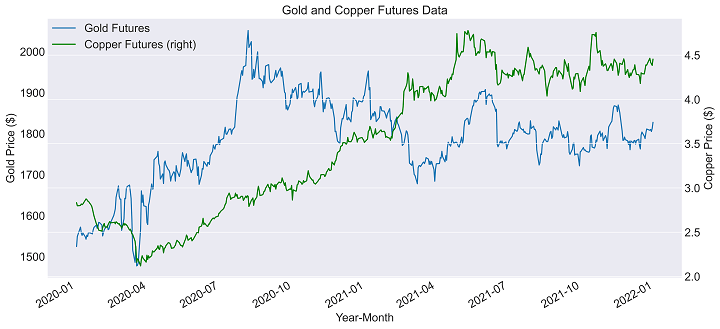

In today's rapidly evolving financial landscape, investors are increasingly focused on innovative strategies to enhance returns and manage risks effectively. Financial derivatives, particularly futures, have become essential tools for these purposes. Derivatives are contracts that derive their value from underlying assets, such as stocks, currencies, or commodities. These instruments provide investors with significant advantages, including risk management through hedging, the ability to leverage investments, and access to markets or assets that might otherwise be inaccessible.

Futures, as a category of derivatives, are known for their role in facilitating price discovery and financial security in various markets. They allow investors to speculate on the future price of an underlying asset, providing both an opportunity for profit and a mechanism for risk mitigation. The standardized nature of futures contracts and their ability to cater to a wide array of assets, from agricultural products to financial indices, explain their widespread use in global markets.



Algorithmic trading has further transformed futures trading by introducing a new level of efficiency and precision. By leveraging advanced algorithms to execute trades, investors can achieve optimal pricing and fast execution that manual trading cannot match. This type of trading minimizes emotional bias and maximizes the accuracy and speed of transactions, enabling participants to react swiftly to market changes.

This article addresses key aspects of financial derivatives investment, with an emphasis on the future of pack trading as well as the role of algorithmic trading in this dynamic sector. By exploring these innovative tools and strategies, investors can better navigate the complexities of modern financial markets and harness the potential benefits of derivatives trading.

## Table of Contents

## Understanding Financial Derivatives

Financial derivatives are sophisticated financial instruments that derive their value from underlying assets, which could be stocks, currencies, commodities, interest rates, or market indices. These contracts allow investors to hedge against risks, leverage positions to amplify potential returns, and gain access to otherwise inaccessible markets or assets.

Derivatives serve multiple purposes for investors and financial institutions, primarily in the areas of risk management and speculation. By using derivatives, market participants can protect their portfolios against adverse price movements in underlying assets. For instance, an airline company might use oil futures contracts to hedge against potential spikes in fuel prices.

Leverage is another key advantage offered by derivatives. By entering into a derivatives contract, investors can control a large position with a relatively smaller amount of capital. This amplifies the potential for significant returns, although it also raises the risk of substantial losses.

Derivatives also provide access to markets or instruments that might be difficult or impossible to directly invest in. Through the use of swaps or complex derivative structures, investors can tailor their exposure to specific risk factors or assets.

Among the most common types of financial derivatives are:

1. **Options**: Contracts that give the holder the right, but not the obligation, to buy or sell an asset at a predetermined price before or at the expiration date. Options are widely used for hedging and speculative purposes.

2. **Futures**: Standardized contracts obligating the buyer to purchase, or the seller to sell, an asset at a predetermined future date and price. Traded on exchanges, futures are commonly used in commodities markets to manage price volatility.

3. **Forwards**: Similar to futures, these are customized contracts between two parties to buy or sell an asset at a specified price on a future date. Forwards are traded over-the-counter (OTC) and are not standardized.

4. **Swaps**: Financial agreements to exchange cash flows or financial instruments between two parties. Interest rate swaps and currency swaps are among the most used, allowing institutions to manage exposure to fluctuations in interest rates and currency exchange rates.

These derivative instruments have become integral components of modern financial systems. By providing mechanisms for risk transfer, price discovery, and [arbitrage](/wiki/arbitrage), they enhance market efficiency and [liquidity](/wiki/liquidity-risk-premium). However, their inherent complexity and leverage also necessitate careful risk management and regulatory oversight to prevent potential systemic risks within the financial markets.

## What Are Investment Futures Packs?

Investment futures packs comprise a collection of futures contracts that investors have the option to trade collectively as a bundle. This strategy enables market participants to [carry](/wiki/carry-trading) out numerous trades in a single transaction, leading to potential cost savings and streamlined execution processes. Instead of executing each contract individually, investment futures packs allow for these transactions to be bundled, thus reducing transaction costs and increasing the efficiency of market operations.

The utilization of futures packs is especially prevalent in the commodities and interest-rate markets. In these markets, efficiency and cost-effectiveness are of paramount importance due to the sheer [volume](/wiki/volume-trading-strategy) and frequency of trades conducted. For instance, in the Eurodollar market, futures packs are extensively used to manage [interest rate](/wiki/interest-rate-trading-strategies) risk efficiently. 

Eurodollars, which are U.S. dollar-denominated deposits held in foreign banks, are subject to interest rate fluctuations. Futures contracts for Eurodollars are a prominent instrument in managing these risks, and their trading in packs provides a structured approach to handling a large volume of trades. By utilizing futures packs, traders can implement strategies that take advantage of conditions across different maturities and market conditions with increased flexibility and reduced transactional friction.

This bundling approach also allows traders to implement complex trading strategies that might be cumbersome to execute with single futures contracts. For example, a trader could simultaneously manage exposure to short-term, medium-term, and long-term interest rate movements in a single package rather than monitoring and executing each position separately.

In essence, investment futures packs streamline the trading process, making it more accessible and economical for traders, especially in sectors with high trading volumes and [volatility](/wiki/volatility-trading-strategies). They provide a structured and efficient approach to engage with multiple futures contracts, offering a strategic advantage in various financial markets.

## Algo Trading in Futures Markets

Algorithmic trading, often shortened to algo trading, employs computers and software algorithms to execute trades by following pre-set rules. These rules, or algorithms, are based on timing, price, quantity, or any mathematical model. The automation ensures that trades are executed with speed and precision that far surpass human capabilities. 

In futures markets, this precision and speed are paramount. Futures contracts, which are agreements to buy or sell an asset at a future date for a predetermined price, require rapid execution to capitalize on the often minute-by-minute fluctuations in market prices. The efficiency of [algorithmic trading](/wiki/algorithmic-trading) allows traders to take advantage of these small price movements, potentially leading to significant profits. By using algo trading, traders eliminate emotional decision-making, which can often lead to suboptimal trading outcomes. Emotions such as fear or greed are removed from the equation, allowing for strictly rule-based trading decisions.

The basic structure of an algorithm used in futures trading might involve the following steps:

1. **Market Scanning and Signal Generation**: Identify potential trading opportunities based on historical and real-time data.

   ```python
   import pandas as pd
   import numpy as np

   data = pd.read_csv('futures_data.csv')
   data['signal'] = np.where((data['price'] > data['moving_average']), 1, 0) # simple moving average signal
   ```

2. **Risk Management**: Implement risk management strategies to determine trade size, stop-loss levels, and other protective measures.

   ```python
   position_size = account_balance * risk_per_trade / (entry_price - stop_loss_price)
   ```

3. **Order Execution**: The algorithm places buy or sell orders based on pre-defined criteria.

4. **Monitoring and Adjustments**: Continuous monitoring of market conditions and making real-time adjustments to existing positions if necessary.

Algorithmic trading in futures also supports high-frequency trading ([HFT](/wiki/high-frequency-trading-strategies)), which involves thousands of trades in fractions of a second. This is especially beneficial in markets such as commodities and financial derivatives, where liquidity can change rapidly. The advances in technology have facilitated mills of trades with accuracy, offering traders the ability to participate in highly liquid markets with minimal manual intervention.

Despite its benefits, algo trading is not without challenges. It requires significant upfront investment in technology and continuous monitoring to ensure systems remain optimal and compliant with ever-changing regulations. Additionally, the algorithms themselves are complex and must be regularly updated to reflect shifts in market conditions or trading goals.

Overall, algo trading offers a distinct edge in futures markets by merging computational power with strategic financial decision-making, optimizing the trading process in a highly dynamic environment.

## The Rise of UltraAlgo and Other Platforms

Platforms like UltraAlgo have significantly impacted the landscape of algorithmic trading by offering user-friendly and sophisticated tools for both novice and experienced traders. Such platforms provide a suite of functionalities that enhance trading strategies and execution. One of the key features includes [backtesting](/wiki/backtesting), which allows traders to simulate their trading ideas against historical data to evaluate potential effectiveness before deploying strategies in live markets. This feature is crucial for minimizing risk and optimizing performance.

Moreover, UltraAlgo and similar platforms provide a comprehensive range of technical indicators. These indicators are mathematical calculations based on historical price, volume, or open interest information, which traders can use to identify patterns and trends. The availability of numerous indicators on these platforms enables traders to tailor their approaches according to specific market conditions and their personal trading objectives.

Automatic execution is another critical feature offered by these platforms, allowing trades to be executed swiftly and without human intervention. This automation reduces latency, helping traders capitalize on market opportunities more efficiently. It also minimizes emotional interference, which can adversely affect decision-making in trading.

The democratization of algorithmic trading through these platforms has made this advanced trading approach accessible to a broader audience. Users benefit from enhanced efficiency and potentially greater profitability. This accessibility encourages innovation and learning within the trading community, fostering an environment where both learning traders and seasoned professionals can refine and improve their trading strategies continually. 

By integrating these advanced tools and technologies, platforms like UltraAlgo facilitate a more streamlined, data-driven approach to trading, appealing to a diverse range of traders aiming to optimize their portfolio performance.

## Benefits and Challenges of Algo Trading in Derivatives

Algorithmic trading in derivatives markets offers numerous benefits that have made it a preferred method for both institutional and individual traders. One of the most significant advantages is speed. Algorithmic trading systems can execute high-frequency trades much faster than a human trader could accomplish manually. This speed not only allows traders to capitalize on fleeting market opportunities but also facilitates high-frequency trading strategies that rely on executing thousands of transactions in seconds.

Accuracy is another key benefit. Algorithms execute trades based on pre-defined criteria, minimizing the risk of human error. This precision ensures that trades are conducted at optimal prices and volumes, reducing the likelihood of slippage — the difference between the expected price of a trade and the actual price.

The cost-effectiveness of algorithmic trading stems mainly from reduced transaction costs. Automated systems can execute trades more efficiently, allowing traders to benefit from lower broker fees and minimized market impact costs. Moreover, the reduction of emotional interference — a common pitfall in manual trading — enhances decision-making. Algorithms operate without the emotional biases that can affect human traders, such as fear or greed, providing a more disciplined approach to trading.

However, the employment of algorithmic trading also presents challenges. The complexity of algorithms means that developing and maintaining these systems requires considerable expertise in both financial markets and programming. Care must be taken to ensure that algorithms are designed correctly and remain effective over time, as market conditions evolve.

Potential trading errors are another concern. Bugs in the code, connectivity issues, or incorrect data feeds can lead to significant financial loss. Therefore, constant monitoring and refinement of trading algorithms are essential. Traders and firms must also ensure algorithms comply with regulatory standards. Regulatory compliance requires that trading systems are transparent and conform to market rules, which can involve significant reporting and documentation.

Market risks, such as liquidity risk and volatility, can also impact algorithmic trading. During high-volatility periods, markets can move rapidly, and algorithms must be able to adapt quickly to avoid losses. Additionally, if too many algorithms execute similar strategies, it can lead to market distortion or flash crashes, where prices plummet and recover in a very short time due to automated reactions to specific triggers.

Overall, while algorithmic trading in derivatives markets offers substantial advantages, it also necessitates rigorous risk management and continual adaptation to changing market and regulatory landscapes.

## Future Directions for Financial Derivatives and Algo Trading

Technological advancements are set to significantly influence the landscape of financial derivatives and algorithmic trading. One of the most promising areas is the application of [artificial intelligence](/wiki/ai-artificial-intelligence) (AI) and [machine learning](/wiki/machine-learning) (ML). These technologies offer the potential to enhance trading strategies by analyzing vast datasets more efficiently than traditional methods, identifying patterns, and predicting market movements with greater accuracy. AI algorithms can continually learn and adapt, optimizing trading models as new data becomes available. This adaptability is crucial in the rapidly changing financial markets and can lead to improved decision-making processes.

Blockchain technology is another innovation poised to impact derivatives trading. Its potential lies in its transparency, security, and ability to facilitate quick settlements. By using blockchain, financial derivatives markets could see a reduction in settlement times, lower transaction costs, and enhanced clarity in contract terms. Smart contracts, powered by blockchain, could automate execution processes once predefined conditions are met, minimizing the need for intermediaries and thereby reducing the potential for disputes or errors.

Furthermore, the increasing focus on Environmental, Social, and Governance ([ESG](/wiki/esg-investing)) principles in investing is likely to influence the development of new derivative products. As investors seek to align their portfolios with sustainable and ethical standards, there is a growing demand for derivatives that cater to ESG criteria. This could lead to the creation of financial instruments that help manage the risks associated with sustainable investments or hedge against ESG-related market changes.

In summary, the evolution of AI, ML, blockchain, and ESG considerations are driving the next wave of innovation in the trading of financial derivatives. These technologies not only promise to enhance current market efficiencies but also offer pathways to new trading opportunities, making it imperative for investors and market participants to stay informed and adapt to these changes. As these technologies mature, they are expected to redefine the operational and strategic frameworks within which derivatives and algorithmic trading operate.

## Conclusion

Financial derivatives, particularly futures packs, continue to play a vital role in modern investment strategies due to their ability to provide risk management, portfolio diversification, and leverage. These instruments allow investors to speculate on future price movements of underlying assets effectively. Algorithmic trading has fundamentally transformed how these derivatives are traded, enhancing the efficiency and precision with which investors can enter and [exit](/wiki/exit-strategy) positions. By utilizing sophisticated algorithms and pre-set conditions, traders eliminate emotional biases and increase execution speed, thus capturing market opportunities that manual trading might miss.

The ongoing advancements in technology further bolster the impact of algorithmic trading on futures packs and other derivatives. As artificial intelligence and machine learning become more integrated into trading systems, they offer the potential for more nuanced and predictive analysis of market behavior, allowing for strategies that adapt to dynamic market conditions. Additionally, the application of blockchain technology is expected to improve transparency and reduce settlement delays, leading to more secure and efficient trading processes.

As we look ahead, the convergence of financial derivatives and algorithmic trading promises to introduce both opportunities and challenges for investors. Innovative strategies could emerge, driven by advancements in technology that offer more robust solutions for risk management and return optimization. However, investors must remain vigilant about the complexities and potential risks of relying heavily on algorithmic systems, ensuring proper oversight and adaptation to regulatory environments. This evolving landscape requires continuous learning and flexibility from market participants to capitalize on the benefits while mitigating potential drawbacks.

## References & Further Reading

[1]: Bergstra, J., Bardenet, R., Bengio, Y., & Kégl, B. (2011). ["Algorithms for Hyper-Parameter Optimization."](https://dl.acm.org/doi/10.5555/2986459.2986743) Advances in Neural Information Processing Systems 24.

[2]: ["Advances in Financial Machine Learning"](https://www.amazon.com/Advances-Financial-Machine-Learning-Marcos/dp/1119482089) by Marcos Lopez de Prado

[3]: ["Evidence-Based Technical Analysis: Applying the Scientific Method and Statistical Inference to Trading Signals"](https://books.google.com/books/about/Evidence_Based_Technical_Analysis.html?id=MeoJAQAAMAAJ) by David Aronson

[4]: ["Machine Learning for Algorithmic Trading"](https://github.com/stefan-jansen/machine-learning-for-trading) by Stefan Jansen

[5]: ["Quantitative Trading: How to Build Your Own Algorithmic Trading Business"](https://www.amazon.com/Quantitative-Trading-Build-Algorithmic-Business/dp/1119800064) by Ernest P. Chan