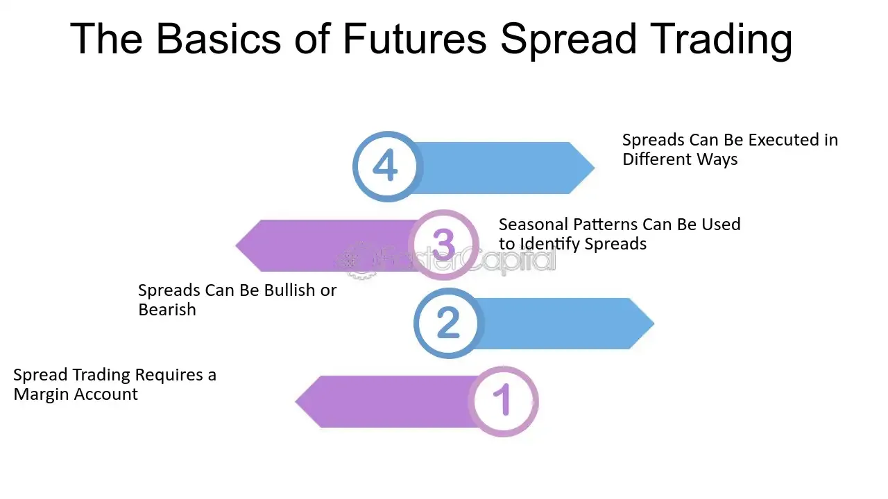

## Table of Contents

## What is a futures spread?

A futures spread is a trading strategy where a trader buys one futures contract and sells another at the same time. The goal is to profit from the difference in price between the two contracts. These contracts can be for the same commodity but have different delivery dates, or they can be for different but related commodities. For example, a trader might buy a wheat futures contract for delivery in March and sell a wheat futures contract for delivery in June.

The main advantage of using a futures spread is that it can reduce risk. Because the trader is buying and selling at the same time, they are less exposed to big price swings in the market. This can make the strategy more attractive to traders who want to be safer. However, the potential profits from a futures spread are usually smaller than from trading a single futures contract. Still, many traders find it a useful way to manage their risk while still trying to make money.

## Why do traders use futures spreads?

Traders use futures spreads mainly to reduce risk. When a trader buys one futures contract and sells another at the same time, they are less affected by big changes in the market. This makes the strategy safer than just buying or selling one contract. By balancing the risk, traders can feel more secure about their investments.

Another reason traders use futures spreads is to take advantage of price differences between contracts. These contracts might be for the same thing but with different delivery times, or they might be for related items. For example, a trader might buy wheat for March and sell wheat for June. The goal is to make money from the difference in price between the two contracts. While the profits might be smaller than trading a single contract, the strategy can still be profitable and help traders manage their risk better.

## What are the basic types of futures spreads?

There are two basic types of futures spreads: intracommodity spreads and intercommodity spreads. Intracommodity spreads, also called calendar spreads, are when a trader buys and sells futures contracts for the same commodity but with different delivery dates. For example, a trader might buy wheat for March and sell wheat for June. The goal is to make money from the price difference between the two delivery dates.

Intercommodity spreads involve buying and selling futures contracts for different but related commodities. For example, a trader might buy a futures contract for corn and sell a futures contract for soybeans. The idea is to profit from the price difference between the two commodities. Both types of spreads help traders manage risk by balancing their positions in the market.

## How does an intramarket spread work?

An intramarket spread, also known as an intracommodity or calendar spread, is when a trader buys and sells futures contracts for the same commodity but with different delivery dates. For example, a trader might buy wheat futures for March and sell wheat futures for June. The goal is to make money from the difference in price between the two delivery dates. If the price of March wheat goes up more than the price of June wheat, the trader can make a profit.

This strategy helps reduce risk because the trader is buying and selling at the same time. This means they are less affected by big changes in the overall market. Instead, they focus on the price difference between the two contracts. While the potential profits might be smaller than trading just one contract, the intramarket spread can be a safer way to trade futures.

## What is an intermarket spread and how is it different from an intramarket spread?

An intermarket spread is when a trader buys and sells futures contracts for different but related commodities. For example, a trader might buy a futures contract for corn and sell a futures contract for soybeans. The goal is to make money from the price difference between these two commodities. This kind of spread can help traders take advantage of how these commodities' prices move relative to each other.

The main difference between an intermarket spread and an intramarket spread is the type of contracts used. An intramarket spread, also called a calendar spread, involves buying and selling futures contracts for the same commodity but with different delivery dates. For example, buying wheat for March and selling wheat for June. On the other hand, an intermarket spread uses contracts for different commodities. Both types help manage risk, but they focus on different kinds of price movements.

## Can you explain what a calendar spread is?

A calendar spread is a way to trade futures where you buy one contract and sell another for the same thing, but they have different times when they will be delivered. For example, you might buy wheat that will be delivered in March and sell wheat that will be delivered in June. The goal is to make money from the difference in price between these two times.

This kind of trading can be safer than just buying or selling one contract because you are balancing your risk. If the overall market goes up or down a lot, it might not affect you as much because you have both bought and sold at the same time. While you might not make as much money as with other ways of trading, a calendar spread can help you manage risk better and still make a profit.

## What are the advantages of using a butterfly spread in futures trading?

A butterfly spread in futures trading is a way to make money while keeping risk low. You use three futures contracts at the same time. You buy one contract, sell two contracts for a closer date, and buy another contract for an even later date. This makes a kind of "butterfly" shape with the prices. The main advantage is that it limits how much you can lose. Even if the market moves a lot, your loss won't be too big because of how the spread is set up.

Another advantage is that it can be profitable if the market stays steady or moves just a little. If the price of the middle contract stays between the prices of the other two, you can make money. This makes it a good choice if you think the market won't change much. It's a bit like betting on calm weather instead of a storm, which can be safer and still let you earn some money.

## How do you calculate the profit and loss of a futures spread?

To calculate the profit and loss of a futures spread, you need to look at the difference between the prices of the two contracts you are trading. For example, if you buy a March wheat futures contract at $5.00 per bushel and sell a June wheat futures contract at $5.20 per bushel, your spread is $0.20 per bushel. If the price of the March contract goes up to $5.10 and the June contract goes up to $5.35, the new spread is $0.25 per bushel. Your profit would be the difference between the new spread and the original spread, which is $0.05 per bushel.

If you are trading multiple contracts, you multiply this profit or loss by the number of contracts you have. For instance, if you have 10 contracts, your total profit would be 10 times $0.05, which is $0.50. It's important to remember that you also need to consider any fees or commissions that might affect your final profit or loss. By keeping track of these changes in the spread, you can figure out how much money you are making or losing on your futures spread trade.

## What are the risks involved in trading futures spreads?

Trading futures spreads can be risky because the market can change in ways you don't expect. Even though spreads can help reduce risk by balancing your trades, there's still a chance the prices won't move the way you hope. For example, if you buy a March wheat contract and sell a June wheat contract, the price difference between these two might not change in your favor. This means you could lose money, even if the overall market moves up or down.

Another risk is that trading futures spreads requires a good understanding of the market and how different contracts relate to each other. If you don't know enough about the market, you might make bad choices about which contracts to buy and sell. Also, even though spreads can limit how much you lose, there are still costs like fees and commissions that can eat into your profits. So, it's important to think carefully and learn as much as you can before you start trading futures spreads.

## How can a trader hedge using futures spreads?

A trader can use futures spreads to hedge by balancing the risk between two different futures contracts. For example, if a farmer wants to protect against falling wheat prices, they might sell wheat futures for a future date, like June. At the same time, they could buy wheat futures for an earlier date, like March. This way, if wheat prices fall, the loss on the June contract might be offset by a gain on the March contract. The goal is to reduce the impact of price changes on the farmer's overall position.

Using futures spreads for hedging can be a smart way to manage risk because it helps protect against big losses. Even if the market moves a lot, the trader's risk is more controlled because they have both bought and sold contracts. This strategy can be especially useful for businesses that need to plan for future costs or revenues, like farmers or companies that use a lot of raw materials. By using futures spreads, they can have more peace of mind knowing that their financial situation is more stable, even if the market changes.

## What advanced strategies can be applied to futures spreads?

One advanced strategy for trading futures spreads is the "crack spread." This is used in the oil industry and involves buying [crude oil](/wiki/crude-oil) futures and selling gasoline and heating oil futures at the same time. The idea is to profit from the difference between the cost of crude oil and the prices of the products made from it. Traders use this strategy to hedge against changes in the refining margin, which is the difference between what it costs to refine crude oil into products and what those products can be sold for. By using the crack spread, traders can manage the risk that comes with big changes in the oil market.

Another advanced strategy is the "crush spread," which is used in the agriculture industry, particularly with soybeans. In this strategy, a trader buys soybean futures and sells soybean oil and soybean meal futures. The goal is to make money from the difference between the cost of soybeans and the prices of the products made from them. This can help farmers and processors hedge against changes in the prices of soybeans and their byproducts. By using the crush spread, they can protect themselves from big price swings and make their business more stable.

## How do market conditions affect the choice of futures spread strategies?

Market conditions play a big role in choosing the right futures spread strategy. If the market is expected to be stable, a trader might use a butterfly spread. This strategy can make money if prices don't change much. But if the market is expected to be very up and down, a trader might choose a calendar spread. This can help protect against big price swings because it involves buying and selling the same thing but at different times. Knowing what the market might do helps traders pick the best strategy to manage risk and make money.

Different market conditions also affect the choice between intermarket and intramarket spreads. If the prices of related commodities, like corn and soybeans, are expected to move differently, a trader might use an intermarket spread. This can help take advantage of the price difference between the two commodities. On the other hand, if the focus is on the same commodity but at different times, like wheat for March and June, an intramarket spread might be better. This can help manage the risk of price changes over time. By understanding market conditions, traders can choose the right type of spread to meet their goals.

## What is the understanding of financial derivatives?

Financial derivatives are financial instruments whose value is contingent upon that of other underlying assets, such as stocks, bonds, commodities, currencies, interest rates, or market indices. They are primarily used for risk management, income generation, or to gain leveraged exposure to an underlying asset. The most common types of financial derivatives include futures, options, and swaps.

Futures are standardized contracts that obligate the parties involved to exchange an asset at a predetermined price on a specified future date. These instruments are traded on exchanges and are widely used in commodities markets—examples include agricultural products like wheat or corn, or energy products like oil and natural gas. In addition to commodities, futures contracts are prevalent in financial markets, allowing traders to speculate on the future price of stocks or interest rates.

Options, on the other hand, grant the holder the right, but not the obligation, to buy or sell an asset at a set price on or before a specified date. This flexibility makes options particularly attractive for both hedging and speculative strategies.

Swaps are derivative contracts where two parties exchange financial instruments or cash flows. The most common form is an [interest rate](/wiki/interest-rate-trading-strategies) swap, where a fixed cash flow is exchanged for a floating rate cash flow, aiding in the management of interest rate exposure.

Futures contracts, in particular, play a critical role in hedging and speculative markets. By allowing traders to lock in prices for the future purchase or sale of an asset, futures mitigate the risk of price fluctuations. For example, an agricultural producer may enter a futures contract to sell their crop at a predetermined price, thus securing revenue regardless of market conditions at harvest time.

The pricing of these derivatives is generally based on an array of factors, including the current price of the underlying asset, time until expiration, [volatility](/wiki/volatility-trading-strategies), and interest rates. For instance, the pricing of a futures contract can be represented mathematically by the equation:

$$
F = S \times (1 + r)^t
$$

where $F$ is the futures price, $S$ is the spot price of the underlying asset, $r$ is the risk-free interest rate, and $t$ is the time to maturity in years.

In summary, financial derivatives like futures, options, and swaps serve essential roles in modern financial markets by providing mechanisms for hedging, risk management, and speculation. Their widespread use across commodities and financial markets underscores their versatility and importance in portfolio and risk management strategies.

## References & Further Reading

[1]: Hull, J. C. (2017). ["Options, Futures, and Other Derivatives"](https://www.pearson.com/en-us/subject-catalog/p/options-futures-and-other-derivatives/P200000005938/9780136939917) (9th ed.). Pearson.

[2]: Murphy, J. J. (1999). ["Technical Analysis of the Financial Markets: A Comprehensive Guide to Trading Methods and Applications"](https://archive.org/details/technicalanalysi0000murp). New York Institute of Finance.

[3]: Lopez de Prado, M. (2018). ["Advances in Financial Machine Learning"](https://www.amazon.com/Advances-Financial-Machine-Learning-Marcos/dp/1119482089). Wiley.

[4]: Chan, E. P. (2009). ["Quantitative Trading: How to Build Your Own Algorithmic Trading Business"](https://github.com/ftvision/quant_trading_echan_book). Wiley.

[5]: Jansen, S. (2020). ["Machine Learning for Algorithmic Trading: Predictive models to extract signals from market and alternative data for systematic trading strategies with Python"](https://www.amazon.com/Machine-Learning-Algorithmic-Trading-alternative/dp/1839217715). Packt Publishing.