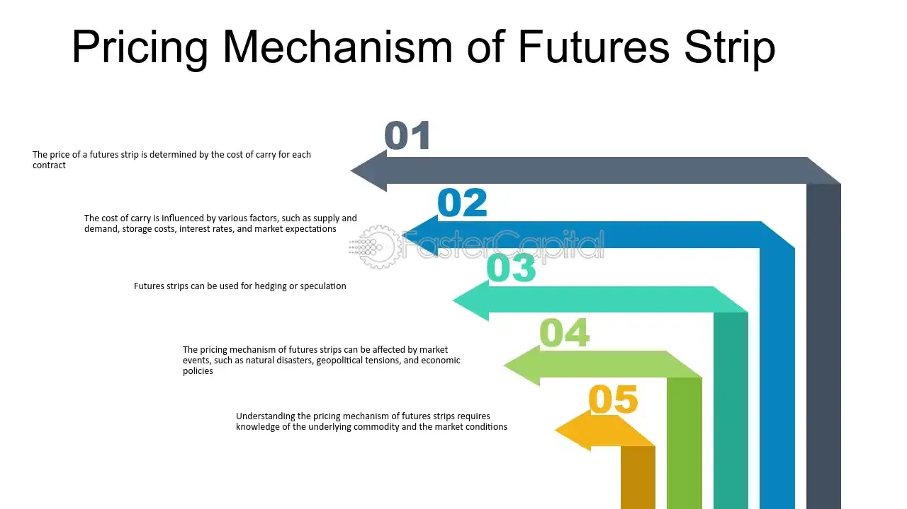

## Table of Contents

## What is a futures strip?

A futures strip is a series of futures contracts that are bought together to cover a specific time period. Imagine you want to buy oil every month for the next six months. Instead of buying six separate futures contracts, one for each month, you can buy a futures strip that includes all six contracts. This makes it easier to manage your purchases and can sometimes be more cost-effective.

These strips are commonly used in markets like energy, agriculture, and commodities where people need to plan for future needs. For example, an airline might use a futures strip to lock in fuel prices for the next year. By doing this, they can better predict their costs and protect themselves from price changes in the market.

## How does a futures strip differ from a single futures contract?

A futures strip is like a package deal of futures contracts, while a single futures contract is just one piece of that package. When you buy a futures strip, you're getting a series of contracts that cover different times in the future, all in one go. For example, if you need oil every month for the next six months, a futures strip would include six different contracts, one for each month. A single futures contract, on the other hand, would only cover one of those months.

Using a futures strip can be more convenient and sometimes cheaper than buying each contract separately. It helps you plan better because you know what you're getting for a longer period. A single futures contract is simpler and might be better if you only need to cover a short time or a specific month. Both can be useful, but they serve different needs depending on how long you want to plan ahead and how much you want to manage at once.

## What are the common uses of futures strips in financial markets?

Futures strips are often used in financial markets by companies that need to plan their costs over time. For example, airlines use futures strips to lock in jet fuel prices for many months ahead. This helps them know how much they will spend on fuel, so they can set their ticket prices and plan their budgets better. By using a futures strip, they don't have to worry about sudden price changes in the oil market, which can be a big help for their financial planning.

Another common use is in the energy sector, where power companies might use futures strips to manage the cost of natural gas or electricity. They buy a series of contracts to cover their needs over several months or even a year. This way, they can keep their energy prices stable for customers and avoid the risk of prices going up suddenly. Futures strips help these companies manage their expenses and protect against market volatility.

## How are futures strips priced?

Futures strips are priced based on the prices of the individual futures contracts that make up the strip. Each contract in the strip has its own price, which is set by the market. These prices can change every day, depending on what's happening in the market. So, the total price of the futures strip is the sum of all the individual contract prices at the time you buy it.

Sometimes, buying a futures strip can be cheaper than buying each contract one by one. This is because trading firms or brokers might offer a discount for buying in bulk. They do this to encourage more trading and to help their clients manage their needs over a longer time. So, while the base price comes from adding up the individual contracts, the final price you pay might be a bit less because of these discounts.

## What are the key components of a futures strip?

A futures strip is made up of several futures contracts that are bought together to cover a period of time. Each contract in the strip is for a specific month or time in the future. For example, if you want to buy oil every month for the next six months, the futures strip would have six contracts, one for each month. The key part of a futures strip is that it includes all these contracts as a package, so you don't have to buy them one by one.

The price of a futures strip is the total of all the individual contract prices at the time you buy it. These prices can change every day because they are set by the market. Sometimes, you might get a discount for buying a futures strip instead of buying each contract separately. This discount comes from trading firms or brokers who want to encourage more trading and help their clients plan for the future.

## Can you explain the process of constructing a futures strip?

To construct a futures strip, you start by figuring out what you need and for how long. Let's say you need to buy oil every month for the next six months. You would look at the futures market and find the contracts for each of those months. Each contract will have a price that changes every day, based on what's happening in the market. You'll need to check the prices for the contracts for January, February, March, April, May, and June, for example.

Once you have the prices for each contract, you add them up to get the total cost of the futures strip. Sometimes, you might get a discount for buying all these contracts together instead of one by one. This discount can come from the trading firm or broker who wants to encourage more trading and help you plan better. After you've added up the prices and figured out any discounts, you can buy the futures strip. This way, you have a plan for buying oil for the next six months, all in one package.

## What are the risks associated with trading futures strips?

Trading futures strips can be risky because the prices of the contracts can change a lot. If the market goes up, you might end up paying more than you expected. If the market goes down, you could lose money on the contracts you bought. This kind of price change can be hard to predict, so it's important to be ready for it.

Another risk is that you might not need all the contracts in the strip. Let's say you buy a strip to get oil every month for six months, but then you don't need the oil in the last month. You can't just cancel that contract; you have to sell it, and if the price has gone down, you could lose money. So, it's important to be sure you need all the contracts before you buy a futures strip.

## How do futures strips help in managing interest rate risk?

Futures strips can help manage [interest rate](/wiki/interest-rate-trading-strategies) risk by letting companies or investors lock in interest rates for a period of time. Imagine a company needs to borrow money every month for the next year. They can use a futures strip to set the interest rates for all those months ahead of time. This way, if interest rates go up, the company doesn't have to pay more. They know exactly what they will pay, which helps them plan their budget better.

Using futures strips for interest rate risk is like buying insurance against rising rates. If rates go down, the company might end up paying a bit more than they would have if they waited, but they are protected from rates going up. This can be really helpful for businesses that need to borrow a lot of money over time and want to keep their costs steady.

## What role do futures strips play in hedging strategies?

Futures strips are a key tool in hedging strategies because they help businesses and investors protect themselves from price changes. If a company needs to buy something regularly, like oil or natural gas, they can use a futures strip to lock in the prices for several months or even a year. This way, if the prices go up, the company doesn't have to pay more. They know what they will pay, which helps them plan their budget and avoid surprises.

For example, an airline might use a futures strip to hedge against rising jet fuel prices. By buying a strip, the airline can set the price of fuel for the next few months. This means they can set their ticket prices and plan their costs without worrying about fuel prices going up suddenly. Futures strips help businesses manage their risks and keep their costs steady, which is very important for their financial planning.

## How do market participants use futures strips for speculative purposes?

Market participants use futures strips for speculative purposes to try and make money from price changes. Imagine someone thinks the price of oil will go up over the next six months. They could buy a futures strip for oil, which includes contracts for each of those months. If the price of oil does go up, they can sell the strip later at a higher price and make a profit. It's like betting on the future price of oil, hoping to sell it for more than they paid.

This kind of speculation can be risky because the prices might not go the way the person expects. If the price of oil goes down instead of up, they could lose money when they try to sell the futures strip. But if they guess right, they can make a good profit. Speculators use futures strips to try and take advantage of market trends and price movements, but they need to be ready for the ups and downs that come with it.

## What are the advanced trading strategies involving futures strips?

Advanced trading strategies involving futures strips can be quite complex, but they often focus on taking advantage of price differences and market trends. One common strategy is called calendar spreading, where a trader buys futures contracts for one month and sells contracts for another month within the same strip. If they think the price difference between these months will change, they can make money from that change. For example, if they believe the price of oil in January will be much higher than in February, they might buy January contracts and sell February contracts, hoping to profit from the spread.

Another strategy is called strip rolling, where traders shift their positions from one futures strip to another as time goes on. This can help them manage their exposure to the market and take advantage of new price trends. For instance, if a trader has a futures strip for oil covering the next six months, they might sell the strip as it gets closer to expiring and buy a new strip for the following six months. This way, they can keep their speculative positions active and potentially profit from ongoing market movements.

These strategies require a good understanding of the market and careful planning. Traders need to watch the market closely and be ready to make quick decisions. While these strategies can be profitable, they also come with a lot of risk, so traders need to be prepared for the possibility of losing money if the market doesn't move the way they expect.

## How do regulatory frameworks impact the trading of futures strips?

Regulatory frameworks play a big role in how futures strips are traded. They set rules to make sure trading is fair and safe for everyone. For example, they might require traders to have enough money or assets to cover their trades, which is called margin requirements. This helps prevent people from making big trades they can't afford, which could cause problems in the market. Also, regulators might watch for any strange trading patterns that could be a sign of cheating or trying to manipulate the market. If they see something that looks wrong, they can step in to stop it and make sure the market stays honest.

Another way regulations impact futures strip trading is by setting rules about how trades are reported and recorded. This helps keep everything clear and open so that everyone can see what's happening in the market. Regulators might also set limits on how many futures contracts someone can hold at one time. This is to stop any one person or group from controlling too much of the market, which could lead to unfair price changes. By having these rules, regulators help make sure that trading futures strips is done in a way that protects everyone involved and keeps the market running smoothly.

## What is Futures Strip Trading?

Futures strip trading is a strategy predominantly employed within the energy markets, involving the simultaneous purchase or sale of futures contracts across several sequential delivery months as a single transaction. This approach provides significant advantages by allowing traders to hedge against price fluctuations over an extended period while concurrently engaging in speculation based on expected market trends.

One of the notable features of futures strip trading is its efficiency in cost management. By executing trades as a single strip, market participants can mitigate the often higher expenses associated with continuously rolling over shorter-term futures contracts. This method ensures that traders are exposed to an averaged price across the multiple contracts within the strip, reducing the impact of short-term market volatility.

To better understand the application and benefits of futures strip trading, consider the following scenario in the energy markets: A trader anticipates that natural gas prices will rise over the next year. Instead of purchasing individual monthly contracts and bearing the cost and logistical complexity of rolling them forward, the trader can opt for a strip comprised of 12 consecutive monthly contracts. This choice not only simplifies the trading process but also locks in an average price for the period, offering both speculative potential and a hedge against unforeseen price spikes or declines.

The concept of a futures strip can be mathematically expressed by averaging the futures prices of the contracts involved. If we denote the price of a futures contract for delivery month $i$ as $F_i$, where $i = 1, 2, \ldots, n$, the average strip price for $n$ contracts can be calculated as:

$$
\text{Average Strip Price} = \frac{1}{n} \sum_{i=1}^{n} F_i
$$

This averaged price provides a more stable financial exposure over the trade's duration, minimizing the risk associated with any single contract's [volatility](/wiki/volatility-trading-strategies).

In practice, futures strip trading not only supports comprehensive risk management but also aligns with broader market strategies. It is particularly advantageous in markets where seasonality or long-term geopolitical factors significantly influence underlying asset prices. This method is extensively utilized by industries and investors who require predictable cost structures over time, such as utility companies managing fuel costs or investors aiming to stabilize returns on long-term positions.

In summary, futures strip trading is an invaluable tool for managing price exposure over a discrete time frame, delivering both cost efficiency and strategic flexibility. This mechanism allows traders and industries to navigate market complexities with greater precision and confidence, ensuring more predictable financial outcomes amidst fluctuating market conditions.

## How can one integrate algo trading in futures markets?

Integrating [algorithmic trading](/wiki/algorithmic-trading) into futures markets represents a significant advancement in trading strategies, offering enhanced speed and accuracy in trade execution. This section explores the mechanics and benefits of this integration, particularly focusing on the identification of trading opportunities and the challenges associated with real-time data processing.

Algorithmic trading systems are designed to exploit futures strip trading opportunities by monitoring market conditions or specific price triggers. These systems employ sophisticated algorithms that can execute trades based on a set of predefined criteria, which often include technical indicators such as moving averages or support and resistance levels. For example, a simple algorithm might initiate a buy order when a short-term moving average crosses above a long-term moving average, signaling a potential upward trend.

Advanced algorithmic platforms are equipped to analyze extensive volumes of market data for predicting price movements. These platforms utilize [machine learning](/wiki/machine-learning) techniques, such as regression analysis and neural networks, to process historical and real-time data, deriving patterns that could indicate future price fluctuations. For instance, using a regression model, the relationship between different financial variables can be established as follows:

$$
y = \beta_0 + \beta_1 x_1 + \beta_2 x_2 + \ldots + \beta_n x_n + \epsilon
$$

where $y$ is the predicted price movement, $\beta_0$ is the intercept, $\beta_1, \beta_2, \ldots, \beta_n$ are coefficients for each respective feature $x_1, x_2, \ldots, x_n$, and $\epsilon$ represents the error term.

Real-time processing of complex market data necessitates robust algorithmic platforms. These platforms must cross-reference vast datasets and react instantly to market changes. Scalability and latency are critical considerations, as delays can result in missed trading opportunities or suboptimal trade executions. High-frequency trading ([HFT](/wiki/high-frequency-trading-strategies)) is a prominent example where latency is minimized to microseconds, demanding high-performance infrastructure and efficient coding practices. A basic Python snippet to illustrate how an algorithm might rapidly access live data can look like this:

```python
import time
from market_data_api import get_real_time_data

def check_trading_signal():
    while True:
        data = get_real_time_data('FUTURES_MARKET')
        if is_trading_condition_met(data):
            execute_trade()
        time.sleep(0.1)  # Adjust based on acceptable latency

def is_trading_condition_met(data):
    # Implement algorithm condition here
    return data['indicator'] > threshold

check_trading_signal()
```

Traders leveraging these technologies can continually refine their strategies. By integrating machine learning algorithms with futures trading, they can dynamically adapt to market conditions, employing strategies like statistical [arbitrage](/wiki/arbitrage) or [momentum](/wiki/momentum) trading based on the latest insights. However, the complexity of these systems requires regular testing and adjustments to remain effective.

In conclusion, the integration of algorithmic trading into futures markets stands as a transformative enhancement, empowering traders with precision and efficiency. While challenges in processing real-time data and system robustness remain, ongoing developments in technology continue to advance these trading strategies, promising greater profitability and minimized risk.

## References & Further Reading

[1]: ["Futures, Options, and Swaps"](https://online.hbs.edu/blog/post/understanding-financial-derivatives-forwards-futures-options) by Robert W. Kolb

[2]: ["Algorithmic Trading: Winning Strategies and Their Rationale"](https://onlinelibrary.wiley.com/doi/pdf/10.1002/9781118676998.fmatter) by Ernie Chan

[3]: ["Automated Trading with R: Quantitative Research and Platform Development"](https://link.springer.com/book/10.1007/978-1-4842-2178-5) by Chris Conlan

[4]: "The Design and Implementation of Algorithmic Trading Systems" by Sourav Ghosh and Theodore Lim

[5]: ["Energy and Power Risk Management: New Developments in Modeling, Pricing, and Hedging"](https://assets.thalia.media/doc/artikel/dd7/bd5/dd7bd57262b791f0959ca8d2637114f4c23d490c.pdf) by Alexander Eydeland and Krzysztof Wolyniec