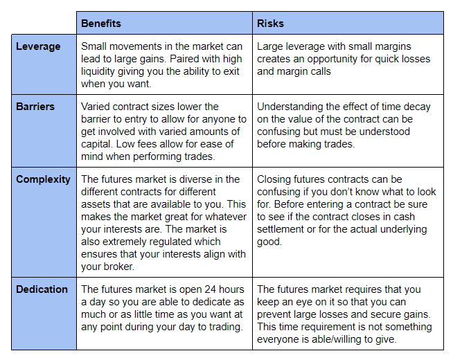

## Table of Contents

## What is futures trading and how does it work?

Futures trading is when people agree to buy or sell something at a future date for a price they set now. This "something" can be anything from corn to gold, or even financial products like stock indexes. The main idea is to lock in a price today to avoid risks from price changes later. People who trade futures can be farmers wanting to know how much they'll get for their crops, or investors trying to make money from price movements.

Here's how it works: Let's say a farmer wants to sell his wheat in six months. He can enter into a futures contract with a buyer, agreeing to sell his wheat at a set price on that future date. If the price of wheat goes up, the buyer benefits because they locked in a lower price. If the price goes down, the farmer benefits because they locked in a higher price. Most futures contracts are settled in cash, meaning the buyer and seller just exchange money based on the price difference, rather than actually trading the physical goods. This makes futures trading a way to bet on future price movements without needing to handle the actual products.

## What are the most popular platforms for futures trading?

Some of the most popular platforms for futures trading are the Chicago Mercantile Exchange (CME) and the Intercontinental Exchange (ICE). These platforms are like big marketplaces where people from all over the world can trade futures contracts. The CME is known for trading things like agricultural products, energy, and financial products, while the ICE is famous for energy and commodities.

Another popular platform is the Eurex Exchange, which is based in Europe and focuses on European financial products. Eurex is good for people who want to trade futures related to European stocks and interest rates. These platforms make it easy for traders to buy and sell futures contracts online, and they provide tools and information to help traders make smart decisions.

## How do beginners start trading futures?

To start trading futures, beginners should first learn the basics. Futures trading means agreeing to buy or sell something at a future date for a price set now. It's important to understand how futures work and the risks involved. Beginners can start by reading [books](/wiki/algo-trading-books), taking online courses, or watching educational videos about futures trading. It's also a good idea to practice with a demo account, which lets you trade without using real money. This helps you get used to how the markets work and how to use trading platforms.

Once you feel ready, you'll need to choose a reputable broker that offers futures trading. A broker is like a middleman who helps you buy and sell futures contracts. Make sure the broker is regulated and has good reviews. After choosing a broker, you'll need to open an account and deposit money into it. This money is called margin, and it's used to cover potential losses. Start with a small amount of money that you can afford to lose, and begin trading with small positions. As you gain more experience and confidence, you can gradually increase your trading size. Remember, futures trading can be risky, so always keep learning and stay updated on market news.

## What are the basic strategies for futures trading?

One basic strategy for futures trading is called going long. This means you think the price of something will go up in the future. So, you buy a futures contract now, hoping to sell it later at a higher price. For example, if you believe the price of oil will increase, you can buy an oil futures contract. If the price does go up, you can sell the contract for a profit. But if the price goes down, you might lose money. Going long is a way to bet on rising prices.

Another strategy is called going short. This is the opposite of going long. You think the price of something will go down in the future. So, you sell a futures contract now, hoping to buy it back later at a lower price. For example, if you believe the price of gold will decrease, you can sell a gold futures contract. If the price does go down, you can buy the contract back for less and make a profit. But if the price goes up, you might lose money. Going short is a way to bet on falling prices.

A third strategy is called spreading. This involves buying one futures contract and selling another related contract at the same time. The goal is to make money from the difference in price between the two contracts. For example, you might buy a corn futures contract for one month and sell a corn futures contract for a later month. If the price difference between the two contracts changes in your favor, you can make a profit. Spreading can be less risky than going long or short because it's not just about whether prices go up or down, but about how they change relative to each other.

## What are the risks associated with futures trading?

Futures trading can be risky because prices can change a lot. If you buy a futures contract and the price goes down, you might lose money. This is called market risk. Also, futures trading uses something called leverage, which means you can trade with more money than you actually have. This can make your profits bigger, but it can also make your losses bigger. If the market moves against you, you might have to put in more money to keep your position open, and if you can't, you could lose everything you put in.

Another risk is called [liquidity](/wiki/liquidity-risk-premium) risk. This happens when there aren't enough buyers or sellers in the market, making it hard to buy or sell your futures contract at the price you want. If you need to get out of a trade quickly, you might have to sell at a lower price than you hoped, which can lead to losses. There's also the risk of not understanding the market well enough. Futures markets can be complicated, and if you don't know what you're doing, you might make bad decisions that cost you money. It's important to learn as much as you can and maybe even get advice from experienced traders before you start.

## How can one manage risk in futures trading?

Managing risk in futures trading is important to protect your money. One way to do this is by using stop-loss orders. A stop-loss order is like a safety net that automatically sells your futures contract if the price drops to a certain level. This can help limit your losses if the market moves against you. Another way to manage risk is by not using too much leverage. Leverage lets you trade with more money than you have, but it can also make your losses bigger. So, it's a good idea to use less leverage and only trade with money you can afford to lose.

Another important way to manage risk is by diversifying your trades. This means not putting all your money into one type of futures contract. Instead, you can spread your money across different types of contracts, like commodities, currencies, or stock indexes. This can help reduce the impact of a bad trade on your overall portfolio. Also, always keep learning about the markets and stay updated on news that might affect prices. The more you know, the better you can make decisions and manage your risks in futures trading.

## What are the advantages of trading futures over other financial instruments?

One advantage of trading futures is that they can help you make money from price movements without needing to own the actual product. For example, you can trade futures on oil without having to store barrels of oil. This makes it easier to bet on prices going up or down. Futures also let you use leverage, which means you can control a big position with a small amount of money. This can make your profits bigger if you guess right, but it can also make your losses bigger if you're wrong.

Another advantage is that futures markets are very liquid, which means there are usually a lot of buyers and sellers. This makes it easier to buy and sell futures contracts at the prices you want. Futures also have standardized contracts, which means everyone knows exactly what they're trading. This can make trading simpler and more transparent. Plus, futures can be a good way to hedge against risks, like if you're a farmer who wants to lock in a price for your crops before you sell them.

## What are the disadvantages of futures trading?

One big disadvantage of futures trading is that it can be very risky. Prices can change a lot, and if you guess wrong, you could lose a lot of money. Futures use something called leverage, which means you can trade with more money than you actually have. This can make your profits bigger, but it can also make your losses bigger. If the market moves against you, you might have to put in more money to keep your position open, and if you can't, you could lose everything you put in.

Another disadvantage is that futures trading can be complicated. The markets can be hard to understand, and if you don't know what you're doing, you might make bad decisions that cost you money. There's also the risk of not being able to buy or sell your futures contract at the price you want, which is called liquidity risk. If you need to get out of a trade quickly, you might have to sell at a lower price than you hoped, which can lead to losses. It's important to learn as much as you can and maybe even get advice from experienced traders before you start.

## How do advanced strategies like spread trading and hedging work in futures markets?

Spread trading in futures markets involves buying one futures contract and selling another related contract at the same time. The goal is to make money from the difference in price between the two contracts. For example, you might buy a corn futures contract for one month and sell a corn futures contract for a later month. If the price difference between the two contracts changes in your favor, you can make a profit. Spread trading can be less risky than just going long or short on one contract because it's not just about whether prices go up or down, but about how they change relative to each other. This strategy can help you manage risk better because you're betting on the relationship between two prices, not just one.

Hedging in futures markets is a way to protect against price changes. For example, if you're a farmer who grows wheat, you might be worried that the price of wheat will go down before you sell your crop. To protect yourself, you can sell a wheat futures contract now at a set price for a future date. If the price of wheat does go down, you'll lose money on your actual wheat, but you'll make money on the futures contract, which can help balance out your losses. Hedging is like insurance; it might cost you a bit, but it can save you from big losses if prices move against you. It's a way to manage risk and make your business more predictable.

## What role do market analysis and forecasting play in successful futures trading?

Market analysis and forecasting are very important for successful futures trading. They help traders understand what might happen to prices in the future. By looking at past price movements and other information, traders can make better guesses about where prices are going. This can help them decide when to buy or sell futures contracts. For example, if a trader thinks the price of oil will go up because of news about a shortage, they might buy an oil futures contract now to sell it later at a higher price.

Using market analysis and forecasting can also help traders manage their risks better. By understanding the market, traders can set up strategies like stop-loss orders to limit their losses if the market moves against them. They can also use these tools to find good opportunities for spread trading or hedging. The more a trader knows about the market and can predict what might happen, the better they can plan their trades and protect their money. So, spending time on market analysis and forecasting is a key part of being a successful futures trader.

## How do regulatory requirements affect futures trading?

Regulatory requirements are rules that governments and organizations set up to make sure futures trading is fair and safe. These rules can affect how traders do their business. For example, traders need to use brokers that are approved by regulators. This means the brokers have to follow certain rules to protect traders' money and make sure they are honest. Also, traders have to report their trades and follow rules about how much money they can use to trade. This is to stop people from taking too much risk and losing a lot of money.

These rules can make futures trading safer, but they can also make it more complicated. Traders have to spend time learning about the rules and making sure they follow them. Sometimes, the rules can limit what traders can do, like how much they can trade or what kinds of contracts they can use. But overall, these regulations help keep the futures market honest and protect traders from big problems.

## What are the latest trends and technologies impacting futures trading?

One big trend in futures trading is the use of technology to make trading easier and faster. Traders now use computer programs and algorithms to help them make decisions and place trades. These programs can look at a lot of information very quickly and find good opportunities to buy or sell futures contracts. This is called [algorithmic trading](/wiki/algorithmic-trading). Also, more traders are using mobile apps to trade from anywhere, not just from their computers. This makes it easier for people to keep an eye on the markets and make trades even when they are not at home or in the office.

Another trend is the use of big data and [artificial intelligence](/wiki/ai-artificial-intelligence) (AI) to predict what might happen in the markets. Traders use AI to look at a lot of different information, like news, weather reports, and past prices, to guess where prices might go in the future. This can help them make better decisions about when to buy or sell. Also, blockchain technology is starting to be used in futures trading. Blockchain can make trading more secure and transparent, which can help build trust in the markets. These new technologies are changing how futures trading works and making it more efficient and accessible for traders.

## References & Further Reading

[1]: Bergstra, J., Bardenet, R., Bengio, Y., & Kégl, B. (2011). ["Algorithms for Hyper-Parameter Optimization."](https://papers.nips.cc/paper/4443-algorithms-for-hyper-parameter-optimization) Advances in Neural Information Processing Systems 24.

[2]: ["Advances in Financial Machine Learning"](https://www.amazon.com/Advances-Financial-Machine-Learning-Marcos/dp/1119482089) by Marcos Lopez de Prado

[3]: ["Evidence-Based Technical Analysis: Applying the Scientific Method and Statistical Inference to Trading Signals"](https://www.amazon.com/Evidence-Based-Technical-Analysis-Scientific-Statistical/dp/0470008741) by David Aronson

[4]: ["Machine Learning for Algorithmic Trading"](https://github.com/PacktPublishing/Machine-Learning-for-Algorithmic-Trading-Second-Edition) by Stefan Jansen

[5]: ["Quantitative Trading: How to Build Your Own Algorithmic Trading Business"](https://books.google.com/books/about/Quantitative_Trading.html?id=j70yEAAAQBAJ) by Ernest P. Chan