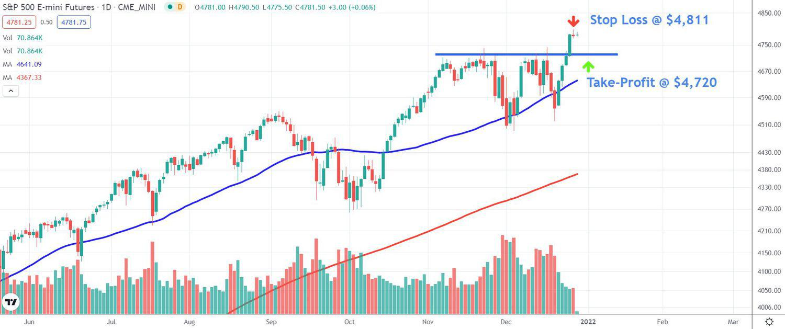

Futures trading has gained prominence as a significant financial instrument, providing traders and investors with an efficient mechanism to speculate on or hedge against the price fluctuations of a diverse array of assets. These assets span across commodities, foreign exchange, stock indices, and even cryptocurrencies, offering substantial breadth in investment opportunities. Notably, futures contracts serve as binding agreements to buy or sell an asset at a predetermined price on a future date, thus facilitating not only speculation but also robust risk management.

Several critical components define the landscape of modern futures trading. The platforms available for executing futures contracts have become increasingly user-friendly and feature-rich, offering access to real-time market data and advanced analytical tools. The selection of an appropriate platform is pivotal as it impacts the trader's ability to execute orders efficiently and leverage algorithmic strategies.



Furthermore, strategies employed in futures trading have evolved, benefiting from advancements in technology and analytics. These strategies range from simple buy-and-sell decisions based on price trends to complex algorithms that utilize multiple market indicators and historical data to predict future movements. Algorithmic trading, in particular, automates trade execution based on pre-defined criteria, eliminating human error and bias while enhancing trading speed and accuracy.

As technology continues to advance, the trading domain increasingly incorporates computing power to develop sophisticated strategies for improved efficiency and return potential. This comprehensive guide aims to present a structured examination of futures trading's modern landscape, emphasizing the integral role of platforms, strategy development, and algorithmic trading in shaping successful market participation.

## Table of Contents

## Understanding Futures Trading

Futures contracts are fundamental financial instruments, representing an agreement between two parties to buy or sell a specific asset at a predetermined price on a specified future date. These contracts are versatile, encompassing a broad array of markets such as commodities, indexes, and cryptocurrencies. Their primary function is to facilitate both speculation and risk management. By locking in prices for future transactions, market participants can hedge against price fluctuations, thereby stabilizing cash flows and mitigating risks.

The futures market, with its standardized platform for trading, plays a crucial role in providing this structured environment. Standardization includes the contract size, expiration dates, and settlement methods, ensuring transparency and liquidity. These traits make futures an attractive vehicle for traders and institutional investors who seek to benefit from price movements without owning the underlying assets.

Historically, the concept of futures trading dates back to the mid-19th century, originating in the agricultural sector. The Chicago Board of Trade (CBOT), established in 1848, is widely recognized as one of the earliest formalized futures exchanges. Initially, these contracts catered to agricultural commodities like wheat and corn, allowing farmers and merchants to lock in prices and protect against supply risks and volatile prices.

Over the years, the scope of futures trading has expanded significantly. Besides agricultural products, modern futures contracts extend to financial instruments, including stock indexes, interest rates, and foreign currencies. The growth of digital assets has further broadened this spectrum, with [cryptocurrency](/wiki/cryptocurrency) futures gaining popularity in recent times.

Futures trading offers both opportunities and challenges. While the potential for leveraged gains is a notable advantage, it also introduces a risk of significant losses. The sophistication inherent in these contracts necessitates a comprehensive understanding of market dynamics, including the influence of macroeconomic factors and regulatory considerations, to effectively partake in futures trading.

## Pros and Cons of Futures Trading

Futures trading offers significant benefits, primarily through the use of leverage, which allows traders to control a substantial market position with a relatively small initial investment. This leverage magnifies potential gains, as traders can profit from price movements without having to pay the full price of the underlying asset. For example, if a futures contract allows an investor to control $100,000 worth of a commodity with an initial margin of $5,000, even a modest price increase could result in substantial profits relative to the initial investment.

Additionally, futures trading facilitates diversification, as it spans various asset classes, including commodities, indices, and interest rates. This diversification enables traders to spread risk by engaging in multiple markets simultaneously, reducing their reliance on a single asset class. Given the global market scope, futures contracts provide opportunities for hedging and speculation across different geographies and sectors.

Despite these advantages, the complexity inherent in futures contracts poses significant challenges. The high leverage that makes futures attractive can also lead to substantial losses, as adverse price movements are similarly magnified. Traders must maintain sufficient margin in their accounts to cover potential losses; failure to do so can lead to margin calls and the forced closure of positions at a loss.

Further, futures contracts come with expirations, requiring traders to manage expiry dates effectively and decide whether to close positions or roll them over to a future date. Rollovers might incur additional costs and necessitate a sound understanding of the market's direction and timing.

Another critical element is market [volatility](/wiki/volatility-trading-strategies), which can contribute to increased risk. Price fluctuations can be swift and severe, requiring traders to implement robust risk management strategies. This includes setting stop-loss orders and continuously monitoring the market to adapt to sudden changes.

Overall, while futures trading offers avenues for profit and diversification, it necessitates a thorough understanding of the associated risks, leverage dynamics, and market mechanics. Success hinges on careful planning, consistent strategy execution, and effective risk management practices.

## Top Futures Trading Platforms

Selecting the right futures trading platform is crucial to optimizing trading success, as it significantly influences the ease of executing strategies and managing trades. Key factors to consider in selecting a platform include ease of use, access to comprehensive market data, competitive fees, and robust support for [algorithmic trading](/wiki/algorithmic-trading). The right platform should accommodate both novice and experienced traders, providing essential tools that cater to varying levels of expertise.

Two leading platforms that exemplify these qualities are TradeStation and [Interactive Brokers](/wiki/interactive-brokers-api). TradeStation offers an intuitive interface and powerful tools that assist traders in developing and executing advanced strategies. Its comprehensive trading ecosystem features extensive educational resources and market insights, facilitating informed decision-making. Moreover, TradeStation's support for algorithmic trading, through advanced features like EasyLanguage scripting, allows traders to automate complex strategies seamlessly.

Interactive Brokers, renowned for its extensive market access and competitive fee structure, offers a highly customizable trading experience. It provides a wide range of tools and extensive data access, catering to both individual and institutional traders. An important feature for algorithmic traders is the Trader Workstation (TWS), which includes advanced trading algorithms, strategy [backtesting](/wiki/backtesting), and API integration, allowing for sophisticated automated trading strategies implementation.

Advanced features such as API access have become indispensable for serious traders who intend to leverage algorithmic strategies. APIs enable seamless integration of custom trading models with a trading platform, facilitating real-time data retrieval and order execution. Here's a simple example illustrating how one might connect to a trading platform's API using Python:

```python
import requests

API_KEY = 'your_api_key_here'
BASE_URL = 'https://api.platform.com/v1/'

def get_market_data(ticker):
    endpoint = f'{BASE_URL}market_data/{ticker}'
    headers = {
        'Authorization': f'Bearer {API_KEY}',
    }
    response = requests.get(endpoint, headers=headers)
    return response.json()

# Example usage:
ticker = 'ES'  # E-mini S&P 500
data = get_market_data(ticker)

print(data)
```

This Python code snippet shows how to interact with a trading platform's API to fetch market data for the E-mini S&P 500 futures. Such capabilities are essential for developing automated trading systems that require real-time data for timely decision-making.

In conclusion, choosing a futures trading platform that aligns with one's trading goals and strategy can greatly enhance trading efficiency and success. Platforms like TradeStation and Interactive Brokers provide comprehensive tools and functionalities, including API access, to accommodate the needs of algorithmic traders. Hence, an informed selection of a trading platform can play a pivotal role in a trader's ability to capitalize on futures market opportunities.

## Developing Effective Trading Strategies

Successful futures trading strategies play a pivotal role in achieving profitability and managing risks in an often volatile market. These strategies are primarily based on defining clear entry and [exit](/wiki/exit-strategy) points, implementing robust risk management protocols, and maintaining continuous market monitoring. Understanding and applying both technical and [fundamental analysis](/wiki/fundamental-analysis) can form the backbone of these strategies, tailored to the trader's preferred approach.

Technical analysis involves the study of past market data, primarily price and [volume](/wiki/volume-trading-strategy), to forecast future price movements. Traders employing technical strategies often rely on chart patterns and various technical indicators. Common technical indicators include moving averages, relative strength index (RSI), and Bollinger Bands, among others. These tools help traders identify trends and potential reversal points. For instance, a moving average crossover strategy might signal a buying opportunity when a short-term moving average crosses above a long-term moving average.

Fundamental analysis, on the other hand, focuses on evaluating economic reports, financial statements, and other macroeconomic factors that might influence the asset's value. In the context of futures trading, fundamental strategies might analyze commodity inventories, crop reports, or [interest rate](/wiki/interest-rate-trading-strategies) changes. For example, a lower-than-expected oil inventory report could indicate potential price increases, guiding trading decisions in [crude oil](/wiki/crude-oil) futures.

Both approaches require disciplined risk management strategies. This might include setting stop-loss orders to limit potential losses, determining position sizes to manage leverage effectively, and diversifying trades across different futures contracts to spread risk. Continuous market monitoring is crucial to adjusting strategies in response to real-time market developments, ensuring strategies remain effective under changing conditions. 

By integrating these elements, traders can develop well-rounded strategies to navigate the futures markets, maximizing potential returns while mitigating risks.

## Algorithmic Trading in Futures

Algorithmic trading in futures markets is a method of executing trades that utilizes computer algorithms to automatically decide aspects of an order including timing, price, or volume, based on pre-programmed instructions. This approach enhances trading efficiency and systematically removes emotional biases, ensuring consistent application of logic and strategy.

Popular platforms such as QuantConnect and Trade Ideas support algorithmic trading, providing traders with advanced tools to develop and test sophisticated strategies. QuantConnect offers a cloud-based environment for executing algorithmic trades that supports multiple languages, including Python and C#. Meanwhile, Trade Ideas focuses on delivering robust market scanning functionality and strategy testing, aiding traders in the identification of potential opportunities.

The selection of an appropriate algorithmic trading platform is significantly influenced by factors such as speed of execution and real-time market data access. High-speed execution is crucial, particularly in futures trading where market conditions can change rapidly, requiring swift responses to maintain trading efficiency and capital protection. In addition, access to real-time market data allows for timely decision-making and effective trade management, enabling algorithms to adjust to changing conditions almost instantaneously.

To illustrate, consider an example of a simple moving average crossover strategy in Python using a hypothetical futures data set. In the following code snippet, we define a basic algorithm that buys a futures contract when a short-term moving average crosses above a long-term moving average and sells when the opposite occurs:

```python
import pandas as pd

# Sample futures data
data = {
    'Date': pd.date_range(start='1/1/2023', periods=100, freq='D'),
    'Price': np.random.random(100) * 100
}
df = pd.DataFrame(data)

# Moving averages
df['SMA_20'] = df['Price'].rolling(window=20).mean()
df['SMA_50'] = df['Price'].rolling(window=50).mean()

# Trading signals
df['Signal'] = 0
df.loc[df['SMA_20'] > df['SMA_50'], 'Signal'] = 1
df.loc[df['SMA_20'] < df['SMA_50'], 'Signal'] = -1

# Display signals
print(df[['Date', 'Price', 'SMA_20', 'SMA_50', 'Signal']])
```

This code highlights core aspects of algorithmic trading, emphasizing the automated nature and objective criteria underpinning trade decisions. Such strategies can be backtested against historical data within platforms like QuantConnect to assess their potential performance in live markets. The capability to iterate and refine trading strategies based on empirical evidence is a key advantage of algorithmic trading, allowing for continuous performance optimization.

## Case Study: Algo Trading with E-mini S&P 500

The E-mini S&P 500 futures contracts have become a pivotal instrument in the landscape of algorithmic trading, primarily due to their robust [liquidity](/wiki/liquidity-risk-premium) and pronounced volatility. These features enable traders to take advantage of frequent and significant price movements, making the E-mini S&P 500 futures an attractive arena for algorithmic trading strategies.

Traders interested in algorithmic trading with the E-mini S&P 500 can build and deploy customized algorithms that respond to market conditions efficiently. These algorithms typically incorporate a range of technical indicators and signals, such as moving averages, relative strength index (RSI), and Bollinger Bands, to identify profitable entry and exit points. For instance, a simple moving average crossover strategy could be deployed, where a buy signal is generated when a short-term moving average crosses above a long-term moving average, and a sell signal is triggered in the opposite scenario.

Risk management is another crucial element that needs careful consideration within these algorithms. Setting stop-loss orders to limit potential losses and using position sizing techniques can help maintain the risk-reward ratio at optimal levels. Additionally, incorporating volatility filters can prevent trading during excessive market turbulence.

Backtesting is a vital step in the development of any algorithmic trading strategy involving the E-mini S&P 500 futures. By applying their strategies to historical data, traders can assess the potential effectiveness and profitability of their algorithms under past market conditions. Backtesting allows for the refinement of strategy parameters to optimize performance and reduce the likelihood of overfitting. Python, with libraries like [backtrader](/wiki/backtrader) or Zipline, offers robust frameworks for conducting such backtests:

```python
import backtrader as bt

# Define a simple moving average crossover strategy
class SmaCross(bt.SignalStrategy):
    def __init__(self):
        sma1, sma2 = bt.ind.SMA(period=10), bt.ind.SMA(period=30)
        self.signal_add(bt.SIGNAL_LONG, sma1 > sma2)
        self.signal_add(bt.SIGNAL_SHORT, sma1 < sma2)

# Create a Cerebro engine instance
cerebro = bt.Cerebro()
cerebro.addstrategy(SmaCross)

# Load historical data for E-mini S&P 500 futures
data = bt.feeds.YahooFinanceData(dataname='ES=F', fromdate='2020-01-01', todate='2021-01-01')
cerebro.adddata(data)

# Set initial capital
cerebro.broker.setcash(100000.0)

# Run backtest
cerebro.run()

# Plot results
cerebro.plot()
```

Utilizing backtesting, traders can iteratively refine their algorithms, enhancing their potential for successful live trading. The goal is to ensure that the developed strategy not only performs well on historical data but is also robust enough to adapt to future market dynamics.

## Conclusion

Futures trading continues to be a vibrant component of the financial markets, offering traders and investors distinctive avenues for both profit generation and risk mitigation. The sector's dynamism stems largely from its capacity to accommodate a diverse array of assets, ranging from traditional commodities to modern assets like cryptocurrencies. This flexibility, combined with the potential for high leverage, makes futures trading an alluring proposition for both seasoned traders and newcomers alike.

Technological advancements have played a pivotal role in reshaping the futures trading landscape. The proliferation of cutting-edge trading platforms has democratized access to sophisticated tools once reserved for large financial institutions. These platforms offer features like real-time data analytics, algorithmic trading capabilities, and user-friendly interfaces, empowering individual traders to execute strategies with precision. Algorithmic trading has particularly revolutionized how futures are traded, enabling the automation of complex strategies that would be difficult to manage manually.

However, the potential for significant returns in futures trading is accompanied by inherent risks. The high leverage involved can amplify not only profits but also potential losses, underscoring the importance of a grounded approach in trading. A well-considered strategy, incorporating robust risk management and continuous market analysis, remains a cornerstone of success in futures trading. Traders must remain vigilant, adapting their strategies in response to market conditions and leveraging technological tools to stay competitive.

In conclusion, while futures trading is not without its challenges, the rewards can be substantial for those who navigate its complexities with diligence and strategic foresight. Embracing the technological advancements available today can further enhance the probability of achieving favorable outcomes in this dynamic market environment.

## References & Further Reading

[1]: Bergstra, J., Bardenet, R., Bengio, Y., & Kégl, B. (2011). ["Algorithms for Hyper-Parameter Optimization."](https://papers.nips.cc/paper/4443-algorithms-for-hyper-parameter-optimization) Advances in Neural Information Processing Systems 24.

[2]: ["Advances in Financial Machine Learning"](https://www.amazon.com/Advances-Financial-Machine-Learning-Marcos/dp/1119482089) by Marcos Lopez de Prado

[3]: ["Evidence-Based Technical Analysis: Applying the Scientific Method and Statistical Inference to Trading Signals"](https://www.amazon.com/Evidence-Based-Technical-Analysis-Scientific-Statistical/dp/0470008741) by David Aronson

[4]: ["Machine Learning for Algorithmic Trading"](https://github.com/PacktPublishing/Machine-Learning-for-Algorithmic-Trading-Second-Edition) by Stefan Jansen

[5]: ["Quantitative Trading: How to Build Your Own Algorithmic Trading Business"](https://books.google.com/books/about/Quantitative_Trading.html?id=j70yEAAAQBAJ) by Ernest P. Chan