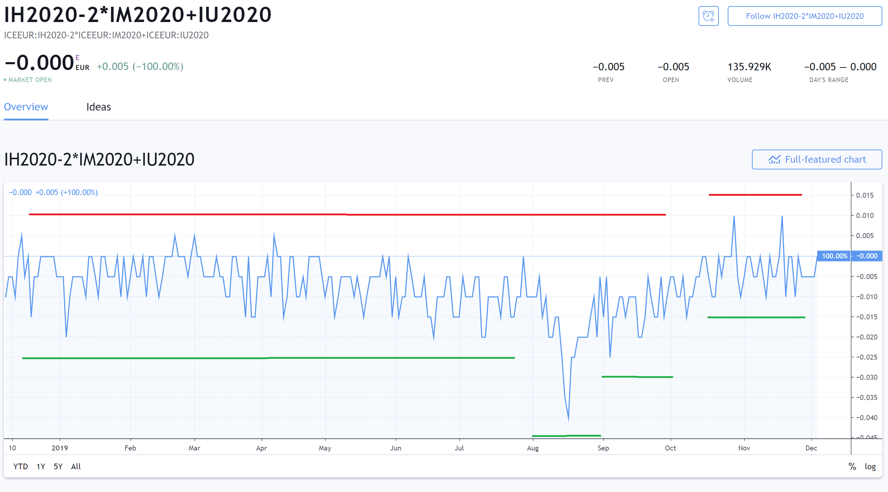

Futures trading has firmly established itself as a popular method for investors to speculate on the price movements of a wide range of assets, such as commodities, currencies, and indices. This financial instrument allows traders to enter into standardized agreements to buy or sell an asset at a set price at a specified future date, providing them with opportunities to hedge risks or achieve speculative goals.

In recent years, the integration of algorithmic trading has significantly revolutionized futures trading. Algorithmic trading, which utilizes computer algorithms, enhances the efficiency and precision of executing trades. These algorithms are capable of analyzing vast amounts of market data rapidly, identifying trading signals, and executing trades at speeds unmatched by human traders. This technological advancement offers traders the opportunity to implement complex futures trading strategies that exploit these identified market opportunities with greater accuracy and speed.



This article examines how algorithmic trading intersects with futures trading strategies, offering insights into enhancing trading performance through the use of algorithms. We will discuss the advantages of this modern approach, such as the increased accuracy of trade execution and the reduction in transaction costs, while also addressing some of the challenges and risks inherent in such systems. By gaining a thorough understanding of these strategies, traders can potentially enhance their ability to compete and succeed in today's fast-paced markets. Whether you are an experienced trader or just starting out, mastering algorithmic futures trading strategies is essential for maintaining a competitive advantage.

## Table of Contents

## Understanding Futures Trading

Futures trading involves the buying and selling of futures contracts, which are standardized agreements obligating the exchange of an asset at a specified price on a predetermined future date. These contracts serve several purposes, notably hedging against price fluctuations, speculating on potential market movements, and engaging in arbitrage opportunities.

Futures contracts are available across diverse asset classes. These include commodities like oil and gold, financial instruments like currencies and indices, and even interest rates. The versatility in asset choice allows traders to execute strategies tailored to specific market conditions.

One of the distinguishing features of futures trading is leverage. Leverage permits traders to control a large position size with a comparatively smaller amount of capital. This characteristic amplifies potential returns, but it also escalates risk, necessitating strategic risk management. The liquidity of futures markets adds another layer of attractiveness for traders, ensuring the ability to enter and [exit](/wiki/exit-strategy) positions with relative ease and minimal price impact.

To effectively develop trading strategies in futures markets, comprehensive knowledge of market operations is indispensable. Familiarity with the workings of futures exchanges, contract specifications, and the interplay of supply and demand dynamics enhances strategic decision-making. It is also essential to understand the regulatory environment and its implications for futures trading activities.

A critical component of futures trading is margin. Traders are required to maintain a margin account with the exchange or broker, serving as collateral to cover potential losses. Initial margin is the upfront amount required to open a position, while maintenance margin is the minimum balance needed to keep the position open. If the account balance falls below the maintenance margin, a margin call occurs, necessitating additional funds to sustain the position.

The functionality of futures contracts in facilitating hedging, speculation, and [arbitrage](/wiki/arbitrage) can be exemplified through scenarios such as a wheat farmer locking in a sale price to hedge against potential market downturns, or an investor seeking to capitalize on anticipated price movements in foreign exchange markets. Understanding these applications allows traders to harness futures contracts effectively as a tool for financial management and opportunity exploitation.

 to Algorithmic Trading

Algorithmic trading, often referred to as algo trading, is a trading approach that utilizes computer algorithms to automate the process of making trading decisions and executing them. This technique leverages sophisticated algorithms that can analyze vast datasets quickly, identify potential trading opportunities, and execute trades with remarkable speed. This level of efficiency greatly minimizes the risk of human error, which can occur in manual trading processes.

In modern financial markets, [algorithmic trading](/wiki/algorithmic-trading) is extensively employed by a range of market participants, including institutional investors, hedge funds, and individual traders. These participants use algo trading to establish a competitive edge by executing trades faster and more accurately than possible with traditional methods. The automation provided by algorithms allows for the execution of complex and multifaceted trading strategies, which would be challenging to manage manually due to the speed and precision required.

With respect to futures trading specifically, algorithmic trading can be exceptionally beneficial. One prime advantage is the optimization of trade execution. Algorithms can reduce slippage, which is the difference between the expected price of a trade and the actual price at which the trade is executed. By enhancing order timing, these algorithms ensure that trades are made at the most opportune moments, thereby maximizing potential returns.

For example, consider an algorithm designed to execute trades based on the moving average crossover strategy. In Python, one could implement a simple trading algorithm using the following pseudocode:

```python
def moving_average_strategy(prices, short_window, long_window):
    short_moving_avg = prices.rolling(window=short_window).mean()
    long_moving_avg = prices.rolling(window=long_window).mean()

    signals = pd.DataFrame(index=prices.index)
    signals['signal'] = 0.0

    # Create long position signals
    signals['signal'][short_window:] = np.where(
        short_moving_avg[short_window:] > long_moving_avg[short_window:], 1.0, 0.0)

    # Generate trading orders
    signals['positions'] = signals['signal'].diff()

    return signals
```

This snippet demonstrates how trading signals could be generated when a short-term moving average crosses above a long-term moving average, indicating a potential buying opportunity. The reverse indicates a selling opportunity. Such implementation showcases how algorithmic trading harnesses technology to improve trade execution efficiency and accuracy.

Understanding algorithmic trading allows traders to take full advantage of its potential in futures markets. Despite its challenges, the capability to execute complex strategies swiftly and minimize human bias positions algorithmic trading as an invaluable tool in the financial landscape.

## Benefits of Using Algorithms in Futures Trading

Algorithmic trading in futures markets provides traders with the ability to process and react to vast quantities of market data in real time. This capability offers insights that would be difficult to obtain through manual trading alone. By leveraging algorithms, traders can swiftly identify patterns and trends that can inform their trading decisions, which enhances the precision of trade execution.

One of the primary advantages of algorithmic trading is its speed and efficiency, which help to reduce both transaction costs and execution risks. The rapid processing power of algorithms enables them to recognize and act upon trading opportunities immediately, thereby minimizing slippage—a common issue in manual trading where prices change between the time a trade is initiated and executed. This is particularly important in markets with high [volatility](/wiki/volatility-trading-strategies), where prices can change rapidly.

Another significant benefit is the capacity for [backtesting](/wiki/backtesting) trading strategies using historical data. Backtesting involves applying an algorithmic strategy to past market data to evaluate its potential effectiveness. This process helps traders refine their strategies before deploying them in live markets, ensuring they are robust and adaptable to various conditions. The ability to test a strategy extensively against historical data can provide insights into potential pitfalls and areas for adjustment, leading to more informed decision-making.

Algorithmic trading also facilitates the creation of customized trading strategies tailored to specific market conditions and trader objectives. This customization is achieved through the use of complex algorithms that can adapt to different scenarios, allowing traders to optimize their strategies for maximum profitability. With the aid of algorithms, traders can implement strategies that are specifically designed to capitalize on trends, mean reversions, arbitrage opportunities, or other market behaviors.

Furthermore, the systematic nature of algorithmic trading reduces emotional biases that often influence manual trading decisions. Emotional trading, driven by fear or greed, can lead to inconsistent and suboptimal results. By relying on predetermined rules and algorithms, traders can ensure that their strategies are executed consistently, without being swayed by market sentiment or psychological pressure.

In summary, algorithmic trading offers significant advantages in the futures markets by enabling traders to analyze vast amounts of data quickly and efficiently, reduce costs and risks, refine strategies through backtesting, create tailored trading approaches, and eliminate emotional biases. These benefits contribute to more disciplined and potentially more profitable trading practices.

## Common Algorithmic Futures Trading Strategies

Trend Following: This strategy involves identifying and capitalizing on trending markets through technical indicators such as moving averages. Trend following is based on the notion that prices in motion will continue in that direction. Traders typically use indicators like moving averages, moving average crossovers, or the Average Directional Index (ADX) to determine and confirm the direction of the trend. For instance, a simple moving average crossover strategy may involve buying when a shorter-term moving average crosses above a longer-term moving average and selling when the reverse occurs.

Mean Reversion: Traders employing mean reversion strategies aim to profit from price corrections by trading against short-term market movements. This strategy operates on the principle that prices will revert to their historical mean or average level after diverging significantly. Indicators such as Bollinger Bands or the Relative Strength Index (RSI) are commonly used to identify overbought or oversold conditions. By executing trades during these conditions, traders seek to capitalize on anticipated reversals.

Arbitrage: Arbitrage strategies exploit price discrepancies between related futures contracts to achieve risk-free profits. These discrepancies may arise due to inefficient market pricing or temporary imbalances in supply and demand. Traders can employ [statistical arbitrage](/wiki/statistical-arbitrage), which involves identifying and trading on pricing inefficiencies between correlated futures contracts. For instance, if two similar commodity futures show divergent prices due to market noise, an algorithm can simultaneously buy the undervalued and sell the overvalued contract to lock in a profit once prices converge.

Market Making: This strategy focuses on profiting from the bid-ask spread by providing [liquidity](/wiki/liquidity-risk-premium) to the market. Market makers continuously submit buy and sell limit orders at quoted bid and ask prices, [earning](/wiki/earning-announcement) the spread as their profit. Advanced algorithms can dynamically adjust quotes to adapt to changing market conditions, thereby managing inventory risk and maximizing profitability. Market making requires sophisticated algorithmic infrastructure to ensure rapid order execution and to hedge exposure efficiently.

Momentum: Momentum strategies involve taking positions aligned with market [momentum](/wiki/momentum), expecting that prices will continue in the same direction. Momentum trading capitalizes on the continuation of an existing trend. Traders use indicators such as the Moving Average Convergence Divergence (MACD) or momentum oscillators to detect and confirm momentum signals. For instance, if the MACD line crosses above the signal line, indicating bullish momentum, an algorithm might trigger a buy order. Conversely, a bearish momentum signal would trigger a sell order, facilitating the capture of ongoing price movements.

These algorithmic futures trading strategies leverage computational power to automate identification, execution, and risk management processes, aiming to enhance returns across different market conditions.

## Challenges and Risks in Algorithmic Futures Trading

Algorithmic futures trading presents several challenges and risks that traders must navigate to ensure successful implementation and performance. One of the primary challenges is the considerable investment required in technology and infrastructure. High-frequency trading, a subset of algorithmic trading, demands advanced computing power and low-latency networks to process large volumes of data and execute trades at high speeds. This infrastructure must be capable of handling real-time market data and executing trades with minimal delay to maintain a competitive edge.

Continuously monitoring and adapting trading strategies to current market conditions is crucial. Market dynamics can shift rapidly, influenced by factors such as economic announcements, geopolitical events, or changes in market sentiment. Without regular adjustments, algorithms risk underperforming or incurring losses. Additionally, the development of adaptive algorithms that can modify their parameters based on real-time feedback can mitigate this challenge, though such systems can be complex and resource-intensive to design.

Another significant risk is the over-reliance on backtested data. While backtesting is an essential step in developing trading algorithms, it can sometimes create a false sense of security. Historical data might not adequately capture future market conditions, leading to potential discrepancies in algorithm performance. To mitigate this risk, traders should employ rigorous validation techniques, including walk-forward analysis and out-of-sample testing, to ensure that strategies are robust across different market environments.

Algorithmic trading systems are also susceptible to flash crashes or unexpected market events. These events can cause significant price volatility and liquidity shortages, posing risks to automated trading strategies that may not be equipped to handle such sudden changes. Implementing comprehensive risk management protocols, such as circuit breakers or volatility filters, can help protect against these risks.

Regulatory challenges also exist due to the complexity and opacity of algorithmic trading systems. Regulatory bodies, such as the Securities and Exchange Commission (SEC) in the United States or the European Securities and Markets Authority (ESMA), have implemented rules to promote transparency and prevent market manipulation. Traders must ensure that their algorithms comply with these regulations, which often require detailed logs of trades, auditable systems, and adherence to specific reporting requirements.

In summary, while algorithmic futures trading offers numerous advantages, traders must be vigilant in addressing the associated challenges and risks. A robust infrastructure, dynamic strategy adaptation, precaution against over-reliance on historical data, effective risk management, and regulatory compliance are all essential components of a successful algorithmic trading operation.

## Developing a Successful Algo-Based Futures Trading Strategy

Developing a successful algorithmic-based futures trading strategy requires meticulous planning and a structured approach. At the outset, it's crucial to establish clear objectives. Traders should define what they aim to achieve, whether it's maximizing profit, minimizing risk, or achieving a balance of both. Understanding personal risk tolerance is pivotal, as it influences the design of the strategy and dictates the acceptable level of potential loss. Market preferences should also be considered, such as focusing on specific asset classes or trading in particular market conditions.

Investment in robust trading platforms and data feeds is essential for accessing accurate and timely market information. These tools provide the foundation for developing sophisticated algorithms. Platforms should be capable of handling high-frequency data and complex computations to enable efficient algorithm execution. Reliable data feeds ensure that the algorithms operate on current information, reducing latency and increasing the likelihood of successful trades.

The design of trading algorithms must integrate comprehensive risk management protocols. This involves setting stop-loss limits, defining position sizes, and establishing diversification rules to prevent substantial losses. Strategies should be designed to adapt quickly to changing market conditions, incorporating elements like volatility indicators or dynamic position sizing.

Backtesting is a vital step that involves applying algorithms to historical market data to evaluate their performance. This process helps identify strengths and weaknesses in the strategy, allowing traders to refine their approach. The results of backtests can be quantitatively analyzed using metrics such as the Sharpe ratio, maximum drawdown, and return on investment (ROI). Code for a simple backtest framework in Python might look like this:

```python
import numpy as np

def backtest(prices, strategy):
    initial_capital = 100000
    positions = strategy(prices)
    returns = np.diff(prices) / prices[:-1]
    portfolio_values = initial_capital + np.cumsum(positions[:-1] * returns)
    sharpe_ratio = (portfolio_values.mean() / portfolio_values.std()) * np.sqrt(252)  # Annualized
    return portfolio_values, sharpe_ratio
```

Remaining informed about the advancements in algorithmic trading technology and changes in regulatory frameworks is necessary to stay competitive. Technology evolves rapidly, offering new tools and methods for improving algorithm performance. Additionally, regulatory bodies frequently update rules that govern trading activities, making compliance an ongoing concern. Being updated ensures that strategies remain viable and legally compliant.

In summary, a successful algo-based futures trading strategy hinges on clear objective setting, investment in high-quality infrastructure, rigorous risk management, detailed backtesting, and continual knowledge enhancement. This systematic approach helps traders to navigate the complexities of the futures markets while maximizing strategic efficacy.

## Conclusion

Algorithmic trading has fundamentally altered futures trading by enabling traders to execute complex strategies with minimal latency and high accuracy. By mastering the principles and strategies discussed in this article, traders can strengthen their ability to navigate futures markets effectively. While algorithmic futures trading is fraught with both technological and market-related challenges, the benefits are considerable for those who commit the required time and resources. 

Success in this domain hinges on continuous learning and adaptation, coupled with a disciplined approach to strategy execution and risk management. Whether you are involved in trend-following strategies, arbitrage opportunities, or another method, algorithms offer a powerful tool to enhance trading outcomes. Implementing algorithms can significantly amplify returns, as they provide the computational power to analyze vast datasets and execute trades faster and more efficiently than human traders. 

This leads to improved decision-making, risk management, and the ability to capitalize on fleeting market opportunities. Moreover, by automating repetitive tasks, algorithms reduce emotional biases, enabling more rational trading decisions. As the technology evolves, staying updated on advancements and regulatory changes will be crucial for maintaining a competitive edge.

## References & Further Reading

[1]: Bergstra, J., Bardenet, R., Bengio, Y., & Kégl, B. (2011). ["Algorithms for Hyper-Parameter Optimization."](https://dl.acm.org/doi/10.5555/2986459.2986743) Advances in Neural Information Processing Systems 24.

[2]: ["Advances in Financial Machine Learning"](https://www.amazon.com/Advances-Financial-Machine-Learning-Marcos/dp/1119482089) by Marcos Lopez de Prado

[3]: ["Evidence-Based Technical Analysis: Applying the Scientific Method and Statistical Inference to Trading Signals"](https://www.amazon.com/Evidence-Based-Technical-Analysis-Scientific-Statistical/dp/0470008741) by David Aronson

[4]: ["Machine Learning for Algorithmic Trading"](https://github.com/stefan-jansen/machine-learning-for-trading) by Stefan Jansen

[5]: ["Quantitative Trading: How to Build Your Own Algorithmic Trading Business"](https://books.google.com/books/about/Quantitative_Trading.html?id=j70yEAAAQBAJ) by Ernest P. Chan