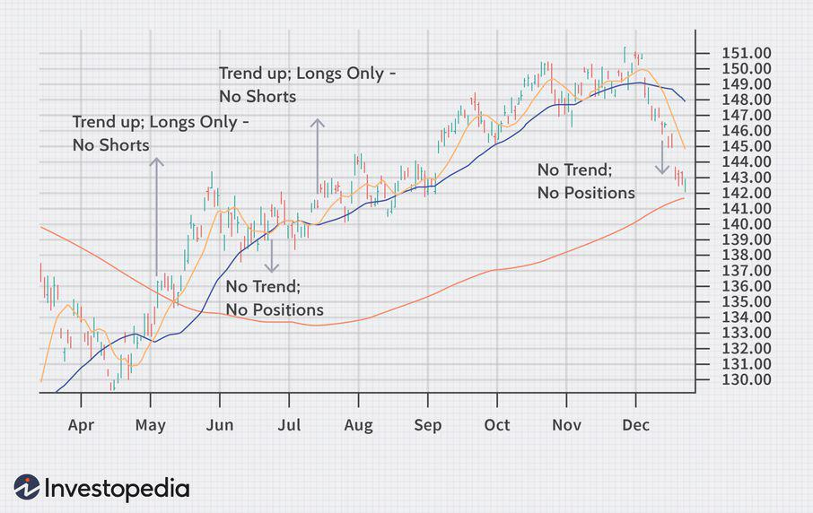

Futures trading presents traders with the potential for significant gains, leveraged by the ability to control large positions with a relatively small amount of capital. The appeal of futures trading lies not only in its potential for high returns but also in the rapid pace at which these returns can be achieved. However, the same leverage that offers the opportunity for sizable profits also brings with it a heightened risk of loss. Successful trading in this high-stakes environment necessitates a strategic approach, incorporating both trend indicators and algorithmic trading strategies to identify market movements and execute trades effectively.

Trend indicators, such as moving averages and other technical analysis tools, provide invaluable insights into market direction and momentum. These indicators are essential for timing entry and exit points, aiding traders in aligning their strategies with prevailing market trends. When used effectively, they can significantly enhance a trader's ability to predict and capitalize on market movements, thus maximizing potential gains while mitigating risks.



Algorithmic trading, meanwhile, offers a technological edge through the use of advanced algorithms that can process vast amounts of data at high speed. These systems execute trades automatically based on pre-defined criteria, reducing human errors and emotional biases. By integrating trend indicators with algorithmic strategies, traders can optimize their performance in futures markets, benefiting from both the speed and precision that technology provides.

In recognizing the inherent risks of futures trading—especially those amplified by leverage—a comprehensive understanding and application of these strategic tools are paramount. This article will focus on key trend indicators and the role of algorithmic trading in enhancing trading efficiency and effectiveness. We will also explore how combining human intuition with automated systems can potentially yield superior trading outcomes. Through this exploration, the aim is to empower traders to harness the full potential of futures trading while carefully managing the associated risks.

## Table of Contents

## Understanding Futures Trading

Futures trading is a form of financial trading where participants engage in buying or selling contracts that obligate them to transact an asset at a predetermined price on a specified future date. Unlike traditional stocks, futures contracts do not confer ownership of the underlying asset. Instead, they focus on speculation or hedging against price movements in various commodities, currencies, indices, or financial instruments.

One of the hallmark features of futures trading is the use of leverage. Leverage allows traders to control a large position with a relatively small amount of capital, often referred to as margin. For instance, a trader might only need to put up 10-20% of the contract's total value to participate. While leverage amplifies potential gains, it equally magnifies potential losses, necessitating strict risk management strategies.

The futures market is characterized by rapid price movements and extensive daily trading volumes, which make timely and effective trading strategies essential to achieve potential gains. Traders must be adept at predicting market trends and responding promptly to market signals to capitalize on these opportunities. For example, a sudden change in geopolitical conditions or economic data can lead to swift shifts in market sentiment, thereby affecting contract values.

Understanding the mechanics of futures markets is critical for traders seeking to develop sound trading strategies. This involves familiarizing oneself with concepts such as margin requirements, settlement procedures, and contract specifications. Additionally, traders often incorporate a blend of technical and [fundamental analysis](/wiki/fundamental-analysis) to inform their strategies. Technical analysis might involve the use of charts and trend indicators, while fundamental analysis could focus on macroeconomic factors affecting the underlying asset. These analytical tools help identify patterns and trends that guide trading decisions.

Overall, futures trading offers substantial potential for profit, but it requires a comprehensive understanding of market dynamics and disciplined execution of strategies to effectively manage risks associated with high leverage and market [volatility](/wiki/volatility-trading-strategies).

## Key Trend Indicators in Futures Trading

Trend indicators are essential tools that assist traders in determining the direction and accessibility of trends, which are crucial for optimizing entry and [exit](/wiki/exit-strategy) points in futures trading. Their capacity to analyze the movement and [momentum](/wiki/momentum) of market prices provides traders with valuable insights into whether a trend is strengthening or weakening, ultimately increasing the likelihood of successful trades.

One of the most widely used trend indicators is the moving average, which helps smooth out price data to identify the direction of the trend. Moving averages can be simple (SMA) or exponential (EMA), with the latter giving more weight to recent prices, making it more responsive to new information. The moving average is often used to generate signals by comparing different time frames; for instance, a short-term moving average crossing above a long-term moving average may signal a potential upward trend.

Moving Average Convergence Divergence (MACD) is another popular trend indicator that combines moving averages with momentum. The MACD measures the difference between a short-term EMA and a long-term EMA, while also featuring a signal line, which is a moving average of the MACD line itself. Traders often look for points where the MACD line crosses the signal line to identify potential buying or selling opportunities. A positive MACD value indicates an upward trend, while a negative value points to a downward trend.

The Average Directional Index (ADX) is a trend strength indicator that quantifies the strength of a trend, regardless of its direction. The ADX is part of the Directional Movement System developed by J. Welles Wilder Jr., which also includes two other lines, the Plus Directional Indicator (+DI) and the Minus Directional Indicator (−DI). The ADX is typically plotted as a smoothed moving average of the directional movement index. A high ADX value suggests a strong trend, whereas a low value indicates a weak trend or a ranging market.

To effectively apply these trend indicators, traders should incorporate them into their broader strategy, considering market conditions and combining multiple indicators to confirm trends. For example, a trader could use moving averages to identify the trend direction and MACD to assess momentum, while relying on the ADX for assessing trend strength. This holistic approach contributes to reducing the risk of mistimed trades and enhancing the probability of capturing significant market movements. 

In summary, trend indicators such as moving averages, MACD, and ADX are invaluable to futures traders seeking to understand market dynamics and refine their decision-making processes. By carefully applying these tools, traders can enhance their ability to trade in alignment with the prevailing market direction, ultimately leading to more informed and potentially profitable trading decisions.

 to Algo Trading in Futures Markets

Algorithmic trading, commonly referred to as algo trading, leverages computer algorithms to execute trades based on pre-set parameters such as timing, price, and [volume](/wiki/volume-trading-strategy). This method of trading allows for faster and more efficient processing of complex data, enabling traders to seize fleeting market opportunities that might otherwise be overlooked in manual trading environments. 

One of the primary advantages of [algorithmic trading](/wiki/algorithmic-trading) is its ability to eliminate emotional biases that can negatively impact trading decisions. By adhering strictly to predefined rules and strategies, algorithms facilitate a more consistent and disciplined approach to trading. This consistency is critical in achieving a methodical application of trading strategies, thereby enhancing overall outcomes.

Popular algo trading strategies include [arbitrage](/wiki/arbitrage), trend-following, and market-making. Each strategy serves a distinct purpose within the trading ecosystem:

1. **Arbitrage**: This strategy exploits price differentials of the same asset across different markets. By buying low in one market and selling high in another, traders can profit from these momentary discrepancies. Algorithms are particularly suited for this strategy due to their ability to rapidly scan multiple markets and execute trades instantly.

   Python Example:
   ```python
   if price_market_1 < price_market_2:
       buy(asset, volume, market_1)
       sell(asset, volume, market_2)
   ```

2. **Trend-following**: A trend-following strategy involves algorithms that identify and capitalize on existing market trends. This might involve using moving averages or other trend indicators to determine entry and exit points. The goal is to ride a trend for as long as possible to maximize gains.

3. **Market-making**: Market-making involves placing simultaneous buy and sell orders to capitalize on the bid-ask spread. Algorithms help in continuously making markets while adjusting to order flows and newly emerging prices, thereby providing liquidity to the market.

Incorporating these strategies into a comprehensive algorithmic trading system requires a keen understanding of both market dynamics and technical infrastructure. Algo trading systems must be robust and adaptable, capable of integrating various market indicators and signals while executing trades with minimal latency. As markets continue to evolve, the role of algorithmic trading is poised to increase, offering traders a competitive edge through advanced technological means.

## Developing an Effective Trading Strategy

Creating a successful trading strategy in futures markets entails the synthesis of diverse market analyses and indicators to form a well-rounded approach. A cohesive trading plan integrates technical analysis, chart patterns, and fundamental data to navigate the volatile futures landscape effectively. The following components are integral to developing a robust strategy:

### Backtesting Strategies

Backtesting involves applying a trading strategy to historical data to assess its viability before live deployment. This step assists in evaluating the strategy's performance under varying market conditions, thereby highlighting potential strengths and weaknesses. 

Python, being a preferred language for quantitative analysis, offers libraries such as `pandas`, `numpy`, and `[backtrader](/wiki/backtrader)` to aid in [backtesting](/wiki/backtesting). Here’s a simple illustration of a backtesting model using Python’s `backtrader` library:

```python
import backtrader as bt

class TestStrategy(bt.Strategy):
    def __init__(self):
        self.sma = bt.indicators.SimpleMovingAverage(self.data, period=15)

    def next(self):
        if self.data.close > self.sma:
            self.buy()
        elif self.data.close < self.sma:
            self.sell()

cerebro = bt.Cerebro()
cerebro.addstrategy(TestStrategy)
data = bt.feeds.YahooFinanceData(dataname='AAPL', fromdate='2020-01-01', todate='2020-12-31')
cerebro.adddata(data)
cerebro.run()
cerebro.plot()
```

### Risk Management Techniques

Effective risk management is fundamental in preserving capital and ensuring long-term sustainability in trading. Essential techniques include:

- **Stop-Loss Orders**: Automatically close a trade when it reaches a certain price to limit potential losses. For instance, setting a stop-loss order at 2% below the purchase price can shield against excessive drawdowns.

- **Position Sizing**: Determining the appropriate amount of capital to allocate to a trade, governed by risk tolerance and market conditions. A commonly used formula is:
$$
  \text{Position Size} = \frac{\text{Risk Capital}}{\text{Trade Risk (Entry Price - Stop Loss)}}

$$

- **Diversification**: Spreading investments across various assets to reduce risk exposure. This approach minimizes the impact of adverse price movements in any single asset.

### Continuous Learning and Adaptation

The dynamic nature of futures markets necessitates a commitment to continuous learning and adaptation. Market conditions, economic indicators, and geopolitical events can influence market trends, requiring traders to remain informed and flexible. Leveraging educational resources, attending webinars, and participating in trading communities can enhance a trader’s knowledge base. Moreover, adapting strategies in response to market developments ensures the trading approach remains effective.

In conclusion, building an effective trading strategy in futures markets involves a balanced consideration of technical and fundamental analyses, methodical risk management practices, and a mindset geared towards ongoing education and adaptation. These elements collectively facilitate achieving trading objectives while mitigating inherent market risks.

## Risk Management in Futures and Algorithmic Trading

Effective risk management is essential in futures trading, primarily due to the inherent risks associated with leverage. Leverage allows traders to control larger positions with relatively small amounts of capital, amplifying both potential gains and losses. As a result, the risks are proportionally increased, making risk management a crucial component of successful trading.

One fundamental technique for managing these risks is setting clear limits on trades. This involves determining the maximum amount of capital to be invested in any single trade and adhering to these predefined limits. Consistency in applying these constraints helps prevent excessive exposure to market volatility. Stop-loss orders serve as another vital risk management tool, automatically selling a position when it reaches a certain price level. This ensures that losses are capped at an acceptable threshold, protecting the trader from significant financial decline.

Diversification is another critical strategy in risk mitigation. By spreading investments across different futures contracts or trading a variety of financial instruments, traders can reduce the impact of a poor-performing asset on the overall portfolio's health. Diversification protects the trader from the adverse effects of market fluctuations specific to a single asset or market.

Algorithmic systems have enhanced the capacity for risk management by incorporating risk parameters directly into trading strategies. These systems can consistently apply risk management techniques like stop-loss orders and position sizing, ensuring that trades adhere to predefined risk levels. For example, if a trader wishes to limit their risk to 2% of their total capital per trade, an algorithm can automatically adjust position sizes to maintain this risk level.

Regularly evaluating and updating risk management practices is essential for maintaining a balanced approach to futures trading. Markets are dynamic, and what might be a robust strategy today could become ineffective as conditions change. Traders should periodically review their risk management frameworks to ensure they remain aligned with current market trends and the trader's risk tolerance. Quantitative methods, such as Value at Risk (VaR) calculations and stress testing, can provide insights into the potential risks under different market scenarios.

In conclusion, effective risk management in futures and algorithmic trading involves a multifaceted approach that includes setting trade limits, utilizing stop-loss orders, maintaining portfolio diversification, and leveraging algorithmic strategies. Consistent evaluation and adjustment of these practices are necessary to navigate the complexities and volatility of futures markets adeptly.

## Future Trends in Algo and Futures Trading

Algorithmic trading continues to evolve through advances in [artificial intelligence](/wiki/ai-artificial-intelligence) (AI) and [machine learning](/wiki/machine-learning) (ML). These technologies enhance the analysis of complex datasets, enabling traders to extract deeper insights and make informed decisions. AI algorithms, for instance, can refine trading models by continuously adapting to market conditions, a process that is crucial in fast-paced futures markets. Machine learning models, such as [reinforcement learning](/wiki/reinforcement-learning), can autonomously learn optimal trading strategies via trial and error, improving predictions over time.

The accessibility of algorithmic trading tools has surged in recent years, bolstered by technological advancements and reduced costs of computing power. This democratization of technology allows retail traders access to sophisticated trading platforms and resources that were once exclusive to large institutional investors. Retail traders can now develop and backtest their algorithms using platforms like QuantConnect and TradingView, supporting the diversification and customization of trading strategies. This shift narrows the competitive gap between individual traders and institutional entities, promoting greater market participation.

Sentiment analysis is another promising trend shaping the future of trading. By analyzing data from social media platforms, news articles, and forums, traders can gauge market sentiment and anticipate potential price movements. Sentiment analysis tools examine linguistic patterns and context, providing an additional layer of predictive capability. For instance, a surge in positive sentiment about a particular commodity or economic indicator might signal a potential rise in its value. Incorporating sentiment analysis into trading algorithms could therefore enhance their responsiveness and predictive accuracy.

Traders who integrate these technological advances with existing strategies are poised to achieve a competitive edge. The combination of AI and ML capabilities with traditional trend indicators and risk management practices enables a holistic approach to trading. The potential for real-time data analysis and strategy adaptation enhances traders' ability to respond swiftly to market changes and make data-driven decisions.

In conclusion, as algorithmic trading tools and technologies become more sophisticated and accessible, market participants who leverage these developments are likely to maintain a strategic advantage. The integration of AI, ML, and sentiment analysis, paired with continuous strategy refinement, offers a promising outlook for the future of trading, marking an exciting evolution in market engagement and decision-making processes.

## Conclusion

Futures trading, coupled with the strategic application of trend indicators and algorithmic trading, provides traders with significant opportunities for substantial returns. This synergy between human insight and technology allows for precise execution of trades and improved prediction of market movements. However, a diligent approach to strategy development and stringent risk management is essential to effectively navigate the inherent volatility of futures markets. 

As technologies continue to evolve, the trading landscape presents new opportunities that require traders to adapt continuously. Advances in artificial intelligence and machine learning are particularly noteworthy, as they offer enhanced data analysis capabilities and predictive accuracy. The ability to integrate sentiment analysis from emerging data sources, such as social media, further enriches a trader's toolkit.

In this dynamic environment, successful futures trading hinges on disciplined strategy execution, coupled with a commitment to continual learning and adaptation. This approach ensures not only capital preservation but also positions traders advantageously to capitalize on market shifts. By combining the strengths of human intuition and automated systems, traders can optimize their trading performance and maintain a competitive edge.

## References & Further Reading

[1]: Bergstra, J., Bardenet, R., Bengio, Y., & Kégl, B. (2011). ["Algorithms for Hyper-Parameter Optimization."](https://dl.acm.org/doi/10.5555/2986459.2986743) Advances in Neural Information Processing Systems 24.

[2]: ["Advances in Financial Machine Learning"](https://www.amazon.com/Advances-Financial-Machine-Learning-Marcos/dp/1119482089) by Marcos Lopez de Prado

[3]: ["Evidence-Based Technical Analysis: Applying the Scientific Method and Statistical Inference to Trading Signals"](https://www.amazon.com/Evidence-Based-Technical-Analysis-Scientific-Statistical/dp/0470008741) by David Aronson

[4]: ["Machine Learning for Algorithmic Trading"](https://github.com/stefan-jansen/machine-learning-for-trading) by Stefan Jansen

[5]: ["Quantitative Trading: How to Build Your Own Algorithmic Trading Business"](https://github.com/LucindaYa/quant-resources/blob/master/Quantitative%20Trading%20How%20to%20Build%20Your%20Own%20Algorithmic%20Trading%20Business.pdf) by Ernest P. Chan