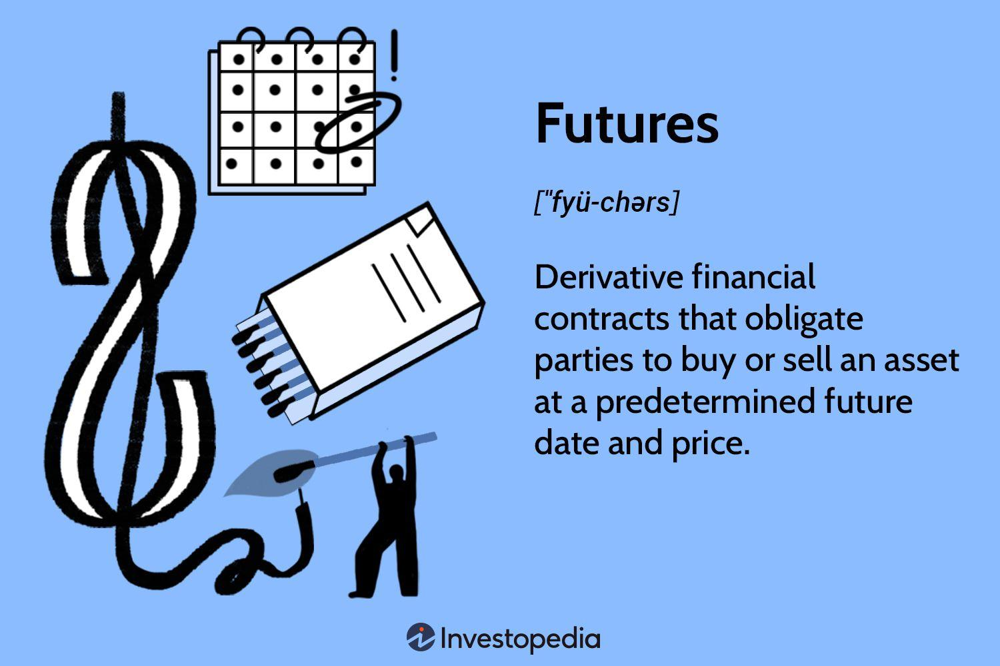

## Table of Contents

## What is futures trading?

Futures trading is when people buy and sell contracts that promise to trade something at a future date. This "something" can be anything from farm products like wheat and corn, to financial things like stock indexes or currencies. The price for the future trade is set today, but the actual trading happens later. People use futures to guess where prices might go or to protect themselves from price changes.

For example, a farmer might sell a futures contract for their wheat to make sure they get a good price, even if the market price drops later. On the other hand, a bakery might buy that contract to lock in a price for wheat, so they know their costs won't go up. Traders who don't actually need the wheat might also buy and sell these contracts, hoping to make money if they guess the price changes correctly. This kind of trading can be risky because prices can be hard to predict.

## How does a futures contract work?

A futures contract is like a promise between two people to buy or sell something at a set price on a specific date in the future. This "something" could be anything from oil to gold, or even financial products like stock indexes. When you buy a futures contract, you're agreeing to buy the item at the agreed price when the contract ends. If you sell a futures contract, you're promising to sell the item at that price. The price is decided today, but the actual buying or selling happens later.

Let's say you're a farmer and you want to make sure you get a good price for your corn next year. You can sell a futures contract now, agreeing to sell your corn at today's price, even if the price drops by next year. This way, you know exactly how much money you'll get. On the other hand, if you're a company that needs corn, you can buy a futures contract to lock in today's price, so you don't have to worry if the price goes up later. This helps both the farmer and the company plan their finances better.

## What are the main types of futures contracts?

There are several main types of futures contracts that people trade. One type is commodity futures, which are contracts for physical goods like oil, gold, wheat, and corn. These are popular because they help farmers, miners, and companies that use these goods to manage the risk of price changes. For example, an airline might use oil futures to lock in a price for fuel, while a jeweler might use gold futures to manage the cost of their materials.

Another type is financial futures, which are contracts for financial products like stock indexes, interest rates, and currencies. These are used by investors and financial institutions to bet on where they think the market is going or to hedge against risks. For example, a pension fund might use stock index futures to protect against a drop in the stock market, while a bank might use [interest rate](/wiki/interest-rate-trading-strategies) futures to manage the risk of changing interest rates.

The third type is currency futures, which are specifically for trading different currencies. These are used by businesses and investors who need to deal with foreign money. For example, a company that does a lot of business in Europe might use euro futures to protect against changes in the exchange rate between the euro and their home currency.

## What are the benefits of trading futures?

Trading futures can help people manage risk. If you're a farmer or a business that needs certain goods, futures can lock in prices today so you don't have to worry if prices go up or down later. This makes planning easier because you know what your costs or income will be. For example, a farmer can sell wheat futures to make sure they get a good price for their crop, even if the market price drops before they sell.

Futures trading also gives people a chance to make money by guessing where prices will go. If you think the price of oil will go up, you can buy oil futures now and sell them later at a higher price. This can be exciting and profitable, but it's also risky because prices can be hard to predict. Traders need to be careful and understand the market well to do well in futures trading.

## What are the risks involved in futures trading?

Futures trading can be risky because prices can change a lot. If you guess wrong about where prices are going, you could lose a lot of money. For example, if you buy a futures contract thinking the price will go up, but it goes down instead, you'll have to sell it at a lower price and lose money. This kind of trading is not for everyone because it can be hard to predict what will happen in the market.

Another risk is that futures contracts use something called leverage, which means you can control a big contract with just a small amount of money. While this can make your profits bigger, it can also make your losses bigger. If the market moves against you, you might have to put in more money to keep your position, and if you can't, you could lose everything you put in. So, it's important to understand how leverage works and to be ready for the possibility of big losses.

## How can someone start trading futures?

To start trading futures, you first need to open an account with a brokerage firm that offers futures trading. Look for a broker that is reputable and offers good customer service, as well as tools and resources to help you learn about futures trading. Once you've chosen a broker, you'll need to fill out an application and provide some personal information. After your account is approved, you'll need to deposit money into it, known as margin, which is the amount required to start trading futures.

Once your account is set up and funded, you can start looking at different futures contracts. You'll need to decide what you want to trade, like commodities, financial products, or currencies. It's a good idea to start with something you understand well. You can then place your first trade through your broker's trading platform. Remember, futures trading can be risky, so it's important to learn as much as you can before you start and to only trade with money you can afford to lose.

## What is margin in futures trading and how does it work?

Margin in futures trading is like a down payment you make to open a futures contract. It's not the full price of the contract, but just a small part of it. This is called trading on margin, and it lets you control a big contract with less money. The margin you need to put down is set by the exchange where the futures are traded, and it can change based on how risky the contract is.

When you trade futures, you need to keep enough money in your account to cover the margin. If the price of the futures contract moves against you, you might get a margin call. This means you need to add more money to your account to keep your position open. If you can't add more money, your broker might close your position to limit their risk. So, it's important to watch your account and be ready to add more money if the market moves against you.

## What are some common strategies used in futures trading?

One common strategy in futures trading is called hedging. This is when someone uses futures to protect against price changes. For example, a farmer might sell wheat futures to lock in a price for their crop, so they don't lose money if the price drops before they sell their wheat. A company that needs wheat might buy those futures to make sure they can buy wheat at a set price, even if the market price goes up. Hedging helps people plan better because they know what their costs or income will be.

Another strategy is called speculation. This is when traders buy and sell futures to make money from price changes. They don't actually need the product; they're just trying to guess where the price will go. For example, if someone thinks the price of oil will go up, they might buy oil futures now and sell them later at a higher price. This can be risky because if the price goes down instead, they could lose money. But if they guess right, they can make a lot of money.

A third strategy is called spreading. This involves buying and selling different futures contracts at the same time to take advantage of price differences. For example, a trader might buy a futures contract for wheat that expires in March and sell a contract for wheat that expires in June. If the price difference between these contracts changes in their favor, they can make money. Spreading can be less risky than speculation because it's based on the relationship between prices, not just guessing where one price will go.

## How do market trends and economic indicators affect futures trading?

Market trends and economic indicators play a big role in futures trading. When people see a trend, like prices going up or down over time, they might decide to buy or sell futures based on that trend. For example, if the price of oil has been going up for a while, traders might buy oil futures because they think the price will keep going up. On the other hand, if they see a trend of prices going down, they might sell futures to avoid losing money. Trends help traders make guesses about where prices might go next.

Economic indicators, like unemployment rates or inflation numbers, also affect futures trading. These indicators give traders information about how the economy is doing, which can change the prices of futures. For example, if a report shows that inflation is going up, traders might expect the price of goods like wheat or oil to go up too, so they might buy futures to take advantage of that. If the economy is doing badly, like if unemployment is high, traders might think prices will go down and sell futures to protect themselves. By watching these indicators, traders can make better decisions about when to buy or sell futures.

## What is the role of futures exchanges and how do they operate?

Futures exchanges are like big marketplaces where people can buy and sell futures contracts. They make sure that trading is fair and safe for everyone. When someone wants to trade a futures contract, they go to the exchange, which matches buyers and sellers. The exchange also sets rules about how much money, or margin, people need to trade and keeps track of all the trades to make sure everything is done right. This helps keep the market stable and trustworthy.

The exchanges also help set the prices of futures contracts. They do this by showing the prices that people are willing to buy and sell at, which everyone can see. This is called the market price, and it changes all the time as people trade. The exchange makes sure that these prices are fair and that no one is cheating. By doing all these things, futures exchanges make it easier and safer for people to trade futures, which helps the whole economy work better.

## How can advanced traders use futures for hedging?

Advanced traders use futures for hedging to protect their investments from big price changes. They might own a lot of a certain thing, like stocks or commodities, and they want to make sure they don't lose too much money if the price goes down. So, they sell futures contracts for that thing. If the price does go down, the money they lose on their investment is made up for by the money they make on the futures contract. This way, they can keep their investment safe without having to sell it right away.

For example, let's say an advanced trader owns a lot of oil. They're worried that the price of oil might drop soon, which would make their investment worth less. To hedge against this risk, they sell oil futures contracts. If the price of oil does drop, the value of their oil goes down, but they make money on the futures contracts they sold. This helps balance out their losses, so they don't lose as much money overall. Hedging with futures is a smart way for advanced traders to manage risk and protect their investments.

## What are the tax implications of trading futures?

When you trade futures, you need to think about taxes. In the United States, profits you make from trading futures are usually taxed at a special rate called the 60/40 rule. This means that 60% of your profits are taxed as long-term capital gains, which have a lower tax rate, and 40% are taxed as short-term capital gains, which are taxed at your regular income tax rate. This can be good for you because it might mean you pay less in taxes than if all your profits were taxed as regular income.

You also need to keep good records of all your trades because you'll need to report them on your tax return. Losses from trading futures can help lower your taxes too. If you lose money, you can use those losses to offset other income, which can reduce the amount of taxes you owe. It's a good idea to talk to a tax professional to make sure you're doing everything right and taking advantage of all the tax benefits you can get from trading futures.

## References & Further Reading

[1]: Bergstra, J., Bardenet, R., Bengio, Y., & Kégl, B. (2011). ["Algorithms for Hyper-Parameter Optimization."](https://papers.nips.cc/paper/4443-algorithms-for-hyper-parameter-optimization) Advances in Neural Information Processing Systems 24.

[2]: ["Advances in Financial Machine Learning"](https://www.amazon.com/Advances-Financial-Machine-Learning-Marcos/dp/1119482089) by Marcos Lopez de Prado

[3]: ["Evidence-Based Technical Analysis: Applying the Scientific Method and Statistical Inference to Trading Signals"](https://www.amazon.com/Evidence-Based-Technical-Analysis-Scientific-Statistical/dp/0470008741) by David Aronson

[4]: ["Machine Learning for Algorithmic Trading"](https://github.com/stefan-jansen/machine-learning-for-trading) by Stefan Jansen

[5]: ["Quantitative Trading: How to Build Your Own Algorithmic Trading Business"](https://www.amazon.com/Quantitative-Trading-Build-Algorithmic-Business/dp/1119800064) by Ernest P. Chan