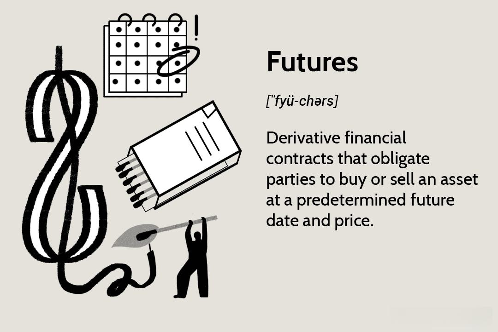

Algorithmic trading, commonly known as algo trading, has fundamentally transformed trade execution processes in financial markets. By utilizing sophisticated computer programs, algo trading automates trading strategies, thereby enhancing both the efficiency and precision of executing trades. This automation is particularly impactful in futures trading, where the necessity for rapid and exact trade execution can significantly influence financial outcomes. Algo trading systems, equipped with the capability to process vast amounts of market data in real-time, can optimize trading strategies, ensuring that conditions such as price changes, volume shifts, and market trends are swiftly acted upon.

The integration of algorithmic trading in futures markets offers traders a myriad of benefits. With the capability to execute trades at speeds impossible for human traders, algo trading reduces the time lag that could otherwise result in financial losses or missed market opportunities. Moreover, the systematic nature of computer-driven strategies ensures that trades are executed based on rigorous data analysis rather than human emotion, which is prone to errors and irrational decisions. As technology continues to evolve, the potential for algo trading to adapt and react to market conditions is unprecedented, paving the way for more innovative and efficient trading systems.



This article will explore how algo trading is shaping the landscape of futures trading, investigating the key benefits and technological advancements propelling its growth. By understanding the tools and strategies at the forefront of this technological wave, traders can better equip themselves to navigate the complexities of modern futures markets and capitalize on emerging opportunities.

## Table of Contents

## Understanding Algorithmic Trading in Futures

Algorithmic trading in futures markets employs computer algorithms to automate and manage trading activities based on predefined rules. This technological advancement allows for quick execution of trades, significantly diminishing the impact of human emotions and errors, which can often lead to irrational decision-making, particularly in volatile markets.

In the futures market, where transactions entail contractual agreements to buy or sell assets at a predetermined price and date, the swift and precise execution of trades is paramount. Algo trading facilitates this by executing trades faster than any human could. Algorithms can be programmed to react to market conditions instantly, thus taking advantage of fleeting opportunities that would otherwise be missed due to human processing delays.

The strategies implemented by algo trading systems can vary widely in their complexity. At the basic end, rule-based systems may execute trades simply when specific criteria are met, such as moving averages crossing each other. An example might be:

```python
def moving_average_strategy(prices, short_window, long_window):
    short_mavg = prices.rolling(window=short_window).mean()
    long_mavg = prices.rolling(window=long_window).mean()

    # Signals for buying and selling
    signals = (short_mavg > long_mavg).astype(int) - (short_mavg < long_mavg).astype(int)
    return signals
```

This Python function calculates signals for buying and selling based on short-term and long-term moving averages, a common rule-based strategy.

On the more sophisticated end, complex algorithms are designed to analyze large volumes of data to detect patterns and opportunities that are not immediately apparent. These algorithms often incorporate statistical models and [machine learning](/wiki/machine-learning) techniques to improve their predictive accuracy and adapt to changing market environments. Such models may integrate various inputs, including historical price data, trading volumes, and even sentiment analysis derived from news data and social media trends.

An essential advantage of these algorithms in the futures market is their ability to operate continuously without fatigue, an invaluable trait given the 24-hour nature of many futures markets. By systematically applying algorithms that are devoid of emotional influence, traders can focus on strategic investment decisions rather than being distracted by the emotional highs and lows that come with traditional trading. 

The integration of algo trading in futures markets has undeniably streamlined trading activities and set the stage for ongoing innovations, contributing to more efficient markets overall.

## Advantages of Algo Trading in Futures

Algorithmic trading in futures markets offers significant advantages, particularly in terms of speed, precision, emotional detachment, and scalability. These advantages stem from the inherent capabilities of computer algorithms to process and act upon market information with unmatched efficiency.

**Speed and Precision**

In the high-octane environment of futures trading, speed is paramount. Algorithmic trading systems can execute trades within milliseconds, far faster than any human could achieve. This efficiency is critical when trading in futures markets, where prices can fluctuate rapidly. Algorithms are capable of monitoring multiple data sources simultaneously and making lightning-fast decisions based on predefined criteria. This precision not only allows traders to capitalize on fleeting opportunities but also reduces slippage, the difference between the expected price of a trade and the actual executed price. Consequently, traders can achieve better execution prices, leading to potential cost savings and improved profitability over time.

**Emotion-Free Trading**

Algorithmic trading systems eliminate emotional interference from trading decisions. Human traders are susceptible to cognitive biases and impulsive actions that can adversely affect trading outcomes. For example, the fear of loss might cause a trader to [exit](/wiki/exit-strategy) a position prematurely, while greed might lead to holding a position for too long. Algorithms, in contrast, operate purely on logic and data, thus ensuring that each trading decision adheres strictly to the established strategy. This objectivity is critical in maintaining discipline and consistency, essential traits for long-term success in the highly volatile futures market.

**Scalability**

One of the notable advantages of [algorithmic trading](/wiki/algorithmic-trading) is its ability to scale efficiently. Algorithms can manage and execute a vast number of trades across different contracts and markets concurrently. This feature is particularly beneficial for institutional traders and hedge funds that handle extensive portfolios. By leveraging automation, traders can enhance operational efficiency and focus on strategy optimization rather than manual trade execution. Moreover, the scalability of algorithms offers the flexibility to quickly adapt and implement new strategies as market conditions evolve, thereby maximizing opportunities across diverse trading environments.

In summary, the adoption of algorithmic trading in futures markets provides a competitive edge by leveraging the inherent strengths of speed, precision, emotional neutrality, and scalability. These attributes not only optimize trade execution but also contribute significantly to strategic development and risk management, which are crucial for navigating the complexities of futures trading.

## Key Technologies Transforming Algo Trading

Artificial Intelligence (AI) is a cornerstone technology in transforming algorithmic trading. By augmenting the predictive capabilities of algorithms, AI optimizes decision-making processes, allowing for more accurate and efficient trade execution. AI systems can process vast amounts of market data, identify patterns, and predict future market movements with a high degree of precision. This capability is vital in the futures market, where quick and informed decisions can lead to significant financial gains.

Machine Learning (ML), a subset of AI, further enhances algo trading by enabling algorithms to learn from historical data. ML models can adapt to new data inputs and refine their strategies dynamically, which is crucial in the ever-evolving financial markets. By employing techniques such as supervised learning, unsupervised learning, and [reinforcement learning](/wiki/reinforcement-learning), ML algorithms can identify trading opportunities and adjust their decisions based on past outcomes and new information.

Advanced Data Analytics is another pivotal technology driving changes in algorithmic trading. Big data analytics involves the collection and analysis of extensive datasets to glean deeper insights into market trends and behaviors. Traders can leverage statistical methods and data analysis tools to develop more effective algorithms capable of processing real-time data and responding promptly to market movements. For instance, using python libraries like Pandas and NumPy, traders can analyze and visualize data to identify trends and optimize trading decisions:

```python
import pandas as pd
import numpy as np

# Load historical trading data
data = pd.read_csv('market_data.csv')

# Calculate moving averages
data['short_mavg'] = data['close'].rolling(window=10).mean()
data['long_mavg'] = data['close'].rolling(window=50).mean()

# Define trading signals
data['signal'] = 0
data['signal'][10:] = np.where(data['short_mavg'][10:] > data['long_mavg'][10:], 1, 0)

# Generate trading orders
data['positions'] = data['signal'].diff()

# Display head of the data
print(data.head())
```

In summary, AI, ML, and advanced data analytics are not only integral to the development of sophisticated trading algorithms but are also instrumental in optimizing strategies and enhancing the decision-making capabilities in algorithmic trading systems. These technologies collectively enable traders to execute trades with higher accuracy and reduced latency, thereby maximizing potential returns in the futures markets.

## Building a Robust Algo Trading System

To build a robust algorithmic trading system, several critical components must be considered, focusing on the right platform, effective trading strategies, and thorough testing and refinement processes.

### Choosing the Right Platform

Selecting an appropriate trading platform lays the groundwork for a successful algorithmic trading system. A suitable platform should support advanced programming languages such as Python, C++, or Java, which are crucial for writing sophisticated trading algorithms. Additionally, the platform must offer robust data analysis capabilities, enabling traders to efficiently process and interpret large volumes of market data. Integrations with external data sources, execution management systems, and risk management tools can enhance the platform's functionality, offering traders a more comprehensive and streamlined approach to trading.

### Developing Trading Strategies

The development of trading strategies is a critical step that requires aligning strategies with financial goals and individual risk tolerance. The process involves understanding market dynamics and identifying patterns or signals that can provide potential trading opportunities. Strategies can range from trend-following methods to mean-reversion or [arbitrage](/wiki/arbitrage) strategies. Each approach requires a clear set of rules and conditions under which trades should be executed. Financial models such as the Black-Scholes model or the Kelly Criterion can be incorporated to assess risk and manage capital allocation effectively. Mathematical and statistical tools are often employed to refine these strategies, optimizing them for better performance.

### Testing and Refinement

Testing and refinement are indispensable for the reliability and efficiency of an algorithmic trading system. Backtesting involves applying trading strategies to historical market data to evaluate how they would have performed in the past. This process helps identify potential weaknesses and verify the strategy's effectiveness without risking real capital. A successful [backtesting](/wiki/backtesting) phase requires high-quality data and realistic assumptions about market conditions, transaction costs, and slippage. Furthermore, stress testing strategies against varying market conditions ensures robustness, aiding in predicting their behavior in different scenarios. Continuous refinement, informed by backtesting results and live market performance, enables iterative improvements to the trading algorithms, enhancing their capacity to adapt to changing market environments.

By meticulously selecting a capable platform, designing precise trading strategies, and committing to thorough testing and refinement, traders can cultivate a robust algorithmic trading system. This approach ensures the trading system remains efficient, adaptive, and aligned with the trader's overarching financial objectives.

## Risk Management in Algo Trading

In algorithmic trading, effective risk management is crucial to ensuring the stability and success of trading strategies. A disciplined approach to managing risk helps traders mitigate potential losses while maximizing returns. Here are key components of risk management in algo trading:

### Position Sizing

Position sizing involves determining the appropriate [volume](/wiki/volume-trading-strategy) for each trade based on thorough risk assessments. This strategy helps control exposure and maintain a balanced risk-reward ratio across the portfolio. A well-defined position sizing strategy can prevent overexposure to any single asset or market condition. For instance, a common approach is the fixed percentage risk model, where a trader risks a fixed percentage of their total equity on each trade. Mathematically, this can be expressed as:

$$
\text{Position Size} = \frac{\text{Equity} \times \text{Risk per Trade (\% of Equity)}}{\text{Stop-Loss Distance (in price units)}}
$$

By consistently using a predefined percentage, traders can protect against significant losses from individual trades while compounding returns from successful trades over time.

### Stop-Loss Mechanisms

Stop-loss mechanisms are vital tools for protecting investments in algorithmic trading. These automated orders sell a security once it hits a predetermined price threshold, limiting potential losses. By setting stop-loss orders, traders can ensure that positions are liquidated before small losses escalate into significant drawdowns. Stop-loss thresholds can be based on various factors, such as [volatility](/wiki/volatility-trading-strategies), recent price action, or technical indicators. Importantly, maintaining discipline in adhering to stop-loss triggers is essential to avoiding emotional biases that can adversely affect trading outcomes.

### Diversity in Strategies

Diversification in algorithmic trading involves spreading investments across various algorithms and asset classes, reducing the impact of adverse market conditions on the overall portfolio. By employing multiple trading strategies simultaneously, traders can increase their chances of capturing different market opportunities that may arise independently of one another. This approach also reduces the dependency on the success of a single strategy, lowering the overall portfolio risk. For example, combining trend-following algorithms with mean-reversion strategies can lead to more stable returns, as these strategies may perform well in different market environments.

Addressing these three core areas—position sizing, stop-loss mechanisms, and strategy diversification—enables algorithmic traders to manage risks proactively and effectively. By doing so, traders can enhance the stability and longevity of their trading activities in increasingly dynamic and competitive markets.

## The Future of Algo Trading in Futures Markets

Algorithmic trading in futures markets is on the cusp of significant transformations driven by regulatory developments, innovative technological solutions, and increased accessibility for traders. Each of these factors plays a crucial role in shaping the future trajectory of algo trading, offering both opportunities and challenges.

### Regulatory Developments

As algorithmic trading continues to evolve, understanding and complying with regulations is essential for maintaining ethical and compliant trading practices. Regulatory bodies across the globe are continually updating their frameworks to address the complexities introduced by automated trading systems. In the United States, for instance, the Commodity Futures Trading Commission (CFTC) has set regulations under the Dodd-Frank Wall Street Reform and Consumer Protection Act to ensure transparency and accountability in futures trading [1]. Similarly, the European Securities and Markets Authority (ESMA) regulates algorithmic trading under the Markets in Financial Instruments Directive II (MiFID II) to protect market integrity and enhance investor protection [2]. These developments necessitate that traders keep informed and adapt their systems to align with the latest regulatory requirements.

### Innovative Solutions

Technological advancements are pivotal in making algorithmic trading more transparent and secure. Blockchain technology, for instance, offers immutable and transparent records of trades, reducing the risk of fraud and enhancing trust in trading systems. Its decentralized nature ensures that no single entity can alter trade records, thereby providing a secure environment for executing trades [3]. For example, smart contracts—automatically executing agreements encoded on the blockchain—can facilitate complex trading strategies by executing transactions based on predetermined criteria, minimizing the need for manual intervention and ensuring accuracy and efficiency. Additionally, advancements in quantum computing hold the promise of revolutionizing computational efficiency, enabling the rapid processing of complex algorithms that analyze vast datasets.

### Growing Accessibility

The increasing accessibility of algorithmic trading platforms is democratizing the trading landscape, allowing both novice and experienced traders to engage in futures markets efficiently. Platforms like UltraAlgo provide user-friendly interfaces and advanced tools that facilitate the development and deployment of automated trading strategies without requiring extensive programming expertise. These platforms often include backtesting capabilities, allowing traders to validate their strategies against historical data before live implementation. This growing accessibility empowers a broader range of market participants to leverage the benefits of algo trading, fostering a more inclusive financial ecosystem.

In summary, the future of algorithmic trading in futures markets is characterized by a dynamic interplay of evolving regulations, technological innovation, and increased accessibility. By staying abreast of these developments, traders can harness the full potential of algorithmic trading to achieve efficient, secure, and compliant trade execution.

### References

[1] U.S. Commodity Futures Trading Commission. (n.d.). Dodd-Frank Act. Retrieved from https://www.cftc.gov/LawRegulation/DoddFrankAct/index.htm

[2] European Securities and Markets Authority. (n.d.). MiFID II. Retrieved from https://www.esma.europa.eu/policy-rules/mifid-ii-and-mifir

[3] Nakamoto, S. (2008). Bitcoin: A Peer-to-Peer Electronic Cash System. Retrieved from https://bitcoin.org/bitcoin.pdf

## Conclusion

Algorithmic trading is poised to redefine futures trading by delivering enhanced efficiency and potential profitability. As technology advances, traders who are prepared to integrate and adapt to emerging tools will be better positioned to navigate the intricacies of the futures market. Keeping abreast of innovations in algorithmic trading is crucial for maintaining a competitive edge. By continually updating their knowledge and skills, traders can effectively harness algorithmic tools to optimize their strategies and achieve superior outcomes. This proactive approach is essential to capitalize on the evolving technological landscape and its implications for the dynamic environment of futures trading.

## References & Further Reading

[1]: Bergstra, J., Bardenet, R., Bengio, Y., & Kégl, B. (2011). ["Algorithms for Hyper-Parameter Optimization."](https://papers.nips.cc/paper/4443-algorithms-for-hyper-parameter-optimization) Advances in Neural Information Processing Systems 24.

[2]: ["Advances in Financial Machine Learning"](https://www.amazon.com/Advances-Financial-Machine-Learning-Marcos/dp/1119482089) by Marcos Lopez de Prado

[3]: ["Evidence-Based Technical Analysis: Applying the Scientific Method and Statistical Inference to Trading Signals"](https://www.amazon.com/Evidence-Based-Technical-Analysis-Scientific-Statistical/dp/0470008741) by David Aronson

[4]: ["Machine Learning for Algorithmic Trading"](https://github.com/stefan-jansen/machine-learning-for-trading) by Stefan Jansen

[5]: ["Quantitative Trading: How to Build Your Own Algorithmic Trading Business"](https://books.google.com/books/about/Quantitative_Trading.html?id=j70yEAAAQBAJ) by Ernest P. Chan