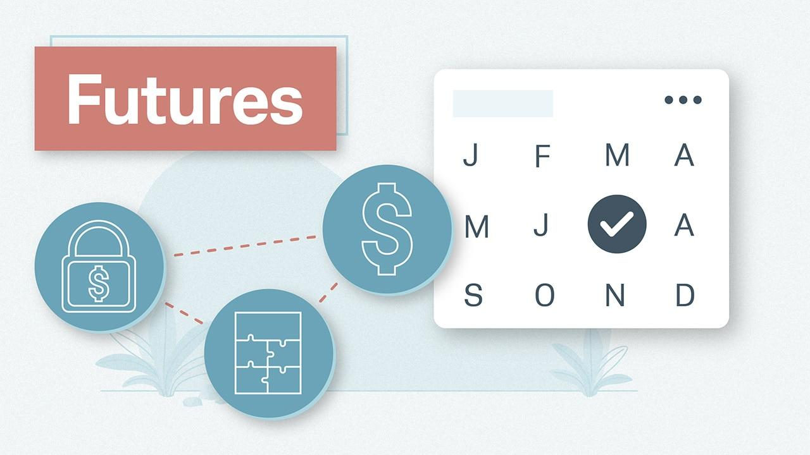

## Table of Contents

## What are futures in the financial markets?

Futures are contracts that let people buy or sell something at a set price on a specific date in the future. They are used in financial markets for things like stocks, commodities, and currencies. When someone buys a future, they agree to buy the item later at the price they agreed on now. If someone sells a future, they agree to sell the item later at that price. This can be useful for businesses that want to lock in prices to avoid surprises in the market.

People use futures to guess which way prices will go or to protect themselves from price changes. If someone thinks the price of oil will go up, they might buy an oil future. If the price does go up, they can sell the future for more than they paid, making a profit. On the other hand, if a farmer wants to make sure they get a good price for their crops, they can sell a future. This way, even if the price drops, they are safe because they locked in a price earlier.

## How do futures contracts work?

A futures contract is a deal between two people to buy or sell something at a certain price on a specific date in the future. This "something" can be anything from wheat and oil to financial products like stock indexes. When you buy a futures contract, you're agreeing to buy the item at the set price later. If you sell a futures contract, you're agreeing to sell the item at that price later. These contracts are traded on special markets called futures exchanges, where people come together to buy and sell these agreements.

People use futures contracts for two main reasons: to guess about future price changes and to protect themselves from those changes. If someone thinks the price of gold will go up, they might buy a gold futures contract. If the price does go up by the time the contract is due, they can sell it for more than they paid, making a profit. On the other hand, if a company knows it will need to buy oil in six months and wants to avoid the risk of prices going up, it can buy an oil futures contract now. This way, no matter what happens to oil prices in the next six months, the company knows exactly how much it will pay.

## What is the difference between futures and options?

Futures and options are both tools people use in the financial markets to make money or protect themselves from price changes, but they work differently. A futures contract is an agreement to buy or sell something at a set price on a specific future date. When you enter into a futures contract, you have to buy or sell the item when the contract ends, no matter what the price is at that time. This means you're locked into the deal and have to follow through.

Options, on the other hand, give you a choice. An option contract gives you the right, but not the obligation, to buy or sell something at a set price before a certain date. You can choose to use the option if it's good for you, or you can let it expire if it's not. This means you have more flexibility with options because you're not forced to do anything if the market doesn't go the way you hoped.

## What are the common types of futures contracts?

There are many types of futures contracts, but some are more common than others. The most popular ones are commodity futures, which include things like oil, natural gas, gold, and agricultural products like wheat and corn. These contracts are used by people who want to buy or sell these goods in the future at a set price. For example, a farmer might use a wheat futures contract to make sure they get a good price for their crop, even if the market price drops later.

Another common type is financial futures, which include contracts on things like stock indexes, interest rates, and currencies. Stock index futures let people bet on how the overall stock market will do, without buying individual stocks. Interest rate futures are used by people who want to protect themselves from changes in interest rates, like banks or people with loans. Currency futures are used to buy or sell foreign money at a set price in the future, which can be helpful for companies that do business in different countries.

## How can someone start trading futures?

To start trading futures, you first need to open an account with a broker that offers futures trading. Not all brokers do this, so you'll need to find one that does. Once you've picked a broker, you'll have to fill out some forms and provide information about yourself. This is because trading futures can be risky, and the broker needs to make sure you understand what you're getting into. After your account is set up, you'll need to put money into it. This is called margin, and it's like a deposit that you use to trade futures.

Once your account is ready and you've put in some money, you can start looking at the futures markets. You can see what prices are being offered for different futures contracts, like oil or wheat. When you find a contract you want to trade, you can place an order through your broker's platform. You can either buy a futures contract if you think the price will go up, or sell one if you think the price will go down. Remember, trading futures can be risky, so it's a good idea to learn as much as you can and maybe even practice with a demo account before you start trading with real money.

## What are the risks associated with futures trading?

Trading futures can be risky because prices can go up and down a lot. If you buy a futures contract and the price goes down, you could lose money. If you sell a futures contract and the price goes up, you could also lose money. This is called market risk. Futures contracts often use something called leverage, which means you can control a big contract with a small amount of money. While this can make your profits bigger, it can also make your losses bigger if things don't go your way.

Another risk is something called [liquidity](/wiki/liquidity-risk-premium) risk. This happens when there aren't enough people buying and selling the futures contract you're interested in. If you want to get out of your contract but can't find someone to take it, you might have to wait or sell it for less than you hoped. There's also the risk of not understanding the market well enough. Futures trading can be complicated, and if you don't know what you're doing, you could make bad decisions and lose money. It's important to learn about the market and maybe even practice with a demo account before you start trading with real money.

## What strategies can be used in futures trading?

One common strategy in futures trading is called hedging. This is when people use futures contracts to protect themselves from price changes. For example, a farmer might sell wheat futures to make sure they get a good price for their crop, even if the market price goes down later. Companies that need to buy things like oil or metals might buy futures to lock in prices and avoid surprises. Hedging helps reduce the risk of losing money because of price changes.

Another strategy is called speculation. This is when traders buy or sell futures contracts to make money from price changes. If someone thinks the price of gold will go up, they might buy a gold futures contract. If the price does go up, they can sell the contract for more than they paid and make a profit. But if the price goes down, they could lose money. Speculation can be risky, but it can also lead to big profits if you guess right.

A third strategy is called spread trading. This involves buying one futures contract and selling another related one at the same time. For example, you might buy a futures contract for oil that expires in three months and sell one that expires in six months. The idea is to make money from the difference in prices between the two contracts. Spread trading can be less risky than other strategies because it's based on the difference between two prices, not just one price going up or down.

## How do futures affect the underlying asset's price?

Futures can affect the price of the thing they're based on, like oil or wheat, because they let people bet on what the price will be in the future. When a lot of people buy futures because they think the price will go up, it can push the current price up too. This happens because more people want to buy the futures, which makes them more valuable. On the other hand, if a lot of people sell futures because they think the price will go down, it can push the current price down. This is because more people want to get rid of the futures, which makes them less valuable.

Futures can also help make prices more stable. When people use futures to protect themselves from price changes, like farmers selling wheat futures, it can stop big swings in prices. This is because people who use futures to hedge are trying to lock in prices, which can keep the market from moving too much in one direction. But futures can also make prices move more if a lot of people are guessing wrong about where prices will go. If everyone thinks the price of oil will go up and it doesn't, the price can drop a lot when they all try to sell their futures at the same time.

## What is margin in futures trading and how does it work?

Margin in futures trading is like a deposit that you need to put into your account before you can start trading. It's not the full price of the futures contract, but just a small part of it. This lets you control a big contract with less money, which is called using leverage. For example, if you want to buy a futures contract worth $10,000, you might only need to put in $1,000 as margin. This makes it easier to trade, but it also means you can lose more money if the price doesn't go the way you hoped.

The margin works by making sure you have enough money in your account to cover any losses. If the price of the futures contract moves against you, your broker might ask you to put in more money. This is called a margin call. If you don't add more money, your broker might close your position to stop you from losing even more. So, while margin lets you trade with less money upfront, it's important to keep an eye on your account and be ready to add more money if needed.

## How are futures prices determined?

Futures prices are set by what people in the market think the price of something will be in the future. It's a bit like guessing, but it's based on a lot of information. People look at things like how much of the item is being produced, how much people want to buy, and what's going on in the world that might change prices. For example, if there's a big storm that might hurt the wheat crop, people might guess that wheat will be more expensive in the future, so the price of wheat futures goes up.

The price of futures also changes all the time because people are always buying and selling them. When more people want to buy a futures contract than sell it, the price goes up. When more people want to sell than buy, the price goes down. This buying and selling happens on special places called futures exchanges, where everyone can see what prices people are offering. So, the price of a futures contract is really just what someone is willing to pay for it at that moment, based on what they think will happen in the future.

## What role do futures play in hedging and speculation?

Futures play a big role in hedging, which is a way for people to protect themselves from price changes. For example, a farmer might sell wheat futures to make sure they get a good price for their crop, even if the market price goes down later. Companies that need to buy things like oil or metals might buy futures to lock in prices and avoid surprises. By using futures to hedge, these people can reduce the risk of losing money because of price changes. It's like buying insurance for their business, making sure they know what prices they'll be dealing with in the future.

Futures also play a big role in speculation, which is when people try to make money by guessing where prices will go. If someone thinks the price of gold will go up, they might buy a gold futures contract. If the price does go up, they can sell the contract for more than they paid and make a profit. But if the price goes down, they could lose money. Speculation can be risky, but it can also lead to big profits if you guess right. People who speculate on futures are trying to make money from the ups and downs in the market, without actually wanting to buy or sell the thing the futures are based on.

## What are some advanced techniques for analyzing futures markets?

One advanced way to analyze futures markets is by using technical analysis. This means looking at charts and graphs of past price movements to try and guess where prices will go next. People who use technical analysis look for patterns, like when prices go up and down in a certain way, or when they reach certain points that seem important. They use tools like moving averages, which smooth out price changes over time, and indicators like the Relative Strength Index (RSI), which can show if a futures contract is being bought or sold too much. By studying these things, traders hope to find the best times to buy or sell futures contracts.

Another advanced technique is [fundamental analysis](/wiki/fundamental-analysis), which looks at the real things that affect the price of a futures contract, like how much of something is being produced or how much people want to buy it. For example, if you're looking at oil futures, you might study things like how much oil countries are producing, how much oil people are using, and what's going on in the world that might change oil prices. This kind of analysis can help traders understand why prices are moving the way they are and make better guesses about where they might go in the future. By combining both technical and fundamental analysis, traders can get a fuller picture of the futures market and make smarter trading decisions.

## What is Risk Management in Algo Trading?

In [algorithmic trading](/wiki/algorithmic-trading), effective risk management is crucial to ensuring the stability and success of trading strategies. A disciplined approach to managing risk helps traders mitigate potential losses while maximizing returns. Here are key components of risk management in algo trading:

### Position Sizing

Position sizing involves determining the appropriate [volume](/wiki/volume-trading-strategy) for each trade based on thorough risk assessments. This strategy helps control exposure and maintain a balanced risk-reward ratio across the portfolio. A well-defined position sizing strategy can prevent overexposure to any single asset or market condition. For instance, a common approach is the fixed percentage risk model, where a trader risks a fixed percentage of their total equity on each trade. Mathematically, this can be expressed as:

$$
\text{Position Size} = \frac{\text{Equity} \times \text{Risk per Trade (\% of Equity)}}{\text{Stop-Loss Distance (in price units)}}
$$

By consistently using a predefined percentage, traders can protect against significant losses from individual trades while compounding returns from successful trades over time.

### Stop-Loss Mechanisms

Stop-loss mechanisms are vital tools for protecting investments in algorithmic trading. These automated orders sell a security once it hits a predetermined price threshold, limiting potential losses. By setting stop-loss orders, traders can ensure that positions are liquidated before small losses escalate into significant drawdowns. Stop-loss thresholds can be based on various factors, such as [volatility](/wiki/volatility-trading-strategies), recent price action, or technical indicators. Importantly, maintaining discipline in adhering to stop-loss triggers is essential to avoiding emotional biases that can adversely affect trading outcomes.

### Diversity in Strategies

Diversification in algorithmic trading involves spreading investments across various algorithms and asset classes, reducing the impact of adverse market conditions on the overall portfolio. By employing multiple trading strategies simultaneously, traders can increase their chances of capturing different market opportunities that may arise independently of one another. This approach also reduces the dependency on the success of a single strategy, lowering the overall portfolio risk. For example, combining trend-following algorithms with mean-reversion strategies can lead to more stable returns, as these strategies may perform well in different market environments.

Addressing these three core areas—position sizing, stop-loss mechanisms, and strategy diversification—enables algorithmic traders to manage risks proactively and effectively. By doing so, traders can enhance the stability and longevity of their trading activities in increasingly dynamic and competitive markets.

## References & Further Reading

[1]: Bergstra, J., Bardenet, R., Bengio, Y., & Kégl, B. (2011). ["Algorithms for Hyper-Parameter Optimization."](https://papers.nips.cc/paper/4443-algorithms-for-hyper-parameter-optimization) Advances in Neural Information Processing Systems 24.

[2]: ["Advances in Financial Machine Learning"](https://www.amazon.com/Advances-Financial-Machine-Learning-Marcos/dp/1119482089) by Marcos Lopez de Prado

[3]: ["Evidence-Based Technical Analysis: Applying the Scientific Method and Statistical Inference to Trading Signals"](https://www.amazon.com/Evidence-Based-Technical-Analysis-Scientific-Statistical/dp/0470008741) by David Aronson

[4]: ["Machine Learning for Algorithmic Trading"](https://github.com/stefan-jansen/machine-learning-for-trading) by Stefan Jansen

[5]: ["Quantitative Trading: How to Build Your Own Algorithmic Trading Business"](https://books.google.com/books/about/Quantitative_Trading.html?id=j70yEAAAQBAJ) by Ernest P. Chan