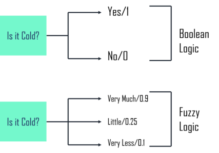

## Table of Contents

## What is Fuzzy Logic and how does it differ from traditional binary logic?

Fuzzy Logic is a way of dealing with uncertainty and imprecision in a way that's more like how humans think. Instead of just saying something is true or false, like in traditional binary logic, fuzzy logic allows for degrees of truth. For example, if you're checking how hot it is outside, binary logic might say it's either hot or not hot. But fuzzy logic can say it's a bit hot, very hot, or somewhere in between. This is useful in things like controlling the temperature in a room or in washing machines where you want to adjust settings smoothly.

In traditional binary logic, everything is either 0 or 1, true or false. This can be shown with the formula $$A \land B$$ where if both A and B are true, then the result is true; otherwise, it's false. But in fuzzy logic, we use what's called a membership function. This function gives a value between 0 and 1 to show how much something belongs to a set. So, if you're looking at the temperature again, instead of just saying it's hot or not, you might say the temperature has a 0.7 degree of membership in the "hot" category. This allows for more nuanced control and decision-making in systems that need to handle real-world uncertainties.

## Can you explain the basic concepts of fuzzy sets and membership functions?

Fuzzy sets are a way to represent things that don't have clear boundaries. Imagine you're trying to describe what "tall" means. In regular sets, someone is either tall or not tall. But with fuzzy sets, you can say someone is somewhat tall, very tall, or not tall at all. This is done using a membership function, which gives a number between 0 and 1 to show how much something belongs to the set. If someone is 1.8 meters tall, you might say they have a membership of 0.8 in the "tall" set, meaning they're pretty tall but not the tallest.

Membership functions are the heart of fuzzy sets. They let us assign a degree of truth to statements instead of just true or false. For example, if you're measuring the temperature and you want to know if it's "warm", you could use a membership function like $$ \mu_{\text{warm}}(T) $$. If the temperature $$ T $$ is 20°C, $$ \mu_{\text{warm}}(20) $$ might be 0.6, meaning it's somewhat warm. These functions can be simple lines or curves, and they help us make decisions in systems that need to handle real-world vagueness and uncertainty.

## How are fuzzy logic systems used in real-world applications?

Fuzzy logic systems are used in many everyday devices to make them work better. For example, in washing machines, fuzzy logic helps decide how much water and detergent to use based on how dirty the clothes are. Instead of just choosing between a few set options, the machine can adjust smoothly to make sure the clothes get clean without wasting resources. This makes the washing machine smarter and more efficient.

Another common use is in air conditioners and heaters. Fuzzy logic helps these devices keep the room at a comfortable temperature by constantly adjusting based on small changes in the room's heat. Instead of just turning on and off, the system can slowly change the temperature to keep it just right. This makes the room more comfortable and can save energy too.

Fuzzy logic is also used in cars for things like automatic transmissions and cruise control. In an automatic car, fuzzy logic can help the gears shift smoothly based on how fast the car is going and how hard the driver is pressing the gas pedal. For cruise control, it can adjust the car's speed to keep it steady even on hills or when the road changes. This makes driving safer and more comfortable.

## What is the process of fuzzification and defuzzification in fuzzy logic systems?

Fuzzification is the first step in a fuzzy logic system where we take real-world data and turn it into fuzzy values. Imagine you're measuring the temperature outside. Instead of just saying it's 25°C, fuzzification would tell you how much this temperature belongs to categories like "cool", "warm", or "hot". This is done using membership functions. For example, if the temperature is 25°C, a membership function $$ \mu_{\text{warm}}(25) $$ might give a value of 0.7, meaning it's pretty warm but not totally. This process helps the system understand the data in a way that's more like how humans think, with shades of gray instead of just black and white.

Defuzzification is the opposite process, where we take the fuzzy results and turn them back into a single, clear number that can be used to make decisions or control something. After the fuzzy logic system has done its calculations, it might have a bunch of fuzzy values that show different possible actions, like how much to turn on the heater. Defuzzification takes these fuzzy values and combines them into one number. For example, if the system decides the room needs to be a bit warmer, defuzzification might turn that fuzzy decision into a specific temperature setting for the heater, like 22°C. This step is crucial because it lets the fuzzy logic system actually control real-world devices in a precise way.

## How do fuzzy logic controllers work and what are their main components?

Fuzzy logic controllers are like smart helpers that use fuzzy logic to make decisions and control things. They take in information about what's happening, like the temperature in a room, and use fuzzy logic to figure out what to do. For example, if the room is a bit cold, the controller might decide to turn the heater on a little bit. It does this by turning real-world data into fuzzy values, doing some calculations, and then turning those fuzzy values back into clear actions. This makes the controller good at handling situations where things aren't just on or off, but can be somewhere in between.

The main parts of a fuzzy logic controller are the fuzzifier, the inference engine, and the defuzzifier. The fuzzifier takes the real-world data and turns it into fuzzy values using membership functions. For example, if the temperature is 20°C, the fuzzifier might say it's 0.6 warm and 0.2 hot. The inference engine then uses these fuzzy values to make decisions based on a set of rules. These rules might say things like "If the room is warm, then turn the heater down a bit." Finally, the defuzzifier takes the results from the inference engine and turns them back into a clear action, like setting the heater to a specific temperature. This process helps the controller make smooth and smart decisions in real-world situations.

## What are some common inference methods used in fuzzy logic?

In fuzzy logic, one common inference method is the Mamdani method. This method is easy to understand and works well for many applications. It uses a set of "if-then" rules to make decisions. For example, if the temperature is high, then turn the heater off. The Mamdani method combines the fuzzy inputs using these rules and then turns the results into a clear action. This makes it good for things like controlling the temperature in a room or the speed of a car.

Another method is the Sugeno method, which is a bit different but also useful. Instead of using fuzzy sets for the output like the Mamdani method, the Sugeno method uses math formulas. For example, if the temperature is high, then the heater setting might be calculated as $$ \text{heater setting} = -0.5 \times \text{temperature} + 30 $$. This makes it easier to work with numbers and can be faster for some systems. The Sugeno method is often used in things like predicting how a system will behave or controlling complex machines.

There's also the Tsukamoto method, which is less common but still important. This method uses special kinds of membership functions that are always either going up or going down. It's good for systems where you need to be very precise. The Tsukamoto method works by finding where the fuzzy inputs match the rules and then using those points to figure out the final action. It's useful in applications where you need to make very accurate decisions based on fuzzy data.

## How can fuzzy logic be integrated with other machine learning techniques?

Fuzzy logic can be combined with other machine learning techniques to make systems smarter and more adaptable. One common way is to use fuzzy logic with neural networks, creating what's called a neuro-fuzzy system. In this setup, the fuzzy logic part helps the neural network understand and handle uncertain or vague data better. For example, if you're teaching a neural network to recognize different levels of brightness in a photo, fuzzy logic can help it understand that brightness can be "somewhat bright" or "very bright," not just bright or not bright. This makes the neural network better at dealing with real-world data that's often not clear-cut.

Another way to integrate fuzzy logic is with genetic algorithms. Genetic algorithms are good at finding the best solutions by trying many different possibilities and choosing the best ones. By adding fuzzy logic, you can make the genetic algorithm work with fuzzy rules and values, which can be useful in situations where you need to optimize things like control systems or decision-making processes. For example, if you're trying to find the best way to control the temperature in a building, a genetic algorithm can try different fuzzy rules and see which ones work best. This combination can lead to smarter and more efficient systems that can adapt to changing conditions.

## What are the advantages and limitations of using fuzzy logic in machine learning?

Fuzzy logic brings a lot of good things to machine learning. It helps machines understand and work with information that's not clear or exact, just like how people think. For example, when you say something is "warm," fuzzy logic can understand that it's not just hot or cold but somewhere in between. This makes machines better at handling real-world data, which is often fuzzy. Also, fuzzy logic can make systems smarter by working with other machine learning techniques like neural networks and genetic algorithms. This can lead to better control and decision-making in things like temperature control in buildings or speed control in cars.

But fuzzy logic also has some problems. One big issue is that it can be hard to figure out how the system made a decision because it uses a lot of rules and fuzzy values. This can make it tricky to explain why a machine did something, which is important in some situations. Another problem is that setting up a fuzzy logic system can take a lot of work. You need to create the right membership functions and rules, which can be time-consuming and needs someone who knows a lot about the system. So, while fuzzy logic can be very useful, it's not always the best choice for every situation and needs careful thought before using it.

## Can you discuss the role of fuzzy logic in handling uncertainty and imprecision in data?

Fuzzy logic is really good at dealing with information that isn't clear or exact. Imagine you're trying to describe the weather as "warm." With regular logic, it's either warm or it's not. But with fuzzy logic, you can say the weather is a bit warm or very warm, using a number between 0 and 1 to show how true that is. For example, if the temperature is 20°C, you might say it has a 0.6 membership in the "warm" category. This way, fuzzy logic helps machines understand and work with the kind of uncertain and imprecise data we see in the real world, making them better at things like controlling the temperature in a room or deciding how much detergent to use in a washing machine.

However, using fuzzy logic isn't perfect. It can be hard to explain how a fuzzy logic system made a decision because it uses a lot of rules and fuzzy values. This can be a problem if you need to understand why a machine did something. Also, setting up a fuzzy logic system takes a lot of work. You have to create the right membership functions and rules, which can be time-consuming and needs someone who knows a lot about the system. So, while fuzzy logic is great for handling uncertainty and imprecision, it's not always the best choice for every situation and needs careful thought before using it.

## How does fuzzy logic contribute to decision-making processes in complex systems?

Fuzzy logic helps make decisions in complex systems by allowing them to handle information that's not clear or exact. Instead of just saying something is true or false, fuzzy logic lets systems understand that things can be a bit true or very true. For example, if a system is controlling the temperature in a room, it can use fuzzy logic to decide how much to turn the heater on based on how cold or warm the room feels. This makes the system smarter because it can smoothly adjust to changes, like when the weather outside gets colder or when more people enter the room and make it warmer.

However, using fuzzy logic in decision-making isn't always easy. It can be hard to explain why a system made a certain choice because it uses a lot of fuzzy rules and values. This can be a problem if you need to understand the decision-making process. Also, setting up a fuzzy logic system takes a lot of work. You need to create the right membership functions and rules, which can be time-consuming and needs someone who knows a lot about the system. So, while fuzzy logic can make decision-making in complex systems better, it needs careful planning and understanding to use it well.

## What are some advanced techniques for optimizing fuzzy logic systems?

One way to make fuzzy logic systems better is by using genetic algorithms. These are like a computer's way of trying out different things and picking the best ones, kind of like natural selection. You can use genetic algorithms to find the best membership functions and rules for your fuzzy logic system. For example, if you're trying to control the temperature in a room, the genetic algorithm can test different fuzzy rules to see which ones keep the room most comfortable. This can make the system work better without needing to guess or spend a lot of time figuring out the right settings.

Another advanced technique is called adaptive neuro-fuzzy inference systems (ANFIS). This combines fuzzy logic with neural networks, which are like a computer's brain that learns from examples. ANFIS can learn how to make the best decisions by looking at data and adjusting its fuzzy rules over time. For instance, if you're using ANFIS to control a car's speed, it can learn from driving data to fine-tune how it responds to different road conditions. This makes the system smarter and better at handling new situations because it can keep learning and improving.

These techniques can make fuzzy logic systems more powerful and efficient, but they also need more work to set up and understand. Using genetic algorithms or ANFIS requires knowing a lot about both the system you're working with and the methods themselves. But if you put in the effort, these advanced techniques can help you create fuzzy logic systems that are really good at making decisions and controlling complex situations.

## How can one evaluate the performance of a fuzzy logic system in machine learning applications?

To evaluate the performance of a fuzzy logic system in machine learning applications, you can use different measures that show how well the system is doing its job. One common way is to look at how accurate the system's decisions are compared to what you want them to be. For example, if you're using a fuzzy logic system to control the temperature in a room, you might check how close the actual temperature stays to the desired temperature. Another way is to use error measures like the mean squared error (MSE), which calculates the average of the squares of the errors between the predicted and actual values. The formula for MSE is $$ \text{MSE} = \frac{1}{n} \sum_{i=1}^{n} (y_i - \hat{y}_i)^2 $$, where $$ y_i $$ is the actual value, $$ \hat{y}_i $$ is the predicted value, and $$ n $$ is the number of observations.

Besides accuracy and error measures, you can also look at how well the system adapts to changes. This is important because real-world situations often change, and a good fuzzy logic system should be able to handle that. You can test this by changing the conditions and seeing how the system responds. For example, if you're using fuzzy logic to control a car's speed, you might change the road conditions and see if the system adjusts the speed correctly. Another way to evaluate performance is by comparing the fuzzy logic system to other methods, like traditional binary logic or other machine learning techniques. This can help you see if fuzzy logic gives better results or if there are other methods that might work better for your specific application.