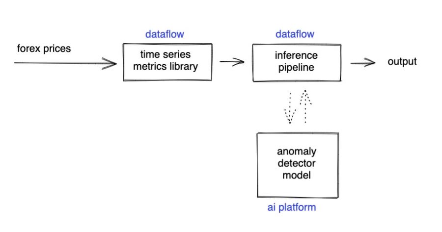

## Table of Contents

## What is an FX anomaly?

An FX anomaly is when the exchange rate between two currencies doesn't follow what we expect based on usual patterns. It's like when the price of one currency compared to another doesn't make sense according to the rules we usually see in the market.

These anomalies can happen because of many reasons, like unexpected news, big economic changes, or even mistakes by people trading currencies. When traders spot these anomalies, they might try to make money from them by buying or selling currencies at the right time.

## How do FX anomalies affect currency markets?

FX anomalies can shake up the currency markets a lot. When the exchange rate between two currencies doesn't follow the usual patterns, it can make traders and investors unsure about what's going on. This uncertainty can lead to big swings in currency prices as everyone tries to figure out what the new normal is. Sometimes, these anomalies can cause a lot of people to quickly buy or sell a currency, which can make the market very unstable.

These anomalies can also create chances for people to make money. Traders who are good at spotting these unusual situations might buy a currency when it's cheaper than it should be, or sell it when it's more expensive than expected. By doing this, they hope to make a profit when the exchange rate goes back to what it should be. However, it's risky because if the market keeps acting strangely, they could lose money instead.

## What are the common types of FX anomalies?

One common type of [FX](/wiki/fx-anomaly) anomaly is called a "[carry](/wiki/carry-trading) trade anomaly." This happens when people borrow money in a country where interest rates are low and then use that money to buy a currency from a country with higher interest rates. Normally, this should be a good way to make money, but sometimes the exchange rates move in unexpected ways, making the strategy not work as planned.

Another type is the "[momentum](/wiki/momentum) anomaly." This is when a currency keeps going up or down for a long time, even when it doesn't seem to make sense based on the economy. Traders might think the currency will keep moving in the same direction, but then it suddenly changes, causing big surprises in the market.

Lastly, there's the "purchasing power parity anomaly." This happens when the exchange rate between two countries doesn't match up with the prices of goods in those countries. Normally, if things are cheaper in one country, its currency should be weaker, but sometimes the exchange rate doesn't follow this rule, leading to an anomaly.

## Can you explain the causes of FX anomalies?

FX anomalies can happen because of many different reasons. One big reason is unexpected news or events, like a sudden change in a country's government or a big economic report that surprises everyone. These events can make people think differently about a currency, causing its value to jump around in ways that don't follow the usual patterns. Another reason is when big investors or banks make big trades all at once. If they all decide to buy or sell a lot of a certain currency at the same time, it can push the exchange rate away from what we would normally expect.

Another cause of FX anomalies is mistakes or misjudgments by traders. Sometimes, traders might think they see a pattern or trend in the market, but they're wrong, and their trades end up pushing the exchange rate in unexpected directions. Also, sometimes the technology used for trading can mess things up. If there's a glitch in a trading system, it might cause a lot of automatic trades to happen, which can lead to big, sudden changes in currency values that don't make sense based on the economy.

Lastly, economic theories and models aren't perfect. Sometimes, the real world doesn't follow these models exactly, leading to anomalies. For example, the idea of purchasing power parity says that exchange rates should match up with the prices of goods in different countries, but in reality, this doesn't always happen. When the real exchange rates don't match what the theories predict, we see FX anomalies.

## How can traders identify FX anomalies?

Traders can spot FX anomalies by keeping an eye on how exchange rates move compared to what they usually expect. They look at things like economic reports, news events, and the overall mood of the market. If a currency's value goes up or down in a way that doesn't match these factors, it might be an anomaly. For example, if a country's economy is doing well but its currency suddenly drops a lot, that could be a sign of an anomaly.

Another way to identify FX anomalies is by using special tools and charts that show how currencies have moved in the past. Traders can compare current exchange rates to historical data to see if something unusual is happening. They might also use computer programs that look for patterns and trends in the data. If these programs find movements that don't fit the usual patterns, they can alert traders to possible anomalies. By combining all this information, traders can get a better sense of when the market is acting strangely.

## What are the potential risks of trading FX anomalies?

Trading FX anomalies can be risky because the market can be very unpredictable. When traders see an anomaly, they might think they can make money by betting on the currency going back to normal. But, the market might keep acting strangely, and the currency could move even further away from what's expected. This means traders could lose money if they're not careful. Also, if a lot of traders try to take advantage of the same anomaly at the same time, it can make the market even more unstable, leading to bigger losses.

Another risk is that traders might not have all the information they need. Sometimes, what looks like an anomaly might actually be the market reacting to something that's not obvious yet, like a big economic change that hasn't been reported. If traders jump into a trade without understanding the full picture, they could end up on the wrong side of the market. It's important for traders to do a lot of research and be ready for surprises when they're trying to trade FX anomalies.

## How do FX anomalies impact global trade and economies?

FX anomalies can shake up global trade and economies a lot. When the exchange rate between two countries' currencies doesn't follow the usual rules, it can make it hard for businesses to plan their trade. For example, if a company in one country is used to buying goods from another country at a certain exchange rate, and suddenly that rate changes a lot because of an anomaly, the company might find that their costs go up or down in unexpected ways. This can make it tough for them to know if they're making money or not, and it might even lead them to stop trading with that country until things settle down.

These anomalies can also affect whole economies. If a country's currency suddenly gets a lot weaker because of an anomaly, it might make their exports cheaper and more attractive to other countries. This could help their economy grow. But, if their currency gets stronger unexpectedly, it might make their exports more expensive and less competitive, which could hurt their economy. Big swings in currency values can also make investors nervous, and they might pull their money out of a country, which can lead to even more economic problems.

## What historical examples illustrate significant FX anomalies?

One big example of an FX anomaly happened in 1992, known as Black Wednesday. The British pound was part of the European Exchange Rate Mechanism (ERM), which tried to keep European currencies stable. But, big investors like George Soros thought the pound was too strong and didn't match the UK's economy. They started selling a lot of pounds, causing its value to drop fast. The UK government tried to stop this by raising interest rates and buying pounds, but it didn't work. They had to pull the pound out of the ERM, and its value fell a lot. This showed how an anomaly could shake up a whole country's economy.

Another example is the Asian Financial Crisis in 1997. It started in Thailand when people lost faith in the Thai baht. The baht was tied to the US dollar, but Thailand's economy was struggling. When investors realized this, they started selling baht, causing its value to drop suddenly. This anomaly spread to other countries in Asia like Indonesia, South Korea, and Malaysia. Their currencies also fell a lot, and it led to big economic problems across the region. It showed how an FX anomaly in one country could cause a chain reaction affecting many others.

## What strategies can be used to profit from FX anomalies?

One way to make money from FX anomalies is by using a strategy called carry trade. This means borrowing money in a country where interest rates are low and then using that money to buy a currency from a country with higher interest rates. Normally, this should be a good way to make money, but sometimes the exchange rates move in unexpected ways. If a trader spots an anomaly where the currency they bought is suddenly worth a lot more or less than expected, they can sell it at the right time to make a profit. The key is to watch the market closely and be ready to act fast when the anomaly happens.

Another strategy is called momentum trading. This is when traders see a currency moving in a certain direction for a long time, even if it doesn't make sense based on the economy. They might think the currency will keep going that way and buy it, hoping to sell it later for more money. But, if they spot an anomaly where the currency suddenly changes direction, they can quickly sell it before it drops too much. This strategy needs traders to be good at spotting when the market is acting strangely and be ready to change their plans quickly.

Lastly, traders can use a strategy based on purchasing power parity. This idea says that exchange rates should match up with the prices of goods in different countries. If a trader sees an anomaly where the exchange rate doesn't match the prices, they can buy the currency that seems too cheap or sell the one that seems too expensive. If the exchange rate goes back to what it should be, they can make money. This strategy needs a lot of research to understand the prices in different countries and be ready for the market to fix the anomaly.

## How do regulatory bodies respond to FX anomalies?

Regulatory bodies keep a close eye on the currency markets to make sure everything is fair and stable. When they see an FX anomaly, they might step in to calm things down. They can do this by changing interest rates or using their own money to buy or sell currencies. This helps to stop the exchange rate from moving too much and keeps the market from getting too wild. They also make rules to stop people from doing things that could cause big problems, like making too many trades at once or using secret information.

Sometimes, regulatory bodies work together with other countries to deal with FX anomalies. If an anomaly in one country's currency is causing trouble for others, they might all agree on a plan to fix it. This can include setting up new rules or even changing how their currencies work together. By working together, they can help make the global economy more stable and prevent big surprises that could hurt a lot of people.

## What role does technology play in detecting and analyzing FX anomalies?

Technology helps a lot in finding and understanding FX anomalies. Computers and special programs can look at a lot of data really fast. They can spot when the exchange rate between two currencies is moving in a strange way that doesn't match what usually happens. These programs use math and patterns to find these anomalies. Traders can use this information to make better decisions about when to buy or sell currencies. Without technology, it would be much harder and take a lot longer to see these unusual movements in the market.

Also, technology helps in keeping an eye on the market all the time. With the internet and fast computers, traders can get real-time information about what's happening with exchange rates. This means they can react quickly to any anomalies they see. Technology also lets traders use tools like charts and graphs to see how currencies have moved in the past, which can help them predict what might happen next. By using technology, traders can be more ready for surprises in the market and make smarter trades.

## How can advanced statistical models help in predicting FX anomalies?

Advanced statistical models can help predict FX anomalies by looking at a lot of data and finding patterns that might not be easy to see. These models use math to understand how different things, like interest rates, economic reports, and even news events, can affect exchange rates. By studying this data, the models can guess when the market might act strangely. For example, if a model sees that a currency has been moving in a way that doesn't match the economy, it might predict an anomaly is coming. This can help traders get ready and make better decisions about when to buy or sell currencies.

These models also help by giving traders a way to test their ideas before they make real trades. Traders can use the models to see what would happen if they made certain trades during past anomalies. This can show them if their strategies might work or if they need to change them. By using these models, traders can be more confident in their predictions and be better prepared for when the market does something unexpected.

## References & Further Reading

[1]: Burnside, C., Eichenbaum, M., & Rebelo, S. (2011). ["Carry Trade and Momentum in Currency Markets."](https://www.nber.org/papers/w16942) NBER Working Paper No. 16942.

[2]: Fama, E. F. (1970). ["Efficient Capital Markets: A Review of Theory and Empirical Work."](https://www.jstor.org/stable/2325486) The Journal of Finance.