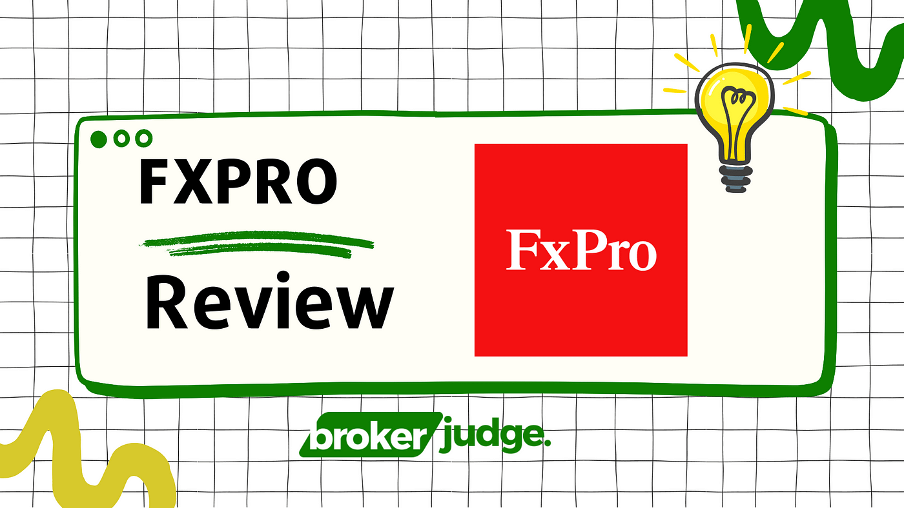

In the dynamic landscape of financial markets, selecting an appropriate trading platform and broker is crucial for achieving success in trading. As traders navigate through a plethora of options, the decision raises questions of reliability, security, and the breadth of services offered. An optimal choice ensures not only ease of access to the markets but also robust tools that can enhance trading performance and achieve strategic objectives.

FxPro has emerged as a notable trading platform and broker that addresses these critical needs through its diverse range of offerings and strong adherence to regulatory standards. Established in 2006 and headquartered in London, FxPro has expanded its footprint to serve a global clientele, evidencing its commitment to maintaining high levels of trust and performance in financial trading. With regulatory compliance ensured by multiple reputable financial authorities, FxPro stands out as a credible choice among traders worldwide.

The focus of this article is to provide an in-depth review of FxPro, emphasizing its capabilities and offerings in algorithmic trading, also known as algo trading. This exploration will guide potential users in their decision-making process by shedding light on how FxPro supports automated trading strategies, catering to both emerging and experienced traders alike. By understanding FxPro's offerings in the context of algo trading, traders can better assess its suitability for their trading needs, aligning their strategies with the platform's advanced functionalities.

## Table of Contents

## Company Overview

FxPro, established in 2006, has grown to become a significant player in the trading industry. Headquartered in London, this broker has expanded its reach globally, serving clients in more than 170 countries and managing over 2.18 million client accounts. This widespread presence underscores FxPro's commitment to providing comprehensive trading services to a diverse clientele. 

The broker's strong reputation is further solidified by its adherence to strict regulatory standards. It is regulated by several reputable financial authorities, most notably the Financial Conduct Authority (FCA) in the United Kingdom and the Cyprus Securities and Exchange Commission (CySEC). These regulatory bodies are known for their stringent oversight, ensuring that FxPro operates within the parameters of transparency and integrity. Compliance with such rigorous standards offers clients additional assurance regarding the safety and security of their investments. 

FxPro's strategic establishment in London, a leading global financial hub, combined with its expansive international footprint, not only illustrates its robust operational framework but also its ability to cater to traders seeking a reliable and regulated environment for their trading activities.

## Trading Platforms

FxPro provides an impressive range of trading platforms aimed at meeting the diverse needs of its clients. These include MetaTrader 4, MetaTrader 5, cTrader, and FxPro's proprietary trading platform. Each platform offers distinct features and varying levels of functionality across desktop, web, and mobile devices.

MetaTrader 4 (MT4) remains a favorite among many traders due to its user-friendly interface and robust trading capabilities. It supports numerous order types, offers advanced charting tools, and includes a variety of technical indicators. MT4's strength lies in its flexibility, allowing users to employ Expert Advisors (EAs) for automated trading. The platform is accessible on desktop, web, and mobile devices, ensuring that traders can manage their portfolios from virtually anywhere.

MetaTrader 5 (MT5) builds on the success of its predecessor, providing additional features such as more timeframes, an economic calendar, and advanced order management tools. It also supports trading in a broader range of asset classes. Like MT4, MT5 is available on desktop, web, and mobile, offering traders versatile access to their accounts.

The cTrader platform distinguishes itself with its focus on [algorithmic trading](/wiki/algorithmic-trading) and advanced market analysis tools. It offers comprehensive support for cAlgo, which enables traders to develop and implement algorithmic strategies using C#. This feature is particularly advantageous for those interested in automating their trading processes. cTrader also includes a powerful [backtesting](/wiki/backtesting) capability, allowing traders to test their algorithms against historical data to gauge performance before deploying them in live markets. The cTrader platform is accessible on desktop, web, and mobile, making it a flexible choice for algorithmic traders seeking robust tools.

FxPro's proprietary platform is designed with a user-centric approach, providing seamless functionality and an intuitive interface. It aims to simplify the trading experience without compromising on the essential tools required for efficient trading. This platform is also available on multiple devices, enhancing user convenience.

Overall, the array of platforms offered by FxPro caters to both discretionary and algorithmic traders, with each platform incorporating unique elements tailored to different trading styles and preferences.

## Investment Products and Algo Trading

FxPro offers a diverse range of investment products, catering to both novice and experienced traders. Among the available products, [forex](/wiki/forex-system) trading stands out, providing a comprehensive selection of currency pairs, including majors, minors, and exotics. FxPro also allows trading in stocks, commodities, indices, and a growing selection of cryptocurrencies. This wide array of products enables traders to create diversified portfolios and manage risk effectively.

In terms of algo trading, FxPro is notable for its support via the cTrader platform. cTrader is renowned for its advanced functionalities, tailored to optimize algorithmic trading strategies. One of the key features of cTrader is its customizable interface, which caters to both manual and automated trading styles. The platform supports the development and deployment of complex algorithmic strategies through cAlgo, a dedicated feature for creating and testing automated systems. By using C#, traders can develop custom indicators and trading robots with cAlgo, making it an advantageous tool for those proficient in coding.

Moreover, cTrader facilitates backtesting, a critical component for algorithmic traders seeking to evaluate the performance of their strategies based on historical data. This feature allows traders to analyze the potential effectiveness of their algorithms before deploying them in live markets, potentially mitigating risks and optimizing strategy outcomes.

Additionally, FxPro provides Virtual Private Server (VPS) services, a crucial resource for algorithmic trading. By using a VPS, traders can ensure their trading algorithms operate continuously, with minimal downtime or interference. This is particularly important for those employing high-frequency trading strategies, where latency and interruptions can significantly impact profitability.

In summary, FxPro's offering of a wide range of investment products combined with advanced algo trading support on cTrader presents a robust environment for traders interested in automation and diversification. The integration of VPS services further enhances this setup, providing traders with the necessary infrastructure to maintain seamless and efficient trading operations.

## Commissions and Fees

FxPro offers a comprehensive and competitive pricing structure across its various account types. The broker provides different types of accounts to cater to varying trader needs, including the FxPro MT4 Instant, FxPro MT4 Market, FxPro cTrader, and FxPro Edge. Each account type offers a distinct fee model, enabling traders to select the one that aligns best with their trading strategies.

### Spreads and Commissions

1. **Spreads**:
   - **FxPro MT4 Instant and MT4 Market Accounts**: These accounts typically offer variable spreads. The spreads on major currency pairs such as EUR/USD can start from as low as 1.4 pips, which is competitive within the industry.
   - **FxPro cTrader Account**: Known for its raw spread environment, cTrader presents spreads starting from 0.3 pips. This account type, though, is accompanied by a commission fee, as is standard with raw spread accounts in the trading industry.
   - **FxPro Edge Account**: Offered spreads can also vary and adapt to market conditions, designed for traders who prefer spread betting.

2. **Commissions**:
   - **FxPro MT4 and FxPro Edge Accounts**: These accounts generally operate on a commission-free basis, with the broker earning from the spread differences. This approach can be beneficial for traders focusing on specific currencies with tighter spreads.
   - **FxPro cTrader Account**: A commission of $45 per million USD traded ($9 per lot) is charged on top of the raw spread. While commissions are applicable, this structure is prevalent among brokers who provide raw spreads, reflecting a standard competitive pricing model.

### Transparency and Industry Comparison

FxPro emphasizes transparency in its fee structure, which is a critical [factor](/wiki/factor-investing) for traders assessing the total cost of their trading activities. The breakdown of charges, particularly the fixed commission on the cTrader account, is clear and detailed, allowing traders to calculate expenses efficiently.

When compared to industry standards, FxPro's pricing is competitive, especially considering the absence of commissions in the MT4 and Edge accounts. The implementation of commissions on the cTrader account aligns with industry norms for raw spread accounts, ensuring that traders have access to market-realistic pricing structures.

Overall, FxPro’s commission and fee policies are designed to offer flexibility. They allow traders to choose an account type based on their trading style, whether they prefer fixed costs per trade or a variable spread model. This approach not only aligns with traders' need for clarity but also positions FxPro competitively in a diverse market landscape.

## Educational Tools and Resources

FxPro provides a comprehensive suite of educational resources tailored for both beginners and experienced traders. These resources are instrumental in helping traders enhance their knowledge and trading skills. FxPro offers an array of webinars conducted by experts that cover various trading topics, from basic concepts to advanced strategies. These live sessions facilitate interaction and allow participants to ask questions, fostering a better understanding of market dynamics.

In addition, FxPro provides video tutorials that serve as visual guides through the intricacies of trading. These videos break down complex topics into manageable segments, making them more accessible to traders at different levels of expertise. For individuals who prefer learning through reading, FxPro offers a plethora of written content, including articles and detailed guides on trading strategies, market analysis, and platform navigation.

Despite these robust offerings, there are areas where FxPro's educational resources could be enhanced. For instance, while the available content is comprehensive, it might benefit from a more structured learning path or curriculum, especially for beginners. Introducing a step-by-step learning module or [course](/wiki/best-algorithmic-trading-courses) could provide new traders with a more systematic approach to mastering the fundamentals of trading.

Moreover, the inclusion of interactive tools such as quizzes or simulation-based learning could further engage users and reinforce learning outcomes. These could help users apply theoretical knowledge in practical, simulated trading scenarios, thus better preparing them for real-world trading environments. Enhancing these aspects could significantly bolster the value of FxPro's educational resources and make them more effective for all user levels.

## Customer Support and Community Engagement

FxPro provides a comprehensive range of customer support services designed to assist traders at various stages of their trading journey. Notably, FxPro offers multi-channel support options, enabling clients to reach out through various platforms such as phone, email, and live chat. This diverse approach ensures that traders can access support in a manner that is most convenient for them. Additionally, FxPro supports multiple languages, catering to its global client base spread across more than 170 countries. This multilingual support is crucial for effectively communicating with a diverse clientele, enhancing the user experience, and addressing queries efficiently.

For traders who prefer in-person consultations or require more personalized assistance, FxPro maintains a physical office in London. This office serves as a point of contact for clients who may wish to have face-to-face interactions, providing reassurance and added value, especially for traders based in or near London.

Beyond direct support channels, FxPro fosters a sense of community among its users by encouraging interaction and collaboration through online forums and groups. These community platforms allow traders to share insights, strategies, and experiences, creating a supportive environment where both novice and experienced traders can learn and grow. However, it is important to note that while these forums are associated with FxPro, they may vary in terms of activity levels and depth of engagement.

FxPro's commitment to customer support and community engagement underscores its dedication to not only providing exceptional trading platforms but also ensuring that traders feel supported and connected throughout their trading endeavors.

## Pros and Cons of FxPro

FxPro stands out in the trading market with several strengths that have contributed to its reputation as a reliable broker. One of its primary advantages lies in its comprehensive suite of trading platforms. Clients have access to MetaTrader 4, MetaTrader 5, cTrader, and FxPro's proprietary platform, allowing for flexible solutions that cater to diverse trading preferences. Each platform supports various operating systems, enhancing accessibility and usability across desktop, web, and mobile devices. This range is particularly advantageous for traders seeking familiarity or those experimenting with different interfaces.

Regulatory compliance is another significant strength for FxPro, as the broker is regulated by multiple reputable financial authorities, including the UK Financial Conduct Authority (FCA) and the Cyprus Securities and Exchange Commission (CySEC). This robust regulatory framework provides traders with a greater sense of security and trust when engaging in financial transactions.

In terms of trading tools, FxPro delivers a rich set of resources that include extensive charting tools, technical indicators, and sophisticated algorithmic trading capabilities, especially on the cTrader platform. With features such as backtesting and support for coding algorithmic strategies, the broker adeptly caters to both manual and automated trading preferences.

However, despite these strengths, there are potential drawbacks that traders should consider. One of the main concerns is the cost structure; some users may find FxPro’s spreads slightly higher than average, particularly for certain asset classes. This could impact profit margins, especially for high-frequency traders or those employing [scalping](/wiki/gamma-scalping) strategies.

Additionally, while FxPro offers a transparent fee structure, the absence of a commission-free option on particular account types can be a disadvantage for traders seeking to minimize transaction costs.

In summary, FxPro offers a well-rounded proposition with its platform diversity, regulatory compliance, and advanced trading tools. However, potential users should carefully weigh these against the cost considerations to determine if FxPro aligns with their trading objectives and financial strategies.

## Is FxPro Suitable for Algo Trading?

FxPro has distinguished itself as a prominent choice for traders seeking algorithmic trading solutions, particularly through its support of the cTrader platform. This platform is renowned for its robust features that cater specifically to the needs of algo traders, making FxPro highly suitable for those interested in developing and deploying algorithmic trading strategies.

cTrader offers a seamless environment for algorithmic trading. One of the key advantages of using cTrader for algo trading is its sophisticated cAlgo feature, which allows traders to write their algorithms in C#. This capability is further enhanced by backtesting functionalities, enabling traders to validate their strategies against historical data before deploying them in live markets. The backtesting process is critical for assessing the viability of trading strategies, as it provides insights into potential performance and risk. The ability to simulate trades using historical data helps in identifying the efficacy of various strategies under different market conditions.

Moreover, cTrader's open API facilitates the integration of custom trading solutions, allowing developers to create tailored platforms that meet specific trading needs. The platform's API supports extensive customization, providing traders with the flexibility to implement complex trading algorithms.

User feedback on FxPro's algo trading capabilities is generally positive, with many traders appreciating the intuitive interface of cTrader and its comprehensive set of features designed for automated trading. Traders often highlight the ease of coding new strategies and the effectiveness of the execution speeds, which are crucial in the world of automated trading where milliseconds can make a significant difference. Users also appreciate the stability and reliability of the platform, pointing out that it minimizes downtime and technical issues which could otherwise disrupt automated strategies.

For those interested in automated trading, FxPro provides a compelling offering with its support for cTrader. The platform's advanced algorithmic trading tools, combined with its customization options and strong user feedback, make it an attractive choice for both novice and experienced algo traders. Given these factors, FxPro should be considered a top contender for traders looking to harness the power of automation in their trading strategies.

## Conclusion

FxPro offers a comprehensive suite of tools and platforms suitable for both novice and experienced traders. It stands out in the market due to its diverse range of trading products, including forex, stocks, commodities, indices, and cryptocurrencies. The platform supports a variety of trading strategies, emphasizing its capability to accommodate algorithmic trading. FxPro's cTrader platform, in particular, provides advanced functionalities for developing and deploying trading algorithms. It also offers backtesting facilities and VPS options, enabling traders to continuously operate their automated systems.

Regulated by multiple reputed financial authorities like the FCA and CySEC, FxPro ensures a secure trading environment, instilling confidence in its clients. The broker also offers competitive pricing, with transparent fee structures and the absence of commissions on most trades, making it appealing to cost-conscious traders.

FxPro's position as a leading trading broker is further reinforced by its strong educational resources, multi-channel customer support, and global presence, enhancing its appeal to a wide range of traders. As a potential client, it is crucial to assess your trading style and needs to determine if FxPro's offerings align with your objectives. This consideration will ensure that your selection of a trading platform and broker is well-informed, ultimately contributing to successful trading outcomes.

## References & Further Reading

[1]: Bergstra, J., Bardenet, R., Bengio, Y., & Kégl, B. (2011). ["Algorithms for Hyper-Parameter Optimization."](https://papers.nips.cc/paper/4443-algorithms-for-hyper-parameter-optimization) Advances in Neural Information Processing Systems 24.

[2]: ["Advances in Financial Machine Learning"](https://www.amazon.com/Advances-Financial-Machine-Learning-Marcos/dp/1119482089) by Marcos Lopez de Prado

[3]: ["Evidence-Based Technical Analysis: Applying the Scientific Method and Statistical Inference to Trading Signals"](https://www.amazon.com/Evidence-Based-Technical-Analysis-Scientific-Statistical/dp/0470008741) by David Aronson

[4]: ["Machine Learning for Algorithmic Trading"](https://github.com/stefan-jansen/machine-learning-for-trading) by Stefan Jansen

[5]: ["Quantitative Trading: How to Build Your Own Algorithmic Trading Business"](https://www.amazon.com/Quantitative-Trading-Build-Algorithmic-Business/dp/1119800064) by Ernest P. Chan