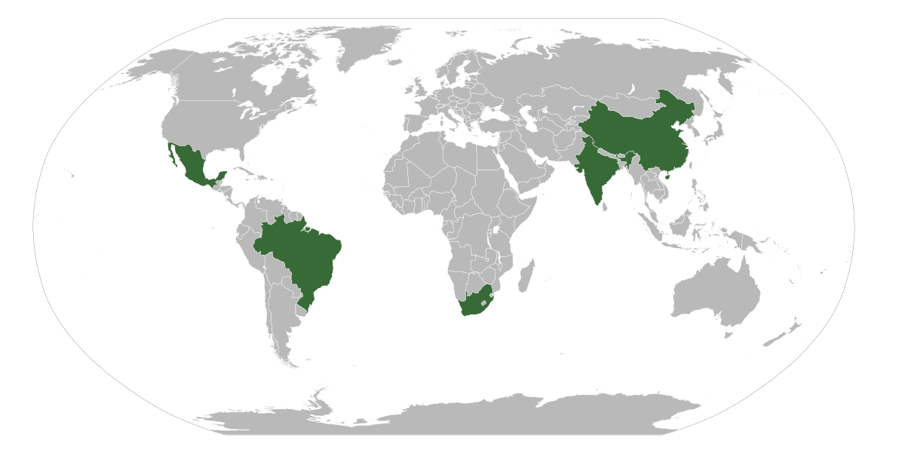

## Table of Contents

## What is the G5?

The G5 is a group of five countries that work together to help each other grow and develop. The countries in the G5 are Brazil, China, India, Mexico, and South Africa. They focus on things like making their economies stronger, fighting poverty, and improving health and education for their people.

These countries meet regularly to talk about their goals and plan ways to achieve them. By working together, they can share ideas and support each other in making their countries better places to live. The G5 is important because it helps these big, developing countries have a stronger voice in the world.

## Which countries are members of the G5?

The G5 is made up of five countries: Brazil, China, India, Mexico, and South Africa. These countries work together to help each other grow and become stronger.

They focus on important things like making their economies better, reducing poverty, and improving health and education. By working together, they can share ideas and help each other make their countries better places to live.

## When was the G5 formed?

The G5 was formed in 2005. This group started because leaders from Brazil, China, India, Mexico, and South Africa wanted to work together. They saw that by joining forces, they could help each other grow and face common challenges.

These countries wanted to make their economies stronger and improve things like health and education. They also wanted to have a bigger say in global issues. By meeting regularly and sharing ideas, the G5 countries work towards making their nations better places for everyone.

## What are the main goals of the G5?

The main goals of the G5 are to help each other grow and become stronger. The countries in the G5 want to make their economies better. They work together to share ideas and find ways to make more money and create jobs for their people. By doing this, they hope to make their countries richer and more successful.

Another important goal of the G5 is to fight poverty and improve the lives of their people. They focus on things like health and education. By working together, they can learn from each other and find better ways to help their citizens live healthier and happier lives. This also means making sure everyone has access to good schools and hospitals.

Overall, the G5 wants to have a bigger voice in the world. By joining forces, these countries can talk about their needs and ideas on a global stage. This helps them influence decisions that affect them and work towards a better future for everyone in their countries.

## How does the G5 influence global economic policies?

The G5 influences global economic policies by working together and speaking with a strong voice. The countries in the G5, like Brazil, China, India, Mexico, and South Africa, are big and important in the world. When they agree on something, other countries and big organizations like the World Bank and the International Monetary Fund listen to them. They can suggest new ideas or changes to how the world handles money and trade. By doing this, the G5 helps shape the rules that affect the global economy.

The G5 also influences global economic policies by sharing their experiences and ideas. These countries face similar challenges, like growing their economies and fighting poverty. By talking about what works and what doesn't, they can come up with better plans. When the G5 agrees on something, it can lead to new ways of doing things that other countries might follow. This helps make the world's economic system fairer and more helpful for everyone, especially for countries that are still growing.

## What are some key historical events that shaped the G5?

The G5 started in 2005 when leaders from Brazil, China, India, Mexico, and South Africa met for the first time. They wanted to help each other grow and face common problems. This meeting was important because it showed that these big countries could work together. They talked about making their economies stronger and improving things like health and education. This meeting set the stage for the G5 to become a group that could influence global issues.

Over the years, the G5 has had many meetings where they discussed important topics. For example, in 2007, they talked about how to help poor countries grow faster. They also talked about how to make trade fairer for everyone. These meetings helped the G5 become more important in the world. By working together, the G5 countries could share ideas and make plans that helped them grow and become stronger. This teamwork made the G5 a big voice in global economic policies.

## How has the membership of the G5 evolved over time?

The G5 was formed in 2005 with five countries: Brazil, China, India, Mexico, and South Africa. These countries decided to work together to help each other grow and face common challenges. Since then, the membership of the G5 has stayed the same. No new countries have joined, and none of the original members have left. The group has remained focused on its goals of making their economies stronger and improving things like health and education.

Over the years, the G5 has had many meetings where they discussed important topics. These meetings helped the G5 become more important in the world. Even though the number of members hasn't changed, the influence of the G5 has grown. By working together, the G5 countries can share ideas and make plans that help them grow and become stronger. This teamwork has made the G5 a big voice in global economic policies.

## What are the economic impacts of G5 meetings on member countries?

G5 meetings help the member countries grow their economies. When leaders from Brazil, China, India, Mexico, and South Africa meet, they talk about ways to make more money and create jobs. They share ideas about what works in their countries and learn from each other. This helps them find new ways to make their economies stronger. For example, they might talk about how to trade more with each other or how to attract more businesses to their countries. By working together, the G5 countries can make plans that help them all grow faster.

The meetings also help the G5 countries fight poverty and improve people's lives. They discuss how to make sure everyone has access to good schools and hospitals. By sharing what works in their countries, they can come up with better plans to help their citizens. This can lead to more people getting good jobs and living healthier lives. Overall, the G5 meetings help the member countries work together to make their economies better and improve the lives of their people.

## How do the G5 nations collaborate on international issues?

The G5 nations work together on international issues by meeting regularly and talking about what's important to them. They share ideas and make plans that can help them solve problems. For example, they might discuss how to fight climate change or how to make trade fairer. By working together, the G5 countries can come up with better solutions because they can learn from each other. They also have a stronger voice when they agree on something, which means other countries and big organizations listen to them more.

When the G5 nations collaborate, they also focus on helping each other grow and develop. They talk about how to make their economies stronger and how to improve things like health and education. By sharing what works in their countries, they can find new ways to help their people live better lives. This teamwork helps them influence global decisions and make sure their needs are considered. Overall, the G5 nations work together to make the world a better place for everyone.

## What are the criticisms and challenges faced by the G5?

Some people criticize the G5 because they think it doesn't include enough countries. They say that only five countries can't speak for the whole world. Other countries might feel left out and think that the G5 only cares about its own members. Also, some people worry that the G5 focuses too much on big economies and might not help smaller or poorer countries enough.

Another challenge for the G5 is making sure all its members agree on things. Brazil, China, India, Mexico, and South Africa are very different countries with different needs and goals. It can be hard for them to come up with plans that everyone likes. Sometimes, they might disagree on important issues like trade or climate change. This can make it harder for the G5 to work together and have a big impact on the world.

## How does the G5 compare to other international groups like the G7 or G20?

The G5 is different from the G7 and G20 because it has fewer members. The G5 includes Brazil, China, India, Mexico, and South Africa, which are all big countries that are still growing. The G7, on the other hand, has seven rich countries like the United States, Japan, and Germany. The G20 is even bigger, with twenty countries that include both rich and growing economies. Because the G5 has fewer members, it can focus more on the needs of these specific countries and work together more easily.

The G5, G7, and G20 all talk about big world issues like money, trade, and the environment. But the G5 has a special focus on helping its members grow and fight poverty. The G7 is more about keeping the world's economy stable and helping rich countries work together. The G20 tries to include more voices from around the world, so it can make decisions that affect everyone. Even though the G5 is smaller, it can still have a big impact because its members are important in the world.

## What future developments are anticipated for the G5?

In the future, the G5 might focus more on working together to solve big problems like climate change and making trade fairer. These countries could share more ideas about how to use clean energy and protect the environment. They might also talk about how to help their people live better lives by improving schools and hospitals. By working together, the G5 can come up with new plans that help everyone.

Another thing that might happen is the G5 could try to include more countries in their talks. Right now, only five countries are part of the G5, but they might want to hear from more voices. This could help them make better decisions that are good for more people around the world. Even though the G5 might stay small, their ideas and plans could still make a big difference.

## References & Further Reading

[1]: ["Advances in Financial Machine Learning"](https://www.amazon.com/Advances-Financial-Machine-Learning-Marcos/dp/1119482089) by Marcos Lopez de Prado

[2]: ["Evidence-Based Technical Analysis: Applying the Scientific Method and Statistical Inference to Trading Signals"](https://www.amazon.com/Evidence-Based-Technical-Analysis-Scientific-Statistical/dp/0470008741) by David Aronson

[3]: ["Machine Learning for Algorithmic Trading"](https://github.com/stefan-jansen/machine-learning-for-trading) by Stefan Jansen

[4]: ["Quantitative Trading: How to Build Your Own Algorithmic Trading Business"](https://www.amazon.com/Quantitative-Trading-Build-Algorithmic-Business/dp/1119800064) by Ernest P. Chan

[5]: Amorós, J. E., & Cristi, O. (2011). "Longitudinal analysis of entrepreneurship and competitiveness dynamics in Latin American countries: An exploration of cross-country differences." *International Entrepreneurship and Management Journal*, 7(3), 317-342. 
