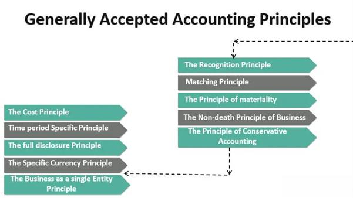

The world of finance is experiencing swift advancements, characterized by the integration of innovative methods and tools designed to enhance decision-making and operational efficiency. Central to these advancements are financial reporting, accrual accounting, Generally Accepted Accounting Principles (GAAP), and algorithmic trading. These components play a pivotal role in how businesses communicate financial data, manage financial activities, and execute trades within the financial markets.

Financial reporting serves as a vital communication tool, enabling companies to provide a transparent account of their financial status to stakeholders. This process is essential for maintaining investor confidence and ensuring compliance with regulatory obligations. Accrual accounting, on the other hand, offers a more comprehensive view of a company's financial health by recording revenues and expenses when they are incurred rather than when cash transactions occur. This method aligns closely with GAAP—a set of standardized rules ensuring consistency, reliability, and comparability of financial statements, particularly for publicly traded companies.



Algorithmic trading represents a fusion of finance and technology, where computer programs utilize pre-defined criteria to execute trades. The accuracy and timeliness of financial data derived from robust financial reporting practices fuel the creation and optimization of these trading algorithms. As such, professionals well-versed in financial reporting standards and algorithmic trading can optimize trading strategies, bolstering their strategic decision-making capabilities.

This article examines the interconnectedness of financial reporting, accrual accounting, GAAP, and algorithmic trading, underscoring their significance in the financial industry. By grasping these elements, financial professionals are positioned to navigate the complexities of today's dynamic financial landscape more effectively, fostering both compliance and competitive advantage.

## Table of Contents

## Understanding Financial Reporting

Financial reporting serves as a fundamental tool for businesses to communicate their financial status to stakeholders, including investors, creditors, and regulatory bodies. This communication is achieved through the production of financial statements that encapsulate a company's operational performance, financial position, and cash flows over a specified period. The primary components of these reports are balance sheets, income statements, and cash flow statements, each serving a unique purpose in portraying the financial health of a business.

Balance sheets provide a snapshot of a company's financial position at a particular point in time, detailing assets, liabilities, and shareholders' equity. This statement is governed by the fundamental accounting equation:

$$
\text{Assets} = \text{Liabilities} + \text{Equity}
$$

An accurate balance sheet is essential for stakeholders to assess a company's solvency and capital structure.

Income statements, on the other hand, summarize the company's revenues, expenses, and profits over a reporting period. This statement is crucial for evaluating the profitability and operational efficiency of the business. The basic structure of an income statement can be represented as:

$$
\text{Net Income} = \text{Revenue} - \text{Expenses}
$$

Cash flow statements provide insights into cash inflows and outflows from operating, investing, and financing activities. This statement is vital for understanding the [liquidity](/wiki/liquidity-risk-premium) and long-term viability of a company, indicating its ability to generate cash to meet obligations.

Reliable and accurate financial reporting is indispensable for enabling stakeholders to make informed decisions regarding investment, lending, and management. It also plays a crucial role in maintaining investor confidence, as these reports provide transparency into the company's financial practices and outcomes. Furthermore, financial reporting must comply with regulatory requirements, which vary across jurisdictions but generally aim to ensure fairness, transparency, and accountability in financial disclosures.

Incorporating accurate and comprehensive financial data into these reports is essential—not only for regulatory compliance but also for reinforcing trust with stakeholders, which is paramount for a company's reputation and market position.

## The Role of Accrual Accounting

Accrual accounting records revenues and expenses when they are earned or incurred, providing a clearer representation of a company's financial health than cash accounting. This approach aligns the recognition of income and associated costs within the same reporting period, often referred to as the matching principle. By matching revenues with related expenses, accrual accounting allows for a more accurate assessment of a company's profitability and operational efficiency over time.

For instance, consider a company delivering a service in December but receiving payment in January. Under accrual accounting, the revenue is recognized in December, reflecting when the service was rendered rather than when cash was received. Similarly, the costs associated with delivering that service are also recorded in December, ensuring that all financial activity relevant to that period is comprehensively represented.

Accrual accounting is crucial for businesses focusing on transparency and consistency, key elements in financial reporting. By recognizing revenue and expenses as they occur, regardless of cash flow, accrual accounting provides stakeholders with a truthful depiction of a company’s financial performance. This method supports compliance with various regulatory frameworks, such as those dictated by Generally Accepted Accounting Principles (GAAP) or International Financial Reporting Standards (IFRS), emphasizing its importance in maintaining investor confidence and meeting statutory obligations.

Understanding accrual accounting implications is fundamental for evaluating a firm's financial performance and stability. It enhances forecasting accuracy and decision-making by presenting a real-time financial condition. This added precision is especially valuable in environments where strategic planning and resource allocation depend heavily on past and current performance metrics.

In summary, accrual accounting offers a comprehensive view of financial operations by accounting for all obligations and earned revenues during the reporting period. This method supports transparent reporting practices that ultimately contribute to the accurate assessment and strategic positioning of a business in its market.

## GAAP: The Framework for Financial Reporting

Generally Accepted Accounting Principles (GAAP) are a comprehensive set of accounting standards, guidelines, and procedures used for financial reporting in the United States. These principles are designed to ensure that financial statements are consistent, reliable, and comparable across different companies, which is crucial for investors, regulators, and other stakeholders who rely on accurate and transparent financial information.

GAAP encompasses a wide range of accounting topics, including revenue recognition, balance sheet classification, and materiality, among others. Revenue recognition under GAAP is governed by specific criteria that determine the conditions under which revenue is recognized. For instance, revenue is typically recognized when it is realized or realizable and earned, which means that the goods or services have been provided and the payment is reasonably assured.

Balance sheet classification under GAAP ensures that assets and liabilities are categorized appropriately to reflect their nature and timing. For example, assets and liabilities are typically divided into current and non-current categories based on their expected settlement within one year or beyond, respectively. This classification aids in assessing a company's liquidity and financial health.

Materiality is another critical concept within GAAP, which refers to the threshold of significance that affects how financial information is reported. Information is considered material if its omission or misstatement could influence the economic decisions of users taken on the basis of the financial statements. This principle ensures that all significant and relevant information is disclosed in financial reports.

Adherence to GAAP is mandatory for publicly traded companies in the U.S., as it is required by the Securities and Exchange Commission (SEC). Compliance with these standards is a best practice for privately held businesses to ensure sound financial practices and enhance the credibility of their financial statements. GAAP provides a framework that accountants, financial analysts, and auditors must be familiar with to perform their jobs effectively and ensure regulatory compliance.

Overall, GAAP plays a vital role in the financial reporting process by providing a standardized set of rules that improve the transparency and comparability of financial information. This standardization facilitates better decision-making by users of financial reports, supports the capital markets, and contributes to the overall stability and efficiency of the financial system.

## The Intersection of Financial Reporting and Algorithmic Trading

Algorithmic trading has revolutionized the way financial markets operate, with automated systems executing trades at speeds and efficiencies unattainable by human traders. A critical component of these systems is their reliance on accurate and timely financial data, which is derived from diligent financial reporting. This data acts as the backbone for many trading algorithms, providing the necessary information to make informed decisions within milliseconds.

Financial reporting, when executed within the framework of Generally Accepted Accounting Principles (GAAP), ensures that the data feeding these algorithms is consistent and reliable. GAAP establishes the rules and standards that guarantee uniformity in financial documentation, thus enabling fair comparisons across different businesses. The reliability imparted by adherence to GAAP is particularly crucial in [algorithmic trading](/wiki/algorithmic-trading), where even minor inaccuracies can lead to significant trading errors or financial loss.

The utilization of accrual accounting within financial reporting further enhances the quality of data available for algorithmic trading. Unlike cash accounting that records transactions only when cash changes hands, accrual accounting records financial events when they occur, irrespective of cash flow. This method offers a more comprehensive view of a company's financial health by matching revenues with associated expenses in the same period. For example, if an algorithm uses earnings data to predict stock movements, it gains a better insight into the company's real performance if these earnings are reported on an accrual basis.

Professionals in both finance and technology are required to have a profound understanding of financial reporting principles and algorithmic trading mechanisms to optimize trading strategies effectively. This dual knowledge enables them to construct algorithms that are not only sophisticated in their execution logic but also grounded in reliable financial insights. 

Python, the preferred language of many quant developers due to its extensive libraries and ease of use, can be employed to demonstrate a simple model that integrates financial reporting data into a trading algorithm. For instance, one might use Python's pandas library to manipulate dataframes of quarterly earnings reports, employing these metrics for trading signals:

```python
import pandas as pd

# Example of integrating financial report data into a trading algorithm
# Load financial data
financial_data = pd.read_csv('financial_reports.csv')

# Convert earnings dates to a datetime object for comparison
financial_data['Earnings Date'] = pd.to_datetime(financial_data['Earnings Date'])

# Calculate moving averages to use as an indicator
financial_data['MA_50'] = financial_data['Earnings'].rolling(window=50).mean()
financial_data['MA_200'] = financial_data['Earnings'].rolling(window=200).mean()

# Generate trade signals based on moving average crossover
financial_data['Signal'] = 0
financial_data['Signal'][financial_data['MA_50'] > financial_data['MA_200']] = 1
financial_data['Signal'][financial_data['MA_50'] < financial_data['MA_200']] = -1
```

This example showcases how financial reporting data, treated under GAAP's consistency principles and using accrual accounting's detailed insights, can be transformed into actionable trading strategies through algorithmic trading systems. Through this intersection of reporting and trading, businesses can achieve higher analytical precision and strategic advantage in the marketplace.

## Challenges and Opportunities

The integration of financial reporting practices and algorithmic trading offers a complex landscape of challenges and opportunities for financial professionals. The primary challenge lies in ensuring data accuracy and maintaining compliance with rapidly evolving regulations. Financial data, essential for algorithmic trading, must be meticulously accurate and timely to avoid significant financial risks. Compliance with regulatory frameworks such as the Sarbanes-Oxley Act and international financial reporting standards is necessary to maintain corporate transparency and protect investor interests.

On the opportunity side, technological advancements have significantly transformed data analysis and the development of trading algorithms. Machine learning and [artificial intelligence](/wiki/ai-artificial-intelligence) can now uncover intricate patterns in financial data, enabling more sophisticated algorithmic trading strategies. Advanced algorithms can analyze vast datasets in real time, leading to the identification of profitable trading opportunities with greater precision. For instance, the use of neural networks in predicting stock price movements is becoming more prevalent, offering more robust market predictions.

The synergy between accrual accounting and algorithmic trading can also enhance market predictions. Accrual accounting provides a comprehensive view of a company's financial situation by recording transactions as they occur, irrespective of cash flow. This method aligns well with algorithmic trading, which relies on the availability of detailed and accurate financial information to make informed decisions. By incorporating accrual accounting principles, trading algorithms can achieve a more accurate analysis of a company's financial health, thus improving the precision of market forecasts.

Remaining informed about the latest developments in financial reporting standards and algorithmic trading technologies is vital for financial professionals who aim to capitalize on these opportunities. As regulations and technologies rapidly evolve, continuous education and adaptation are required to ensure compliance and harness the potential of innovative trading strategies. Engaging with current industry trends and maintaining a flexible approach to new tools and methods will facilitate the successful integration of financial reporting and algorithmic trading, ultimately driving competitive advantage in the financial industry.

## Conclusion

The interconnectedness of financial reporting, accrual accounting, Generally Accepted Accounting Principles (GAAP), and algorithmic trading is significantly influencing modern finance. Businesses that integrate these practices can effectively manage and analyze financial data, which enhances their ability to address market complexities and make informed decisions. This comprehensive approach enables organizations to optimize strategic trading, fostering sustained success in competitive markets.

Professionals well-versed in these concepts are positioned to leverage advanced financial strategies and technologies. This expertise is critical for developing and implementing trading algorithms that rely on accurate and consistent financial data. Such information, underpinned by GAAP and accrual accounting, ensures reliability and comparability, crucial for strategic advantage.

As the financial industry continues to evolve with technological advancements and regulatory changes, staying informed is essential. The ability to adapt and incorporate new developments in financial reporting and algorithmic trading determins a business's competitive edge. Thus, the synthesis of these financial components is integral to transforming and shaping the global financial landscape, driving future innovations and efficiencies within the industry.

## References & Further Reading

[1]: Financial Accounting Standards Board. ["About the FASB."](https://fasb.org/about-us/about-the-fasb) Accessed on [date].

[2]: "GAAP: Generally Accepted Accounting Principles" [Investopedia](https://www.investopedia.com/terms/g/gaap.asp) 

[3]: Bruce I. Jacobs and Kenneth N. Levy. ["Market Efficiency, Anomalies, and the Case for Fundamental Analysis"](https://jlem.com/documents/FG/jlem/articles/579647_Complexity_of_the_Stock_Market_-_Bruce_Jacobs-Ken_Levy_-_JPM_Fall_1989.pdf) Financial Analysts Journal, 1999.

[4]: ["Advances in Financial Machine Learning"](https://www.amazon.com/Advances-Financial-Machine-Learning-Marcos/dp/1119482089) by Marcos Lopez de Prado

[5]: ["Quantitative Trading: How to Build Your Own Algorithmic Trading Business"](https://www.amazon.com/Quantitative-Trading-Build-Algorithmic-Business/dp/1119800064) by Ernest P. Chan

[6]: ["Machine Learning for Algorithmic Trading"](https://github.com/stefan-jansen/machine-learning-for-trading) by Stefan Jansen

[7]: Securities and Exchange Commission. ["Beginners' Guide to Financial Statement."](https://www.sec.gov/about/reports-publications/investorpubsbegfinstmtguide) Accessed on [date].