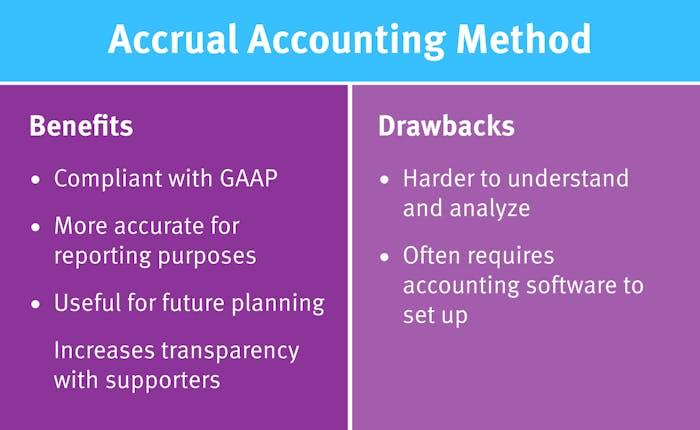

## Table of Contents

## What is GAAP and why is it important?

GAAP stands for Generally Accepted Accounting Principles. It is a set of rules that accountants follow when they prepare financial statements. These rules make sure that the financial information is clear and consistent, so people can trust it. GAAP is used in the United States and helps companies show their financial health in a way that everyone can understand.

GAAP is important because it helps create trust in financial reporting. When everyone follows the same rules, it's easier to compare the financial statements of different companies. This is really helpful for investors, who need to make smart decisions about where to put their money. Without GAAP, it would be hard to know if a company's financial statements are accurate and fair.

## What is accrual basis accounting and how does it differ from cash basis accounting?

Accrual basis accounting is a method where you record income and expenses when they happen, not when you actually get or spend the money. For example, if you do a job in December but don't get paid until January, you would still record the income in December. This method gives a better picture of your financial situation over time because it matches the income with the expenses that helped earn that income.

Cash basis accounting is simpler and works by recording income and expenses only when the money changes hands. So, if you do a job in December but get paid in January, you would record the income in January. This method is easier to use and understand, but it can make your financial statements look different from what's really happening in your business. For example, it might look like you had a bad month when you actually did a lot of work but haven't been paid yet.

The main difference between the two is timing. Accrual basis accounting focuses on when the work or expense happens, while cash basis accounting focuses on when the money moves. Accrual basis is required for larger businesses and gives a more accurate long-term view, while cash basis is often used by smaller businesses and gives a clearer short-term view of cash flow.

## How does GAAP relate to accrual basis accounting?

GAAP, or Generally Accepted Accounting Principles, is a set of rules that companies in the United States follow when they make their financial statements. One of the big rules in GAAP is that companies have to use accrual basis accounting. This means they record income and expenses when they happen, not when the money actually changes hands. This is important because it gives a more accurate picture of a company's financial health over time.

Accrual basis accounting fits well with GAAP because it helps make sure financial statements are clear and consistent. When all companies use the same method, it's easier for people like investors to compare different companies and make good decisions. GAAP wants financial information to be trustworthy, and using accrual basis accounting helps achieve that goal.

## What are the basic principles of GAAP that affect accrual accounting?

The basic principles of GAAP that affect accrual accounting include the revenue recognition principle and the matching principle. The revenue recognition principle says that companies should record income when they earn it, not when they get paid. This means if a company does a job in one month but gets paid later, they still record the income in the month they did the job. This helps show a true picture of when the money was earned.

The matching principle goes hand-in-hand with revenue recognition. It says that companies should record expenses in the same period as the income they helped earn. So, if a company spends money to do a job in December, they should record that expense in December, even if they pay the bill in January. This helps match the costs with the income they helped generate, giving a clearer view of the company's financial performance over time.

These principles are important because they make sure that financial statements show a fair and accurate picture of a company's financial health. By using accrual accounting as required by GAAP, companies can better reflect their true financial situation, which helps investors and other people make informed decisions.

## Can you explain the revenue recognition principle under GAAP?

The revenue recognition principle under GAAP says that companies should record their income when they earn it, not when they get paid. This means if a company does a job in one month but gets paid later, they still record the income in the month they did the job. It's like saying, "We earned this money now, even if we get it later." This helps show a true picture of when the money was earned and makes financial statements more accurate.

This principle is important because it helps companies show their real financial situation. If a company waited to record income until they got paid, their financial statements might look different from what's really happening. For example, a company could look like it's doing badly in one month when it's actually doing a lot of work but hasn't been paid yet. By recording income when it's earned, the revenue recognition principle helps everyone see a clearer and more honest view of a company's financial health.

## How does the matching principle apply in accrual accounting?

The matching principle in accrual accounting says that companies should record their expenses in the same period as the income they helped earn. This means if a company spends money to do a job in one month, they should record that expense in that month, even if they pay the bill later. It's like saying, "We spent this money to earn this income, so let's match them up."

This principle is important because it helps show a true picture of a company's financial health. If a company recorded all their expenses when they paid them, their financial statements might look different from what's really happening. For example, a company could look like it's doing badly in one month when it's actually doing a lot of work but hasn't paid all the bills yet. By matching expenses with the income they helped earn, the matching principle helps everyone see a clearer and more honest view of a company's financial performance.

## What are the specific GAAP requirements for recording revenues and expenses?

GAAP has specific rules for when companies should record their revenues and expenses. For revenues, GAAP says companies should use the revenue recognition principle. This means they need to record income when they earn it, not when they get paid. So, if a company does a job in December but gets paid in January, they still record the income in December. This helps show when the money was really earned and makes the financial statements more accurate.

For expenses, GAAP uses the matching principle. This means companies should record their expenses in the same period as the income they helped earn. So, if a company spends money in December to do a job, they record that expense in December, even if they pay the bill in January. This helps match the costs with the income they helped generate, giving a clearer view of the company's financial performance over time.

These rules are important because they make sure financial statements show a fair and accurate picture of a company's financial health. By using these principles, companies can better reflect their true financial situation, which helps investors and other people make informed decisions.

## How should adjusting entries be handled under GAAP for accrual accounting?

Adjusting entries under GAAP for accrual accounting are used to make sure a company's financial statements are correct at the end of an accounting period. These entries help match revenues with the expenses that helped earn those revenues. For example, if a company owes money for utilities used in December but hasn't paid the bill yet, they would make an adjusting entry to record that expense in December. This way, the financial statements show the true cost of doing business in that period.

Adjusting entries can also be used to record revenues that have been earned but not yet received. If a company did a job in December but won't get paid until January, they would make an adjusting entry to record that income in December. This helps show the real financial situation of the company by matching the income with the time it was earned. By using adjusting entries, companies follow GAAP rules and make their financial statements more accurate and useful for everyone who looks at them.

## What are some common challenges businesses face when implementing GAAP and accrual accounting?

Businesses often find it hard to switch to GAAP and accrual accounting because it can be more complicated than what they're used to. For example, instead of just writing down income and expenses when money changes hands, they have to think about when they earned the money or when the expense happened. This can be confusing and requires keeping good records of everything. Smaller businesses might not have the staff or the know-how to do this well, and it can take a lot of time and effort to learn and follow all the GAAP rules.

Another challenge is that accrual accounting can make it harder to see how much cash a business actually has on hand. With cash basis accounting, you can easily see how much money is coming in and going out. But with accrual accounting, you might see income and expenses that haven't been paid yet, which can make it look like the business is doing better or worse than it really is. This can be tough for business owners who need to know their cash situation to make decisions. Plus, making all the adjusting entries needed for accrual accounting can be a lot of work and might need special accounting software or help from an accountant.

## How do GAAP and accrual accounting impact financial statements?

GAAP and accrual accounting make a big difference in how a company's financial statements look. They help show a true picture of a company's money situation by matching up when income is earned with when expenses are made. For example, if a company does a job in December but gets paid in January, GAAP says they should record that income in December. This means the financial statements will show the real earnings for that month, not just the cash that came in.

Accrual accounting can also make financial statements more complicated to understand at first. Instead of just showing money that's been received or spent, it includes money that's been earned or owed. This can make it look like a company has more or less money than it really does in the bank. But over time, using GAAP and accrual accounting helps everyone see a clearer and more honest view of how the company is doing financially. It's important for investors and others who need to trust the numbers they see.

## What are the implications of non-compliance with GAAP in accrual accounting?

If a company doesn't follow GAAP rules for accrual accounting, it can face big problems. Not following GAAP can make the company's financial statements wrong and hard to trust. This can lead to fines or legal trouble from the government or other groups that watch over businesses. Investors and lenders might also lose trust in the company and decide not to give them money, which can hurt the business a lot.

Not following GAAP can also make it hard for a company to compare itself to other businesses. When everyone uses the same rules, it's easy to see how one company is doing compared to another. But if a company doesn't use GAAP, its financial statements might look different, and it can be tough to understand their real financial health. This can make it harder for the company to get new business or make smart decisions about their future.

## How can a business ensure ongoing compliance with GAAP and accrual basis accounting requirements?

A business can make sure it keeps following GAAP and accrual basis accounting rules by always keeping good records and using the right accounting software. This software can help them record income and expenses at the right time, not just when money changes hands. They should also train their staff to understand GAAP rules and how to use accrual accounting correctly. By doing this, everyone in the business knows what to do, and they can keep their financial statements accurate and trustworthy.

It's also a good idea for a business to have regular checks to make sure they're still following GAAP. They can hire an outside accountant or auditor to look over their books and make sure everything is right. This helps catch any mistakes early and keeps the business on track. By staying up to date with any changes in GAAP rules and making sure everyone in the business understands them, a company can keep its financial statements clear and reliable.

## What is Understanding Financial Reporting?

Financial reporting serves as a fundamental tool for businesses to communicate their financial status to stakeholders, including investors, creditors, and regulatory bodies. This communication is achieved through the production of financial statements that encapsulate a company's operational performance, financial position, and cash flows over a specified period. The primary components of these reports are balance sheets, income statements, and cash flow statements, each serving a unique purpose in portraying the financial health of a business.

Balance sheets provide a snapshot of a company's financial position at a particular point in time, detailing assets, liabilities, and shareholders' equity. This statement is governed by the fundamental accounting equation:

$$
\text{Assets} = \text{Liabilities} + \text{Equity}
$$

An accurate balance sheet is essential for stakeholders to assess a company's solvency and capital structure.

Income statements, on the other hand, summarize the company's revenues, expenses, and profits over a reporting period. This statement is crucial for evaluating the profitability and operational efficiency of the business. The basic structure of an income statement can be represented as:

$$
\text{Net Income} = \text{Revenue} - \text{Expenses}
$$

Cash flow statements provide insights into cash inflows and outflows from operating, investing, and financing activities. This statement is vital for understanding the [liquidity](/wiki/liquidity-risk-premium) and long-term viability of a company, indicating its ability to generate cash to meet obligations.

Reliable and accurate financial reporting is indispensable for enabling stakeholders to make informed decisions regarding investment, lending, and management. It also plays a crucial role in maintaining investor confidence, as these reports provide transparency into the company's financial practices and outcomes. Furthermore, financial reporting must comply with regulatory requirements, which vary across jurisdictions but generally aim to ensure fairness, transparency, and accountability in financial disclosures.

Incorporating accurate and comprehensive financial data into these reports is essential—not only for regulatory compliance but also for reinforcing trust with stakeholders, which is paramount for a company's reputation and market position.

## References & Further Reading

[1]: Financial Accounting Standards Board. ["About the FASB."](https://fasb.org/about-us/about-the-fasb) Accessed on [date].

[2]: "GAAP: Generally Accepted Accounting Principles" [Investopedia](https://www.investopedia.com/terms/g/gaap.asp) 

[3]: Bruce I. Jacobs and Kenneth N. Levy. ["Market Efficiency, Anomalies, and the Case for Fundamental Analysis"](https://jlem.com/documents/FG/jlem/articles/579647_Complexity_of_the_Stock_Market_-_Bruce_Jacobs-Ken_Levy_-_JPM_Fall_1989.pdf) Financial Analysts Journal, 1999.

[4]: ["Advances in Financial Machine Learning"](https://www.amazon.com/Advances-Financial-Machine-Learning-Marcos/dp/1119482089) by Marcos Lopez de Prado

[5]: ["Quantitative Trading: How to Build Your Own Algorithmic Trading Business"](https://www.amazon.com/Quantitative-Trading-Build-Algorithmic-Business/dp/1119800064) by Ernest P. Chan

[6]: ["Machine Learning for Algorithmic Trading"](https://github.com/stefan-jansen/machine-learning-for-trading) by Stefan Jansen

[7]: Securities and Exchange Commission. ["Beginners' Guide to Financial Statement."](https://www.sec.gov/about/reports-publications/investorpubsbegfinstmtguide) Accessed on [date].