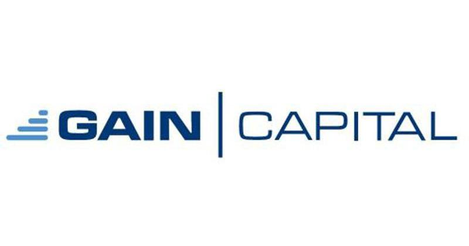

Algorithmic trading has profoundly transformed financial markets by enabling automated and rapid trade execution, thereby reducing the potential for human error and increasing operational efficiency. Gaincapital-com, operating under StoneX Financial Inc., is pivotal in facilitating algorithmic trading through its sophisticated platforms and application programming interfaces (APIs). These offerings cater to both individual and institutional traders, granting them access to the tools necessary for efficient trading.

Gaincapital-com's platforms integrate cutting-edge technology, offering a robust framework for designing and implementing algorithmic trading strategies. These platforms are designed to handle the critical needs of algorithmic traders, including real-time data analysis, automated execution, and comprehensive risk management tools. By leveraging these capabilities, traders can refine their strategies, reduce latency, and optimize the execution of trades, which is crucial in the fast-paced financial markets.



Moreover, gaincapital-com provides educational resources and technical support that empower traders to fully utilize its platforms and trading tools. This support is crucial for both novice and experienced traders looking to harness the full potential of algorithmic trading. Understanding and leveraging these tools can lead to enhanced trading performance and offer a competitive advantage in the market. As algorithmic trading continues to evolve, gaincapital-com remains at the forefront, consistently enhancing its offerings to meet the ever-changing demands of the trading world.

## Table of Contents

## Overview of Gaincapital-com and Its Services

Gaincapital-com, operating under the umbrella of StoneX Financial Inc.'s Gain Futures Division, delivers a comprehensive suite of trading services tailored to both institutional and individual traders. This platform has established a reputation for its cutting-edge technology solutions that streamline trading activities, addressing the needs of a diverse clientele.

The cornerstone of Gaincapital-com's offerings includes futures and options trading. These instruments provide traders with the flexibility to hedge their portfolios against market [volatility](/wiki/volatility-trading-strategies) while capitalizing on price movements. By enabling trading in these derivatives, Gaincapital-com supports a wide range of trading strategies, from straightforward hedging to intricate speculative pursuits.

Beyond these fundamental services, Gaincapital-com extends its capabilities to managed futures, allowing investors to access professional management of their futures investments. This service is particularly beneficial for traders who aim to diversify their portfolios without directly managing their trades.

A defining feature of Gaincapital-com is its advanced electronic trading platform, GAIN Trader. This platform stands out for its user-friendly interface and powerful suite of tools designed to enhance trading efficiency. GAIN Trader offers live market data and advanced charting features, equipping traders with the necessary resources for informed decision-making and strategy development.

Gaincapital-com's services are meticulously designed to cater to the varied requirements of its user base. This inclusivity spans from novice traders, who require intuitive platforms and straightforward operational processes, to seasoned professionals who execute complex strategies and demand high levels of customization and real-time data integration. The adaptable and versatile nature of Gaincapital-com’s offerings makes it a versatile partner in the financial trading sector.

## The Role of APIs in Algorithmic Trading

The Gain Futures API is a pivotal tool that assists traders in implementing [algorithmic trading](/wiki/algorithmic-trading) strategies with efficiency and precision. This API facilitates trading across all markets accessible through a trader's account, enabling seamless integration with customized trading solutions. By allowing traders to link their front-end applications to the back-end services provided by gaincapital-com, the API paves the way for automation and real-time data analysis. 

Crucially, the Gain Futures API supports a range of programming languages, including C++, Python, and Java. This extensive compatibility allows traders to develop and execute strategies in an environment that best suits their technical preferences and specific needs. The flexibility offered by this multilingual support is essential for the development of sophisticated algorithmic models, further enhancing the customization potential for each trader's unique requirements. 

As algorithmic trading increasingly involves complex computational processes, the ability to integrate scripting and coding directly into trading platforms is invaluable. For example, a Python script could be used to calculate the moving average of a stock, executing trades automatically when certain conditions are met. Here is a basic execution using Python for such a strategy:

```python
import pandas as pd
import numpy as np

# Example: Simple Moving Average Crossover Strategy
def simple_moving_average(data, short_window=40, long_window=100):
    signals = pd.DataFrame(index=data.index)
    signals['price'] = data['close']
    signals['short_mavg'] = data['close'].rolling(window=short_window, min_periods=1, center=False).mean()
    signals['long_mavg'] = data['close'].rolling(window=long_window, min_periods=1, center=False).mean()
    signals['signal'] = 0.0
    signals['signal'][short_window:] = np.where(signals['short_mavg'][short_window:] > signals['long_mavg'][short_window:], 1.0, 0.0)   
    signals['positions'] = signals['signal'].diff()
    return signals

# Sample data and function execution
sample_data = pd.DataFrame({
    'close': [1.0, 1.2, 1.3, 1.1, 1.4, 1.6, 1.8, 1.7, 1.9, 2.0]
})
signals = simple_moving_average(sample_data)
print(signals)
```

This code highlights the importance of APIs in enabling algorithmic trading strategies, as traders can utilize API connectivity to feed market data into scripts or algorithms for real-time trading decisions. The ability to swiftly develop and test new strategies without being constrained by technical limitations marks an evolutionary advantage for traders using gaincapital-com's API resources. Such capabilities are indispensable in a dynamic trading environment where speed and strategy adaptation are key to success.

## Gain Trader Platform: A Hub for Algo Traders

GAIN Trader is an intuitive and feature-rich trading platform that supports the automation and precision required for effective algorithmic trading. It offers an extensive array of features designed to accommodate both the complexity and speed demands of modern trading strategies.

One of the core features of GAIN Trader is its provision of live market data. This real-time data is crucial for algorithmic trading, where decisions are made based on immediate market conditions. By ensuring access to the latest information, traders can refine their strategies and make informed trades at optimal times.

In addition to real-time data, GAIN Trader provides sophisticated charting tools. These tools enable traders to visualize market trends and patterns efficiently, allowing for the analysis necessary to develop and validate trading strategies. The ability to overlay multiple technical indicators on charts ensures that traders have a comprehensive understanding of market dynamics.

Back-testing capabilities are another significant feature of the GAIN Trader platform. Back-testing allows traders to apply their algorithms to historical data to assess potential performance before executing them in live markets. This practice is essential for verifying the robustness of trading strategies, minimizing risk, and optimizing returns.

Customization is a hallmark of the GAIN Trader platform. With features such as customizable layouts and alerts, traders have the flexibility to tailor their trading environment according to their specific needs and preferences. This level of personalization enhances the user experience and aids in the efficient monitoring of trading activities.

The platform also offers support for complex order types and risk management tools. These capabilities provide essential functionality for managing the intricacies of algorithmic trading. By offering advanced order types, such as conditional and trailing stop orders, GAIN Trader allows traders to execute precise trading strategies. Additionally, comprehensive risk management tools enable traders to mitigate potential losses and protect their investment capital.

Overall, GAIN Trader serves as a comprehensive hub for algorithmic traders who require sophisticated tools and features to enhance their trading performance. From real-time data access and advanced charting to customizable interfaces and robust risk management, GAIN Trader meets the demands of both novice and experienced traders seeking efficiency and precision in their trading operations.

## Advantages of Using Gaincapital-com in Algo Trading

Gaincapital-com, part of StoneX Financial Inc., offers several advantages that are particularly beneficial for algorithmic traders. One of the most significant benefits is the platform's exceptional speed and reliability. High-frequency trading ([HFT](/wiki/high-frequency-trading-strategies)) and other forms of algorithmic trading require rapid execution to capitalize on market opportunities that may last only fractions of a second. Gaincapital-com's robust infrastructure, supported by StoneX, ensures high uptime and low latency, essential for executing trades promptly in volatile markets.

Additionally, traders on gaincapital-com have access to a dedicated support team and comprehensive resources that can be instrumental in troubleshooting and strategy enhancement. Having reliable support and resources can greatly assist both novice and experienced traders in refining their strategies and optimizing their trading operations.

Innovation is another key focus of gaincapital-com. The platform offers features such as trade automation and the ability to create custom indicators, which provide traders with a significant market advantage. Automated trading allows for the execution of pre-defined trading strategies without manual intervention, ensuring that trades are executed as planned regardless of the time of day or market conditions. Custom indicators, meanwhile, enable traders to tailor their analytics to better suit their specific trading strategies, potentially identifying trends and opportunities that standard indicators might overlook.

Overall, gaincapital-com provides a comprehensive suite of tools and support that empower traders to effectively execute and optimize their algorithmic trading strategies.

## Getting Started with Gaincapital-com for Algorithmic Trading

Traders interested in algorithmic trading with gaincapital-com can initiate their journey by accessing the comprehensive API documentation available on the official website. This documentation provides detailed insights into how the APIs can be effectively utilized to automate trading strategies and integrate with custom solutions.

To facilitate a smooth onboarding process, gaincapital-com offers tutorials and user guides that inform new users about the trading platform's functionalities and features. These resources are beneficial for understanding how to navigate the platform and employ its various tools to enhance trading strategies.

For traders focused on developing custom algorithms, gaincapital-com provides an API Developer Center. This center is an invaluable resource hub, offering extensive documentation, code samples, and access to community support forums where traders can exchange ideas and solutions. The collaborative environment encourages knowledge sharing, which is crucial for developing effective algorithmic strategies.

Gaincapital-com also enables traders to establish demo accounts, which serve as a beneficial sandbox environment for testing and refining trading strategies without financial risk. Demo accounts simulate the live trading environment, allowing traders to experiment with different algorithmic approaches, back-test, and optimize their strategies to achieve desired outcomes before deploying them in real-time markets.

Engaging with these resources empowers traders to harness the full potential of gaincapital-com's algorithmic trading capabilities, fostering skill development and strategic growth.

## Conclusion

Gaincapital-com stands out as a formidable platform for traders focused on algorithmic trading. Its well-rounded suite of services, coupled with cutting-edge technology solutions, provides a strategic advantage for traders aiming to refine and execute efficient trading strategies. Gaincapital-com’s offering caters to both newcomers and experienced traders, empowering them with a versatile set of tools and resources essential for achieving diverse trading objectives. As algorithmic trading undergoes continuous transformation, gaincapital-com is proactive in its approach, consistently innovating to align with the progressing demands of the trading sector. This commitment ensures that traders have access to first-rate platforms and support, contributing to their success in the fast-paced trading landscape.

## References & Further Reading

[1]: Bergstra, J., Bardenet, R., Bengio, Y., & Kégl, B. (2011). ["Algorithms for Hyper-Parameter Optimization."](https://papers.nips.cc/paper/4443-algorithms-for-hyper-parameter-optimization) Advances in Neural Information Processing Systems 24.

[2]: ["Advances in Financial Machine Learning"](https://www.amazon.com/Advances-Financial-Machine-Learning-Marcos/dp/1119482089) by Marcos Lopez de Prado

[3]: ["Evidence-Based Technical Analysis: Applying the Scientific Method and Statistical Inference to Trading Signals"](https://www.amazon.com/Evidence-Based-Technical-Analysis-Scientific-Statistical/dp/0470008741) by David Aronson

[4]: ["Machine Learning for Algorithmic Trading"](https://github.com/stefan-jansen/machine-learning-for-trading) by Stefan Jansen

[5]: ["Quantitative Trading: How to Build Your Own Algorithmic Trading Business"](https://books.google.com/books/about/Quantitative_Trading.html?id=j70yEAAAQBAJ) by Ernest P. Chan