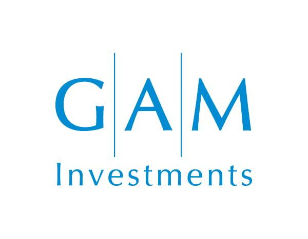

## Table of Contents

## What is GAM Systematic?

GAM Systematic is a part of GAM Investments, a company that helps people invest their money. It uses computers and math to make decisions about where to invest. This method is called systematic investing. Instead of people choosing where to put money, computers look at a lot of information and use special rules to decide. This can help find good investment opportunities that might be hard for people to see.

The team at GAM Systematic works on creating and improving these computer programs. They use data from the past to teach the programs how to make better choices. This way, the programs can learn from what happened before and try to do better in the future. By using technology, GAM Systematic aims to make investing easier and more successful for their clients.

## Who founded GAM Systematic?

GAM Systematic was founded by Anthony Lawler. He started it because he saw that using computers and math could help make better investment choices. Anthony wanted to use technology to find good investment opportunities that people might miss.

Anthony and his team worked hard to create computer programs that could learn from past data. They believed that by using these programs, they could help their clients make more money. GAM Systematic became a part of GAM Investments, and it has been helping people invest their money in a smart way ever since.

## What are the main investment strategies used by GAM Systematic?

GAM Systematic uses computers and math to decide where to invest money. They look at a lot of data from the past to find patterns and make choices. This is called quantitative investing. They use special rules, or algorithms, to pick investments that they think will do well. These rules help them find opportunities that might be hard for people to see.

One of the main strategies they use is called multi-asset investing. This means they invest in different types of things, like stocks, bonds, and other financial products. By spreading out their investments, they try to lower the risk and make more money. They use their computer programs to decide how much to invest in each type of asset.

Another strategy they use is called [trend following](/wiki/trend-following). This means they look at how prices are moving and try to invest in things that are going up in value. They use their algorithms to find these trends and make quick decisions. This can help them make money even when the market is changing a lot.

## How does GAM Systematic integrate technology into its investment processes?

GAM Systematic uses computers and math to help make investment choices. They create special programs, called algorithms, that look at a lot of information from the past. These programs help them find patterns and make decisions about where to invest money. Instead of people choosing where to put money, the computers do it based on the rules they've learned. This way, GAM Systematic can find good investment opportunities that might be hard for people to see.

They use these computer programs to invest in different types of things, like stocks and bonds. This is called multi-asset investing. By spreading out their investments, they try to lower the risk and make more money. Their programs also help them follow trends in the market. This means they can quickly invest in things that are going up in value. Using technology like this helps GAM Systematic make smart investment choices for their clients.

## What types of assets does GAM Systematic typically invest in?

GAM Systematic invests in many different types of things. They put money into stocks, which are pieces of companies, and bonds, which are like loans to companies or governments. They also invest in other financial products like commodities, which are things like gold or oil, and currencies from different countries. By investing in many different things, they try to spread out the risk and make more money for their clients.

Their computer programs help them decide how much to invest in each type of asset. These programs look at a lot of information from the past to find patterns and make choices. This way, they can find good investment opportunities that might be hard for people to see. By using technology, GAM Systematic can make smart choices about where to put their clients' money.

## Can you explain the risk management approach of GAM Systematic?

GAM Systematic uses computers and math to manage the risks of investing. They use special programs to look at a lot of information from the past. These programs help them find patterns and make choices about where to invest money. By using these programs, they can see what might happen in the future and try to avoid big losses. They also spread out their investments across different types of things, like stocks and bonds. This way, if one type of investment does badly, the others might still do well, and it helps to keep the risk lower.

Another way they manage risk is by following trends in the market. Their computer programs help them see which investments are going up in value. If they see a trend, they can quickly invest in it and try to make money. But they also know that trends can change, so they keep watching and are ready to change their investments if needed. By using technology and being careful, GAM Systematic tries to make smart choices and keep their clients' money safe.

## What are some of the key performance metrics for GAM Systematic's funds?

GAM Systematic looks at different numbers to see how well their funds are doing. One important number is the return, which shows how much money their investments have made. They also look at the risk, which is how much the value of their investments might go up or down. Another key metric is the Sharpe ratio, which tells them how much return they get for the risk they take. A higher Sharpe ratio means they are doing a good job of making money without taking too much risk.

They also pay attention to the drawdown, which is the biggest drop in value their funds have seen. This helps them understand how safe their investments are. Another number they look at is the alpha, which shows if their funds are doing better than the market. If the alpha is positive, it means their funds are beating the market. By looking at all these numbers, GAM Systematic can see if their strategies are working well and if they need to make changes.

## How does GAM Systematic's approach differ from traditional investment management?

GAM Systematic uses computers and math to make investment choices, which is different from traditional investment management where people make the decisions. Traditional managers might look at news, company reports, and their own experience to pick investments. But GAM Systematic's computers look at a lot of data from the past to find patterns and make choices. This way, they can find good investment opportunities that might be hard for people to see.

Another big difference is how GAM Systematic manages risk. Traditional managers might spread out their investments and rely on their judgment to avoid big losses. But GAM Systematic uses special programs to look at past data and predict what might happen in the future. They also invest in many different types of things, like stocks and bonds, to lower the risk. By using technology, GAM Systematic can make smart choices and keep their clients' money safe in a way that traditional managers might not be able to do.

## What are the geographical focuses of GAM Systematic's investment strategies?

GAM Systematic looks at investments all over the world. They don't just focus on one country or area. Instead, they use their computer programs to find good opportunities everywhere. This means they might invest in the United States, Europe, Asia, or other places. By looking at many different countries, they can find the best investments no matter where they are.

Their approach helps them spread out the risk. If one part of the world is doing badly, they might still make money from other places. This way, they can keep their clients' money safe even when things are changing a lot in different parts of the world. Using technology to look at many countries helps GAM Systematic make smart choices about where to invest.

## What role does data analysis play in GAM Systematic's decision-making process?

Data analysis is very important for GAM Systematic's decision-making. They use special computer programs to look at a lot of information from the past. This helps them find patterns and make choices about where to invest money. Instead of people choosing where to put money, the computers do it based on the rules they've learned. This way, GAM Systematic can find good investment opportunities that might be hard for people to see.

By using data analysis, GAM Systematic can also manage risk better. Their programs help them see what might happen in the future and try to avoid big losses. They look at different types of information to understand how safe their investments are. This helps them make smart choices and keep their clients' money safe.

## How has GAM Systematic evolved its strategies in response to market changes?

GAM Systematic has changed its strategies over time to keep up with the market. They use computers and math to make investment choices, and they always look at new data to see what is happening in the world. If they see that something is changing, like new trends in the market or new technology, they update their computer programs. This helps them find new investment opportunities and make better choices for their clients.

One way they have changed is by using more types of data. They now look at information from social media, news, and other places to understand what people are thinking and doing. This helps them see trends faster and make quick decisions. By always learning and changing, GAM Systematic can keep making smart investment choices even when the market is different from before.

## What are the future trends GAM Systematic is preparing for in the investment landscape?

GAM Systematic is getting ready for a few big changes in the world of investing. One big trend they are watching is the use of more data from places like social media and news. They think this information can help them understand what people are thinking and doing, which can show them new trends in the market. By using this data, they can make quicker and better choices about where to invest money.

Another trend they are preparing for is the growth of technology like [artificial intelligence](/wiki/ai-artificial-intelligence) (AI). They believe AI can help them find even better patterns in the data they look at. This can help them make smarter investment decisions and manage risk better. By staying ahead of these trends, GAM Systematic wants to keep making good choices for their clients, even as the world changes.

## References & Further Reading

[1]: Lopez de Prado, M. (2018). ["Advances in Financial Machine Learning."](https://www.amazon.com/Advances-Financial-Machine-Learning-Marcos/dp/1119482089) Wiley.

[2]: Aronson, D. (2006). ["Evidence-Based Technical Analysis: Applying the Scientific Method and Statistical Inference to Trading Signals."](https://www.wiley.com/en-us/Evidence+Based+Technical+Analysis%3A+Applying+the+Scientific+Method+and+Statistical+Inference+to+Trading+Signals-p-9780470008744) Wiley.

[3]: Jansen, S. (2020). ["Machine Learning for Algorithmic Trading - Second Edition."](https://www.amazon.com/Machine-Learning-Algorithmic-Trading-alternative-ebook/dp/B08D9SP6MB) Packt Publishing.

[4]: Chan, E. P. (2009). ["Quantitative Trading: How to Build Your Own Algorithmic Trading Business."](https://github.com/ftvision/quant_trading_echan_book) Wiley.

[5]: Kissell, R. (2013). ["The Science of Algorithmic Trading and Portfolio Management."](https://www.sciencedirect.com/book/9780124016897/the-science-of-algorithmic-trading-and-portfolio-management) Academic Press.

[6]: Aldridge, I. (2013). ["High-Frequency Trading: A Practical Guide to Algorithmic Strategies and Trading Systems."](https://onlinelibrary.wiley.com/doi/pdf/10.1002/9781119203803.fmatter) Wiley.