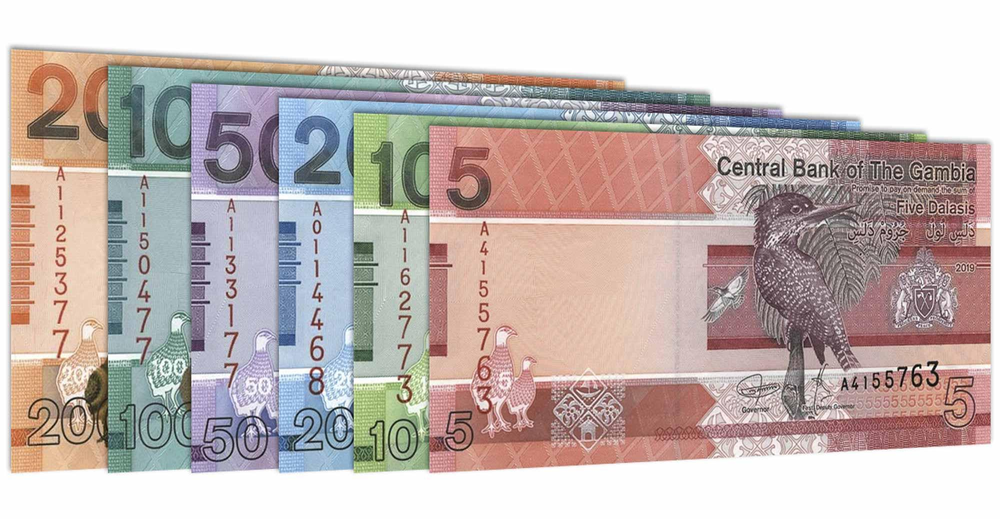

## Table of Contents

## What is the Gambian Dalasi and when was it introduced?

The Gambian Dalasi is the official currency of The Gambia, a country in West Africa. It is used every day by people in The Gambia to buy things like food, clothes, and other goods. The symbol for the Dalasi is D, and it is divided into 100 bututs.

The Gambian Dalasi was introduced on July 1, 1971. Before that, The Gambia used the West African CFA franc and the British West African pound. The introduction of the Dalasi was important because it showed that The Gambia was becoming more independent and had its own money to use.

## What are the denominations of the Gambian Dalasi?

The Gambian Dalasi comes in different amounts of money, called denominations. For the coins, you can find 1, 5, 10, 25, and 50 bututs. There are also coins worth 1 Dalasi. These coins help people buy small things or get exact change when they shop.

For the paper money, or banknotes, the Gambian Dalasi has notes of 5, 10, 20, 50, 100, and 200 Dalasis. These larger amounts are used for bigger purchases, like buying groceries for the week or paying bills. Having different denominations makes it easier for people to use the right amount of money for what they need to buy.

## How has the value of the Gambian Dalasi changed over time?

The value of the Gambian Dalasi has changed a lot over time. When it was first introduced in 1971, it was worth more than it is now. For example, in the 1970s and 1980s, the Dalasi was stronger compared to other currencies like the US dollar. This meant that people in The Gambia could buy more things from other countries with their money. But over the years, the value of the Dalasi has gone down. This is called inflation, and it means that the same amount of Dalasi can buy fewer things today than it could in the past.

In recent years, the value of the Dalasi has kept changing. Sometimes it goes up a little, but most of the time it goes down. This makes it harder for people in The Gambia to buy things from other countries because their money is worth less. For example, in 2023, 1 US dollar was worth around 60 Dalasis. This shows how much the value of the Dalasi has dropped since it was first introduced. The government and the central bank of The Gambia keep working to make the Dalasi stronger, but it is still a challenge.

## What factors influence the exchange rate of the Gambian Dalasi?

The exchange rate of the Gambian Dalasi is influenced by many things. One big [factor](/wiki/factor-investing) is the economy of The Gambia. If the economy is doing well, with more people working and businesses making more money, the Dalasi can become stronger. But if the economy is not doing well, with fewer jobs and businesses struggling, the Dalasi can become weaker. Another important factor is how much the country is importing and exporting. If The Gambia is selling more things to other countries than it is buying, this can make the Dalasi stronger. But if The Gambia is buying more things from other countries than it is selling, this can make the Dalasi weaker.

Another factor that affects the exchange rate is the [interest rate](/wiki/interest-rate-trading-strategies) set by the Central Bank of The Gambia. If the interest rate is high, it can attract more foreign money into the country, which can make the Dalasi stronger. But if the interest rate is low, it might not attract as much foreign money, and the Dalasi can become weaker. Political stability is also very important. If the country is peaceful and the government is stable, people and businesses feel more confident about the economy, which can help the Dalasi. But if there is a lot of uncertainty or problems, this can make the Dalasi weaker.

## How does the Gambian Dalasi compare to other West African currencies?

The Gambian Dalasi is one currency used in West Africa, and it is compared to other currencies in the region like the West African CFA franc and the Ghanaian Cedi. The West African CFA franc is used in several countries like Senegal, Ivory Coast, and Burkina Faso. It is part of a group of countries that have agreed to use the same money. The CFA franc is usually stronger than the Dalasi. For example, in 2023, 1 CFA franc was worth about 0.16 Dalasis. This means that people in The Gambia need more Dalasis to buy things from countries that use the CFA franc.

The Ghanaian Cedi is another currency in West Africa, used in Ghana. The Cedi is also stronger than the Dalasi. In 2023, 1 Cedi was worth around 10 Dalasis. This means that if someone from The Gambia wants to buy something from Ghana, they would need a lot more Dalasis than someone in Ghana would need Cedis. These differences in value show how the economies of these countries are doing and how their money is seen by other countries. The Dalasi is often weaker compared to these other West African currencies, which can make it harder for people in The Gambia to buy things from other countries in the region.

## What role does the Central Bank of The Gambia play in managing the Dalasi?

The Central Bank of The Gambia is very important for taking care of the Gambian Dalasi. It is like the boss of all the money in the country. The Central Bank decides how much money should be printed and how much should be in the banks. It also sets the interest rates, which is like the price people pay to borrow money. If the Central Bank makes the interest rates high, it can make people want to save more money and spend less. This can help control how fast prices go up, which is called inflation.

The Central Bank also works to keep the Dalasi strong. It does this by watching how much money is coming in and going out of the country. If the Central Bank sees that the Dalasi is getting too weak, it might try to buy or sell other countries' money to help the Dalasi. It also makes rules for banks to follow, so they can help keep the money safe and make sure people can trust it. By doing all these things, the Central Bank tries to make sure the Dalasi is good for everyone in The Gambia to use.

## How is the Gambian Dalasi used in international trade?

The Gambian Dalasi is used in international trade when The Gambia buys or sells things with other countries. If The Gambia wants to buy something from another country, like machines or medicine, it needs to change its Dalasis into the other country's money. This is called the exchange rate, and it shows how much Dalasi is needed to get one unit of the other country's money. For example, if The Gambia wants to buy something from a country that uses US dollars, it has to change its Dalasis into dollars at the current exchange rate.

When The Gambia sells things to other countries, like peanuts or fish, it gets paid in the other country's money. Then, it changes that money back into Dalasis. This helps The Gambia earn more Dalasis, which can make the Dalasi stronger. But if The Gambia buys more things from other countries than it sells, it can make the Dalasi weaker. The Central Bank of The Gambia helps manage this by trying to keep the right balance of money coming in and going out, so the Dalasi stays useful in international trade.

## What are the major economic factors affecting the Gambian Dalasi's performance in the forex market?

The performance of the Gambian Dalasi in the [forex](/wiki/forex-system) market is influenced by several key economic factors. One major factor is the overall health of The Gambia's economy. If the economy is growing, with more people working and businesses doing well, the Dalasi can become stronger. This is because a strong economy attracts foreign investment, which increases the demand for the Dalasi. On the other hand, if the economy is struggling, with high unemployment and businesses facing difficulties, the Dalasi can weaken. This is because a weak economy can lead to less foreign investment and more people wanting to change their Dalasis into other currencies.

Another important factor is the balance of trade. If The Gambia exports more goods and services than it imports, it brings in more foreign currency, which can help strengthen the Dalasi. However, if The Gambia imports more than it exports, it needs to spend more Dalasis to buy foreign currency, which can weaken the Dalasi. Additionally, the interest rates set by the Central Bank of The Gambia play a role. Higher interest rates can attract foreign investors looking for better returns on their money, which can support the Dalasi. Conversely, lower interest rates might not attract as much foreign money, putting downward pressure on the Dalasi's value in the forex market.

## How do geopolitical events impact the value of the Gambian Dalasi?

Geopolitical events can have a big effect on the value of the Gambian Dalasi. When there are big changes or problems in the world, like wars or big disagreements between countries, it can make people and businesses less sure about the future. If people think The Gambia might be affected by these problems, they might want to change their Dalasis into other, safer currencies. This can make the Dalasi weaker because more people are trying to get rid of it. Also, if there are big changes in nearby countries, like new trade rules or conflicts, it can change how much The Gambia can buy and sell with them, which can also affect the Dalasi's value.

Another way geopolitical events can impact the Dalasi is through changes in global markets. For example, if there is a big drop in the price of oil or other things The Gambia needs to buy, it can make the country's money go down in value. This is because The Gambia has to spend more Dalasis to get the same amount of these things. On the other hand, if there are good changes in the world, like new trade deals that help The Gambia, it can make the Dalasi stronger. People and businesses feel more confident about the future, which can make them want to keep their money in Dalasis.

## What are the common trading strategies involving the Gambian Dalasi?

One common trading strategy involving the Gambian Dalasi is called [carry](/wiki/carry-trading) trading. This is when traders borrow money in a currency with low interest rates, like the Dalasi, and then use that money to invest in a currency with higher interest rates. They make money from the difference in interest rates. But this can be risky because if the Dalasi gets weaker, it might cost more to pay back the money they borrowed. Traders have to watch the news and economic reports to see if the Dalasi might go up or down in value.

Another strategy is called forex speculation. Traders try to guess if the Dalasi will go up or down in value compared to other currencies. They might look at things like how The Gambia's economy is doing, what other countries are doing with their money, and any big news that could affect the Dalasi. If they think the Dalasi will get stronger, they might buy it now and sell it later for more money. If they think it will get weaker, they might sell it now and buy it back later for less money. This can be risky because it's hard to guess the future, but it can also make a lot of money if the guesses are right.

## How can one hedge against fluctuations in the Gambian Dalasi?

One way to hedge against fluctuations in the Gambian Dalasi is to use forward contracts. A forward contract is like a promise to buy or sell the Dalasi at a certain price in the future. If you think the Dalasi might get weaker, you can use a forward contract to lock in a better price now. This can help protect you if the Dalasi does go down in value. For example, if you're a business that needs to buy things from other countries, you can use a forward contract to make sure you know how much it will cost in Dalasis, even if the exchange rate changes.

Another way to hedge is by using options. Options give you the right, but not the obligation, to buy or sell the Dalasi at a certain price before a certain date. This can be useful if you're not sure if the Dalasi will go up or down. If the Dalasi gets weaker, you can use your option to sell it at the better price you locked in. But if the Dalasi gets stronger, you don't have to use the option, and you can still benefit from the stronger Dalasi. This way, you can protect yourself from the Dalasi getting weaker while still having the chance to gain if it gets stronger.

## What future trends might affect the role of the Gambian Dalasi in the global forex market?

In the future, several trends might change how the Gambian Dalasi works in the global forex market. One big trend is the growth of digital money and cryptocurrencies. More and more people around the world are using digital money, and this could affect how much people use the Dalasi. If The Gambia starts using digital money more, it could make the Dalasi stronger by making it easier and faster to use. But if other countries move to digital money faster, it might make the Dalasi weaker because people might want to use those other currencies instead.

Another trend that could affect the Dalasi is changes in global trade rules and agreements. If The Gambia can make new trade deals with other countries, it could help the Dalasi by making it easier to buy and sell things. This could make the Dalasi more useful and stronger in the forex market. But if big changes in the world, like new trade wars or disagreements, make it harder for The Gambia to trade, it could make the Dalasi weaker. People and businesses would be less sure about the future, and they might want to use other currencies instead.

## References & Further Reading

[1]: Craig, Ben. (1995). ["The Definition of a Currency and the Introduction of the Gambian Dalasi."](https://scholar.google.com/citations?user=hHdJ970AAAAJ) The Journal of African History, 36(3), 373-379.

[2]: The Central Bank of The Gambia. ["Monetary Policy."](https://www.cbg.gm/Monetary%20Policy%20Committee) Retrieved from the official website of The Central Bank of The Gambia.

[3]: Lopez de Prado, M. (2018). ["Advances in Financial Machine Learning."](https://www.amazon.com/Advances-Financial-Machine-Learning-Marcos/dp/1119482089) Hoboken, NJ: Wiley.

[4]: Chan, Ernest P. (2013). ["Algorithmic Trading: Winning Strategies and Their Rationale."](https://github.com/ftvision/quant_trading_echan_book) Wiley Trading.

[5]: Jansen, Stefan. (2020). ["Machine Learning for Algorithmic Trading."](https://github.com/stefan-jansen/machine-learning-for-trading) Packt Publishing.