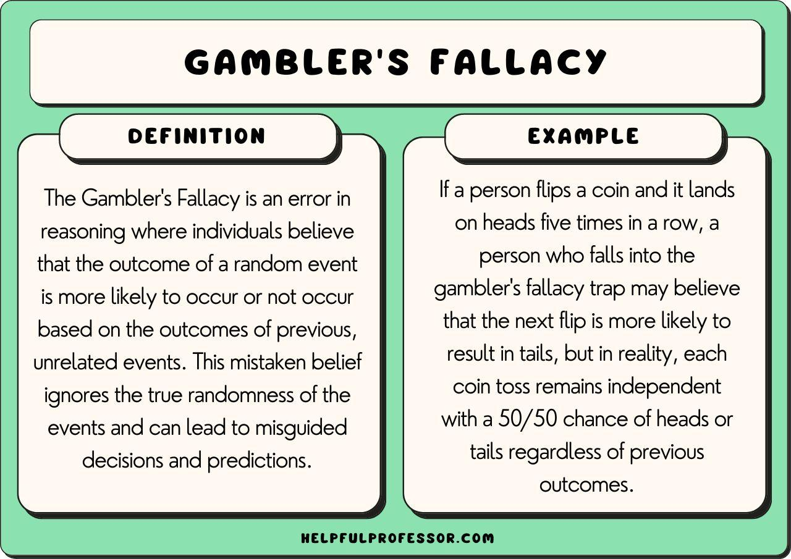

## Table of Contents

## What is the Gambler's Fallacy?

The Gambler's Fallacy is a mistaken belief that if something happens more often than usual during a certain period, it will happen less often in the future, or vice versa. For example, if a coin lands on heads many times in a row, someone might think that tails is more likely to come up next. But in reality, each coin toss is separate and has the same chance of being heads or tails, no matter what happened before.

This fallacy often leads people to make bad choices when they gamble. They might keep betting on a certain outcome because they think it's "due" to happen, even though the odds haven't changed. Understanding that each event is independent can help people avoid falling into this trap and make better decisions.

## Can you provide a simple example of the Gambler's Fallacy?

Imagine you're playing a game where you flip a coin. You've flipped it ten times and it's landed on heads every single time. You might start to think that tails is more likely to come up next because it hasn't happened yet. This is the Gambler's Fallacy. The truth is, the coin doesn't remember what happened before. Each flip is a new chance, and the odds of getting heads or tails are still 50/50.

This kind of thinking can lead to problems. For example, if you're at a casino playing roulette and the ball has landed on black ten times in a row, you might bet a lot of money on red, thinking it's due to come up. But the wheel doesn't care about past results. Every spin is independent, and the chances of landing on red or black remain the same. Believing otherwise can make you lose more money than you planned.

## How does the Gambler's Fallacy affect decision-making in gambling?

The Gambler's Fallacy can really mess up how people make choices when they gamble. People might start thinking that if something hasn't happened for a while, it's more likely to happen soon. For example, if they keep losing at a slot machine, they might think they're due for a win and keep playing, even though each spin is totally random and the chances of winning don't change.

This kind of thinking can lead to big problems. Gamblers might bet more money than they should, hoping to win back what they lost or to finally hit a big win. They might end up chasing losses, which means they keep playing and betting more, trying to make up for the money they've already lost. This can turn a fun game into a serious money problem, and it's all because they didn't understand that each bet is a fresh start with the same odds as before.

## What is the difference between the Gambler's Fallacy and the law of large numbers?

The Gambler's Fallacy and the law of large numbers are two different ideas that people sometimes mix up. The Gambler's Fallacy is when someone thinks that if something happens a lot, it's less likely to happen next, or if it hasn't happened in a while, it's more likely to happen soon. For example, if a coin lands on heads five times in a row, someone might think tails is more likely next. But that's wrong because each coin flip is separate and has the same 50/50 chance.

The law of large numbers is different. It says that if you do something a lot of times, the results will start to match what you expect on average. So, if you flip a coin a thousand times, you'll probably get close to 500 heads and 500 tails. It's not about what happens next time; it's about what happens over a long period. The law of large numbers doesn't change the odds for each individual event, it just means that over many tries, the results even out.

## Why do people fall prey to the Gambler's Fallacy?

People fall prey to the Gambler's Fallacy because they often look for patterns where there aren't any. When they see something happen a few times in a row, like a coin landing on heads, they start thinking that the next result must be different to balance things out. This is because humans naturally try to make sense of the world around them, and sometimes they see patterns or expect fairness even when events are truly random. 

Another reason is that people often remember the times when the Gambler's Fallacy seemed to work out. For example, if they bet on tails after a long string of heads and tails finally comes up, they might think their strategy was smart. But they forget all the times it didn't work, leading them to believe in the fallacy even more. This selective memory can make them keep using the same wrong thinking, even though each event is independent and the odds don't change.

## How can the Gambler's Fallacy be observed in casino games like roulette?

In a casino, you might see the Gambler's Fallacy in action when people play roulette. Imagine the ball has landed on black ten times in a row. Some players might start thinking that red is due to come up next because it hasn't happened for a while. They might bet a lot of money on red, hoping to win big. But the truth is, each spin of the roulette wheel is separate from the last one. The odds of landing on red or black stay the same every time, no matter what happened before.

This kind of thinking can lead to big losses. People might keep betting more and more, thinking they're about to hit a win because they believe the wheel owes them a red. But the wheel doesn't remember past spins. It's all random, and the chances don't change. So, players who fall for the Gambler's Fallacy might end up losing a lot of money because they're not playing based on the real odds, but on a mistaken belief that the game will even out soon.

## What are some real-world examples of the Gambler's Fallacy outside of gambling?

People often make mistakes because of the Gambler's Fallacy in everyday life, not just in gambling. For example, imagine you're waiting for a bus. You've been waiting for a long time and no bus has come. You might start thinking that a bus is more likely to come soon because it's been so long. But really, each bus follows its own schedule, and waiting longer doesn't make the next bus come any faster.

Another example is in sports. If a basketball player misses a lot of shots in a row, fans might think he's more likely to make the next one because he's "due" for a basket. But each shot is separate, and missing a bunch of shots doesn't make the next one easier to make. The player's chance of scoring stays the same, no matter what happened before.

## How does cognitive bias contribute to the Gambler's Fallacy?

Cognitive biases are ways our brains trick us into thinking things that aren't true. The Gambler's Fallacy happens because of a cognitive bias called the "representativeness heuristic." This means we think things that happen a lot should even out over time. So, if we see heads come up a bunch of times when flipping a coin, we might think tails is more likely next to make things fair. But that's not how randomness works. Each flip is separate, and the odds stay the same.

Another bias that helps the Gambler's Fallacy is the "availability heuristic." This is when we remember the times when the fallacy seemed to work and forget the times it didn't. For example, if you bet on tails after a long string of heads and tails comes up, you might think you were smart. But you forget all the times it didn't work out. This makes you believe in the fallacy even more, even though it's wrong. These biases make it hard for us to see things as they really are, and they can lead to bad decisions.

## What strategies can help someone avoid falling into the Gambler's Fallacy?

To avoid the Gambler's Fallacy, it's important to remember that each event is separate. When you flip a coin, roll a die, or spin a wheel, the result doesn't depend on what happened before. Each time is a fresh start with the same chances. So, if you see heads come up five times in a row, don't think tails is more likely next. It's still 50/50. Keeping this in mind can help you make better choices and not fall into the trap of thinking something is "due" to happen.

Another good strategy is to learn about how randomness works. The more you understand that things like coin flips and dice rolls are truly random, the less likely you are to think in terms of patterns that don't exist. Watching videos, reading [books](/wiki/algo-trading-books), or even taking a class on probability can help. Also, try to be aware of your own thinking. If you catch yourself thinking something is more likely because it hasn't happened in a while, stop and remind yourself that each event is independent. This can help you avoid making decisions based on the Gambler's Fallacy.

## How have psychologists studied the impact of the Gambler's Fallacy on behavior?

Psychologists have studied the Gambler's Fallacy by doing experiments where people make choices in games like coin flips or dice rolls. They watch how people bet and what they think will happen next. They've found that many people think if something happens a lot, like getting heads a bunch of times, the opposite is more likely to happen soon. This isn't true, but it shows how people's minds can trick them into seeing patterns that aren't there. These studies help us understand why people make certain choices and how we can help them make better ones.

Another way psychologists study the Gambler's Fallacy is by looking at real gambling data. They see if people bet more on something because they think it's due to happen. For example, if a roulette wheel lands on black a lot, do people start betting more on red? By looking at this data, psychologists can see how the Gambler's Fallacy affects what people do and how much money they might lose because of it. This helps them find ways to teach people about randomness and how to avoid making bad choices based on the Gambler's Fallacy.

## Can the Gambler's Fallacy influence financial markets and investment decisions?

The Gambler's Fallacy can definitely mess with how people make choices in financial markets and investments. Imagine you see a stock go down a lot over a few days. You might start thinking it's due to go up soon, just like thinking tails is more likely after a bunch of heads. But each day's stock price is its own thing, and what happened before doesn't change the odds for the next day. People who think this way might buy a stock expecting it to go up, even though it might keep going down.

This kind of thinking can lead to big mistakes in investing. For example, someone might keep buying a stock that's been losing value, hoping it will bounce back. They might lose a lot of money because they're not looking at the real reasons why the stock is going down. Instead, they're just hoping it will even out, which isn't how the stock market works. Understanding that each day's market movement is separate can help investors avoid making choices based on the Gambler's Fallacy and make better decisions based on real information.

## What are advanced statistical concepts that debunk the Gambler's Fallacy?

One advanced statistical concept that debunks the Gambler's Fallacy is the idea of independent events. This means that what happens in one event doesn't affect what happens in the next. For example, when you flip a coin, the result of the last flip doesn't change the odds for the next one. Each flip is a new chance with the same 50/50 odds of being heads or tails. Understanding this helps us see why thinking that tails is more likely after a bunch of heads is wrong. Each event is separate, so the past doesn't change the future.

Another concept is conditional probability, which looks at the chance of something happening given that something else has already happened. But with truly random events like coin flips or dice rolls, the conditional probability is the same as the regular probability because the events are independent. So, even if you know the last ten flips were heads, the chance of the next flip being tails is still 50%. This shows us that the Gambler's Fallacy is just a mistake because it doesn't take into account that each event is its own thing with the same odds every time.

## What is the Gambler's Fallacy Explained?

The Gambler's Fallacy is a specific cognitive distortion where an individual mistakenly believes that the outcome of a random event is somehow affected by its previous occurrences. This misconception arises from the flawed interpretation of probabilities and randomness, where independent events are wrongly perceived as being interdependent. In the context of probabilistic events, such as coin tosses, each event is independent; the probability of obtaining heads or tails remains constant across all tosses, typically 0.5 for a fair coin. 

Consider a scenario of tossing a fair coin multiple times. If the first four tosses result in heads, a person falling prey to the Gambler's Fallacy might predict that the next toss is more likely to be tails to "balance" the previous outcomes. However, this prediction is incorrect. Each coin toss is an independent event with an equal probability of resulting in heads or tails, regardless of previous outcomes. 

This type of flawed reasoning can result in significant errors in decision-making processes. For example, in a trading environment, a trader might anticipate a price reversal in a market due to a sequence of ups or downs, expecting that the pattern must soon change. This assumption disregards the possibility that market events, though appearing as patterns, might be driven by randomness or factors outside the scope of the immediate history being observed.

To mathematically illustrate the independence of events, for a series of coin tosses, the probability $P$ of getting a specific sequence, say, all heads in five tosses, is given by:

$$

P(\text{five heads in a row}) = \left(\frac{1}{2}\right)^5 = \frac{1}{32}
$$

Despite the sequence being rare, if it occurs, the probability of the outcome of the next toss being heads remains:

$$

P(\text{heads next}) = \frac{1}{2}
$$

This mathematical independence is fundamental in understanding why the Gambler's Fallacy is erroneous. For traders, a deep comprehension of this concept is vital to avoid cognitive biases that could cloud judgment. Decoupling analysis from perceived patterns allows for objective decision-making based on sound statistical methodologies rather than flawed perceptions of probability. Recognizing the independence of random events empowers traders to forge strategies that align with realistic and statistically grounded expectations.

## References & Further Reading

[1]: Bergstra, J., Bardenet, R., Bengio, Y., & Kégl, B. (2011). ["Algorithms for Hyper-Parameter Optimization."](https://dl.acm.org/doi/10.5555/2986459.2986743) Advances in Neural Information Processing Systems 24.

[2]: ["Advances in Financial Machine Learning"](https://www.amazon.com/Advances-Financial-Machine-Learning-Marcos/dp/1119482089) by Marcos Lopez de Prado

[3]: ["Evidence-Based Technical Analysis: Applying the Scientific Method and Statistical Inference to Trading Signals"](https://www.amazon.com/Evidence-Based-Technical-Analysis-Scientific-Statistical/dp/0470008741) by David Aronson

[4]: ["Machine Learning for Algorithmic Trading"](https://github.com/stefan-jansen/machine-learning-for-trading) by Stefan Jansen

[5]: ["Quantitative Trading: How to Build Your Own Algorithmic Trading Business"](https://www.amazon.com/Quantitative-Trading-Build-Algorithmic-Business/dp/1119800064) by Ernest P. Chan