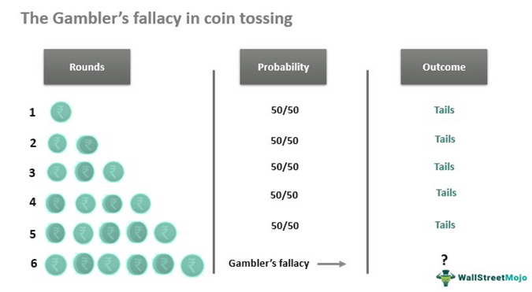

Understanding probability is a fundamental aspect of decision-making across a wide range of fields, from finance to science. It enables individuals to make informed choices by assessing the likelihood of various outcomes. However, misconceptions about probability can lead to cognitive biases, which can skew judgment and reasoning. One such bias is the Gambler's Fallacy. This cognitive bias involves the mistaken belief that if an occurrence happens more frequently than usual during a certain period, it will happen less frequently in the future, or vice versa. This erroneous thinking can be particularly damaging in fields such as trading and investments, where decisions are closely tied to probabilistic analysis. 

The importance of recognizing and addressing such biases cannot be overstated, especially in trading environments where the stakes are high. In trading and wealth management, an accurate understanding of independent probabilistic events is essential for sound decision-making. Algorithmic trading, in particular, presents unique challenges and opportunities for overcoming biases like the Gambler's Fallacy. These sophisticated systems execute trades based on mathematical models and data-driven analysis, but they are still susceptible to human-introduced biases in their design.



By exploring how the Gambler's Fallacy impacts decision-making and how its influence can be mitigated, traders and investors can enhance the effectiveness of their strategies. Accurate probabilistic thinking not only aids in understanding market dynamics but also contributes to more efficient and rational trading approaches. Recognizing cognitive biases and integrating probabilistic clarity into strategy formulation can lead to improved outcomes in trading and investment contexts.

## Table of Contents

## Understanding Probability Misconceptions

Probability misconceptions can significantly impact decision-making, particularly in situations involving uncertainty, such as trading and financial markets. These misconceptions arise from individuals' tendencies to misjudge likelihoods, often interpreting random events as valid patterns or trends. This can lead to biased decisions and flawed strategies.

One common probability misconception is known as the Gambler's Fallacy. This belief is rooted in the erroneous idea that the occurrences of random events are dependent on past outcomes. For example, consider the event of repeatedly flipping a fair coin. If the coin lands on heads multiple times consecutively, an individual might mistakenly believe that tails are "due" on the next flip to correct the imbalance. This assumption ignores the fundamental principle of independent events in probability, where each coin flip has an equal chance of resulting in heads or tails, regardless of previous outcomes.

The misconception persists because human intuition often struggles with understanding the concept of statistical independence, which states that the occurrence of one event does not affect the likelihood of another event. Mathematically, if events $A$ and $B$ are independent, then the probability of both events occurring is given by the formula $P(A \text{ and } B) = P(A) \times P(B)$. In the case of coin flips, this means each flip is unaffected by any prior flips.

Such biases are not exclusive to gambling environments but are prevalent in trading and financial markets. Investors and traders may mistakenly perceive trends in asset prices, believing that past behaviors imply future movements. This can lead to poor decision-making, such as incorrectly anticipating market reversals or continuations based on historical price patterns alone. Recognizing the independence of random events and avoiding such misconceptions can enhance decision-making accuracy and effectiveness.

## The Gambler's Fallacy Explained

The Gambler's Fallacy is a specific cognitive distortion where an individual mistakenly believes that the outcome of a random event is somehow affected by its previous occurrences. This misconception arises from the flawed interpretation of probabilities and randomness, where independent events are wrongly perceived as being interdependent. In the context of probabilistic events, such as coin tosses, each event is independent; the probability of obtaining heads or tails remains constant across all tosses, typically 0.5 for a fair coin. 

Consider a scenario of tossing a fair coin multiple times. If the first four tosses result in heads, a person falling prey to the Gambler's Fallacy might predict that the next toss is more likely to be tails to "balance" the previous outcomes. However, this prediction is incorrect. Each coin toss is an independent event with an equal probability of resulting in heads or tails, regardless of previous outcomes. 

This type of flawed reasoning can result in significant errors in decision-making processes. For example, in a trading environment, a trader might anticipate a price reversal in a market due to a sequence of ups or downs, expecting that the pattern must soon change. This assumption disregards the possibility that market events, though appearing as patterns, might be driven by randomness or factors outside the scope of the immediate history being observed.

To mathematically illustrate the independence of events, for a series of coin tosses, the probability $P$ of getting a specific sequence, say, all heads in five tosses, is given by:

$$

P(\text{five heads in a row}) = \left(\frac{1}{2}\right)^5 = \frac{1}{32}
$$

Despite the sequence being rare, if it occurs, the probability of the outcome of the next toss being heads remains:

$$

P(\text{heads next}) = \frac{1}{2}
$$

This mathematical independence is fundamental in understanding why the Gambler's Fallacy is erroneous. For traders, a deep comprehension of this concept is vital to avoid cognitive biases that could cloud judgment. Decoupling analysis from perceived patterns allows for objective decision-making based on sound statistical methodologies rather than flawed perceptions of probability. Recognizing the independence of random events empowers traders to forge strategies that align with realistic and statistically grounded expectations.

## Cognitive Biases in Trading

Cognitive biases are systematic patterns of deviation from norm or rationality in judgment, which often lead traders and investors to make irrational decisions in the financial markets. One common cognitive bias observed is the Gambler's Fallacy, which involves the mistaken belief that previous outcomes of a random process influence future outcomes. This bias can manifest in trading as the assumption that a winning streak indicates a higher likelihood of continued success or that a losing streak will soon be followed by gains. Such assumptions ignore the independence of events in probabilistic scenarios.

Recognizing and mitigating these biases is essential for maintaining effective trading strategies. A key strategy is to utilize [algorithmic trading](/wiki/algorithmic-trading), which involves automated systems making trades according to pre-defined rules based on quantitative analysis. These systems help to diminish the impact of emotional decision-making, as they rely on data-driven strategies rather than human emotions. By executing trades based on algorithms, traders can avoid biases induced by psychological factors and focus instead on empirical evidence.

Despite the advantages of algorithmic trading, it is important to note that algorithms themselves are designed by humans who may inadvertently incorporate biases into the systems. Ensuring that algorithms are robust requires a thorough understanding of cognitive biases and careful programming to account for them. Improving algorithm design involves continuous testing and refinement, using large datasets to identify patterns and adapting strategies based on objective analysis rather than subjective judgment.

Traders can further protect against cognitive biases by employing statistical techniques that provide objective evaluations of market trends. For instance, using tools such as moving averages, regression models, and [machine learning](/wiki/machine-learning) can assist in analyzing and interpreting complex market data without falling prey to the biases that often accompany manual decision-making.

In conclusion, cognitive biases pose significant challenges for traders in financial markets. However, through the recognition of these biases and the application of algorithmic trading systems and robust statistical techniques, traders can achieve more rational and effective decision-making.

## Algorithmic Trading and Probability Biases

Algorithmic trading employs pre-set rules derived from quantitative analysis to automate the execution of trades, aiming to capitalize on the speed and efficiency of computers to process vast amounts of data. This system, while data-driven, is not impervious to biases, as it is ultimately crafted by humans who may unknowingly embed cognitive biases into the algorithms they design. The Gambler’s Fallacy, along with other probability misconceptions, can subtly influence the development and programming of these algorithms, potentially affecting their performance in real-world trading.

The challenge in algorithmic trading is twofold: first, to identify the cognitive biases that could be introduced during the algorithm development process, and second, to program the algorithms in a manner that compensates for these biases. This requires a comprehensive understanding of such biases and a strategic approach to mitigate them. For instance, developers must ensure that algorithms do not implicitly assume predictive patterns where none exist, staying true to the principles of probability and statistical independence.

Developing robust algorithms involves incorporating mechanisms that either detect or prevent biased decisions. One effective approach is using machine learning techniques that adapt and learn from new data, minimizing human intervention in real-time analysis and trade execution. These systems can be designed to recognize anomalies and recalibrate based on empirical evidence. Python, a widely used programming language in algorithmic trading, provides rich libraries for implementing such adaptive algorithms. For example:

```python
from sklearn.linear_model import LogisticRegression
from sklearn.model_selection import train_test_split
from sklearn.preprocessing import StandardScaler
import numpy as np

# Sample financial data placeholders
X = np.random.rand(1000, 10)  # Feature matrix
y = np.random.randint(0, 2, 1000)  # Binary target variable

# Splitting data into training and testing sets
X_train, X_test, y_train, y_test = train_test_split(X, y, test_size=0.2)

# Standardizing features
scaler = StandardScaler()
X_train_scaled = scaler.fit_transform(X_train)
X_test_scaled = scaler.transform(X_test)

# Implementing a simple logistic regression algorithm
model = LogisticRegression()
model.fit(X_train_scaled, y_train)

# Evaluating the algorithm's performance
accuracy = model.score(X_test_scaled, y_test)
print(f'Algorithm Accuracy: {accuracy:.2f}')
```

This code snippet demonstrates a simplistic setup of a machine learning algorithm used in financial predictions, highlighting the importance of using statistical tools to minimize biases.

Ultimately, understanding cognitive biases like the Gambler's Fallacy is crucial for designing algorithmic trading systems that operate on accurate probabilistic thinking. With the right implementation, these systems can significantly enhance trading decisions by reducing human error and emotional influence, aligning more closely with objective data analysis. This alignment can contribute to improved trade execution, reduced risk of fallacious reasoning, and potentially more sustainable investment strategies.

## How to Overcome the Gambler's Fallacy

Educating traders and investors about the independence of random events is crucial to overcoming the Gambler's Fallacy. A fundamental understanding of probability and [statistics](/wiki/bayesian-statistics) reinforces that each event in a series of independent events, such as coin tosses or stock price movements, has the same likelihood regardless of preceding outcomes. Continuous education on these mathematical principles can prevent erroneous intuitions about patterns and trends.

Developing awareness of cognitive biases is an effective step in mitigating their influence. Engaging in training sessions, workshops, and simulations that highlight common biases allows individuals to recognize and counteract these biases in real-time decision-making situations. By understanding where cognitive biases originate, traders and investors can consciously adjust their thought processes, leading to more rational financial decisions.

Traders might adopt robust statistical techniques to evaluate market trends objectively. Methods such as regression analysis, moving averages, and other quantitative models help distill noise from genuine market signals. For instance, using Python, traders can implement a simple moving average crossover strategy to identify trends:

```python
import pandas as pd

# Sample stock price data
data = pd.DataFrame({
    'Price': [100, 102, 104, 103, 105, 107, 110]
})

# Calculate moving averages
data['Short_MA'] = data['Price'].rolling(window=2).mean()
data['Long_MA'] = data['Price'].rolling(window=3).mean()

# Signal generation
data['Buy_Signal'] = data['Short_MA'] > data['Long_MA']

print(data)
```

This code snippet demonstrates how a moving average crossover strategy can be implemented, offering a systematic approach to detecting market trends based on historical data rather than subjective belief.

Algorithmic trading is a powerful tool for maintaining objectivity, as it relies heavily on empirical data and minimizes emotional decision-making. Algorithms execute trades based on predefined rules devoid of biases. However, it is crucial to ensure that these trading algorithms incorporate unbiased logic. Regular [backtesting](/wiki/backtesting) and validation against diverse scenarios help verify that the algorithms perform effectively without succumbing to human biases. For example, implementing risk management protocols within an algorithm can protect against overleveraging based on false expectations.

In conclusion, fostering an environment where traders are educated about randomness, increasing awareness of cognitive biases, using statistical techniques, and leveraging algorithmic trading can collectively aid in overcoming the Gambler's Fallacy. These measures lead to more objective, data-driven decisions, achieving more reliable outcomes in trading and investments.

## Conclusion

In trading and investing, relying on past events to predict future outcomes can be misleading due to the concept of independent probabilities. This understanding stems from the recognition that many random financial events do not affect each other, a principle often misunderstood by individuals due to cognitive biases such as the Gambler's Fallacy. The Gambler's Fallacy leads traders and investors to mistakenly believe that past outcomes can somehow influence future events, which can result in irrational decision-making.

Acknowledging these cognitive biases is crucial for traders to make rational, informed decisions. By understanding that each event is independent, traders can better assess risk and avoid common pitfalls. Those who employ algorithmic trading systems have a significant advantage in this regard. These systems, based on pre-set rules and quantitative analysis, can execute trades without the emotional influences that often accompany manual trading. However, even algorithmic trading is not immune to biases, as these systems are designed by humans who might unconsciously incorporate their biases into trading algorithms.

To enhance trading strategies, traders can program their algorithms to minimize bias by incorporating robust statistical techniques that evaluate market trends objectively. For example, utilizing statistical models that [factor](/wiki/factor-investing) in a wide array of market data can help provide a more comprehensive view of potential outcomes, as opposed to relying on single-variable predictions or anecdotal evidence. Implementing machine learning algorithms can also refine these systems by continuously analyzing market conditions and learning from new data.

Ultimately, aligning trading strategies with accurate probabilistic thinking can lead to more successful and sustainable results. Understanding and mitigating the impact of cognitive biases like the Gambler's Fallacy empowers traders to make data-driven decisions that better reflect the realities of market dynamics. As such, continuous education and adaptation to new information remain essential components for traders and investors aiming for long-term success.

## References & Further Reading

[1]: Bergstra, J., Bardenet, R., Bengio, Y., & Kégl, B. (2011). ["Algorithms for Hyper-Parameter Optimization."](https://dl.acm.org/doi/10.5555/2986459.2986743) Advances in Neural Information Processing Systems 24.

[2]: ["Advances in Financial Machine Learning"](https://www.amazon.com/Advances-Financial-Machine-Learning-Marcos/dp/1119482089) by Marcos Lopez de Prado

[3]: ["Evidence-Based Technical Analysis: Applying the Scientific Method and Statistical Inference to Trading Signals"](https://www.amazon.com/Evidence-Based-Technical-Analysis-Scientific-Statistical/dp/0470008741) by David Aronson

[4]: ["Machine Learning for Algorithmic Trading"](https://github.com/stefan-jansen/machine-learning-for-trading) by Stefan Jansen

[5]: ["Quantitative Trading: How to Build Your Own Algorithmic Trading Business"](https://www.amazon.com/Quantitative-Trading-Build-Algorithmic-Business/dp/1119800064) by Ernest P. Chan