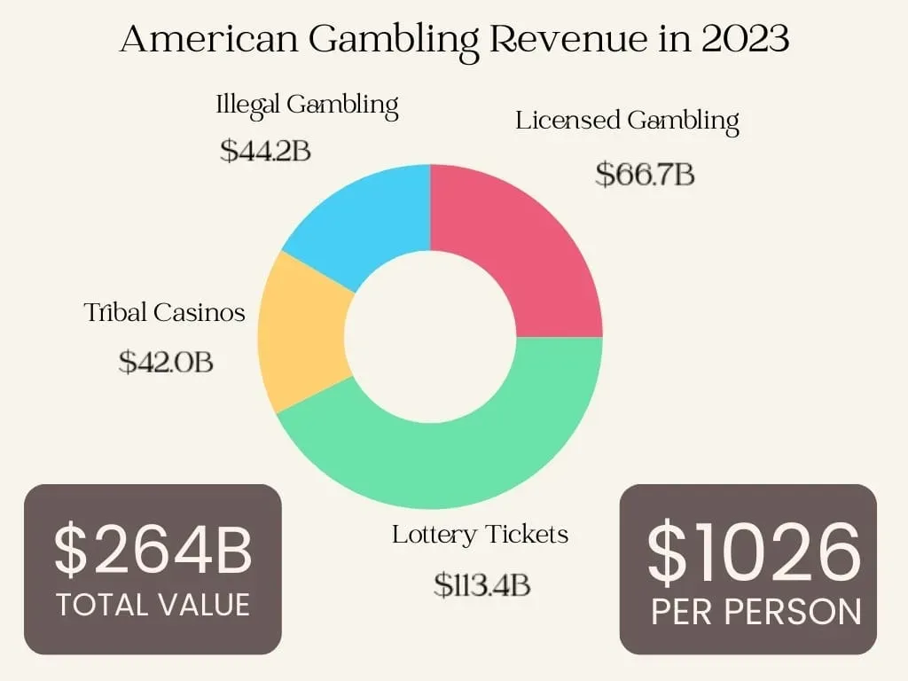

## Table of Contents

## What is the definition of gambling?

Gambling is when people play games or make bets where they can win or lose money. It's like a game where you don't know what will happen, and you might get money if you're lucky, or lose money if you're not.

People often gamble at places like casinos, where they can play games like poker, blackjack, or slot machines. They can also bet on sports or other events. Gambling can be fun, but it can also be risky because people might lose a lot of money if they're not careful.

## How prevalent is gambling among different demographics?

Gambling is common among many different types of people. Young adults often gamble, especially in college where they might play card games or bet on sports with friends. Older adults also gamble a lot, especially at casinos or with lottery tickets. Men tend to gamble more than women, but the difference is getting smaller as more women start to gamble too.

Different groups of people gamble in different ways. For example, people with more money might go to fancy casinos, while people with less money might buy more lottery tickets because they are cheaper. Also, gambling can be more common in certain cultures where it is seen as a normal part of life. Overall, gambling is something that many people do, but how often and what kind of gambling they do can change a lot depending on who they are and where they live.

## What are the most common forms of gambling?

The most common forms of gambling are lotteries, casino games, and sports betting. Lotteries are very popular because they are easy to play. You just buy a ticket and hope your numbers match the winning ones. Many people buy lottery tickets at stores or online. Casino games like slot machines, blackjack, and poker are also very common. People go to casinos to play these games, hoping to win money.

Sports betting is another common form of gambling. People bet on sports like football, basketball, or horse racing. They try to guess who will win and bet money on it. This can be done at a betting shop, online, or even with friends. All these forms of gambling are popular because they are exciting and people enjoy the chance to win money.

## What are the basic statistics on gambling participation rates?

A lot of people gamble in different ways. In the United States, about 85% of adults have gambled at least once in their life. Around 60% of adults gamble every year. Lotteries are the most common form of gambling, with about 50% of adults buying a ticket at least once a year. Casinos are also popular, with about 25% of adults visiting one each year. Sports betting is less common but still popular, with about 15% of adults placing a bet on sports each year.

The rates of gambling can change a lot depending on where you live and who you are. For example, in some countries like Australia and the UK, gambling is even more common than in the US. Young adults, especially college students, often gamble more than older people. Men also tend to gamble more than women, but the difference is getting smaller over time. Overall, gambling is something many people do, but how often and what kind of gambling they do can vary a lot.

## How do gambling odds work and what are the house edges in different games?

Gambling odds show how likely you are to win and how much you can win if you do. They are like a guess about what might happen in a game. For example, if you bet on a coin flip, the odds might be 50/50 because there are two sides to a coin. But in most gambling games, the odds are not that simple. Casinos and other places where you gamble make the odds a little bit in their favor. This means that over time, they will make more money than they lose. The difference between the true odds and the odds the casino offers is called the house edge.

Different games have different house edges. In a game like blackjack, the house edge can be very small, maybe around 1% if you know how to play well. This means that for every $100 you bet, you might lose about $1 on average. Slot machines have a much bigger house edge, sometimes up to 15%. This means that for every $100 you bet on a slot machine, you might lose about $15 on average. Games like roulette and craps have house edges somewhere in the middle, usually between 2% and 5%. Knowing the house edge can help you pick games where you might lose less money over time.

## What are the typical outcomes for casual gamblers versus professional gamblers?

Casual gamblers are people who gamble for fun, not as a job. They might go to a casino once in a while or buy a lottery ticket now and then. For them, gambling is just a way to have a good time. They usually don't expect to make money from it. Sometimes they win a little, sometimes they lose a little. Over time, casual gamblers usually end up losing more money than they win because the games are set up so the casino makes money. But since they don't gamble often, the losses are usually small and don't hurt their money situation too much.

Professional gamblers, on the other hand, treat gambling like a job. They spend a lot of time learning how to play games well and understanding the odds. They try to make money from gambling, not just have fun. Some professional gamblers can make a lot of money, but it's very hard and risky. They need to be really good at the games they play and manage their money carefully. Even then, they can still lose money if they have a bad run of luck. Professional gambling is not for everyone because it takes a lot of skill and can be very stressful.

## How do gambling addiction rates correlate with gambling frequency and types?

Gambling addiction is more common in people who gamble a lot. If someone gambles every day or spends a lot of time and money on it, they are at a higher risk of becoming addicted. This is because gambling can be exciting and make people feel good, which can make them want to do it more and more. The more often someone gambles, the more likely they are to develop a problem. People who gamble casually, like buying a lottery ticket once in a while, are less likely to become addicted.

Different types of gambling can also affect the chances of addiction. Games that are fast and exciting, like slot machines or online gambling, can be more addictive because they give quick rewards. These games can make people want to keep playing to get that feeling again. On the other hand, games that are slower and take more skill, like poker or sports betting, might not be as addictive for some people. But even with these games, if someone gambles a lot, they can still develop a gambling problem.

## What are the long-term financial impacts of gambling on individuals?

Gambling can have big effects on a person's money over time. If someone gambles a lot and loses more than they win, they can end up spending a lot of money. This can lead to big debts because they might borrow money or use credit cards to keep gambling. Over time, these debts can grow and make it hard for them to pay for important things like their home, food, or bills. If they can't stop gambling, they might lose everything they own, like their house or car, and even go bankrupt.

On the other hand, some people might win money from gambling, but this is not common. Even if they win big once, they might keep gambling and lose it all back. Professional gamblers who are very good at what they do might make money over time, but it's hard and risky. For most people, gambling is not a good way to make money. It's more likely to cost them money in the long run, which can hurt their savings and their ability to take care of themselves and their family.

## How do regulatory measures affect gambling statistics and player outcomes?

Regulatory measures can change how much people gamble and what happens when they do. When governments make strict rules about gambling, like limiting where and how people can gamble, fewer people might gamble. This can lower the number of people who have gambling problems. For example, if a country bans online gambling, people can't gamble from home as easily, and this might stop some from gambling too much. Also, rules that make casinos and betting companies show the risks of gambling can help people make better choices and gamble less.

These rules can also change how much money people win or lose. If the government makes the games fairer, like lowering the house edge, people might lose less money over time. But if the rules make it harder for people to get their winnings, or if there are high taxes on gambling wins, people might win less money in the end. Overall, good rules can help make gambling safer and stop people from losing too much money, but bad rules might not help and could even make things worse.

## What advanced statistical models are used to predict gambling behavior and outcomes?

Advanced statistical models help people understand and predict how people gamble and what might happen when they do. One common model is called logistic regression. This model looks at different things about a person, like how old they are, how much money they have, and how often they gamble, to guess if they might have a gambling problem. Another model is the Markov chain, which can predict what someone might do next in a gambling game by looking at what they did before. These models use a lot of math and data to make good guesses about gambling behavior.

Another useful model is [machine learning](/wiki/machine-learning), which can learn from a lot of gambling data to find patterns that are hard for people to see. For example, machine learning can look at how people bet on sports and guess if they will keep betting or stop. It can also help casinos figure out what games people like and how to make them more fun. These models are very good at predicting what might happen, but they are not perfect. They can help casinos and people who study gambling make better choices, but they can't tell the future for sure.

## How do cultural attitudes towards gambling influence player outcomes in different regions?

Cultural attitudes towards gambling can change how people gamble and what happens when they do. In some places, like Las Vegas in the United States, gambling is seen as fun and normal. People there might gamble more often because it's part of their culture. They might go to casinos with friends and family, and it's not a big deal if they lose some money. But in other places, like some countries in Asia, gambling can be seen as bad or even illegal. People in these places might hide their gambling and feel ashamed if they lose money. This can make gambling problems worse because they don't get help.

In places where gambling is accepted, people might be more open about their gambling habits. They might talk about their wins and losses with others and learn from each other. This can help them gamble more safely because they know more about the risks. But in places where gambling is looked down on, people might not talk about it at all. They might keep gambling even if it's causing problems because they don't want others to know. This can lead to bigger gambling problems and more money lost over time.

## What are the latest trends in gambling technology and how do they impact player statistics?

The latest trends in gambling technology include online gambling and mobile apps. More and more people are using their phones and computers to gamble. Websites and apps let people play casino games, bet on sports, or buy lottery tickets from home. This makes gambling easier and more convenient. Virtual reality (VR) and augmented reality (AR) are also becoming popular. These technologies make gambling games feel more real and exciting, like you are in a real casino even if you are at home.

These new technologies change how people gamble and the statistics about gambling. More people can gamble because they don't have to go to a casino. This can mean more people are gambling overall. The easy access might also lead to more gambling problems because it's harder to stop when you can gamble anytime. Also, because VR and AR make games more fun, people might spend more time and money gambling. This can change the numbers on how much people win or lose and how often they gamble.

## What are the odds for players in gambling?

Player odds are fundamental in determining the probability of various outcomes in a gambling scenario. These odds, representing the likelihood of a particular event occurring, guide player decisions and influence the overall dynamics in casinos. A comprehensive understanding of the mathematical basis of betting odds, house advantages, and the different formats of expressing odds can enhance a player's strategic approach to gambling.

The calculation of odds involves probabilities, which indicate the ratio of successful outcomes to possible outcomes. For example, if a die is rolled, the probability of rolling a 3 is 1 out of 6, or approximately 16.67%. In gambling, odds are often adjusted by casinos to incorporate the house advantage, which ensures profitability over time. House advantage is defined as the casino's edge over players, generally expressed as a percentage. The formula for calculating house advantage (HA) can be expressed as:

$$

HA = \left( \dfrac{\text{Average Loss}}{\text{Original Bet}} \right) \times 100
$$

Understanding how odds are calculated is crucial for players aiming to maximize their potential winnings and minimize losses. Casinos employ complex algorithms to ensure these odds are slightly tilted in their favor, which often becomes evident over extended gameplay.

There are three primary types of betting odds: fractional, decimal, and moneyline, each serving as a different method of expressing the same probability information.

1. **Fractional Odds**: Commonly used in the UK, fractional odds such as 5/1 (read as "five to one") indicate that for every unit wagered, a player can win five units plus their original stake. If you bet $10 at 5/1 odds, you could win $50 and get your $10 back, resulting in a total of $60.

2. **Decimal Odds**: Predominant in Europe, decimal odds make calculations straightforward: the odds number represents the total payout rather than just the profit. For example, decimal odds of 6.0 mean that for every dollar bet, the payout is $6 (inclusive of the stake).

3. **Moneyline Odds**: Mostly used in the United States, moneyline odds can be either positive or negative. Positive moneyline odds indicate how much profit a $100 wager would yield (e.g., +500 means a $100 bet could win $500). Conversely, negative moneyline odds indicate how much must be wagered to profit $100 (e.g., -200 means $200 must be wagered to win $100).

These distinct forms allow odds to be tailored to various betting contexts, and understanding them helps players make informed decisions. Profound knowledge of betting odds and probabilities, while advantageous, cannot eliminate the inherent risks associated with gambling.

## What is the impact of casino statistics on gambling outcomes?

Casinos have long relied on statistical models to maintain profitability and manage the risk associated with gambling activities. The primary mechanism by which casinos ensure a steady profit is through the mathematical concept known as the "house edge." The house edge represents the average gross profit that a casino expects to make from each game, and it is embedded in the rules and payoffs of every casino game.

### The House Edge

The house edge is a percentage of each bet that the casino expects to keep over the long run. For example, in a game like roulette, the house edge is derived from the presence of '0' and '00' on the wheel in American roulette. If a player bets on a single number, the probability of winning is $\frac{1}{38}$, because there are 38 slots (1 to 36, 0, and 00). However, the payout is only 35 to 1, creating a house edge of about 5.26%. Mathematically, the house edge can be calculated using the formula:

$$
\text{House Edge} = \left(1 - \frac{\text{Payout Odds}}{\text{True Odds}}\right) \times 100
$$

### Casino Game Design

Casino games are meticulously designed to ensure that the house edge is always in the casino's favor. Games like blackjack, poker, and baccarat are structured in such a way that, while they may allow for occasional player wins, the long-term expected outcomes always favor the house. For instance, blackjack offers a lower house edge, often less than 1% with optimal play. However, the complexity and skill required to achieve this make it difficult for the average player to consistently beat the house.

### Long-term Player Losses

The design of casino games leverages [statistics](/wiki/bayesian-statistics) to ensure that the law of large numbers works for the casino. Over a few games, a player might experience a streak of wins; however, as the number of games increases, the outcomes tend to converge to the expected value dictated by the house edge. This statistical reality implies that most gamblers will lose more money than they win in the long run.

For instance, in games that rely purely on chance, such as slot machines, the house edge can range from 2% to as high as 15%, making player losses statistically inevitable over time. Slot machines are designed with a programmed return to player (RTP) percentage, which signifies the portion of total wagers that the machine will pay back to players over time. If a slot machine has an RTP of 95%, it means that the house edge is 5%, reinforcing the statistical expectation that the casino will profit consistently.

In summary, through the strategic use of statistical modeling and the house edge concept, casinos create a reliable profit stream. While individual players may experience significant wins or losses, the aggregate behavior of players over time favors the casino, underscoring why most gamblers are statistically likely to lose in the long run.

## References & Further Reading

[1]: Bergstra, J., Bardenet, R., Bengio, Y., & Kégl, B. (2011). ["Algorithms for Hyper-Parameter Optimization."](https://papers.nips.cc/paper/4443-algorithms-for-hyper-parameter-optimization) Advances in Neural Information Processing Systems 24.

[2]: ["Advances in Financial Machine Learning"](https://www.amazon.com/Advances-Financial-Machine-Learning-Marcos/dp/1119482089) by Marcos Lopez de Prado

[3]: ["Evidence-Based Technical Analysis: Applying the Scientific Method and Statistical Inference to Trading Signals"](https://www.amazon.com/Evidence-Based-Technical-Analysis-Scientific-Statistical/dp/0470008741) by David Aronson

[4]: ["Machine Learning for Algorithmic Trading"](https://github.com/PacktPublishing/Machine-Learning-for-Algorithmic-Trading-Second-Edition) by Stefan Jansen

[5]: ["Quantitative Trading: How to Build Your Own Algorithmic Trading Business"](https://books.google.com/books/about/Quantitative_Trading.html?id=j70yEAAAQBAJ) by Ernest P. Chan