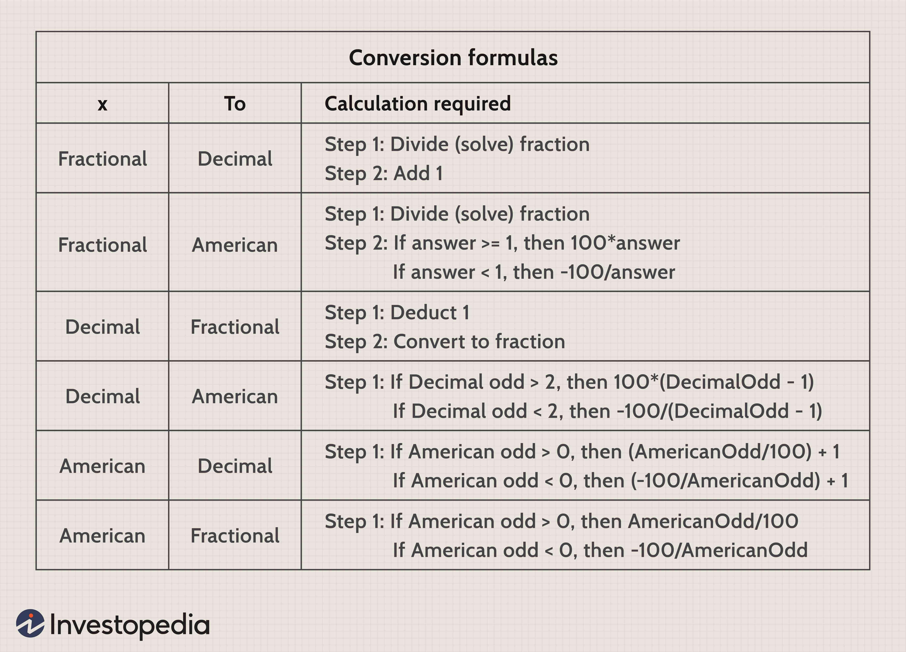

Gambling, odds, and statistics hold significant importance in the worlds of casinos and financial trading. This relationship is deeply rooted in the calculation of probabilities and the application of statistical models, which together form the backbone of strategy and prediction in these domains. The outcomes in gambling are heavily influenced by player odds and casino statistics, while algorithmic trading relies on sophisticated computational methods to inform decisions in financial markets.

Understanding the probability of various events occurring is crucial for both gamblers and traders. In casinos, player odds determine the likelihood of a particular bet succeeding, with calculations often based on the mathematics of probability and statistics. These odds are influenced by the inherent design of the games, which casinos often tailor to ensure a favorable position through the concept of the "house edge." This ensures long-term profitability and influences the decisions players make while engaging in games of chance.



On the other hand, financial markets have seen a transformation with the rise of algorithmic trading. Here, statistical analysis and programming algorithms are deployed to analyze market data, predict price movements, and execute trades. Similar to gambling, the objective is to assess risks and maximize returns, but the tools involve complex models and data-driven decision-making processes. Algorithmic trading often utilizes big data and artificial intelligence to refine predictions and enhance trading outcomes.

Both gambling and trading involve managing uncertainty and risk. While gamblers aim to interpret odds to maximize their winnings, traders use algorithmic models to predict future market conditions and develop optimal strategies. Despite the advances in algorithms, both fields require human oversight and judgment because outcomes cannot always be precisely foreseen.

The interplay between statistical probabilities and algorithmic models in gambling and trading prompts a constant pursuit of strategies that maximize benefits while minimizing risks. Understanding these concepts and responsibly applying algorithmic systems can provide significant advantages in navigating the complexities of these activities.

## Table of Contents

## Understanding Player Odds in Gambling

Player odds are fundamental in determining the probability of various outcomes in a gambling scenario. These odds, representing the likelihood of a particular event occurring, guide player decisions and influence the overall dynamics in casinos. A comprehensive understanding of the mathematical basis of betting odds, house advantages, and the different formats of expressing odds can enhance a player's strategic approach to gambling.

The calculation of odds involves probabilities, which indicate the ratio of successful outcomes to possible outcomes. For example, if a die is rolled, the probability of rolling a 3 is 1 out of 6, or approximately 16.67%. In gambling, odds are often adjusted by casinos to incorporate the house advantage, which ensures profitability over time. House advantage is defined as the casino's edge over players, generally expressed as a percentage. The formula for calculating house advantage (HA) can be expressed as:

$$

HA = \left( \dfrac{\text{Average Loss}}{\text{Original Bet}} \right) \times 100
$$

Understanding how odds are calculated is crucial for players aiming to maximize their potential winnings and minimize losses. Casinos employ complex algorithms to ensure these odds are slightly tilted in their favor, which often becomes evident over extended gameplay.

There are three primary types of betting odds: fractional, decimal, and moneyline, each serving as a different method of expressing the same probability information.

1. **Fractional Odds**: Commonly used in the UK, fractional odds such as 5/1 (read as "five to one") indicate that for every unit wagered, a player can win five units plus their original stake. If you bet $10 at 5/1 odds, you could win $50 and get your $10 back, resulting in a total of $60.

2. **Decimal Odds**: Predominant in Europe, decimal odds make calculations straightforward: the odds number represents the total payout rather than just the profit. For example, decimal odds of 6.0 mean that for every dollar bet, the payout is $6 (inclusive of the stake).

3. **Moneyline Odds**: Mostly used in the United States, moneyline odds can be either positive or negative. Positive moneyline odds indicate how much profit a $100 wager would yield (e.g., +500 means a $100 bet could win $500). Conversely, negative moneyline odds indicate how much must be wagered to profit $100 (e.g., -200 means $200 must be wagered to win $100).

These distinct forms allow odds to be tailored to various betting contexts, and understanding them helps players make informed decisions. Profound knowledge of betting odds and probabilities, while advantageous, cannot eliminate the inherent risks associated with gambling.

## Casino Statistics and Their Impact on Gambling Outcomes

Casinos have long relied on statistical models to maintain profitability and manage the risk associated with gambling activities. The primary mechanism by which casinos ensure a steady profit is through the mathematical concept known as the "house edge." The house edge represents the average gross profit that a casino expects to make from each game, and it is embedded in the rules and payoffs of every casino game.

### The House Edge

The house edge is a percentage of each bet that the casino expects to keep over the long run. For example, in a game like roulette, the house edge is derived from the presence of '0' and '00' on the wheel in American roulette. If a player bets on a single number, the probability of winning is $\frac{1}{38}$, because there are 38 slots (1 to 36, 0, and 00). However, the payout is only 35 to 1, creating a house edge of about 5.26%. Mathematically, the house edge can be calculated using the formula:

$$
\text{House Edge} = \left(1 - \frac{\text{Payout Odds}}{\text{True Odds}}\right) \times 100
$$

### Casino Game Design

Casino games are meticulously designed to ensure that the house edge is always in the casino's favor. Games like blackjack, poker, and baccarat are structured in such a way that, while they may allow for occasional player wins, the long-term expected outcomes always favor the house. For instance, blackjack offers a lower house edge, often less than 1% with optimal play. However, the complexity and skill required to achieve this make it difficult for the average player to consistently beat the house.

### Long-term Player Losses

The design of casino games leverages [statistics](/wiki/bayesian-statistics) to ensure that the law of large numbers works for the casino. Over a few games, a player might experience a streak of wins; however, as the number of games increases, the outcomes tend to converge to the expected value dictated by the house edge. This statistical reality implies that most gamblers will lose more money than they win in the long run.

For instance, in games that rely purely on chance, such as slot machines, the house edge can range from 2% to as high as 15%, making player losses statistically inevitable over time. Slot machines are designed with a programmed return to player (RTP) percentage, which signifies the portion of total wagers that the machine will pay back to players over time. If a slot machine has an RTP of 95%, it means that the house edge is 5%, reinforcing the statistical expectation that the casino will profit consistently.

In summary, through the strategic use of statistical modeling and the house edge concept, casinos create a reliable profit stream. While individual players may experience significant wins or losses, the aggregate behavior of players over time favors the casino, underscoring why most gamblers are statistically likely to lose in the long run.

## Algorithmic Trading: Statistical Analysis Meets Financial Markets

Algorithmic trading, often referred to as algo trading, represents a significant transformation in how trading is conducted in financial markets. This system employs complex algorithms to execute orders at optimal speeds and prices, minimizing human intervention. Central to [algorithmic trading](/wiki/algorithmic-trading) are statistical models that analyze vast datasets to forecast market trends and make trading decisions.

Automated systems have reshaped the financial landscape by enhancing the efficiency and speed of trading. High-frequency trading ([HFT](/wiki/high-frequency-trading-strategies)) is a prime example, where trades are executed in fractions of a second, a feat unachievable by manual traders. These systems can process information like price variations, market conditions, and historical data at incredible speeds, enabling traders to capitalize on small, temporal price differences that arise in the market.

Both algorithmic trading and gambling rely on assessing probabilities and optimizing outcomes. However, a significant difference lies in their application: trading algorithms attempt to predict financial market movements based on historical patterns and market psychology, while gambling relies on game-related statistics and luck. Another contrast is the risk management strategies employed; while gambling generally accepts a certain level of risk, algorithmic trading often incorporates sophisticated risk management tools to mitigate potential losses.

The use of big data and [artificial intelligence](/wiki/ai-artificial-intelligence) (AI) has further enhanced the capabilities of algorithmic trading. AI can identify complex patterns in vast datasets that would be unrealizable through human analysis. Machine learning models, a subset of AI, can refine trading strategies by learning from past data to predict future market trends. For instance, [reinforcement learning](/wiki/reinforcement-learning), a type of [machine learning](/wiki/machine-learning), can be used to develop autonomous trading [agents](/wiki/agents) that improve their strategies over time based on trial and error.

The Python language, with its rich ecosystem of libraries such as NumPy, pandas, and TensorFlow, provides robust tools for implementing algorithmic trading strategies. Here’s an example of how simple linear regression can be employed to predict stock prices:

```python
import pandas as pd
import numpy as np
from sklearn.linear_model import LinearRegression

# Sample historical stock price data
data = pd.DataFrame({
    'Date': pd.date_range(start='1/1/2020', periods=5),
    'Price': [100, 101, 102, 103, 104]
})

# Prepare the data
data['Time'] = np.arange(len(data))
X = data[['Time']].values
y = data['Price'].values

# Create and train the model
model = LinearRegression()
model.fit(X, y)

# Predict the next day's price
next_day = np.array([[len(data)]])
predicted_price = model.predict(next_day)

print(f"Predicted price: {predicted_price[0]:.2f}")
```

In this basic example, a linear regression model predicts future prices based on historical data, illustrating statistical analysis's role in algorithmic trading.

As financial markets continue to evolve, the integration of AI and big data in algorithmic trading is expected to grow, promising even more sophisticated tools for predicting and navigating the complexities of financial markets.

## The Convergence of Gambling and Trading Algorithms

Algorithms initially designed for trading have found applications in gambling, leveraging similar statistical techniques to analyze and predict outcomes. The adaptation of these algorithms to gambling scenarios is driven by the shared necessity in both domains to assess probabilities, manage risk, and optimize results. Both gambling and trading fundamentally involve making decisions under uncertainty, providing fertile ground for algorithmic strategies that capitalize on historical data and predictive modeling.

The adaptation process involves adjusting trading algorithms that focus on market trends and asset performance to fit the specific parameters of gambling environments, such as predicting the outcome of sports events or casino games. This convergence relies heavily on machine learning, particularly models that excel at pattern recognition and statistical inference.

### Ethical Considerations and Potential Risks

The application of algorithms in gambling raises several ethical considerations. One key concern is the potential for widening the knowledge gap between casual gamblers and those using sophisticated algorithmic tools. Advanced algorithms can provide significant advantages, potentially leading to unfair competition if they are accessible only to certain users.

Additionally, algorithmic systems in gambling, like in trading, pose risks related to system failures and unexpected outcomes. Relying excessively on algorithmic predictions without human oversight can lead to significant financial losses. Moreover, these systems can be exploited to manipulate odds or operations, leading to integrity issues within the gambling industry.

### Machine Learning in Predicting Gambling Outcomes

Machine learning models, such as neural networks and decision trees, are increasingly employed to forecast gambling results akin to financial predictions. These models analyze historical data to identify trends and patterns that can inform betting strategies. For instance, in sports betting, algorithms can evaluate player statistics, team performance, and external factors like weather conditions to estimate the likelihood of different outcomes.

A simple example in Python illustrating the use of logistic regression, a common machine learning approach, to predict binary outcomes such as winning or losing is given below:

```python
from sklearn.linear_model import LogisticRegression
from sklearn.model_selection import train_test_split
from sklearn.metrics import accuracy_score
import pandas as pd

# Sample data: features related to player/team performance, and labels (win: 1, loss: 0)
data = pd.read_csv('performance_data.csv')

X = data.drop('result', axis=1) # Features: historical performance metrics
y = data['result'] # Labels: win or loss

# Split the data into training and test sets
X_train, X_test, y_train, y_test = train_test_split(X, y, test_size=0.2, random_state=42)

# Initialize and train the logistic regression model
model = LogisticRegression()
model.fit(X_train, y_train)

# Predict outcomes on test data
y_pred = model.predict(X_test)

# Calculate accuracy of the model
accuracy = accuracy_score(y_test, y_pred)
print(f'Model accuracy: {accuracy * 100:.2f}%')
```

This code snippet demonstrates how logistic regression can be applied to predict binary events, showcasing the straightforward adaptability of such models to gambling scenarios.

In conclusion, while algorithmic tools offer considerable potential to enhance decision-making in gambling, they must be operated with awareness of their ethical implications and inherent risks. As technology advances, the boundary between gambling and trading continues to blur, paving the way for innovations that could transform both fields.

## Implications for Players and Traders

Understanding statistics is an essential skill for both gamblers and traders, yet it serves different purposes in each domain. For gamblers, statistical analysis can enhance decision-making by identifying patterns and calculating probabilities, but it does not eliminate inherent risks. The fundamental advantage lies in the ability to comprehend different odds structures, such as fractional, decimal, and moneyline odds, and how these relate to potential outcomes. For instance, knowing the house edge in a casino game allows players to make more informed choices, although it can't overturn the house's inherent advantage. This knowledge can assist players in managing their bankroll more effectively and choosing games that offer the best return on investment over time.

For traders, the application of algorithms serves to optimize strategies through deep data analysis and statistical modeling. However, despite the power of algorithmic trading, market unpredictability presents a persistent challenge. Algorithms can quickly process vast amounts of data and execute trades at speeds and frequencies that are impossible for human traders. Yet, they sometimes fail to account for unprecedented market events, known as "black swan" events. These unpredictable and rare events can lead to significant financial losses, underscoring the necessity for traders to maintain oversight and judgment in managing algorithmic strategies.

Balancing the odds in gambling and trading requires a comprehensive understanding of both statistical and non-statistical factors. In gambling, it is crucial to acknowledge that while statistics can improve decision-making, they cannot alter the structural disadvantage dictated by the house edge. Players should seek to manage their expectations and risks correspondingly. In trading, professionals should employ algorithms as powerful tools to refine strategies and execution but remain vigilant regarding the limitations of quantitative models. By employing a well-balanced approach that marries statistical insight with prudent risk management, gamblers and traders alike can strive for better financial outcomes.

Ultimately, the key takeaway for both gamblers and traders is the importance of an informed strategy that recognizes human oversight as a complement to statistical and algorithmic tools. As these fields continue to evolve with advancing technologies and methodologies, individuals engaged in either should prioritize continuous learning and adaptation to harness potential advantages effectively.

## Conclusion

Odds and statistics form a fundamental base in both gambling and trading, guiding players and analysts in decision-making processes. However, the importance of human oversight and judgment in these areas cannot be overstated. Although algorithmic systems have the capacity to streamline operations and provide extensive data-driven insights, they require responsible utilization to ensure ethical and effective outcomes. 

The application of advanced statistical models and artificial intelligence holds considerable promise in further optimizing strategies in gambling and trading. These systems can process large volumes of data with precision, offering predictions and automated strategies that can enhance decision-making capabilities. Despite these technological advancements, human intervention remains necessary to handle uncertainties and unforeseen variables that algorithms might not account for, such as market [volatility](/wiki/volatility-trading-strategies) or changes in player behavior. 

The future landscape of gambling and trading is poised for deeper integration of these technologies. As algorithms become more sophisticated, blending machine learning and AI with traditional statistical methods, the potential for innovation expands. However, the success of these systems lies in balancing technological efficiencies with ethical standards and prudent judgment, ensuring that they enhance rather than undermine the integrity of gambling and trading practices. Such a balance will likely dictate future advancements, determining how effectively these domains can harness the power of data while maintaining human-centric values.

## References & Further Reading

[1]: Bergstra, J., Bardenet, R., Bengio, Y., & Kégl, B. (2011). ["Algorithms for Hyper-Parameter Optimization."](https://papers.nips.cc/paper/4443-algorithms-for-hyper-parameter-optimization) Advances in Neural Information Processing Systems 24.

[2]: ["Advances in Financial Machine Learning"](https://www.amazon.com/Advances-Financial-Machine-Learning-Marcos/dp/1119482089) by Marcos Lopez de Prado

[3]: ["Evidence-Based Technical Analysis: Applying the Scientific Method and Statistical Inference to Trading Signals"](https://www.amazon.com/Evidence-Based-Technical-Analysis-Scientific-Statistical/dp/0470008741) by David Aronson

[4]: ["Machine Learning for Algorithmic Trading"](https://github.com/PacktPublishing/Machine-Learning-for-Algorithmic-Trading-Second-Edition) by Stefan Jansen

[5]: ["Quantitative Trading: How to Build Your Own Algorithmic Trading Business"](https://books.google.com/books/about/Quantitative_Trading.html?id=j70yEAAAQBAJ) by Ernest P. Chan