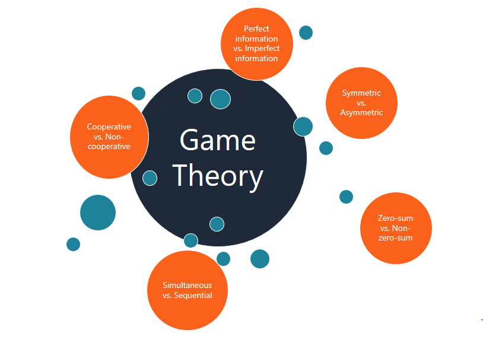

The integration of game theory into finance, particularly in algorithmic trading, is shaping a transformative approach to decision-making within financial markets. At its core, game theory offers a robust mathematical framework designed for analyzing and predicting strategic interactions among rational agents, which, in this context, are competitive traders and sophisticated trading algorithms. By leveraging game-theoretical principles, market participants can better anticipate and respond to the actions of others in the marketplace, thus optimizing their trading strategies.

In algorithmic trading, decisions are no longer made in isolation but in consideration of a complex web of interactions. Game theory facilitates a deeper understanding of these interactions by framing the market as a battleground of strategic players, each with their objectives and strategies. The Nash equilibrium, a foundational concept in game theory, is particularly relevant as it represents a scenario where no player can benefit by changing their strategy while the others remain unchanged. This equilibrium state can guide traders and algorithms in determining optimal strategies amidst competitive pressures.

Beyond conceptual understanding, the application of game theory within algorithmic trading manifests in various practical forms. For instance, algorithmic strategies can be designed to adapt dynamically to real-time market conditions and competitor actions, enhancing their effectiveness. The domains of market making, arbitrage, and high-frequency trading are seeing innovations rooted in game-theoretical approaches, where algorithms can learn from and strategically counteract the moves of their competitors.

The importance of game theory in optimizing trading strategies cannot be overstated, as it equips market participants with a crucial edge. Those who grasp these principles and embed them into their trading models are better positioned to navigate the complex and competitive terrain of financial markets. As technological advancements, particularly in artificial intelligence and machine learning, continue to evolve, the capability of algorithms to implement game theory will likely expand, further cementing its role in the future of trading. Understanding and implementing game theory concepts is now essential for traders and firms aiming for long-term success and sustainability in the financial markets.

## Table of Contents

## The Basics of Game Theory

Game theory is a mathematical discipline that analyzes strategic interactions among rational decision-makers, commonly referred to as players. It provides a framework to model situations where individuals or entities make decisions that are interdependent, with the outcome for each participant depending on the choices of others. This concept is particularly relevant in competitive environments such as financial markets, where traders strive to optimize their strategies against competitors.

At the core of game theory are several key concepts:

1. **Players**: In any game, the decision-makers are referred to as players. Each player has a set of possible actions or strategies they can employ. In financial markets, players typically include individual traders, investment firms, and algorithmic trading systems.

2. **Strategies**: A strategy is a complete plan of actions a player will take given the different circumstances that might arise during the game. Strategies can be pure or mixed. A pure strategy involves making a specific choice or action, while a mixed strategy involves selecting among possible actions based on a probability distribution.

3. **Payoffs**: Each combination of strategies chosen by the players results in a particular payoff for each participant. Payoffs are typically represented in the form of a matrix, where each cell corresponds to the outcomes of strategy combinations. In trading, payoffs could be profits or losses resulting from market interactions.

4. **Nash Equilibrium**: Named after mathematician John Nash, a Nash Equilibrium occurs when players choose strategies such that no player can benefit by unilaterally changing their own strategy, given the strategies of the others. At equilibrium, each player's strategy is optimal in response to the strategies chosen by their opponents.

5. **Zero-sum vs. Non-zero-sum Games**: In zero-sum games, one player's gain is exactly balanced by the losses of another player. The total payoff for all players in a zero-sum game is zero. Conversely, non-zero-sum games allow for a net benefit to all players through cooperation, making these games more complex as they often involve negotiation and coalition-building.

Understanding these concepts enables traders to anticipate potential actions and reactions of other market participants. Game theory aids in predicting competitor behavior, optimizing strategies, and potentially outmaneuvering rivals in the marketplace. This analytical approach becomes invaluable, especially when integrated into automated [algorithmic trading](/wiki/algorithmic-trading), where speed and efficiency in decision-making are critical.

## Application of Game Theory in Algorithmic Trading

In algorithmic trading, the use of automated systems allows traders to execute orders efficiently based on predetermined strategies. The integration of game theory into these systems helps craft strategies that adapt dynamically to real-time market conditions and competitor actions. At its core, game theory provides a framework for analyzing strategic interactions among market participants, facilitating the development of more sophisticated trading algorithms.

One application of game theory in algorithmic trading is [market making](/wiki/market-making). Market makers provide [liquidity](/wiki/liquidity-risk-premium) to the markets by continuously quoting buy and sell prices. Using game theory, they can anticipate the actions of competitors and adjust their strategies to maintain profitability while minimizing risk. This involves analyzing potential price movements and competitor behavior to set optimal bid-ask spreads.

Arbitrage is another area where game theory plays a crucial role. Arbitrage traders capitalize on price discrepancies across different markets or instruments. By employing game-theoretic models, traders can predict and exploit these inefficiencies before they are corrected by the market. This requires rapid decision-making and precise execution, attributes well-suited to algorithmic systems.

High-frequency trading ([HFT](/wiki/high-frequency-trading-strategies)) further exemplifies the application of game theory in algorithmic trading. HFT involves executing a large number of orders at extremely high speeds, often relying on small price differentials. Game theory helps HFT algorithms anticipate the actions of other rapid traders, allowing them to develop strategies that prioritize speed and accuracy to maximize gains in an environment characterized by fierce competition and minimal margins.

Predatory trading strategies also benefit from game-theoretic analysis. These strategies seek to exploit other traders' vulnerabilities by anticipating their actions. For instance, a trader might use game theory to predict a substantial trading order that could impact the market, allowing them to position themselves advantageously before the order is executed.

Algorithmic collusion represents a more controversial application of game theory in trading. In scenarios where multiple trading algorithms might coordinate indirectly, game theory can help understand and model potential collusion, leading to synchronized trading strategies that could manipulate market conditions. This application raises ethical and regulatory concerns, as it challenges market fairness and transparency.

Overall, the application of game theory in algorithmic trading enables the development of adaptive, competitive, and efficient trading strategies. By leveraging game-theoretic principles, traders can optimize their algorithmic systems to navigate complex market dynamics effectively.

## Prominent Companies Utilizing Game Theory

Several leading firms in the financial sector employ game theory within their trading practices, using its principles to achieve a competitive edge. Notably, Citadel Securities, Two Sigma Investments, Renaissance Technologies, Jane Street, and Virtu Financial exemplify this innovative approach.

Citadel Securities, a prominent market maker, integrates game theory into its trading algorithms to identify optimal strategies under competitive conditions. By anticipating and responding to the actions of other market participants, Citadel maximizes profits while minimizing risks. Citadel's algorithms evaluate market data in real-time, enabling swift adjustments that maintain a competitive stance in rapidly changing environments.

Two Sigma Investments, renowned for its use of technology and data science, applies game theory to enhance its predictive analytics. The firm leverages game-theoretic models to analyze market dynamics and devise strategies that optimize trade execution. By considering the potential actions and reactions of other traders, Two Sigma's algorithms dynamically adapt to market fluctuations, improving the efficiency and effectiveness of their trading operations.

Renaissance Technologies, with its focus on [quantitative trading](/wiki/quantitative-trading), utilizes game theory to refine its investment strategies. The firm employs sophisticated computational models to address the intricate interdependencies within financial markets. Game-theoretic principles support Renaissance in forecasting market trends and informing decision-making processes, ultimately leading to superior investment outcomes.

Jane Street, a leading global quantitative trading firm, employs game theory to facilitate its market-making and [arbitrage](/wiki/arbitrage) activities. By modeling the interactions between buyers and sellers, Jane Street's trading algorithms are equipped to execute strategies that capitalize on price discrepancies. Game theory aids Jane Street in maintaining liquidity and ensuring the best possible execution prices for their clients, which is vital for their success in high-frequency trading.

Virtu Financial, a key player in high-frequency trading, incorporates game-theoretic approaches to manage its vast array of trades efficiently. Virtu's algorithms predict competitor behavior and market trends, allowing the firm to execute trades with exceptional speed and accuracy. This strategic application of game theory strengthens Virtu's ability to operate effectively within the fragmented landscape of global financial markets.

These firms utilize complex mathematical and computational models to optimize their trading algorithms. Game theory aids each in predicting competitors' strategies, responding to market movements, and improving trading efficiencies. By integrating these principles into their operations, these companies illustrate the profound impact of game theory on modern algorithmic trading practices.

## Challenges and Ethical Considerations

Algorithmic trading, while offering significant advantages in terms of speed and efficiency, presents regulatory challenges due to the complex nature of game-theoretic strategies that may result in market manipulation. Market participants often design algorithms that exploit inefficiencies, potentially leading to predatory behaviors that undermine fair competition. For instance, high-frequency trading might involve strategies such as quote stuffing, where excessive orders are placed to create false market activity, thereby misleading other participants. Regulatory bodies, therefore, have the task of devising rules that prevent such manipulative practices while fostering innovation in algorithmic trading.

Ethical considerations are equally critical, as traders must navigate the intricacies of crafting strategies that maximize profits without compromising market fairness. Traders are often caught in a dilemma between pursuing aggressive strategies for higher returns and adhering to ethical standards that promote transparency and fairness. The implementation of game-theoretic approaches can sometimes prioritize profitability over fairness, thus challenging traders to consider the broader implications of their strategies on market dynamics. A balanced approach involves integrating ethical guidelines into algorithm design, ensuring that strategies do not exploit vulnerabilities in ways that harm the market's integrity.

Additionally, the technical and computational demands of implementing sophisticated game-theoretic strategies are significant. The infrastructure required for algorithmic trading must handle vast amounts of data and execute complex calculations in microseconds. This necessitates investment in high-performance computing systems and expertise in fields such as [machine learning](/wiki/machine-learning) and data analytics. The use of infrastructure, such as co-location servers, provides firms with the necessary speed advantage, but also raises questions about the equal access to trading information, which is a matter of equity and fair access in the market.

Addressing these challenges requires collaboration between stakeholders, including regulators, financial institutions, and technology providers, to develop frameworks that balance innovation with fairness and competitiveness. Maintaining robust compliance mechanisms and promoting transparency in algorithmic processes are vital steps toward ensuring that the integration of game theory into trading practices benefits the broader financial ecosystem.

## Future Trends in Game Theory and Algo Trading

Advances in [artificial intelligence](/wiki/ai-artificial-intelligence) (AI) and machine learning are significantly enhancing how algorithms within financial markets learn and adapt. These technologies align seamlessly with the principles of game theory, enabling traders to construct more dynamic and responsive trading systems. Machine learning models, particularly those utilizing [reinforcement learning](/wiki/reinforcement-learning), can simulate various strategic interactions among market participants, allowing AI systems to identify optimal strategies in multi-agent environments. These models continuously refine trading algorithms by processing vast amounts of data, improving accuracy in predicting competitor behaviors and market movements.

The rapid expansion of decentralized finance (DeFi) platforms represents a significant avenue where game theory principles are being applied. DeFi eliminates traditional financial intermediaries, utilizing protocols built on blockchain to facilitate autonomous transactions. This shift transforms financial operations into a highly competitive environment where players, represented by smart contracts, engage strategically. Game theory informs the design of these contracts, aligning incentives and ensuring fair participation while enhancing stability and cooperation among decentralized networks.

Quantum computing offers additional transformative potential for algorithmic trading, with implications for game theory applications. Due to their ability to process complex calculations at unprecedented speeds, quantum computers can solve intricate optimization problems central to trading. Algorithms leveraging quantum computing could explore vast strategic spaces efficiently, redefining the computation of Nash equilibria and enabling real-time adjustments to strategic interactions. 

The incorporation of these technologies—AI, machine learning, DeFi, and quantum computing—into algorithmic trading frameworks points to a future where trading strategies are not only more sophisticated but also more adaptable. This convergence will likely expand the applicability and relevance of game theory within financial markets, providing traders with the necessary tools to craft strategies that are both efficient and ethical. As each of these technological trends continues to evolve, they will play a crucial role in shaping the next generation of trading innovations.

## Conclusion

The integration of game theory into algorithmic trading significantly transforms financial markets by offering strategic advantages previously unattainable with traditional methods. This synergy leverages mathematical frameworks to anticipate market dynamics, providing traders with tools to make more informed decisions amidst competitive environments. As technological advancements continue, the relevance of game theory in trading is poised to expand further. Innovations in artificial intelligence and machine learning facilitate the development of algorithms that can adapt and learn from real-time market conditions, enhancing the strategic implementation of game-theoretic principles.

Furthermore, the rise of decentralized finance (DeFi) platforms introduces new opportunities and challenges for game theory application. These platforms operate with minimal central control, requiring robust strategies to navigate their unique structures and competitive natures. Quantum computing also holds significant promise, potentially solving complex problems beyond the current capabilities of classical computing, thereby expanding the analytical horizon for algorithmic traders.

Traders who grasp and effectively employ game theory can pave the way for more innovative, ethical, and effective trading strategies. By anticipating competitors' actions and market movements, these traders can optimize their tactics, ensuring a competitive edge. Moreover, maintaining an ethical approach in using game-theoretic strategies is crucial to fostering market fairness and sustainability. As the financial landscape evolves, those who embrace these advanced concepts will likely lead in developing impactful trading strategies that drive market innovation and integrity.

## References & Further Reading

[1]: Nasini, Filippo, Vinay K. Goyal, and Paul Grubbs. ["Integrating Game Theory with Financial Trading Strategies in Algo Trading."](https://scholar.google.com/citations?user=VzB0IIIAAAAJ&hl=en) SSRN, 2019.

[2]: Myerson, Roger B. ["Game Theory: Analysis of Conflict."](https://www.jstor.org/stable/j.ctvjsf522) Harvard University Press, 1997.

[3]: Lopez de Prado, Marcos. ["Advances in Financial Machine Learning."](https://www.amazon.com/Advances-Financial-Machine-Learning-Marcos/dp/1119482089) Wiley, 2018.

[4]: Avinash Dixit and Barry Nalebuff. ["The Art of Strategy: A Game Theorist's Guide to Success in Business and Life."](https://www.amazon.com/Art-Strategy-Theorists-Success-Business/dp/0393337170) W.W. Norton & Company, 2008.

[5]: Chan, Ernest P. ["Quantitative Trading: How to Build Your Own Algorithmic Trading Business."](https://github.com/ftvision/quant_trading_echan_book) Wiley, 2008.

[6]: Osborne, Martin J. and Ariel Rubinstein. ["A Course in Game Theory."](https://www.economics.utoronto.ca/osborne/cgt/index.html) The MIT Press, 1994.

[7]: Easley, David, and Jon Kleinberg. ["Networks, Crowds, and Markets: Reasoning About a Highly Connected World."](https://www.cs.cornell.edu/home/kleinber/networks-book/) Cambridge University Press, 2010.