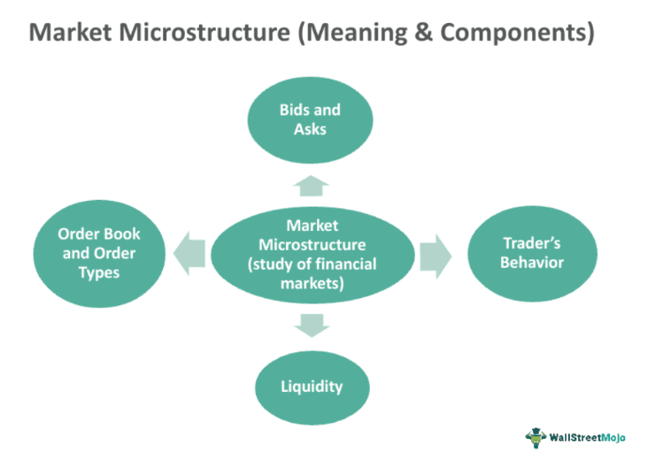

Game Theory has fundamentally transformed the landscape of financial markets, revolutionizing the development and implementation of trading strategies. At its core, Game Theory provides a mathematical framework to analyze and predict the strategic interactions among rational decision-makers. This analytical toolkit has become increasingly vital in market microstructure, especially within the domain of algorithmic trading.

Market microstructure focuses on the processes and outcomes of exchanging assets under specific trading rules. Here, Game Theory aids in understanding the behavior and decisions of various market participants, be they individual traders, institutional investors, or trading algorithms. By modeling these participants as players in a strategic game, analysts can anticipate actions and reactions within the market, leading to more informed and effective trading strategies.



Algorithmic trading, a predominant force in modern financial markets, leverages Game Theory to optimize decision-making processes. Algorithms, designed as strategic players, assess market conditions and other participants' potential actions to execute trades that maximize profit and mitigate risks. These algorithms utilize the principles of Game Theory to navigate complex transactions, enabling rapid and strategic trading that aligns with predefined goals.

In essence, Game Theory equips traders and algorithms with the capability to evaluate and respond to the competitive interplay in markets. This article examines how Game Theory principles are integrated into market microstructure, spotlighting their role in crafting sophisticated algorithmic trading strategies. Through the continued integration of these theories, participants can enhance trading efficiency, anticipate market shifts, and gain competitive advantages.

## Table of Contents

## History and Development of Game Theory

Game Theory as a formalized discipline emerged in 1944 with the publication of "Theory of Games and Economic Behavior," authored by John von Neumann and Oskar Morgenstern. This groundbreaking work laid the foundation of Game Theory by introducing mathematical models to analyze and predict the behavior of rational decision-makers in strategic situations. The book's establishment of Game Theory inspired further developments and extensions that significantly impacted economics, social sciences, and later, financial markets.

Over the decades, Game Theory has expanded to encompass several sub-disciplines that address different types of strategic interactions. Among these are cooperative and non-cooperative games. Cooperative games focus on coalitions and alliances, analyzing how cooperating players can jointly achieve better outcomes, often through binding agreements. Non-cooperative games, however, analyze scenarios where players make individual decisions and the resultant outcomes depend on the strategic choices of all players involved.

Central to Game Theory is the concept of Nash equilibrium, named after mathematician John Nash. A Nash equilibrium represents a stable state in a strategic game where no player can benefit by unilaterally changing their strategy, given the strategies of others. This concept is expressed mathematically by a set of strategies $(s_1, s_2, \ldots, s_n)$ such that for each player $i$, their strategy $s_i$ maximizes their payoff, assuming all other players' strategies are held constant.

Zero-sum and non-zero-sum games represent another vital distinction within Game Theory. In zero-sum games, one player’s gain is exactly balanced by the losses of others, which is described mathematically as:

$$
\sum_i u_i = 0
$$

where $u_i$ represents the payoff of player $i$. Conversely, non-zero-sum games allow the possibility for all players to gain or lose collectively, encouraging cooperative strategies to achieve mutual benefits.

These foundational principles have found wide-ranging application in financial markets. Game Theory's mathematical rigor offers tools to analyze complex interactions among market participants, informing strategies in trading, [market making](/wiki/market-making), and pricing of financial instruments. Understanding these strategic interactions is crucial for developing models that anticipate market movements and inform decisions in dynamic and competitive environments. As such, Game Theory's evolution continues to guide innovations in economic theory and practice.

## Core Concepts of Game Theory in Trading

Game Theory, a mathematical framework for analyzing strategic interactions among rational decision-makers, provides critical insights into trading within financial markets. Core concepts in Game Theory have profound applications in [algorithmic trading](/wiki/algorithmic-trading), influencing the development and refinement of trading strategies.

**Players** in the context of trading are typically traders or algorithms making decisions in the market. Each player aims to maximize their profits while minimizing potential losses. In algorithmic trading, these players are often represented by sophisticated algorithms programmed to execute trades under specific conditions.

**Strategies** are the predefined plans or algorithms that players use to make trading decisions. In algorithmic trading, strategies often include complex decision-making processes coded into trading bots or software. These strategies can vary widely, including market making, arbitrage, statistical analysis, and momentum-based trading, among others.

The **payoff** in trading refers to the financial outcome, usually expressed in terms of profit or loss, that results from a player's chosen strategy. The effectiveness of a strategy is evaluated based on its payoff over time, and strategies are frequently adjusted to enhance potential payoffs while reducing risk exposure.

The concept of **Nash Equilibrium** is especially pertinent in competitive markets. A Nash Equilibrium occurs when no player can gain additional benefit by unilaterally changing their strategy, given the strategies chosen by other players. In trading, this can manifest in situations where all participating algorithms have adjusted their strategies to a point of stability, where no further individual adjustments can yield better results without cooperation.

Trading scenarios often encompass elements of both **zero-sum and non-zero-sum games**. In zero-sum scenarios, one trader's gain is inherently another’s loss. This is common in certain derivatives markets where the total payoff is conserved. On the other hand, non-zero-sum scenarios arise when multiple traders can benefit from a strategic collaboration or when the market conditions change favorably for all participants. Understanding the dynamics and potential outcomes of zero-sum versus non-zero-sum situations is crucial for developing strategies that can adapt to different market circumstances.

These core concepts provide a foundational framework for the practical application of Game Theory in trading. They guide the design and execution of algorithmic trading strategies, aiming to achieve optimal results in the complex and competitive landscape of financial markets.

## Applications of Game Theory in Algorithmic Trading

Game Theory's application in algorithmic trading leverages strategic decision-making to enhance market dynamics and optimize financial outcomes. Here are the key applications:

1. **Market Making**: Game Theory is employed to formulate strategies for market makers, who provide liquidity by placing simultaneous buy and sell orders. Market makers are vital for efficient market operation, as they stand ready to trade at publicly quoted prices. Utilizing Game Theory, market makers anticipate the actions of other traders and adjust their strategies to maintain a balance between supply and demand, thereby minimizing risk while maximizing returns. This strategic placement of orders helps in reducing bid-ask spreads and improving price stability.

2. **Arbitrage Strategies**: In the context of arbitrage, Game Theory assists traders in forecasting the moves of competing market participants to exploit price anomalies across different markets or financial instruments. By predicting competitor actions, traders can preemptively position themselves to capture arbitrage opportunities more effectively. In mathematical terms, this involves solving for equilibrium prices where no arbitrage condition holds. Typically, algorithms analyze high volumes of data in search of discrepancies which, when identified, allow for profit through simultaneous buying and selling.

3. **High-Frequency Trading (HFT)**: HFT firms utilize sophisticated algorithms that leverage Game Theory principles to predict and react to market microstructure changes at millisecond intervals. By understanding the likely responses of other market participants, high-frequency traders can place trades with unmatched speed and precision. Python, for example, can be used to simulate HFT strategies incorporating Game Theory. A basic outline for such an implementation in Python might look like:

    ```python
    def high_frequency_trading_strategy(market_data):
        # Analyze market data to predict competitors' actions
        anticipated_actions = analyze_market_data(market_data)

        # Formulate Game Theoretic strategy
        if anticipated_actions == 'buy':
            place_sell_order()
        elif anticipated_actions == 'sell':
            place_buy_order()

    def analyze_market_data(data):
        # Placeholder for sophisticated market analysis logic
        pass

    def place_buy_order():
        # Code to execute buy order
        pass

    def place_sell_order():
        # Code to execute sell order
        pass
    ```

4. **Predatory Trading**: This involves strategies designed to take advantage of other market participants' weaknesses or mistakes, often leading to their financial disadvantage. Such strategies exploit asymmetries in information or liquidity, focusing on triggering reactions that benefit the predatory trader. Ethical considerations are significant here, as these tactics can destabilize markets and invite regulatory scrutiny.

5. **Algorithmic Collusion**: Game Theory also sheds light on the risk of implicit collusion among trading algorithms. Though not explicit, algorithms might inadvertently learn to cooperate in ways that reduce competition and elevate prices. Recognizing this potential allows regulators and firms to address and mitigate collusion risks proactively. Understanding these dynamics is crucial, as collusive algorithms can impact market fairness and efficiency.

In summary, the strategic application of Game Theory within algorithmic trading equips firms with agile, competitive, and efficient tools to navigate complex and rapidly-evolving market conditions.

## Prominent Companies Using Game Theory

Citadel Securities is renowned for its sophisticated application of Game Theory principles within market making. By employing advanced algorithms, Citadel optimizes the strategic placement of buy and sell orders, thus enhancing market [liquidity](/wiki/liquidity-risk-premium) and ensuring efficient price discovery. The firm's ability to predict competitor moves and market conditions allows them to maintain a competitive advantage in the market-making sector.

Two Sigma Investments integrates statistical modeling with [artificial intelligence](/wiki/ai-artificial-intelligence), underpinned by Game Theory frameworks, to inform its trading strategies. By leveraging these analytical tools, Two Sigma can predict market behavior, optimize risk management, and execute trades with high precision. The combination of data analytics and Game Theory enables the firm to make informed decisions and adapt to the evolving market landscape effectively.

Renaissance Technologies is a pioneer in utilizing Game Theory within its trading models. The firm employs advanced mathematical techniques and algorithms to identify trading opportunities and manage investments. The use of Game Theory allows Renaissance Technologies to analyze competitive strategies and potential outcomes, facilitating profitable and timely investment decisions.

Jane Street uses a blend of quantitative analysis and Game Theory to execute trading strategies effectively. By understanding the strategic interactions between market participants, Jane Street can accurately model market dynamics and optimize trading executions. This strategic approach allows the firm to capitalize on [arbitrage](/wiki/arbitrage) opportunities and manage risks efficiently.

Virtu Financial relies significantly on Game Theory to sustain its edge in high-frequency trading. By designing algorithms that anticipate and respond to minute market movements, Virtu can quickly execute trades, capturing fleeting opportunities before competitors. The firm's Game Theory-based strategies enable it to navigate market fluctuations and maintain consistently high trading volumes and profitability.

## Challenges and Considerations

Regulatory issues are a significant consideration in the application of Game Theory to algorithmic trading. Regulatory bodies, such as the U.S. Securities and Exchange Commission (SEC) and the European Securities and Markets Authority (ESMA), have established guidelines to prevent market manipulation and ensure fair trading practices. Algorithms must be carefully designed to comply with these regulations. Instances of spoofing or layering, where traders place orders without intending to execute them to manipulate prices, are expressly prohibited. Ensuring compliance requires rigorous testing and monitoring of algorithmic strategies to avoid activities that could be perceived as manipulative.

Ethical considerations arise in the context of predatory trading strategies, where algorithms exploit the weaknesses of other market participants. While such strategies might achieve short-term profit gains, they pose ethical questions about fairness and market integrity. Ethical trading practices require that algorithms do not unduly disadvantage any participants, maintaining a level playing field. This often involves balancing profit motives with broader considerations of fair market behavior.

The technical limitations of implementing Game Theory in trading strategies are also crucial. The mathematical models used in Game Theory can be computationally intensive, requiring significant resources for simulations and real-time data processing. High-frequency trading algorithms, for example, necessitate robust infrastructure to execute trades within fractions of a second. As a result, firms must invest in high-performance computing systems to support the computational demands. Moreover, the complexity of these models increases with the number of players and possible strategies, sometimes necessitating approximations rather than exact solutions.

Market uncertainty is a perpetual challenge as financial markets are influenced by various unpredictable factors, such as geopolitical events, economic indicators, and investor sentiment. Despite the sophistication of Game Theory models, they cannot capture every potential market disruption or black swan event. Traders and firms must therefore incorporate risk management strategies and adapt their algorithms to adjust to changing market conditions. This demands a continual refinement of strategies and a dynamic approach to algorithm design to respond effectively to unforeseen market changes.

## Future Trends

The future of algorithmic trading is poised for transformative changes as it integrates more deeply with advanced technologies such as Artificial Intelligence (AI), Machine Learning (ML), Decentralized Finance (DeFi), and Quantum Computing. These developments, when combined with Game Theory, are expected to create more sophisticated and adaptive trading systems.

### Integration with AI and Machine Learning

The application of AI and ML in algorithmic trading aims to create more adaptive and intelligent trading systems. By learning from vast datasets, AI and ML can recognize complex patterns in market behavior that were previously indiscernible. The fusion of these technologies with Game Theory allows for dynamic strategy adaptation, optimizing decision-making under uncertainty. For example, [reinforcement learning](/wiki/reinforcement-learning)—a type of ML—can simulate a game-like scenario where algorithms continuously improve strategies based on outcomes. This integration empowers trading systems to navigate the [volatility](/wiki/volatility-trading-strategies) and complexity of financial markets more efficiently.

### Decentralized Finance (DeFi)

Game Theory is increasingly being utilized in Decentralized Finance (DeFi) to optimize trading strategies on decentralized platforms. DeFi seeks to replicate and improve upon traditional financial services without the need for intermediaries, using blockchain technology. Game Theory helps in modeling and predicting [agents](/wiki/agents)' behavior in decentralized environments, facilitating efficient market mechanisms such as automated market makers (AMMs). These algorithms rely on Game Theory to balance liquidity and token pricing effectively, ensuring fair and efficient market dynamics. As DeFi platforms grow, the strategic interactions modeled by Game Theory become essential in maintaining robust and decentralized market architectures.

### Quantum Computing

Quantum Computing presents a potential paradigm shift in the application of Game Theory to algorithmic trading. Quantum computers process information fundamentally differently from classical computers, leveraging quantum bits that can represent multiple states simultaneously. This capability enables the solving of highly complex problems, such as those encountered in Game Theory models, more efficiently. Quantum algorithms could, theoretically, analyze multiple strategic interactions and equilibria faster and with greater accuracy, surpassing the limitations of classical computational methods. As quantum technology matures, it may significantly enhance algorithms used in trading by allowing for more intricate and comprehensive analysis of financial markets.

In summary, the future of algorithmic trading will be significantly shaped by the integration of AI, ML, DeFi, and Quantum Computing, all underpinned by Game Theory. These advancements will likely lead to more intelligent, efficient, and decentralized trading systems, paving the way for novel market strategies and frameworks.

## Conclusion

Game Theory provides a robust framework for the development and refinement of trading strategies within algorithmic trading. By modeling the interactions between market participants as strategic games, Game Theory enables traders to anticipate the actions of competitors and optimize their strategies accordingly. This strategic foresight is fundamental in achieving favorable outcomes in complex trading environments.

The continuous advancements in technology are poised to further integrate Game Theory into financial markets, enhancing the capabilities of traders and firms to navigate market intricacies effectively. Technological progress, including artificial intelligence and [machine learning](/wiki/machine-learning), contributes significantly to the development of more sophisticated algorithmic strategies. These technologies enable the processing of vast amounts of data, providing deeper insights into the strategic interactions among traders.

A key component of formulating successful algorithmic trading strategies lies in understanding and predicting the strategic behavior of market participants. By applying Game Theory principles, traders can design algorithms that not only pursue profitability but also adhere to ethical considerations and regulatory standards. The ability to simulate various market scenarios and participant strategies through computational models ensures that trading algorithms remain robust under different market conditions.

In summary, Game Theory's comprehensive framework allows for the crafting of more informed and strategic trading decisions. With continued technological innovations, the role of Game Theory in financial markets is set to expand, offering advanced tools for managing market complexities and fostering a more equitable and efficient trading landscape.

## References & Further Reading

[1]: Von Neumann, J., & Morgenstern, O. (1944). ["Theory of Games and Economic Behavior."](https://www.jstor.org/stable/j.ctt1r2gkx) Princeton University Press.

[2]: Nash, J. (1950). ["Equilibrium Points in N-Person Games."](https://www.pnas.org/doi/full/10.1073/pnas.36.1.48) Proceedings of the National Academy of Sciences, 36(1), 48-49.

[3]: Osbourne, M. J., & Rubinstein, A. (1994). ["A Course in Game Theory."](https://sites.math.rutgers.edu/~zeilberg/EM20/OsborneRubinsteinMasterpiece.pdf) MIT Press.

[4]: Lopez de Prado, M. (2018). ["Advances in Financial Machine Learning."](https://www.amazon.com/Advances-Financial-Machine-Learning-Marcos/dp/1119482089) Wiley.

[5]: Chan, E. P. (2008). ["Quantitative Trading: How to Build Your Own Algorithmic Trading Business."](https://github.com/egorpe/EPChan-QuantitativeTrading/blob/master/example7_6.m) Wiley.

[6]: Jarrow, R. A. (1992). ["Market Manipulation, Bubbles, Corners, and Short Squeezes."](https://www.jstor.org/stable/2331322) The Journal of Financial and Quantitative Analysis, 27(3), 311-336. 

[7]: Shkarupa, A. (2018). ["Decentralized Finance Game Theoretical Modeling."](https://journals.aserspublishing.eu/tpref/article/view/8585) arXiv.

[8]: Fudenberg, D., & Tirole, J. (1991). ["Game Theory."](https://archive.org/details/gametheory0000fude) MIT Press.

[9]: MacKenzie, D. (2019). ["Trading at the Speed of Light: How Ultrafast Algorithms are Transforming Financial Markets."](https://www.jstor.org/stable/j.ctv191kx1k) Princeton University Press.